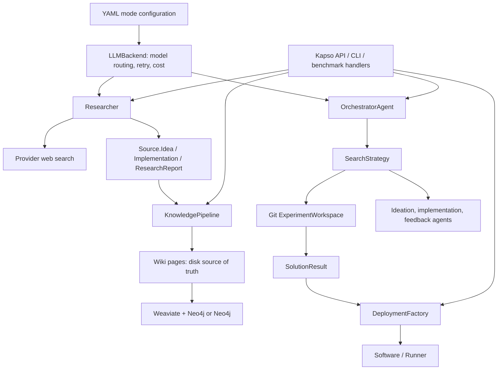
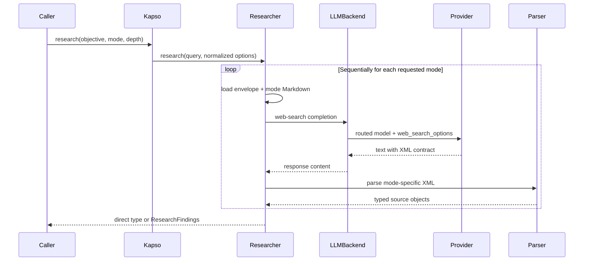
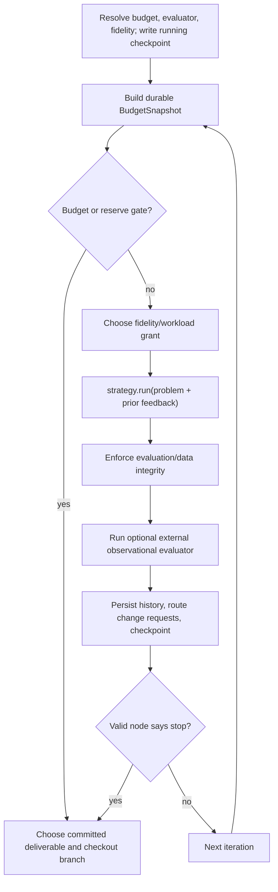

# Kapso architecture and code map

This is a maintainer-facing map of the architecture implemented in `src/kapso`.
It is intentionally code-first: when it conflicts with the product documentation,
the current source and focused hermetic tests win. Kapso is pre-release and several
older docs and tests still describe superseded designs. Unless stated otherwise,
package paths below are relative to `src/kapso`.

## The shortest useful mental model

Kapso has four user-facing verbs, but two architectural loops:

- `research` turns an objective into typed, source-bearing text through one or
  more web-search LLM calls.
- `learn` turns supported repositories or individual research source objects into
  wiki pages, then optionally merges and indexes those pages. Completed-solution
  ingestion and direct `ResearchFindings` dispatch are advertised but not wired
  in the current implementation.
- `evolve` runs a durable search campaign. Each candidate is a Git branch with
  an idea, code, evaluation evidence, feedback, lineage, and telemetry.
- `deploy` selects a runtime, asks an agent to adapt/deploy the selected solution,
  and wraps the runtime in the common `Software` interface.

Research is primarily a stateless acquisition pipeline. Evolve is a stateful
control system whose durable state is split across Git refs, `.kapso` files, and
evaluation evidence.

## Source layout and dependency direction

| Area | Primary modules | Responsibility |
| --- | --- | --- |
| Public facade | `kapso/__init__.py`, `kapso/kapso.py`, `kapso/cli.py` | Lazy package exports, Python API, CLI argument translation |
| Shared core | `kapso/core/config.py`, `kapso/core/llm.py`, `kapso/core/prompt_loader.py` | YAML loading, semantic model roles, bounded retry, cost accounting, prompt loading/rendering |
| Research | `kapso/researcher/` | Research modes, prompt composition, web-search calls, result parsing |
| Knowledge | `kapso/knowledge_base/` | Source types, ingestion, wiki merge, indexing, search backends |
| Evolution control plane | `kapso/execution/orchestrator.py`, `budget.py`, `fidelity.py`, `run_checkpoint.py` | Campaign lifecycle, admission, budget, evaluator identity, resume |
| Evolution data plane | `kapso/execution/search_strategies/`, `experiment_workspace/`, `coding_agents/` | Candidate generation, implementation, evaluation, feedback, Git isolation |
| Evolution memory | `kapso/execution/memories/` | Experiment ledger and branch-local repository model |
| Agent tools | `kapso/gated_mcp/` | Capability-checked MCP tool bundles for research, history, repo memory, KG, and external knowledge |
| Problem adapters | `kapso/environment/handlers/` | Convert a goal and caller-owned files into the agent problem contract |
| Deployment | `kapso/deployment/` | Strategy selection, repo adaptation/deployment, runner creation |
| Product scenarios | `examples/`, `benchmarks/` | Thin scenario adapters and benchmark-specific handlers/configuration |

The intended dependency direction is public facade → orchestration/pipeline →
pluggable implementation → shared core. Factories invert the final step for
search strategies, coding agents, knowledge search backends, ingestors, and
deployment runners.

`kapso/__init__.py` deliberately lazy-loads public symbols. This keeps the gated
MCP subprocess from importing the full execution and database stack during cold
start.

## Configuration and provider boundary

`Kapso` loads one YAML file on construction. `load_mode_config()` selects either
the explicit mode or `default_mode`, and the resulting block configures search,
agents, model routes, retry policy, knowledge search, learning, and optional
budget/evaluation behavior. The package configuration currently defines
`GENERIC` and `MINIMAL`; benchmark configurations define additional modes.

`LLMBackend` is the shared provider boundary:

- `ModelRouter` resolves semantic roles `utility`, `reasoning`, and `web_search`
  while preserving explicit provider model strings.
- `RetryPolicy` applies bounded exponential backoff with optional full jitter to
  errors classified as transient.
- Cost is accumulated from LiteLLM response metadata.
- Sync and parallel completion variants share routing and retry behavior.
- Research uses the web-search completion surface. Repo memory and other utility
  work use ordinary completion surfaces.

Prompt templates are intended to live outside Python and be loaded through
`core/prompt_loader.py` or a subsystem-local loader. Several older modules still
construct prompts inline.

## Research: implemented design

### Entry points and return contract

Research has three entry points that converge on `Researcher.research()`:

1. `Kapso.research()` lazily constructs a `Researcher` using the active mode's
   model routes and retry configuration.
2. `kapso research` converts CLI options into the facade call.
3. The gated MCP `ResearchGate` exposes `research_idea`,
   `research_implementation`, and `research_study` to coding agents.

The mode controls both prompt instructions and the Python return type:

| Input | Return type |
| --- | --- |
| `mode="idea"` | `list[Source.Idea]` |
| `mode="implementation"` | `list[Source.Implementation]` |
| `mode="study"` | `Source.ResearchReport` |
| a list of modes | one `ResearchFindings` wrapper populated by mode |

`Kapso.research()` defaults to the list `['idea', 'implementation']`, so its
default result is `ResearchFindings`. A single-item list still returns the direct
single-mode type because `Researcher` normalizes the list and branches on its
length. The facade's `ResearchFindings` annotation is therefore narrower than
the actual runtime contract.

Only a string or literal list is accepted. An empty list produces an empty
`ResearchFindings`; duplicate modes make duplicate sequential calls and the later
result overwrites the same wrapper field. None of those edge cases is normalized
away today.

The output types live in `knowledge_base/types.py`, not in the researcher. That
choice is the main coupling between research and learning: the researcher emits
objects that the ingestor factory already understands. Each type also implements
`to_string()`/`__str__()` for prompt context and `to_dict()` for serialization.

### End-to-end flow

The concrete steps are:

1. Strip and validate the query.
2. Validate the mode or mode list. The accepted values are exactly `idea`,
   `implementation`, and `study`.
3. Map depth to both reasoning effort and provider search context:
   `light → medium`, `deep → high`.
4. Load `research_envelope.md` and one of `idea.md`, `implementation.md`, or
   `study.md`; substitute the full query, `top_k`, mode, and instructions.
5. Call `LLMBackend.llm_completion_with_web_search()` with the semantic
   `web_search` route and a 32,000-token requested output cap.
6. Parse the `<research_result>` envelope. Idea and implementation modes parse
   repeated `<research_item>` elements containing `<source>` and `<content>`;
   study mode stores the envelope body as a report.
7. When multiple modes were requested, assign each mode's result to the matching
   field in one `ResearchFindings` instance.

Multiple modes run sequentially. There is no research cache, persistent state,
deduplication, source validation, or cross-mode synthesis beyond aggregation.
`top_k` is communicated to the model but is not enforced after parsing.
The provider/search model, rather than application code, generates search queries
and selects sources inside each single completion.

There is no standalone request-timeout parameter at the researcher boundary.
Agent-driven research is bounded only indirectly by the outer coding-agent
session. Study results also have no first-class source field; any citations exist
only inside their content.

The prompt layering has one current interpolation defect: `_build_research_prompt()`
uses one `str.format()` call to insert mode instructions into the envelope. Braces
inside that inserted text are not formatted recursively, so `{query}` and
`{top_k}` in the idea/implementation instruction files remain literal even though
the envelope's copies are rendered. Research prompts also bypass the shared
`prompt_loader` override/cache path and read their packaged files directly.

### Failure and parsing semantics

Research currently fails soft at two levels:

- `_run_single_mode()` catches any provider exception and returns an empty list
  or empty report.
- The XML parsers return empty results when the outer tag is absent, accept a
  missing closing envelope tag as truncated output, and skip items missing a
  source or content field.

The MCP gate catches failures again and turns them into textual tool responses.
These semantics conflict with the repository's current fail-loud engineering
rule and should be treated as implementation debt, not a general architectural
precedent.

Only `response.choices[0].message.content` survives the LiteLLM boundary. Provider
citation/tool metadata is discarded, so a `source` URL is model-emitted text, not
a separately verified provider citation. The docs call this the OpenAI Responses
API, while current code uses LiteLLM's completion surface with web-search options.

### How research enters the rest of Kapso

Research has three distinct consumption paths:

- Ephemeral evolve context: `findings.to_string()` or individual source objects
  are stringified by `Kapso.evolve(context=[...])` and appended to the problem
  prompt. No learning occurs on this path.
- Durable learning: callers must pass individual ideas, implementations, and the
  optional report (usually by splatting the lists) so the ingestor factory can
  route each typed source. Passing the `ResearchFindings` wrapper itself currently
  produces an unknown-ingestor error inside the pipeline despite facade docs
  claiming support.
- On-demand agent tool: generic evolve sessions can receive the research MCP
  gate. This invokes the same researcher through a process-local, lazily created
  singleton and returns formatted text directly to the coding agent.

The MCP singleton is constructed as bare `Researcher()`: it does not receive the
active Kapso mode's custom model routes or retry block. Its separate web-research
cost is accumulated internally but is not surfaced through the tool response or
attributed to evolve's phase/budget telemetry. Raw tool queries/results also are
not first-class persisted experiment artifacts; normally only the agent's
synthesis into the chosen solution survives.

### Research extension points and test anchors

- Add or change a research mode in `researcher.py`, `research_findings.py`, the
  prompt directory, knowledge source types/ingestors, CLI validation, and the MCP
  gate together.
- Change provider behavior in `core/llm.py`, not in prompts or parsers.
- Preserve the direct-type versus wrapper behavior unless deliberately replacing
  that public contract.
- The strongest hermetic test touchpoint is `test_llm_routing_retry.py`. The
  researcher/ingestor/live-web test files also expose intended contracts, but
  several contain network calls, stale imports, or obsolete result shapes and
  should be audited before being treated as executable specification.

## Evolve: implemented design

### The architectural split

Evolve separates policy from mechanism:

- `OrchestratorAgent` is the campaign executive. It owns configuration identity,
  budgets, fidelity grants, evaluation registration, checkpoint timing, external
  observations, history persistence, and stopping.
- `SearchStrategy` owns the candidate graph and one strategy iteration.
- `ExperimentWorkspace` and `ExperimentSession` turn candidate lineage into Git
  branches and isolated working copies.
- Coding agents perform ideation, implementation, and feedback under different
  tool permissions.
- `SearchNode` is the in-memory and checkpointed candidate record.

This split matters: the orchestrator is allowed to grant a workload and accept or
reject evidence; the strategy decides how to use that grant to propose and build
a candidate.

### Facade setup

`Kapso.evolve()` performs the following work before calling the campaign loop:

1. For resume, require an existing non-bare Git repository at `output_path`.
2. For a caller-provided evaluation directory, hash and validate it before any
   initial-repository lookup or workspace mutation.
3. Resolve the seed:
   - GitHub URLs are cloned to a temporary directory.
   - local paths are passed through and later cloned/copied into the workspace.
   - absent seeds trigger an optional knowledge-graph workflow-repository lookup;
     failure or no match produces an empty workspace.
4. Convert the goal, optional additional context, and each `context` item into a
   `GenericProblemHandler` problem string.
5. Construct `OrchestratorAgent` with the handler, mode, workspace, seed, files,
   knowledge backend, evaluator callback, and resume flag.
6. Call `solve()` with iteration/time/cost/reserve dials.
7. Ask the strategy for the deliverable, check out that branch in the root
   workspace, and return a `SolutionResult` describing the delivered artifact and
   campaign metadata.

`output_path` is the campaign repository itself, not a separate copy destination.
Without it, the strategy allocates a UUID workspace under `tmp/experiment_workspace`.

### Orchestrator construction

Construction is significant because it establishes campaign identity:

1. Load the mode once and build the shared `LLMBackend`.
2. Resolve strategy type/parameters and compute a configuration fingerprint.
   Budget dials are intentionally excluded so a paused campaign can resume with
   a larger budget. The provided evaluator manifest and external evaluator
   identity are included when present.
3. If resuming, load `.kapso/run_state.json`, validate schema, exact goal,
   strategy type, fingerprint, and incomplete status, then restore prior time,
   cost, feedback, and strategy state.
4. Create the feedback generator, search strategy, workspace, and branch-local
   repo memory. On resume, import rather than reinitialize workspace state.
5. Create the budget ledger and resolve fidelity/evaluation-maintainer policy.
6. Create `.kapso/experiment_history.json` storage and adopt or construct the
   configured knowledge backend.

The injected knowledge backend is lifecycle-managed by the orchestrator, but the
generic solve loop does not directly query it. In the default generic path, KG
use is primarily seed-workflow lookup before orchestration and optional MCP gates
configured on the agent. Other strategies may use knowledge differently.

### Campaign loop

Important loop semantics:

- The wall clock is durable: prior elapsed time from checkpoints plus current
  monotonic time determines budget consumption after resume.
- `BudgetSnapshot` is read-only from the strategy's point of view. The strategy
  uses it to render advisory status and clamp phase timeouts.
- Time, cost, and finalization reserve can stop admission. Budget stops leave the
  checkpoint `running`; only a valid goal-achieved stop marks it `completed`.
- A bootstrap checkpoint is written before the first iteration because evaluator
  registration/reconciliation is already paid work.
- The orchestrator identifies every new candidate finalized by a strategy call,
  not just the node returned from that call. This supports strategies that emit
  more than one node per iteration.
- Integrity and external evaluation happen before durable history/checkpoint
  writes so representations agree.
- The next iteration receives the prior feedback appended to the original
  problem. Experiment history itself is available through MCP, not injected as a
  growing prompt blob.

### Generic candidate lifecycle

The default `generic` strategy is evidence-directed and durable.

1. **Grant handling.** A validation-only fidelity grant short-circuits ideation
   and remeasures an existing artifact.
2. **Evidence and policy.** Build one immutable campaign snapshot from linked
   executed experiments, prior ideas, claims, gaps, and budget/fidelity capacity.
   Deterministic precedence chooses explore, exploit, verify, recover, or finalize.
3. **Operators and parents.** Allocate independent operator briefs and resolve
   each parent plan once to branch, node, Git, materialization, diff, and feedback
   refs.
4. **Candidate pipeline.** Codex and/or Claude Code CLI roles generate structured
   candidates. Kapso applies hard rules, descriptor and exact-duplicate checks,
   optional OpenAI embeddings, at most one diversity repair, and a structured
   selector decision.
5. **Durable decision.** `IdeaArchive` advances through `PLANNED`, `GENERATED`,
   `ANALYZED`, and `SELECTED`. The winner is linked to one `SearchNode` before
   implementation, advancing the batch to `BRIDGED`.
6. **Isolated implementation.** The implementation agent works on
   `generic_exp_<node_id>` from the frozen parent and returns the complete current
   XML contract. Evaluation integrity and feedback retain their existing authority.
7. **Outcome ordering.** The orchestrator writes the strict executed-only
   `ExperimentRecord`, then the linked `IdeaOutcome`, then the run checkpoint.
8. **Resume.** Deterministic operation IDs replay completed CLI calls from
   durable `result.json`; batches restart only their first unfinished phase.
   Cross-store reconciliation repairs valid prefix/ahead states and rejects
   conflicting identity or lineage.

Ideation reasoning uses coding-agent CLIs, not a direct generative API. Only
`OpenAIEmbeddingProvider` calls a model API. Implementation continues to use
`ClaudeCodeCodingAgent` and its configured MCP gates.

### Git is the candidate store

`ExperimentWorkspace` owns one non-bare root repository:

- Seed repositories are cloned/copied; the caller's source repository is never
  mutated in place.
- A stable `main` branch is the baseline.
- Each candidate branch inherits exactly one selected parent ref.
- Read-only inspection and external evaluation use detached temporary Git
  worktrees, leaving the root checkout unchanged.
- Implementation uses a nested session clone. The session branch is pushed back
  into the root repository before the clone is removed.
- Final delivery checks out the chosen branch. Checkout preserves unrelated
  untracked files and fails with `WorkspaceCheckoutError` rather than cleaning
  caller data; only untracked paths that the target branch itself owns are
  removed to permit materialization.

Candidate identity is therefore at least `(node_id, branch/ref, commit SHA,
parent ref)`, not merely a score or a directory path.

### Evaluation trust model

Kapso has three related but separate evaluation mechanisms:

1. **Agent-generated evaluation.** With no provided or registered suite, the
   implementation agent creates evaluation code and reports evidence. The
   feedback agent judges validity.
2. **Protected/registered evaluation.** Caller-provided evaluation files are
   hashed before setup. An optional `EvaluationMaintainer` can register a versioned
   evaluator, protected data manifest, command, seed, and timing model. Every
   candidate is verified against that identity before its score is accepted.
3. **External iteration evaluator.** A caller callback runs against an isolated
   detached worktree after a candidate is finalized. Its metrics and errors are
   stored on the node and returned in metadata. They do not affect parent
   selection, stopping, or deliverable choice. Generic search reserves the
   strict `metadata.ideation_evidence` object for evaluator-authored causal
   claims and gaps; after validation, those records affect only subsequent
   ideation policy and prompts. Score direction alone never creates them.

For registered evaluation, a score is meaningful only inside a
`ComparabilityClass(evaluator_id, fidelity, fraction, seed)`. Evaluation attempts
also store the candidate commit SHA. The machine-readable evaluation manifest is
the score of record; the feedback agent's parsed score is a cross-check.

If evaluation or protected data changed, the node becomes invalid, scoreless,
non-stopping, and ineligible as a normal best candidate.

### Budget, fidelity, and delivery

`BudgetSpec` resolves explicit API dials over mode configuration and validates
time, cost, reserve, and minimum phase constraints. `BudgetLedger` combines prior
checkpoint totals with live component meters. Cost is best-effort because not all
providers expose complete price metadata.

When enabled, `FidelityPolicy` uses measured evaluator timing and campaign state
to grant build/evaluation profiles such as fast work, full work, or validation of
an existing node. It maintains a finalization reserve and may spend that reserve
on a guaranteed full-size endgame attempt/measurement. Evaluator changes are
bridged and reconciled so scores from different evaluator versions are not
silently compared.

Exploration and delivery are deliberately different:

- Parent selection may use projected/canonical scores to keep search moving.
- `get_deliverable_experiment()` uses evidence tiers under the registered
  evaluator so an unvalidated fast leader cannot displace a full-fidelity
  candidate.
- `SolutionResult.delivered_score` is the delivered artifact's authoritative
  score; it need not equal the last iteration feedback score.

### Checkpoint and persistence model

| Artifact | Durable purpose | Git-tracked? |
| --- | --- | --- |
| Candidate branches/commits | Code, lineage, branch-local repo memory | yes |
| `.kapso/repo_memory.json` | Evidence-backed understanding inherited by descendants | yes, on candidate branches |
| `changes.log` | Agent/change audit trail and memory-observation input | yes |
| `.kapso/run_state.json` | Atomic campaign checkpoint, strategy state, durable clock/cost | intentionally ignored |
| `.kapso/experiment_history.json` | Strict executed-only experiment projection | workspace-local |
| `.kapso/idea_archive.json` | Atomic idea batches, candidates, decisions, links, and outcomes | workspace-local |
| `.kapso/ideation/agent_calls/` and session stream artifacts | Idempotent CLI results and failure/timeout forensics | workspace-local |
| `kapso_evaluation/` | Evaluation code and runtime results | code is tracked; policy depends on provenance |
| `kapso_datasets/` | Copied caller data | tracked during setup unless repo rules differ |
| `sessions/` | Ephemeral implementation clones | ignored and removed |

Checkpoint schema version 2 stores the exact goal and hash, strategy type,
configuration fingerprint, status, completed iterations, cumulative cost,
feedback, serialized strategy state, elapsed time, per-component cost, and the
last budget stop. Files are written to a temporary sibling, flushed/fsynced, and
atomically replaced.

Resume is intentionally strict and has no pre-release migration shim. It rejects
missing/corrupt/incompatible/completed state and validates restored branch refs.

### Memory and execution authorities

The representations answer different questions and are joined by strict IDs:

- Generic `SearchNode` state in the run checkpoint is the canonical executable
  campaign state, including lineage, evaluation attempts, and telemetry.
- `IdeaArchive` records what was proposed and why: every candidate, analysis,
  selection, frozen parent, idea-to-node link, embedding, and final outcome.
- `ExperimentHistoryStore` records only what actually ran: scores, feedback,
  branches, fidelity, cost, and required Generic `idea_id`/`selection_batch_id`.
  Its MCP tools never expose unexecuted ideas.
- `RepoMemoryManager` is a branch-local, evidence-backed book about architecture,
  entry points, edit locations, invariants, testing, gotchas, and dependencies.
  Baseline memory is created before search; each session updates it only after all
  code is committed, then commits the memory as the last metadata commit. Child
  branches therefore inherit the model corresponding to their exact parent.

Ideation receives complete proposal memory in its frozen mandatory packet and a
read-only parent worktree. The MCP boundary remains useful for executed-history
and repo-memory retrieval during implementation.

### MCP capability boundary

`gated_mcp/presets.py` groups tools into named gates:

- internal: `kg`, `idea`, `code`, `research`, `experiment_history`, `repo_memory`
- external: `leeroopedia`

Gate resolution checks declared environment and command capabilities, then uses
`skip`, `warn`, or `error` policy. It returns both MCP server configuration and an
allow-list of exact MCP tool names. Generic strategy adds ordinary agent tools
separately: ideation is read-only; implementation receives mutation and Bash.

The gate subprocess lazily initializes heavy knowledge/research backends. Explicit
paths are projected into the child server configuration instead of requiring the
caller to mutate its process environment.

### Evolve extension points and test anchors

- New search algorithm: subclass `SearchStrategy`, implement run/history/best/
  checkout and checkpoint state, register it, and add a mode/preset. Start from
  `search_strategies/_template.py`.
- New coding agent: implement `CodingAgentInterface`, add an adapter and
  `agents.yaml` entry. Check whether the target strategy instantiates an adapter
  directly before assuming the factory setting covers all phases.
- New problem domain: implement `ProblemHandler`; benchmark handlers are the best
  examples.
- New evaluator behavior: preserve evaluator identity, manifest protection,
  comparability classes, checkpoint compatibility, and the distinction between
  search evidence and observational metrics.
- New gate: define tools and capability requirements in `gated_mcp/presets.py`,
  implement a `ToolGate`, register it in the server, and test both capability
  resolution and exact allow-list names.
- Core tests: `test_run_checkpoint.py`, `test_budget.py`,
  `test_fidelity_policy.py`, `test_evaluation_integrity.py`,
  `test_evaluation_maintainer_wiring.py`, `test_evaluator_transition.py`,
  `test_ideation_parent_bridge.py`, `test_workspace_branch_safety.py`,
  `test_node_telemetry.py`, `test_iteration_evaluator.py`,
  `test_repo_memory*.py`, `test_ideation_engine.py`,
  `test_ideation_resume.py`, `test_ideation_v3_integration.py`, and
  `test_streaming_cost_and_deadline.py`.

## Learn and knowledge architecture

Knowledge has a disk-first acquisition pipeline and pluggable online indexes:

1. `Source` types identify repository, solution, idea, implementation, or report
   inputs.
2. `IngestorFactory` selects a source-specific ingestor and produces `WikiPage`s.
3. `KnowledgePipeline` either returns extracted pages (`skip_merge`) or passes
   them to `KnowledgeMerger`.
4. The merger treats connected pages as subgraphs, plans top-down, writes/updates
   bottom-up, and audits nodes/edges.
5. Wiki Markdown is the editable source of truth. `index_kg()` creates an index
   reference file containing backend metadata, while actual indexed data lives in
   Neo4j/Weaviate.

`kg_graph_search` combines wiki pages, Weaviate semantic search, Neo4j relations,
and optional reranking. `kg_llm_navigation` operates on a JSON graph in Neo4j
with LLM-guided traversal. `NullKnowledgeSearch` makes knowledge optional without
scattering `None` checks.

Two current limitations materially affect that model:

- `NullKnowledgeSearch` inherits `_enabled=True`, so `is_enabled()` incorrectly
  reports that the null backend is active even though searches remain empty.
- Wiki-file, Weaviate, Neo4j, and in-memory updates are best-effort multi-step
  writes rather than transactions. A successful operation does not guarantee all
  layers are synchronized, and backend validation is not a full cross-store
  consistency check.

The repository ingestor is the mature learning path. `ExperimentIngestor`
currently raises `NotImplementedError`, so advertised `Source.Solution` learning
does not work. `skip_merge=True` skips KG merge/index work but is not a dry run:
ingestors can still publish wiki files and the repo ingestor can perform configured
workflow-repository side effects.

The architectural bridge is typed data: research emits `Source` instances,
learning consumes them, and knowledge search can later provide workflow seeds or
agent tools.

Learning is partial-success oriented: the pipeline processes sources sequentially,
collects per-source errors, and can still merge whatever pages were extracted.
That behavior is materially different from the strict campaign checkpoint and
evaluation-state boundaries in evolve.

## Deploy architecture

`Kapso.deploy()` wraps a `SolutionResult` in `DeployConfig` and delegates to
`DeploymentFactory`:

1. Select a strategy with the selector agent for `AUTO`, or materialize an
   explicit setting.
2. Ask the adapter agent to create deployment files, run deployment, and report
   a run interface/endpoint.
3. Resolve the strategy runner from `StrategyRegistry`.
4. Return `DeployedSoftware`, which implements the common run/stop/log/health
   interface.

Strategies currently include local, Docker, Modal, BentoML, and LangGraph. Each
strategy package owns selector/adapter instructions, configuration, and runner.
Deployment is downstream of evolve: it adapts the delivered checkout, not an
abstract node or the last attempted branch.

There is a current registry break at this boundary: `StrategyRegistry` discovers
only `selector_instruction.md` and `adapter_instruction.md`, while every shipped
strategy provides `.txt` files. The enum and directories exist, but registry-based
selection/adaptation sees no shipped strategies. In addition, `DeployConfig.env_vars`
is not propagated through the factory/adapter/runners, and the available
`AdaptationValidator` is not invoked by the primary factory path.

## Current invariants worth protecting

1. A campaign never mutates the caller's seed repository in place.
2. Parent branch, parent node ID, ideation worktree, and implementation base must
   refer to the same candidate.
3. A candidate is not a valid stopping/best candidate without a valid evaluation
   and score.
4. Protected evaluation code and data must match the registered identity at the
   candidate ref.
5. Scores from different evaluator/fidelity/fraction/seed classes are not
   directly interchangeable.
6. External callback metrics are observations, not search rewards.
7. Budget stops are resumable; valid goal achievement is terminal.
8. Resume must restore exactly compatible campaign and branch state.
9. Repo memory describes a committed state and is inherited through Git lineage.
10. Final checkout selects the deliverable evidence tier, not merely the last
    iteration or largest unqualified score.
11. Agent-bound user/context text is passed in full; display/log truncation is a
    separate concern.
12. Missing optional knowledge may disable a capability; corrupt durable state
    must not silently become a fresh campaign.

## Known code/documentation gaps

These are navigation hazards, not proposed fixes in this document:

- Public docs still advertise `mode="both"`; current research accepts only
  `idea`, `implementation`, `study`, or a list of those values.
- Research coverage itself contains architectural fossils: some tests make live
  network calls without skip markers or import removed types/modules, and there
  are no focused parser, multi-mode edge-case, prompt-interpolation, MCP-handler,
  or single-mode CLI contract tests.
- Several evolve docs describe `ContextManager`, `TREE_SEARCH`, `SCORED`, and
  generic linear/tree configurations that are not present in the package's
  current `config.yaml` or generic solve path.
- Some docs use paths such as `src/kapso.py`; current package paths are under
  `src/kapso/`.
- The CLI's research printer/JSON writer expects a `ResearchFindings` wrapper,
  while explicit single-mode research returns a list or report. Default
  multi-mode CLI use follows the expected wrapper path; single-mode presentation
  is inconsistent.
- `Kapso.research()`'s annotation promises `ResearchFindings`, but the underlying
  direct-return contract is broader.
- `Kapso.evolve()` documents `context` as sources to learn; implementation only
  stringifies and injects them. Durable ingestion requires `learn()`.
- `Kapso.learn()` advertises direct `ResearchFindings` and `Source.Solution`
  support. The former lacks a registered wrapper ingestor and the latter reaches
  an unimplemented experiment ingestor.
- The generic orchestrator owns an injected knowledge backend but does not query
  it in its loop. Do not assume `kg_index` automatically adds KG snippets to
  every generic prompt; use configured gates/context and verify the active mode.
- The null knowledge backend currently reports `is_enabled() == True`, which can
  make disabled-KG state look active to orchestration.
- Deployment's strategy registry expects `.md` instruction files while shipped
  strategy packages contain `.txt`; discovery is empty until those conventions
  are reconciled.
- Generic ideation role/model choices come from the required canonical
  `ideation_profile`; the implementation agent remains separately configured.
- Research MCP calls use an independently constructed researcher, so active-mode
  model/retry overrides and cost attribution do not automatically cross that
  subprocess boundary.
- RepoMemory is updated before final feedback is known and currently receives
  placeholder score/error/feedback fields. Treat node/history records—not the
  memory book's experiment narrative—as authoritative for outcomes.
- Generic persistence is split deliberately: the strict checkpoint owns
  execution state, `IdeaArchive` owns proposal/decision/outcome state, and the
  atomic `ExperimentHistoryStore` owns its executed-only projection. Resume
  reconciles valid write-order gaps and rejects conflicts.
- Budget enforcement is an admission/ledger mechanism, not a hard billing or
  real-time ceiling: unknown provider spend, in-flight subprocesses, and useful
  minimum timeouts can overshoot.
- Protected-data verification checks registered expected paths but is not a
  closed-world directory check; arbitrary new files in a protected directory are
  not rejected by that manifest alone.
- Successful Generic implementation output must contain exactly one complete
  set of required XML fields; malformed or partial results fail loudly.
- `BenchmarkTreeSearch` parses some model-produced list expressions with raw
  Python `eval()` and does not implement every managed-evaluator/fidelity hook
  assumed by the newest generic orchestration path.
- Research and several older factories still swallow errors or use compatibility
  fallbacks, contrary to the current repository engineering rules in `CLAUDE.md`.
- Some current modules still use environment-driven capability discovery and
  function-local imports despite newer repository guidance. Treat the guidance
  as the target for new work, while reading the current code literally.

## Reading and change workflow

For an evolve change, read in this order:

1. `kapso.py:evolve`
2. `environment/handlers/generic.py`
3. `execution/orchestrator.py`
4. `execution/search_strategies/base.py`
5. the active strategy, usually `generic/strategy.py`
6. `experiment_workspace/experiment_workspace.py` and `experiment_session.py`
7. the relevant policy module: checkpoint, budget, fidelity, evaluation
   integrity/maintainer, or memory
8. the focused tests named above

For a research change, read:

1. `kapso.py:research`
2. `researcher/researcher.py`
3. `researcher/prompts/`
4. `researcher/research_findings.py`
5. `knowledge_base/types.py`
6. `gated_mcp/gates/research_gate.py` if agents consume it
7. research routing, parser, and ingestor tests

For architectural decisions, distinguish three layers explicitly:

- **Implemented contract:** source and focused hermetic tests.
- **Operational evidence:** benchmark reviews and postmortems under `benchmarks/`.
- **Aspirational or historical design:** docs and archived modules.

That distinction is essential in this repository because many recent evolve
features were driven by live campaign failures and landed faster than older
overview pages were rewritten.
