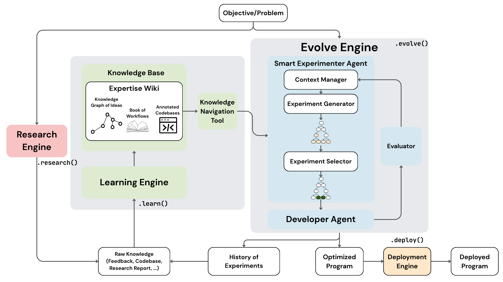

<h1 align="center">Kapso</h1>

<h4 align="center">A framework where AI Learns, Experiments, Builds, and Ships</h4>

<p align="center">
  <a href="https://docs.leeroo.com">Learn more</a> ·
  <a href="https://discord.gg/hqVbPNNEZM">Join Discord</a> ·
  <a href="https://leeroo.com">Website</a>
</p>

<p align="center">
  <a href="https://discord.gg/hqVbPNNEZM"></a>
  <a href="https://pypi.org/project/kapso/"></a>
  <a href="https://github.com/leeroo-ai/kapso"></a>
  <a href="https://pypi.org/project/kapso/"></a>
  <a href="https://www.ycombinator.com/companies/leeroo"></a>
</p>

<p align="center">
  
</p>

---

## Introduction

Kapso lets domain experts (quant, healthcare, data engineering, etc.) turn their knowledge into executable software — without deep engineering expertise. The system automates the cycle of **designing**, **testing**, and **refining** algorithms, eventually adapting the optimized solution for **deployment** on your chosen infrastructure.

### Key Features

- **Knowledge-Grounded**: Solutions are informed by domain knowledge, not just LLM priors
- **Iterative Refinement**: Tree search explores multiple approaches, learns from failures
- **Pluggable Components**: Swap coding agents, evaluators, and search strategies
- **Full Lifecycle**: From research to deployment in a single framework
- **Evidence-Backed Memory**: RepoMemory tracks code understanding with file-level evidence

### Use Cases

- **ML Competitions**: Automated Kaggle solution development with knowledge-guided experimentation
- **LLM Fine-Tuning**: Build QLoRA/LoRA training pipelines with best practices from your knowledge base
- **Data Engineering**: Create ETL pipelines that meet throughput and quality requirements
- **General Software**: Any problem that benefits from iterative experimentation and domain knowledge

## 🚀 Quickstart

### Installation

```bash
git clone https://github.com/leeroo-ai/kapso.git
cd kapso

# Pull Git LFS files (wiki knowledge data)
git lfs install
git lfs pull

# Create conda environment (recommended)
conda create -n kapso python=3.12
conda activate kapso

# Install
pip install -e .
```

### Set Up API Keys

Create `.env` in project root:

```bash
OPENAI_API_KEY=your-openai-api-key
GOOGLE_API_KEY=your-google-api-key       # For Gemini
ANTHROPIC_API_KEY=your-anthropic-api-key # For Claude Code
```

### Basic Usage

```python
from src.kapso import Kapso, DeployStrategy

# Initialize Kapso
kapso = Kapso()

# Build a solution — Kapso runs experiments automatically
solution = kapso.evolve(
    goal="Build a random forest classifier for the Iris dataset with accuracy > 0.9",
    output_path="./models/iris_v1",
    evaluator="regex_pattern",
    evaluator_params={"pattern": r"Accuracy: ([\d.]+)"},
    stop_condition="threshold",
    stop_condition_params={"threshold": 0.9},
)

# Deploy and run
software = kapso.deploy(solution, strategy=DeployStrategy.LOCAL)
result = software.run({"data_path": "./test.csv"})

# Cleanup
software.stop()
```

### With Knowledge Graph

```python
from src.kapso import Kapso, Source

# Initialize with pre-indexed knowledge
kapso = Kapso(kg_index="data/indexes/llm_finetuning.index")

# Research best practices
research = kapso.research(
    "QLoRA fine-tuning best practices",
    mode="implementation",
    depth="deep",
)

# Learn from repositories
kapso.learn(
    Source.Repo("https://github.com/huggingface/peft"),
    research,
    wiki_dir="data/wikis",
)

# Build with knowledge context
solution = kapso.evolve(
    goal="Fine-tune Llama-3.1-8B with QLoRA, target loss < 0.5",
    output_path="./models/qlora_v1",
)
```

For detailed integration steps, see the [Quickstart](https://docs.leeroo.com/docs/quickstart) and [Installation](https://docs.leeroo.com/docs/installation) guides.

## 📚 Documentation & Support

- **Full Documentation**: [docs.leeroo.com](https://docs.leeroo.com)
- **Community**: [Discord](https://discord.gg/hqVbPNNEZM)
- **Website**: [leeroo.com](https://leeroo.com)

## Core Components

| Component | Description |
|-----------|-------------|
| **Kapso** | Main API — orchestrates research, learn, evolve, and deploy |
| **OrchestratorAgent** | Runs the experimentation loop with budget tracking |
| **Search Strategy** | Explores solutions via tree search or linear search |
| **Coding Agents** | Pluggable code generators: Aider, Gemini, Claude Code, OpenHands |
| **Knowledge Pipeline** | Two-stage learning: Ingestors extract WikiPages → Merger integrates into KG |
| **Knowledge Search** | Hybrid retrieval using Weaviate (semantic) + Neo4j (graph structure) |
| **Evaluators** | Score solutions: regex patterns, JSON files, LLM judges |
| **Stop Conditions** | Control when to stop: threshold, plateau, cost/time limits |
| **Deployment** | Turn solutions into running software: Local, Docker, Modal, BentoML |

## Supported Benchmarks

| Benchmark | Description |
|-----------|-------------|
| **MLE-Bench** | Kaggle ML competitions — tabular, image, text, audio problems |
| **ALE-Bench** | AtCoder algorithmic optimization — C++ solution generation |

## ⚖️ License

MIT — see the [LICENSE](LICENSE) file for details.
