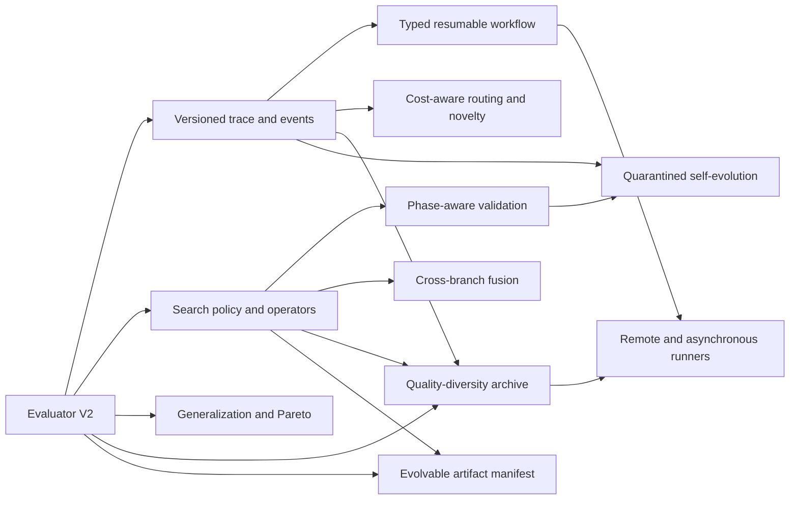

## Executive recommendation

The first investment should be **Evaluator V2**, combining GEPA's Actionable Side Information, OpenEvolve's multi-metric and cascaded evaluation, and AI Scientist's artifact feedback. Nearly every later improvement depends on structured evidence rather than a scalar score and untyped text.

The next investments should be a policy/operator separation, phase-aware validation, and versioned run state. Quality-diversity search, self-evolving prompts, and distributed scheduling have high upside but should follow those foundations.

## How ranking works

Each work package receives an impact and difficulty score from 1 to 5 using the [comparison methodology](/docs/competitive-analysis/methodology). The priority score is:

```text
priority = 2 × impact − difficulty
```

The formula favors high impact while breaking ties toward changes that can ship and be validated sooner. Dependency order can override the numeric rank.

## Ranked work packages

| Rank | Work package | Main sources | Impact | Difficulty | Priority | Recommended horizon |
|---:|---|---|---:|---:|---:|---|
| 1 | Evaluator V2: metrics, diagnostics, artifacts, cascades | GEPA, OpenEvolve, AI Scientist | 5 | 3 | 7 | Now |
| 2 | Search policy and first-class mutation operators | MLEvolve, AIRA-dojo, AIDE | 5 | 3 | 7 | Now |
| 3 | Phase-aware schedule, ablations, and multi-seed validation | AI Scientist, EvoMaster | 5 | 3 | 7 | Next |
| 4 | Versioned trace, checkpoint, and lifecycle event model | R&D-Agent, AIRA-dojo, OpenEvolve, MLE-Agent | 5 | 3 | 7 | Now |
| 5 | Generalization-aware evaluation and Pareto retention | GEPA | 5 | 3 | 7 | Next for prompt/agent use cases |
| 6 | Cross-branch fusion with provenance | MLEvolve | 5 | 3 | 7 | Next |
| 7 | Cost-aware model routing and novelty rejection | ShinkaEvolve | 4 | 2 | 6 | Next |
| 8 | Quality-diversity archive and optional islands | OpenEvolve, ShinkaEvolve, AIRA-dojo | 5 | 4 | 6 | Later |
| 9 | Typed, resumable workflow control plane | R&D-Agent | 5 | 4 | 6 | Later, built incrementally through package 4 |
| 10 | Atomic hypothesis and invalid-metric semantics | AIDE | 4 | 2 | 6 | Immediate quick win |
| 11 | Evolvable artifact manifest and component mutations | EvoAgentX, GEPA, R&D-Agent | 4 | 3 | 5 | Next |
| 12 | Quarantined self-evolution and knowledge promotion | EvoMaster | 4 | 3 | 5 | Later |
| 13 | Remote runner and asynchronous proposal/evaluation pipeline | ShinkaEvolve, AIRA-dojo, R&D-Agent | 4 | 4 | 4 | Later |
| 14 | Experiment visualization, reports, and plan review UX | AIDE, AI Scientist, MLE-Agent | 3 | 2 | 4 | Parallel product track |

## Baseline priority

This table ranks source projects by the expected value of studying and adopting their mechanisms, not by benchmark score or GitHub popularity.

| Adoption order | Baseline | Strategic impact | Typical difficulty | Reason |
|---:|---|---|---|---|
| 1 | GEPA | Very high | Low to medium | Supplies the missing structured feedback contract and generalization model. |
| 2 | MLEvolve | Very high | Medium | Improves budget allocation, branch diversity, and knowledge transfer between experiments. |
| 3 | AI Scientist v2 | Very high | Medium | Adds scientific phases, ablations, multi-seed evidence, and artifact interpretation. |
| 4 | AIDE | High quick-win value | Low | Atomic changes and explicit invalid results improve causal attribution immediately. |
| 5 | OpenEvolve | Very high | Medium to high | Multi-metric traces are easy wins; MAP-Elites is a larger strategic investment. |
| 6 | ShinkaEvolve | High | Low to high | Model routing and novelty filtering are accessible; asynchronous evolution is harder. |
| 7 | EvoMaster | High | Medium | Provides a safe pattern for promoting lessons into behavior-changing assets. |
| 8 | R&D-Agent | Very high | High | Its workflow architecture is valuable but would substantially reshape Kapso's control plane. |
| 9 | AIRA-dojo | High | Medium to high | Best used for policy composition, ablations, and scale after core contracts stabilize. |
| 10 | EvoAgentX | Medium to high | Medium to high | Most valuable when Kapso productizes prompt and agent-workflow optimization. |
| 11 | MLE-Agent | Medium | Low | Primarily improves UX, telemetry, and human checkpoints rather than search quality. |

## Dependency map



## Delivery plan

### Phase 0: contract and observability foundation

Target: two to four weeks for an initial compatible slice.

1. Add `EvaluationResult`, `Metric`, `DiagnosticPayload`, and artifact-reference types.
2. Preserve `SearchNode.score` as a compatibility property derived from the primary metric.
3. Add an explicit invalid result instead of encoding failure as zero or `None`.
4. Require normal improvements to declare one hypothesis, expected mechanism, and invariants.
5. Emit a versioned JSONL transition record and typed lifecycle events.
6. Add component cost, latency, error, and retry telemetry.

Acceptance criteria:

- Existing generic, MLE, and ALE flows produce identical primary-score decisions.
- A failed evaluation cannot rank as a successful zero-scoring candidate.
- Every experiment can be reconstructed from the trace plus git branches.
- Diagnostic fields and artifacts reach feedback generation and memory extraction.

### Phase 1: better use of a fixed budget

Target: four to eight weeks after Phase 0.

1. Separate mutation operators from selection policies.
2. Add time-aware exploration/exploitation and branch-stagnation signals.
3. Add ancestry, sibling, global-best, and similarity-based memory scopes.
4. Implement novelty checks before expensive execution.
5. Implement cost-aware model routing behind an opt-in configuration.
6. Add a phase policy: baseline, optimize, diversify, validate, finalize.

Acceptance criteria:

- Policies are unit-testable with a synthetic candidate history.
- Controlled runs can force a fixed model and deterministic policy.
- Duplicate proposal rate and evaluator idle time are reported.
- Each policy decision is recorded with inputs and reason.

### Phase 2: causal validation and knowledge transfer

Target: six to ten weeks.

1. Add selective cross-branch fusion with donor provenance.
2. Add first-class ablation and multi-seed operators.
3. Separate reflection examples from validation examples for prompt and agent optimization.
4. Add experiment, task, and cross-task knowledge promotion levels.
5. Add quarantined prompt/skill overlays with baseline replay before promotion.

Acceptance criteria:

- A promoted lesson points to repeated or ablation-supported evidence.
- Fusion children identify the donor branch and adopted mechanism.
- Validation examples never appear in proposer context.
- Removing an overlay restores baseline behavior without editing source prompts.

### Phase 3: diversity and scale

Target: strategic program after Phases 0–2.

1. Add a git-backed quality-diversity archive.
2. Add Pareto retention across metrics and examples.
3. Add an evolvable artifact manifest for prompts and agent workflows.
4. Add remote runners and asynchronous proposal, implementation, and evaluation queues.
5. Add dynamic islands only after archive behavior is validated.

Acceptance criteria:

- Archive dimensions are task-configurable and cannot silently change mid-run.
- Every archive member references a reproducible commit and evaluator version.
- Queue recovery is idempotent after process termination.
- Distributed execution produces the same result schema as local execution.

## Proposed core types

The precise API should be designed during implementation, but the comparison supports a model similar to:

```python
@dataclass
class EvaluationResult:
    valid: bool
    primary_metric: str
    metrics: dict[str, Metric]
    diagnostics: DiagnosticPayload
    artifacts: list[ArtifactRef]
    evaluator_version: str

@dataclass
class ChangeHypothesis:
    statement: str
    mechanism: str
    components: list[str]
    invariants: list[str]
    donor_node_ids: list[int]

@dataclass
class TransitionRecord:
    schema_version: int
    parent_node_ids: list[int]
    child_node_id: int
    operator: str
    hypothesis: ChangeHypothesis
    evaluation: EvaluationResult
    branch_name: str
    commit_sha: str
    cost: float
    elapsed_seconds: float
```

## Capabilities to preserve

The roadmap should not compromise Kapso's existing advantages:

- Git remains the source of truth for code and provenance.
- Domain knowledge and experiment memory remain separate but composable.
- Coding agents remain replaceable implementation operators.
- Evaluators, not LLM confidence, determine measured progress.
- Deployment remains part of the lifecycle.
- Generic APIs do not acquire Kaggle-specific assumptions.

## Highest-risk ideas

| Idea | Risk | Mitigation |
|---|---|---|
| Prompt and skill self-evolution | Overfitting and persistent behavioral regressions | Run-local overlays, held-out evaluation, explicit promotion, rollback |
| Model routing | Benchmark contamination and unpredictable spend | Fixed-model mode, cost caps, full routing trace |
| Cross-branch fusion | Bundled changes destroy causal attribution | One adopted mechanism, donor provenance, follow-up ablation |
| Quality-diversity archives | Arbitrary dimensions and operational complexity | Small opt-in archive, immutable dimension schema, controlled ablations |
| Distributed execution | Duplicate work and inconsistent state | Idempotent jobs, versioned manifests, commit-addressed candidates |

