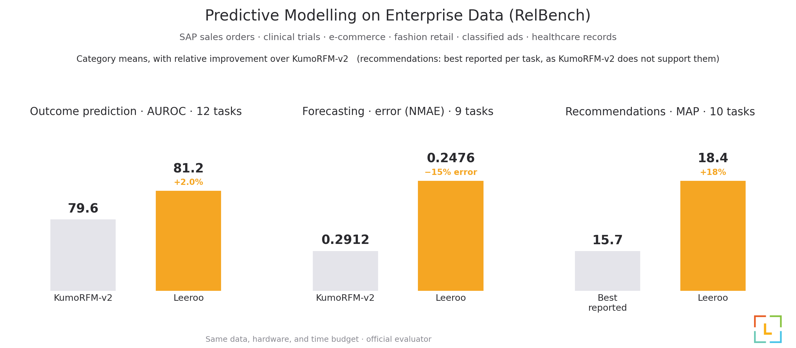
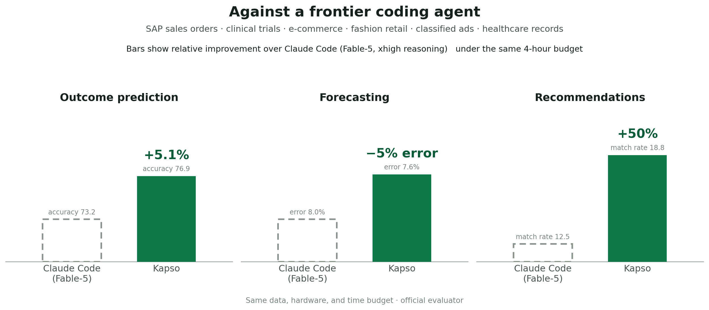

# RelBench Integration

Every company's most valuable data has the same shape: customers, orders, events, and records
spread across linked tables. [RelBench](https://relbench.stanford.edu) (Stanford/Kumo,
[v2 paper](https://arxiv.org/abs/2602.12606)) turns that shape into a benchmark: 11 real
relational databases (SAP sales orders, H&M retail transactions, clinical trials, e-commerce
reviews, classified ads, ICU records, …) and 66 prediction tasks: who churns, what sells,
which trial succeeds, what to recommend next.

Kapso attacks each task the way a research team would: an experimentation loop of
**ideation → implementation → judged feedback**, every iteration scored on the official
validation metric, every lesson compounding into the next round. Ideas are grounded in two
knowledge sources: a **knowledge bank** of measured lessons from its own past campaigns,
and **Leeroopedia**, Leeroo's curated ML knowledge base.

## Results

Kapso beats the best published results across the three task families. The same solutions,
re-measured under an identical budget, also beat a frontier coding agent working alone:





All scores come from the official RelBench evaluator. The Claude Code baseline (same tasks,
same hardware, same 4-hour budget, one generic prompt) is fully reproducible from
[`claude_code_baseline/`](claude_code_baseline/).

## How it stays honest

1. **Sanitized cache**: `sandbox.py` builds a per-task database copy with everything
   test-derivable physically removed; the agent-visible test table carries only
   (entity, seed-time) rows.
2. **Search**: the Kapso platform iterates ideation → implementation → judged feedback
   against official *validation* scores: `--strategy generic` (the campaign standard, with
   the provided immutable grader) or `--strategy tree` (handler-scored).
3. **Selection**: the best run is chosen on validation and scored **once** on test by the
   handler, followed by a code audit for leakage patterns.

Temporal-regime details, including the rolling per-tick harness for windowed tasks, live in
[`EVALUATION_PROTOCOL.md`](EVALUATION_PROTOCOL.md).

## Quickstart

```bash
# from the repository root
pip install -e .
pip install -r benchmarks/relbench/requirements.txt
```

Run one task:

```bash
expert-relbench -s rel-f1 -t driver-position \
    --strategy generic -m RELBENCH_GENERIC --time-budget-hours 4
```

Multi-task campaign (task queue, hardware gating, budget threading):

```bash
PYTHONPATH=src:. python -m benchmarks.relbench.campaign \
    --hours-per-task 10 --hardware gpu
```

## Layout

| path | role |
|---|---|
| `handler.py` | benchmark handler: sanitized-cache contract, val-scored runs, final selection + leakage audit |
| `runner.py` / `campaign.py` | single-task CLI / multi-task campaign driver |
| `sandbox.py` | sanitized + rolling cache builder |
| `context.py` / `task_specs.py` | problem-context builder / per-task metadata |
| `config.yaml` | benchmark modes (`RELBENCH_GENERIC` is the campaign standard) |
| `data/` | agent-facing starter kit, provided evaluator, seed baseline |
| `claude_code_baseline/` | the frontier-coding-agent baseline: prompt, harness, results |
