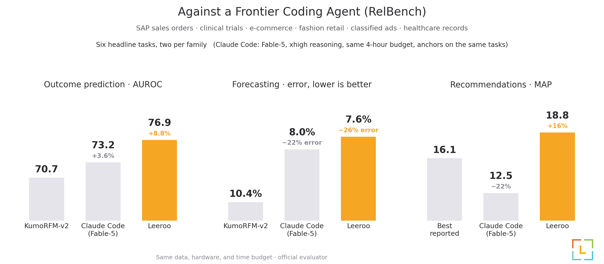

# Claude Code Baseline

How far does a frontier coding agent get on RelBench without any scaffolding? This baseline
runs Claude Code (Fable-5, xhigh reasoning) on the same sanitized task data Kapso sees, with
one short generic prompt ([`PROMPT.md`](PROMPT.md)), the same hardware, and the same 4-hour
budget per task. Predictions are scored one way by the official RelBench evaluator
([`score_baseline.py`](score_baseline.py)); the agent never sees test labels.

Six headline tasks, two per family. Kapso wins every settled cell, and in recommendations the
raw agent stays below the best reported bar while Kapso clears it.

Per-task scores, the drop protocol, and run archives: [`RESULTS.md`](RESULTS.md). The harness
(`run_baseline.sh`) provisions a box, stages the sanitized cache, runs the agent under a hard
timeout, and archives every session.
