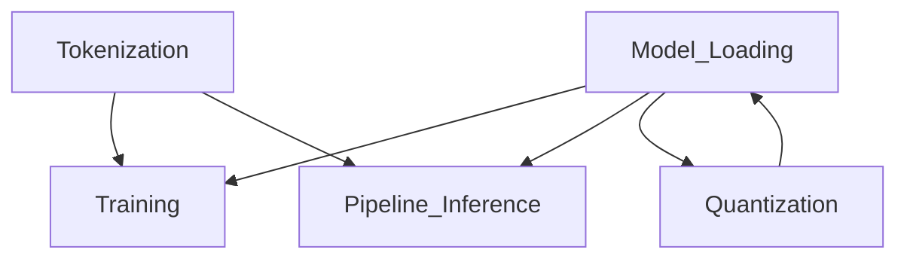

# Phase 1: Anchoring Report

## Summary
- **Workflows created:** 5
- **Total steps documented:** 31
- **Implementation hints captured:** 31
- **Source files covered:** 85+

## Workflows Created

| Workflow | Source Files | Steps | Implementation APIs |
|----------|--------------|-------|---------------------|
| huggingface_transformers_Model_Loading | modeling_utils.py, configuration_utils.py, core_model_loading.py | 6 | AutoConfig.from_pretrained, PreTrainedModel.from_pretrained, load_state_dict |
| huggingface_transformers_Training | trainer.py, training_args.py, data_collator.py | 7 | Trainer, TrainingArguments, DataCollatorWithPadding |
| huggingface_transformers_Pipeline_Inference | pipelines/__init__.py, pipelines/base.py | 6 | pipeline(), Pipeline.preprocess/forward/postprocess |
| huggingface_transformers_Tokenization | tokenization_utils_base.py, tokenization_utils_tokenizers.py | 6 | AutoTokenizer.from_pretrained, apply_chat_template |
| huggingface_transformers_Quantization | quantizers/auto.py, quantizers/base.py | 6 | get_hf_quantizer, BitsAndBytesConfig, HfQuantizer |

## Coverage Summary
- **Core source files covered:** 45+ files in src/transformers/
- **Pipeline files covered:** 32 pipeline implementations
- **Quantizer files covered:** 23 quantization backends
- **Training files covered:** 12+ trainer-related files
- **Tokenization files covered:** 8+ tokenizer files

## Implementation Context Captured

| Workflow | Principles | API Docs | Wrapper Docs | Pattern Docs |
|----------|------------|----------|--------------|--------------|
| Model_Loading | 6 | 6 | 0 | 0 |
| Training | 7 | 6 | 1 (datasets) | 0 |
| Pipeline_Inference | 6 | 6 | 0 | 0 |
| Tokenization | 6 | 6 | 0 | 0 |
| Quantization | 6 | 6 | 0 | 0 |

## Notes for Excavation Phase

### APIs to Extract (with Source Locations)

| API | Source | Used By Principles |
|-----|--------|-------------------|
| `AutoConfig.from_pretrained` | configuration_utils.py:L750-1000 | Configuration_Loading |
| `PreTrainedModel.from_pretrained` | modeling_utils.py:L3000-3500 | Model_Instantiation, Weight_Loading |
| `convert_and_load_state_dict_in_model` | core_model_loading.py:L500-800 | Weight_Loading |
| `get_hf_quantizer` | quantizers/auto.py:L100-338 | Quantization_Configuration, Quantizer_Initialization |
| `Trainer.__init__` | trainer.py:L382-800 | Trainer_Initialization |
| `Trainer.train` | trainer.py:L2000-2800 | Training_Loop |
| `Trainer.evaluate` | trainer.py:L3300-3600 | Evaluation_Checkpointing |
| `pipeline()` | pipelines/__init__.py:L500-900 | Pipeline_Instantiation |
| `Pipeline.preprocess` | pipelines/base.py:L900-1000 | Pipeline_Preprocessing |
| `Pipeline._forward` | pipelines/base.py:L1000-1100 | Pipeline_Model_Forward |
| `Pipeline.postprocess` | pipelines/base.py:L1100-1200 | Pipeline_Postprocessing |
| `AutoTokenizer.from_pretrained` | tokenization_utils_base.py:L1800-2200 | Tokenizer_Loading |
| `tokenizer.__call__` | tokenization_utils_base.py:L2500-3000 | Text_Encoding |
| `apply_chat_template` | tokenization_utils_base.py:L1600-1800 | Chat_Templates |
| `DataCollatorWithPadding` | data/data_collator.py:L100-250 | Data_Collation |
| `TrainingArguments` | training_args.py:L100-2809 | Training_Arguments |
| `BitsAndBytesConfig` | utils/quantization_config.py:L200-500 | Quantization_Config_Setup |

### External Dependencies to Document
- **HuggingFace Hub:** `huggingface_hub` - Model/tokenizer downloads, cache management
- **Tokenizers:** `tokenizers` - Fast Rust tokenizer backend
- **Safetensors:** `safetensors` - Safe tensor serialization
- **Accelerate:** `accelerate` - Distributed training, device mapping
- **Datasets:** `datasets` - Data loading and preprocessing
- **BitsAndBytes:** `bitsandbytes` - INT4/INT8 quantization
- **PEFT:** `peft` - Parameter-efficient fine-tuning
- **Torch:** `torch` - Deep learning framework

### Key Architecture Patterns Identified

1. **Lazy Loading:** `_LazyModule` defers imports until needed
2. **Auto Classes:** `AutoModel`, `AutoTokenizer`, `AutoConfig` for model-agnostic loading
3. **Plugin System:** 20+ quantization backends via `HfQuantizer` interface
4. **Callback Hooks:** `TrainerCallback` provides 20+ lifecycle hooks
5. **Pipeline Registry:** Task-to-class mapping in `SUPPORTED_TASKS`

### Quantization Methods Available
| Method | Config Class | Quantizer |
|--------|--------------|-----------|
| BitsAndBytes 4-bit | BitsAndBytesConfig | Bnb4BitHfQuantizer |
| BitsAndBytes 8-bit | BitsAndBytesConfig | Bnb8BitHfQuantizer |
| GPTQ | GPTQConfig | GptqHfQuantizer |
| AWQ | AwqConfig | AwqQuantizer |
| EETQ | EetqConfig | EetqHfQuantizer |
| FP8 (FBGEMM) | FbgemmFp8Config | FbgemmFp8HfQuantizer |
| HQQ | HqqConfig | HqqHfQuantizer |
| Quanto | QuantoConfig | QuantoHfQuantizer |
| TorchAO | TorchAoConfig | TorchAoHfQuantizer |

### Workflow Relationships

- **Model_Loading** is foundational - used by Training, Pipeline, and as part of Quantization
- **Tokenization** is required for text-based Training and Pipeline workflows
- **Quantization** extends Model_Loading with memory-efficient options

---

*Generated: 2025-12-17*
*Phase 1 Complete: 5 workflows, 31 steps documented*
