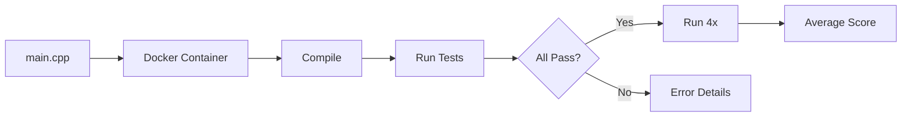

ALE-Bench provides AtCoder Heuristic Contest problems for evaluating algorithmic optimization agents. Kapso achieved **#1 on ALE-Bench**.

<Frame>
  
</Frame>

## Usage

```bash
# List available problems
PYTHONPATH=. python -m benchmarks.ale.runner --list

# List lite benchmark problems
PYTHONPATH=. python -m benchmarks.ale.runner --lite

# Solve a problem
PYTHONPATH=. python -m benchmarks.ale.runner -p ahc039

# With options
PYTHONPATH=. python -m benchmarks.ale.runner \
    -p ahc039 \
    -i 14 \
    -m ALE_CONFIGS \
    -d aider
```

## CLI Options

| Option | Description | Default |
|--------|-------------|---------|
| `-p, --problem` | Problem ID (e.g., `ahc039`) | Required |
| `-i, --iterations` | Max experiment iterations | 14 |
| `-m, --mode` | Config mode | `ALE_CONFIGS` |
| `-d, --coding-agent` | Coding agent | From config |
| `--list` | List all problems | - |
| `--lite` | List lite problems | - |
| `--list-agents` | List coding agents | - |

## Available Problems

`ahc008`, `ahc011`, `ahc015`, `ahc016`, `ahc024`, `ahc025`, `ahc026`, `ahc027`, `ahc039`, `ahc046`

<Note>
ALE-Bench uses `benchmark_tree_search` strategy which uses the handler's built-in evaluation via `handler.run()`. This is different from `kapso.evolve()` which uses agent-built evaluation.
</Note>

## Output Structure

The agent generates:

```
experiment_workspace/{uuid}/
├── main.cpp          # C++ solution
├── pre_run.cpp       # Optional precomputation (max 1 min)
└── sessions/         # Experiment branches
```

## Evaluation



The evaluation process works as follows:

1. **Code Submission**: The `main.cpp` file is read from the experiment workspace
2. **Docker Evaluation**: Code is sent to `ale_bench.public_eval()` which compiles and runs in an isolated Docker container
3. **Test Execution**: Solution runs against all test cases with strict time limits
4. **Validation**: Each test case must return `ACCEPTED` with a non-zero score
5. **Score Stabilization**: If all tests pass, the solution runs **4 additional times** and scores are averaged for stability
6. **Final Ranking**: Private evaluation compares against original contest participants

## Code Requirements

Generated C++ must:
- Be time-aware (limit: time_limit - 100ms for I/O)
- Handle all input constraints
- Use efficient algorithms and data structures
- Include compiler optimization pragmas if helpful

## Built-in Domain Knowledge

The handler includes tips for common algorithms:

<Accordion title="Simulated Annealing">
- Design good state representation
- Balance small and large moves
- Avoid recomputation in legality checks
- Keep regret mechanism for constrained problems
</Accordion>

<Accordion title="Beam / Random Search">
- Balance diversity and quality in beams
- Fast-stop bad solutions
- Use strong heuristic scoring
</Accordion>

<Accordion title="Random Simulation">
- Define strong heuristic scoring
- Consider average and std of scores
- Balance greedy vs long-horizon moves
</Accordion>
