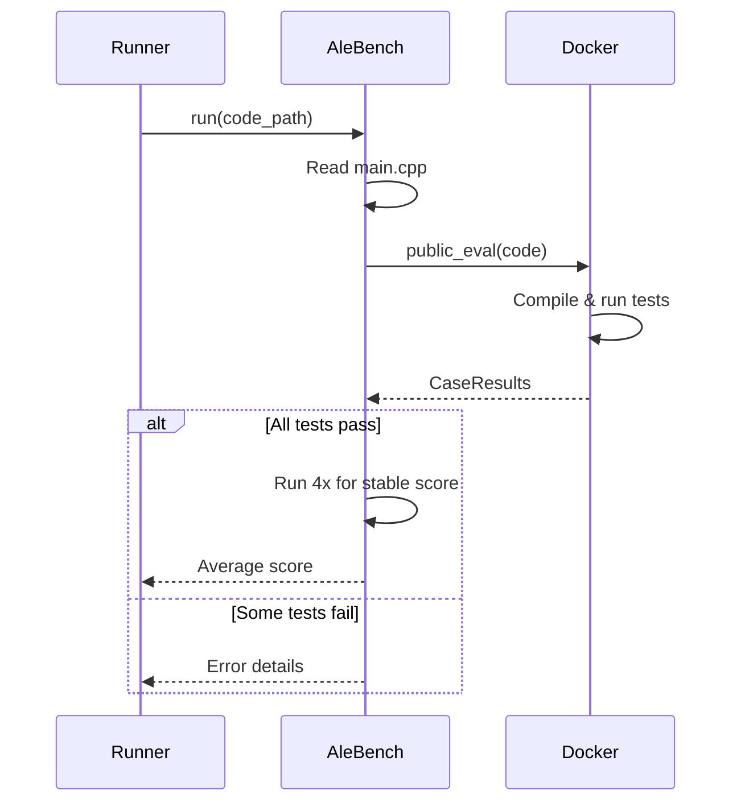

ALE-Bench provides AtCoder Heuristic Contest problems. Expert Agent generates C++ solutions evaluated in Docker containers.

## Usage

```bash
# List available problems
PYTHONPATH=. python -m benchmarks.ale.runner --list

# List lite benchmark problems
PYTHONPATH=. python -m benchmarks.ale.runner --lite

# Solve a problem
PYTHONPATH=. python -m benchmarks.ale.runner -p ahc039

# With options
PYTHONPATH=. python -m benchmarks.ale.runner \
    -p ahc039 \
    -i 14 \
    -m ALE_CONFIGS \
    -d aider
```

## CLI Options

| Option | Description | Default |
|--------|-------------|---------|
| `-p, --problem` | Problem ID (e.g., `ahc039`) | Required |
| `-i, --iterations` | Max experiment iterations | 14 |
| `-m, --mode` | Config mode | `ALE_CONFIGS` |
| `-d, --coding-agent` | Coding agent | From config |
| `--list` | List all problems | - |
| `--lite` | List lite problems | - |
| `--list-agents` | List coding agents | - |

## Available Problems

| Problem | Contestants | Scoring |
|---------|-------------|---------|
| ahc008 | 824 | Maximize |
| ahc011 | 926 | Maximize |
| ahc015 | 779 | Maximize |
| ahc016 | 1047 | Maximize |
| ahc024 | 664 | Maximize |
| ahc025 | 879 | Minimize |
| ahc026 | 740 | Maximize |
| ahc027 | 999 | Minimize |
| ahc039 | 683 | Maximize |
| ahc046 | 939 | Maximize |

## Output Structure

The agent generates:

```
experiment_workspace/{uuid}/
├── main.cpp          # C++ solution
├── pre_run.cpp       # Optional precomputation (max 1 min)
└── sessions/         # Experiment branches
```

## Evaluation



## Code Requirements

Generated C++ must:
- Be time-aware (limit: time_limit - 100ms for I/O)
- Handle all input constraints
- Use efficient algorithms and data structures
- Include compiler optimization pragmas if helpful

## Built-in Domain Knowledge

The handler includes tips for common algorithms:

<Accordion title="Simulated Annealing">
- Design good state representation
- Balance small and large moves
- Avoid recomputation in legality checks
- Keep regret mechanism for constrained problems
</Accordion>

<Accordion title="Beam / Random Search">
- Balance diversity and quality in beams
- Fast-stop bad solutions
- Use strong heuristic scoring
</Accordion>

<Accordion title="Random Simulation">
- Define strong heuristic scoring
- Consider average and std of scores
- Balance greedy vs long-horizon moves
</Accordion>

## Key Differences from MLE-Bench

| Aspect | MLE-Bench | ALE-Bench |
|--------|-----------|-----------|
| Language | Python | C++ (cpp23) |
| Main file | `main.py` | `main.cpp` |
| Debug mode | `--debug` flag | N/A |
| Evaluation | CSV grading | Docker tests |
| Stop condition | Medal achieved | Never (fixed iterations) |
| Knowledge graph | Recommended | Disabled by default |

