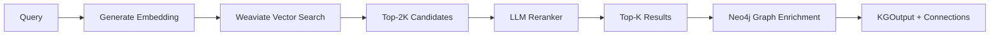
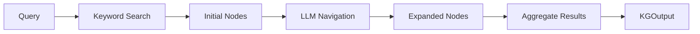

Knowledge search retrieves domain-specific guidance from wiki pages using semantic embeddings (Weaviate), LLM reranking, and graph structure (Neo4j).

## Available Backends

| Backend | Description | Best For |
|---------|-------------|----------|
| `kg_graph_search` | Weaviate embeddings + LLM reranking + Neo4j graph | **Recommended** - Best quality results |
| `kg_llm_navigation` | Neo4j + LLM-guided navigation | Complex multi-hop exploration |

---

## KG Graph Search (Recommended)

Uses OpenAI embeddings for semantic search in Weaviate, optional LLM reranking for improved relevance, and Neo4j for graph relationship enrichment.

### Search Flow



### Quick Start

```python
from src.knowledge.search import KnowledgeSearchFactory, KGIndexInput, KGSearchFilters

# Create search backend
search = KnowledgeSearchFactory.create("kg_graph_search")

# Index wiki pages (only needed once)
search.index(KGIndexInput(
    wiki_dir="data/wikis",
    persist_path="data/indexes/wikis.json",
))

# Search (data persists in Weaviate/Neo4j)
result = search.search(
    query="How to fine-tune LLM with limited GPU?",
    filters=KGSearchFilters(top_k=5, page_types=["Workflow"]),
)

# Results include connected pages from Neo4j
for item in result:
    print(f"{item.page_title}: {item.score:.2f}")
    print(f"  Connected: {len(item.metadata.get('connected_pages', []))} pages")
```

### Parameters

| Parameter | Type | Default | Description |
|-----------|------|---------|-------------|
| `embedding_model` | str | `text-embedding-3-large` | OpenAI model for embeddings |
| `weaviate_collection` | str | `KGWikiPages` | Weaviate collection name |
| `use_llm_reranker` | bool | `True` | Enable LLM-based reranking |
| `reranker_model` | str | `gpt-4.1-mini` | LLM model for reranking |
| `include_connected_pages` | bool | `True` | Include graph connections in results |

### Configuration Presets

```yaml
# In knowledge_search.yaml
kg_graph_search:
  presets:
    DEFAULT:        # Full pipeline
      params:
        use_llm_reranker: true
        include_connected_pages: true
    
    FAST:           # No reranking, no graph
      params:
        use_llm_reranker: false
        include_connected_pages: false
    
    RERANK_ONLY:    # Reranking without graph
      params:
        use_llm_reranker: true
        include_connected_pages: false
```

### Usage Examples

```python
from src.knowledge.search import KnowledgeSearchFactory, KGSearchFilters, PageType

# Default: reranking + graph enrichment
search = KnowledgeSearchFactory.create("kg_graph_search")

# Fast: semantic search only (no reranking, no graph)
search = KnowledgeSearchFactory.create(
    "kg_graph_search",
    params={"use_llm_reranker": False, "include_connected_pages": False}
)

# Using preset
search = KnowledgeSearchFactory.create("kg_graph_search", preset="FAST")

# Search with filters
result = search.search(
    query="LoRA best practices",
    filters=KGSearchFilters(
        top_k=5,
        min_score=0.5,
        page_types=[PageType.HEURISTIC, PageType.WORKFLOW],
        domains=["LLMs"],
    ),
)

# Access results
for item in result:
    print(f"{item.page_title} ({item.page_type}): {item.score:.2f}")
    
    # Connected pages (from Neo4j graph)
    connected = item.metadata.get("connected_pages", [])
    for conn in connected:
        print(f"  -> {conn['title']} ({conn['edge_type']})")
```

### LLM Reranker

The reranker uses an LLM to improve result ordering based on query relevance:

1. **Semantic search** returns 2x `top_k` candidates
2. **LLM analyzes** each candidate's relevance to the query
3. **Reranks** based on direct relevance, page type appropriateness, specificity
4. **Returns** top `top_k` results with adjusted scores

The reranker considers:
- **Direct relevance**: Does the page answer the query?
- **Page type**: Workflows for "how to", Principles for theory, etc.
- **Specificity**: Specific pages over general ones

### Environment Variables

```bash
# Required
export OPENAI_API_KEY="sk-..."

# Neo4j (graph structure)
export NEO4J_URI="bolt://localhost:7687"
export NEO4J_USER="neo4j"
export NEO4J_PASSWORD="password123"

# Weaviate (embeddings)
export WEAVIATE_URL="http://localhost:8081"
```

### Docker Setup

```bash
# Weaviate (vector database)
docker run -d --name weaviate \
    -p 8081:8080 -p 50051:50051 \
    -e AUTHENTICATION_ANONYMOUS_ACCESS_ENABLED=true \
    -e PERSISTENCE_DATA_PATH='/var/lib/weaviate' \
    semitechnologies/weaviate:latest

# Neo4j (graph database)
docker run -d --name neo4j \
    -p 7474:7474 -p 7687:7687 \
    -e NEO4J_AUTH=neo4j/password123 \
    neo4j:latest
```

---

## KG LLM Navigation Search (Legacy)

Uses LLM-guided graph traversal starting from keyword matches.

### How It Works



1. **Keyword search** finds initial nodes matching the problem
2. **LLM navigation** selects relevant neighbors to explore
3. **Aggregation** collects content from all visited nodes

### Parameters

| Parameter | Type | Default | Description |
|-----------|------|---------|-------------|
| `search_top_k` | int | 1 | Number of starting nodes |
| `navigation_steps` | int | 3 | Depth of navigation |
| `expansion_limit` | int | 3 | Max nodes per step |
| `search_node_type` | string | `specialization` | Node type to start from |

---

## Common Data Structures

### KGSearchFilters

```python
@dataclass
class KGSearchFilters:
    top_k: int = 10                      # Max results to return
    min_score: float = None              # Minimum relevance score (0.0 to 1.0)
    page_types: List[str] = None         # Filter by types: Workflow, Principle, etc.
    domains: List[str] = None            # Filter by domain tags
    include_content: bool = True         # Include full page content

class PageType(str, Enum):
    WORKFLOW = "Workflow"
    PRINCIPLE = "Principle"
    IMPLEMENTATION = "Implementation"
    ENVIRONMENT = "Environment"
    HEURISTIC = "Heuristic"
```

### KGOutput & KGResultItem

```python
@dataclass
class KGResultItem:
    id: str              # Unique node identifier
    score: float         # Relevance score (0.0 to 1.0)
    page_title: str      # Title of the wiki page
    page_type: str       # Node type (Workflow, Principle, etc.)
    overview: str        # Brief summary/description
    content: str         # Full page content
    metadata: Dict       # domains, sources, connected_pages, etc.

@dataclass
class KGOutput:
    query: str                    # Original search query
    filters: KGSearchFilters      # Filters applied
    results: List[KGResultItem]   # Ranked results (by score descending)
    total_found: int              # Total matching results
    search_metadata: Dict         # Backend info, reranked status, etc.
```

### Search Interface

```python
class KnowledgeSearch(ABC):
    @abstractmethod
    def index(self, data: KGIndexInput) -> None:
        """Index wiki pages into the backend."""
        pass
    
    @abstractmethod
    def search(
        self, 
        query: str, 
        filters: KGSearchFilters = None,
        context: str = None,
    ) -> KGOutput:
        """Search for relevant knowledge with optional filters."""
        pass
```

---

## Factory Usage

```python
from src.knowledge.search import KnowledgeSearchFactory

# Create search backend
search = KnowledgeSearchFactory.create("kg_graph_search")
search = KnowledgeSearchFactory.create("kg_graph_search", params={...})
search = KnowledgeSearchFactory.create("kg_graph_search", preset="FAST")

# From config dict
search = KnowledgeSearchFactory.create_from_config({
    "type": "kg_graph_search",
    "preset": "DEFAULT",
})

# Null search (no-op, returns empty results)
search = KnowledgeSearchFactory.create_null()
```
