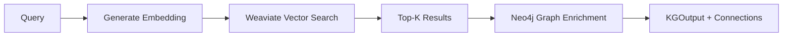
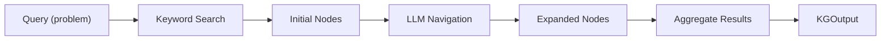

Knowledge search retrieves domain-specific guidance from wiki pages using semantic embeddings (Weaviate) and graph structure (Neo4j).

## Available Backends

| Backend | Description | Best For |
|---------|-------------|----------|
| `kg_graph_search` | Weaviate embeddings + Neo4j graph | **Recommended** - Semantic search with graph connections |
| `kg_llm_navigation` | Neo4j + LLM-guided navigation | Complex multi-hop exploration |

## KG Graph Search (Recommended)

Uses OpenAI embeddings for semantic search in Weaviate, with Neo4j storing graph relationships for result enrichment.



### Quick Start

```python
from src.knowledge.search import KnowledgeSearchFactory, KGIndexInput, KGSearchFilters

# Create search backend
search = KnowledgeSearchFactory.create("kg_graph_search", enabled=True)

# Index wiki pages
search.index(KGIndexInput(
    wiki_dir="data/wikis",
    persist_path="data/indexes/wikis.json",
))

# Search
result = search.search(
    query="How to fine-tune LLM with limited GPU?",
    filters=KGSearchFilters(top_k=5, page_types=["Workflow"]),
)

# Results include connected pages from Neo4j
for item in result:
    print(f"{item.page_title}: {item.score:.2f}")
    print(f"  Connected: {len(item.metadata.get('connected_pages', []))} pages")
```

### Configuration

```yaml
knowledge_search:
  type: "kg_graph_search"
  enabled: true
  params:
    embedding_model: "text-embedding-3-large"
    weaviate_collection: "KGWikiPages"
    include_connected_pages: true
```

### Environment Variables

```bash
# Required
export OPENAI_API_KEY="sk-..."

# Neo4j (graph structure)
export NEO4J_URI="bolt://localhost:7687"
export NEO4J_USER="neo4j"
export NEO4J_PASSWORD="password123"

# Weaviate (embeddings)
export WEAVIATE_URL="http://localhost:8081"
```

---

## KG LLM Navigation Search (Legacy)

Uses LLM-guided graph traversal starting from keyword matches.

## How It Works



1. **Keyword search** finds initial nodes matching the problem
2. **LLM navigation** selects relevant neighbors to explore
3. **Aggregation** collects content from all visited nodes

## Configuration

```yaml
knowledge_search:
  type: "kg_llm_navigation"
  enabled: true
  params:
    search_top_k: 1           # Initial nodes
    navigation_steps: 3       # Graph hops
    expansion_limit: 3        # Nodes per step
    search_node_type: "specialization"
```

## Parameters

| Parameter | Type | Default | Description |
|-----------|------|---------|-------------|
| `search_top_k` | int | 1 | Number of starting nodes |
| `navigation_steps` | int | 3 | Depth of navigation |
| `expansion_limit` | int | 3 | Max nodes per step |
| `search_node_type` | string | `"specialization"` | Node type to start from |

## Presets

```yaml
# In knowledge_search.yaml
presets:
  DEFAULT:
    params:
      search_top_k: 1
      navigation_steps: 3
      expansion_limit: 3
      
  DEEP_SEARCH:
    params:
      search_top_k: 3
      navigation_steps: 5
      expansion_limit: 5
      
  MINIMAL:
    params:
      search_top_k: 1
      navigation_steps: 1
      expansion_limit: 1
```

## Factory Usage

```python
from src.knowledge.search import KnowledgeSearchFactory, KGSearchFilters, PageType

# Create from config
search = KnowledgeSearchFactory.create(
    search_type="kg_llm_navigation",
    enabled=True,
    params={"navigation_steps": 3},
)

# Or from config dict
search = KnowledgeSearchFactory.create_from_config({
    "type": "kg_llm_navigation",
    "enabled": True,
    "preset": "DEEP_SEARCH",
})

# Null search (disabled)
search = KnowledgeSearchFactory.create_null()

# Search with filters
result = search.search(
    query="How to fine-tune transformers for NLP?",
    filters=KGSearchFilters(
        top_k=5,
        min_score=0.6,
        page_types=[PageType.WORKFLOW, PageType.PRINCIPLE],
        domains=["NLP", "Deep_Learning"],
    ),
    context="Previous experiment used BERT",
)

# Access results
for item in result:
    print(f"{item.page_title} ({item.page_type}): {item.score:.2f}")
```

## Search Interface

```python
class KnowledgeSearch(ABC):
    @abstractmethod
    def index(self, data: Dict) -> None:
        """Index knowledge into the backend."""
        pass
    
    @abstractmethod
    def search(
        self, 
        query: str, 
        filters: KGSearchFilters = None,
        context: str = None,
    ) -> KGOutput:
        """Search for relevant knowledge with optional filters."""
        pass
```

## KGSearchFilters

```python
@dataclass
class KGSearchFilters:
    top_k: int = 10                      # Max results to return
    min_score: float = None              # Minimum relevance score (0.0 to 1.0)
    page_types: List[str] = None         # Filter by types: Workflow, Principle, etc.
    domains: List[str] = None            # Filter by domain tags: NLP, Deep_Learning, etc.
    include_content: bool = True         # Include full page content

class PageType(str, Enum):
    WORKFLOW = "Workflow"
    PRINCIPLE = "Principle"
    IMPLEMENTATION = "Implementation"
    ENVIRONMENT = "Environment"
    HEURISTIC = "Heuristic"
```

## KGOutput & KGResultItem

```python
@dataclass
class KGResultItem:
    id: str              # Unique node identifier
    score: float         # Relevance score (0.0 to 1.0)
    page_title: str      # Title of the wiki page
    page_type: str       # Node type (Workflow, Principle, Implementation, etc.)
    overview: str        # Brief summary/description
    content: str         # Full page content (empty if include_content=False)
    metadata: Dict       # Additional data (domains, sources, last_updated)

@dataclass
class KGOutput:
    query: str                    # Original search query
    filters: KGSearchFilters      # Filters applied
    results: List[KGResultItem]   # Ranked results (by score descending)
    total_found: int              # Total matching results
    search_metadata: Dict         # Search params and timing info
```

## Navigation Algorithm

```python
def _retrieve_navigate(self, query, search_top_k, navigation_steps, expansion_limit) -> List[KGResultItem]:
    # 1. Find starting nodes
    nodes = self._keyword_search(query, top_k=search_top_k)
    visited_ids = [n['id'] for n in nodes]
    node_scores = {n['id']: 1.0 for n in nodes}  # Initial nodes get highest score
    
    # 2. Navigate graph
    for step in range(navigation_steps):
        step_score = 1.0 - (step + 1) * 0.2  # Score decay per step
        neighbors = []
        for node in nodes:
            for neighbor in self._get_neighbors(node['id']):
                if neighbor['id'] not in visited_ids:
                    neighbors.append(neighbor)
                    visited_ids.append(neighbor['id'])
                    node_scores[neighbor['id']] = step_score
        
        if not neighbors:
            break
        
        # 3. LLM selects relevant neighbors
        selected = self._llm_select(query, nodes, neighbors, expansion_limit)
        nodes.extend(selected)
    
    # 4. Convert to KGResultItem list, sorted by score
    results = [KGResultItem(id=n['id'], score=node_scores[n['id']], ...) for n in nodes]
    return sorted(results, key=lambda x: x.score, reverse=True)
```

## Neo4j Setup

```bash
# Start container
docker run -d \
    --name neo4j \
    -p 7474:7474 -p 7687:7687 \
    -e NEO4J_AUTH=neo4j/password \
    neo4j:latest

# Environment variables
export NEO4J_URI="bolt://localhost:7687"
export NEO4J_USER="neo4j"
export NEO4J_PASSWORD="password"
```

## Loading Data

```python
from src.knowledge.search.kg_llm_navigation_search import KGLLMNavigationSearch
import json

search = KGLLMNavigationSearch()

with open('benchmarks/mle/data/kg_data.json') as f:
    data = json.load(f)

search.index(data)  # Load nodes and edges
```

Data format:
```json
{
  "nodes": {
    "0": {"id": "0", "name": "...", "type": "specialization", "content": "..."},
    "1": {"id": "1", "name": "...", "type": "workflow", "content": "..."}
  },
  "edges": [
    {"source": "0", "target": "1"}
  ]
}
```

