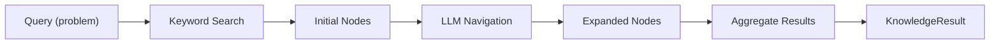

Knowledge search retrieves domain-specific guidance from a Neo4j knowledge graph using LLM-guided navigation.

## How It Works



1. **Keyword search** finds initial nodes matching the problem
2. **LLM navigation** selects relevant neighbors to explore
3. **Aggregation** collects content from all visited nodes

## Configuration

```yaml
knowledge_search:
  type: "kg_llm_navigation"
  enabled: true
  params:
    search_top_k: 1           # Initial nodes
    navigation_steps: 3       # Graph hops
    expansion_limit: 3        # Nodes per step
    search_node_type: "specialization"
```

## Parameters

| Parameter | Type | Default | Description |
|-----------|------|---------|-------------|
| `search_top_k` | int | 1 | Number of starting nodes |
| `navigation_steps` | int | 3 | Depth of navigation |
| `expansion_limit` | int | 3 | Max nodes per step |
| `search_node_type` | string | `"specialization"` | Node type to start from |

## Presets

```yaml
# In knowledge_search.yaml
presets:
  DEFAULT:
    params:
      search_top_k: 1
      navigation_steps: 3
      expansion_limit: 3
      
  DEEP_SEARCH:
    params:
      search_top_k: 3
      navigation_steps: 5
      expansion_limit: 5
      
  MINIMAL:
    params:
      search_top_k: 1
      navigation_steps: 1
      expansion_limit: 1
```

## Factory Usage

```python
from src.knowledge.search import KnowledgeSearchFactory

# Create from config
search = KnowledgeSearchFactory.create(
    search_type="kg_llm_navigation",
    enabled=True,
    params={"navigation_steps": 3},
)

# Or from config dict
search = KnowledgeSearchFactory.create_from_config({
    "type": "kg_llm_navigation",
    "enabled": True,
    "preset": "DEEP_SEARCH",
})

# Null search (disabled)
search = KnowledgeSearchFactory.create_null()
```

## Search Interface

```python
class KnowledgeSearch(ABC):
    @abstractmethod
    def index(self, data: Dict) -> None:
        """Index knowledge into the backend."""
        pass
    
    @abstractmethod
    def search(self, query: str, context: str = None) -> KnowledgeResult:
        """Search for relevant knowledge."""
        pass
```

## KnowledgeResult

```python
@dataclass
class KnowledgeResult:
    text_results: str    # General knowledge text
    code_results: str    # Code snippets only
    metadata: Dict       # Search metadata
```

## Navigation Algorithm

```python
def _retrieve_navigate(self, query, search_top_k, navigation_steps, expansion_limit):
    # 1. Find starting nodes
    nodes = self._keyword_search(query, top_k=search_top_k)
    visited_ids = [n['id'] for n in nodes]
    
    # 2. Navigate graph
    for step in range(navigation_steps):
        neighbors = []
        for node in nodes:
            for neighbor in self._get_neighbors(node['id']):
                if neighbor['id'] not in visited_ids:
                    neighbors.append(neighbor)
                    visited_ids.append(neighbor['id'])
        
        if not neighbors:
            break
        
        # 3. LLM selects relevant neighbors
        selected = self._llm_select(query, nodes, neighbors, expansion_limit)
        nodes.extend(selected)
    
    # 4. Aggregate
    text = "\n".join(n['content'] for n in nodes)
    code = "\n".join(n['content'] for n in nodes if n['type'] == 'code')
    return text, code
```

## Neo4j Setup

```bash
# Start container
docker run -d \
    --name neo4j \
    -p 7474:7474 -p 7687:7687 \
    -e NEO4J_AUTH=neo4j/password \
    neo4j:latest

# Environment variables
export NEO4J_URI="bolt://localhost:7687"
export NEO4J_USER="neo4j"
export NEO4J_PASSWORD="password"
```

## Loading Data

```python
from src.knowledge.search.kg_llm_navigation_search import KGLLMNavigationSearch
import json

search = KGLLMNavigationSearch()

with open('benchmarks/mle/data/kg_data.json') as f:
    data = json.load(f)

search.index(data)  # Load nodes and edges
```

Data format:
```json
{
  "nodes": {
    "0": {"id": "0", "name": "...", "type": "specialization", "content": "..."},
    "1": {"id": "1", "name": "...", "type": "workflow", "content": "..."}
  },
  "edges": [
    {"source": "0", "target": "1"}
  ]
}
```

