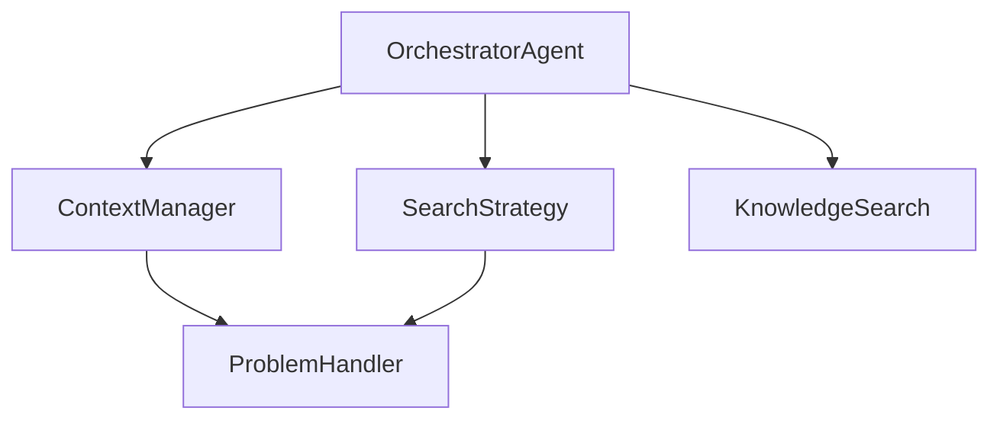

## Overview

The `OrchestratorAgent` is the central coordinator that manages the experimentation loop. It connects all components and runs iterations until a stop condition is met.



## Responsibilities

1. **Budget Tracking**: Monitor time, iterations, and cost
2. **Stop Condition Checking**: Determine when to stop
3. **Context Gathering**: Assemble problem + KG + history
4. **Search Coordination**: Run search strategy iterations
5. **Resource Cleanup**: Close connections when done

## Usage

### Via Kapso API (Recommended)

```python
from src.kapso import Kapso

kapso = Kapso()
solution = kapso.evolve(
    goal="Build a classifier",
    max_iterations=10,
)
```

### Direct Usage

```python
from src.execution.orchestrator import OrchestratorAgent
from src.environment.handlers.generic import GenericProblemHandler

# Create problem handler
handler = GenericProblemHandler(
    problem_description="Build a classifier",
    evaluator="regex_pattern",
    evaluator_params={"pattern": r"Accuracy: ([\d.]+)"},
)

# Create orchestrator
orchestrator = OrchestratorAgent(
    problem_handler=handler,
    config_path="src/config.yaml",
    mode="GENERIC",
    coding_agent="aider",
)

# Run experimentation
orchestrator.solve(
    experiment_max_iter=10,
    time_budget_minutes=60,
    cost_budget=50.0,
)

# Get best result
best = orchestrator.search_strategy.get_best_experiment()
```

## The Solve Loop

```python
def solve(self, experiment_max_iter, time_budget_minutes, cost_budget):
    start_time = time.time()

    for i in range(experiment_max_iter):
        # Calculate budget progress (0-100)
        budget_progress = max(
            (time.time() - start_time) / (time_budget_minutes * 60),
            i / experiment_max_iter,
            self.get_cumulative_cost() / cost_budget
        ) * 100

        # Check stopping conditions
        if self.problem_handler.stop_condition() or budget_progress >= 100:
            print("[Orchestrator] Stopping: score threshold or budget reached")
            break

        # Get enriched context
        context = self.context_manager.get_context(budget_progress)

        # Check if LLM decided COMPLETE (cognitive context manager)
        if self.context_manager.should_stop():
            print("[Orchestrator] Stopping: LLM decided COMPLETE")
            break

        # Run one search iteration
        self.search_strategy.run(context, budget_progress)

        # Log progress
        print(f"Experiment {i+1} completed with cost: ${self.get_cumulative_cost():.3f}")

    return self.search_strategy.get_best_experiment()
```

## Budget Tracking

The orchestrator tracks three budgets:

| Budget | Description | Progress Calculation |
|--------|-------------|---------------------|
| **Time** | Wall-clock time | `elapsed / time_budget` |
| **Iterations** | Experiment count | `i / max_iterations` |
| **Cost** | LLM API cost | `cumulative_cost / cost_budget` |

Budget progress is the **maximum** of all three:

```python
budget_progress = max(time_progress, iteration_progress, cost_progress) * 100
```

When any budget reaches 100%, the loop stops.

## Component Creation

The orchestrator creates components from configuration:

### Search Strategy

```python
def _create_search_strategy(self, coding_agent, workspace_dir):
    # Extract config
    search_config = self.mode_config.get('search_strategy', {})
    strategy_type = search_config.get('type', 'llm_tree_search')
    strategy_params = search_config.get('params', {})

    # Build coding agent config
    coding_agent_config = CodingAgentFactory.build_config(
        agent_type=coding_agent_type,
        model=coding_agent_model,
    )

    # Create via factory
    return SearchStrategyFactory.create(
        strategy_type=strategy_type,
        problem_handler=self.problem_handler,
        llm=self.llm,
        coding_agent_config=coding_agent_config,
        params=strategy_params,
    )
```

### Knowledge Search

```python
def _create_knowledge_search(self, is_kg_active):
    ks_config = self.mode_config.get('knowledge_search', {})

    if ks_config:
        return KnowledgeSearchFactory.create_from_config(ks_config)

    if is_kg_active:
        return KnowledgeSearchFactory.create("kg_llm_navigation")

    return KnowledgeSearchFactory.create_null()
```

### Context Manager

```python
def _create_context_manager(self):
    cm_config = self.mode_config.get('context_manager', {})

    if cm_config and cm_config.get('type'):
        return ContextManagerFactory.create_from_config(
            config=cm_config,
            problem_handler=self.problem_handler,
            search_strategy=self.search_strategy,
            knowledge_search=self.knowledge_search,
        )

    # Default: use kg_enriched if KG is active
    if self.knowledge_search.is_enabled():
        return ContextManagerFactory.create(
            context_manager_type="cognitive",
            ...
        )

    return ContextManagerFactory.create("kg_enriched", ...)
```

## Cost Tracking

```python
def get_cumulative_cost(self) -> float:
    """Get total cost from all components."""
    return (
        self.llm.get_cumulative_cost()
        + self.search_strategy.workspace.get_cumulative_cost()
        + self.problem_handler.llm.get_cumulative_cost()
    )
```

## Resource Cleanup

The orchestrator cleans up resources in a `finally` block:

```python
try:
    # Solve loop
    ...
finally:
    # Close context manager
    if hasattr(self.context_manager, "close"):
        self.context_manager.close()

    # Close knowledge search (if orchestrator created it)
    if self._owns_knowledge_search:
        self.knowledge_search.close()
```

## Configuration

```yaml
modes:
  GENERIC:
    search_strategy:
      type: "linear_search"
      params:
        code_debug_tries: 5

    coding_agent:
      type: "aider"
      model: "gpt-4o-mini"

    context_manager:
      type: "token_efficient"
      params:
        state_experiments_count: 5

    knowledge_search:
      type: "kg_graph_search"
      enabled: true
```

## Constructor Parameters

| Parameter | Type | Description |
|-----------|------|-------------|
| `problem_handler` | `ProblemHandler` | Handles problem context and evaluation |
| `config_path` | `str` | Path to config.yaml |
| `mode` | `str` | Configuration mode (GENERIC, MINIMAL, etc.) |
| `coding_agent` | `str` | Override coding agent type |
| `is_kg_active` | `bool` | Whether to enable knowledge graph |
| `knowledge_search` | `KnowledgeSearch` | Pre-configured search instance |
| `workspace_dir` | `str` | Custom workspace directory |
| `starting_repo_path` | `str` | Seed experiments from existing repo |

## Next Steps

<CardGroup cols={2}>
  <Card title="Search Strategies" icon="sitemap" href="/docs/components/search-strategies">
    Explore solution space algorithms
  </Card>
  <Card title="Coding Agents" icon="code" href="/docs/components/coding-agents">
    Pluggable code generators
  </Card>
  <Card title="Evaluators" icon="scale-balanced" href="/docs/components/evaluators">
    Score solutions
  </Card>
  <Card title="Stop Conditions" icon="stop" href="/docs/components/stop-conditions">
    Control when to stop
  </Card>
</CardGroup>
