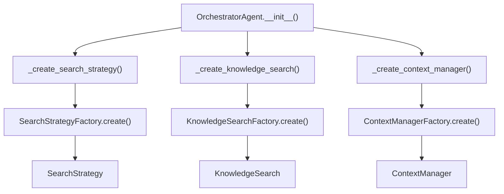

The `OrchestratorAgent` is the main entry point that coordinates all components during problem-solving.

## Initialization

```python
from src.execution.orchestrator import OrchestratorAgent
from benchmarks.mle.handler import MleBenchHandler

handler = MleBenchHandler("tabular-playground-series-dec-2021")
orchestrator = OrchestratorAgent(
    problem_handler=handler,
    config_path="benchmarks/mle/config.yaml",
    mode="MLE_CONFIGS",
    coding_agent="aider",
    is_kg_active=True,
)
```

## Parameters

| Parameter | Type | Description |
|-----------|------|-------------|
| `problem_handler` | `ProblemHandler` | Benchmark-specific handler |
| `config_path` | `str` | Path to config YAML |
| `mode` | `str` | Configuration mode name |
| `coding_agent` | `str` | Override coding agent type |
| `is_kg_active` | `bool` | Enable knowledge graph |
| `search_strategy` | `SearchStrategy` | Pre-configured strategy (optional) |

## Component Creation

The orchestrator creates components via factories:



## Solve Loop

```python
def solve(self, experiment_max_iter=20, time_budget_minutes=24*60, cost_budget=300):
    start_time = time.time()
    
    for i in range(experiment_max_iter):
        # Calculate budget progress (0-100)
        budget_progress = max(
            (time.time() - start_time) / (time_budget_minutes * 60),
            i / experiment_max_iter,
            self.get_cumulative_cost() / cost_budget
        ) * 100
        
        # Check stopping conditions
        if self.problem_handler.stop_condition() or budget_progress >= 100:
            break
        
        # Get enriched context
        experiment_context = self.context_manager.get_context(budget_progress)
        
        # Run one iteration
        self.search_strategy.run(experiment_context, budget_progress)
    
    return self.search_strategy.get_best_experiment()
```

## Budget Tracking

Budget progress is the maximum of three metrics:

| Metric | Calculation |
|--------|-------------|
| Time | `elapsed / (time_budget * 60)` |
| Iterations | `current / max_iterations` |
| Cost | `cumulative_cost / cost_budget` |

```python
def get_cumulative_cost(self):
    return (
        self.llm.get_cumulative_cost() 
        + self.search_strategy.workspace.get_cumulative_cost() 
        + self.problem_handler.llm.get_cumulative_cost()
    )
```

## After Solving

```python
# Run the solve loop
orchestrator.solve(experiment_max_iter=20)

# Get experiment history
history = orchestrator.search_strategy.get_experiment_history()

# Checkout best solution
orchestrator.search_strategy.checkout_to_best_experiment_branch()

# Get total cost
cost = orchestrator.get_cumulative_cost()

# Final evaluation
workspace = orchestrator.search_strategy.workspace.workspace_folder
result = handler.final_evaluate(workspace)
```

## Configuration Loading

The orchestrator loads configuration from YAML:

```python
def _create_search_strategy(self, coding_agent):
    mode_config = load_mode_config(self.config_path, self.mode)
    
    search_config = mode_config.get('search_strategy', {})
    strategy_type = search_config.get('type', 'llm_tree_search')
    strategy_params = search_config.get('params', {})
    
    coding_config = mode_config.get('coding_agent', {})
    coding_agent_config = CodingAgentFactory.build_config(
        agent_type=coding_agent or coding_config.get('type'),
        model=coding_config.get('model'),
    )
    
    return SearchStrategyFactory.create(
        strategy_type=strategy_type,
        problem_handler=self.problem_handler,
        coding_agent_config=coding_agent_config,
        params=strategy_params,
    )
```

