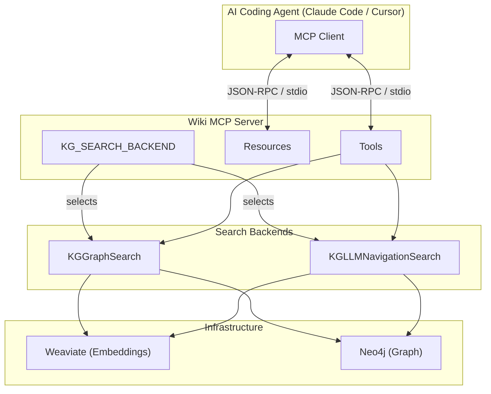
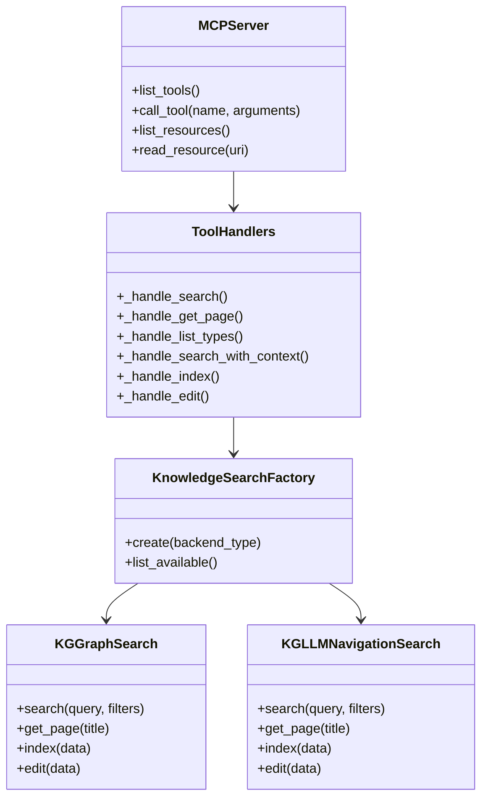

The Wiki MCP Server wraps the knowledge search functionality as an MCP (Model Context Protocol) server, enabling integration with AI coding agents like Claude Code, Cursor, and other MCP-compatible tools.

## What is MCP?

[Model Context Protocol](https://modelcontextprotocol.io) is an open standard by Anthropic that enables AI models to interact with external tools and data sources. It uses JSON-RPC 2.0 over stdio or HTTP for communication.



---

## Search Backends

The MCP server supports multiple search backends, configured via the `KG_SEARCH_BACKEND` environment variable:

| Backend | Description | Best For |
|---------|-------------|----------|
| `kg_graph_search` | Hybrid vector + graph search using Weaviate embeddings + Neo4j | Fast queries, general search (default) |
| `kg_llm_navigation` | LLM-guided multi-hop navigation | Complex queries needing reasoning |

---

## Quick Start

### 1. Install Dependencies

```bash
pip install mcp weaviate-client neo4j openai
```

### 2. Configure Your AI Agent

**For Claude Code** - Add to `~/.config/claude-code/settings.json`:

Use the template provided at `src/knowledge/wiki_mcps/mcp_config_template.json`:

```json
{
  "mcpServers": {
    "kg-graph-search": {
      "command": "python",
      "args": ["-m", "src.knowledge.wiki_mcps.mcp_server"],
      "cwd": "/path/to/tinkerer",
      "env": {
        "PYTHONPATH": "/path/to/tinkerer",
        "KG_SEARCH_BACKEND": "kg_graph_search"
      }
    },
    "kg-llm-navigation": {
      "command": "python",
      "args": ["-m", "src.knowledge.wiki_mcps.mcp_server"],
      "cwd": "/path/to/tinkerer",
      "env": {
        "PYTHONPATH": "/path/to/tinkerer",
        "KG_SEARCH_BACKEND": "kg_llm_navigation"
      }
    }
  }
}
```

**For Cursor** - Add to `~/.cursor/mcp.json`:

```json
{
  "mcpServers": {
    "knowledge-search": {
      "command": "python",
      "args": ["-m", "src.knowledge.wiki_mcps.mcp_server"],
      "cwd": "/path/to/tinkerer",
      "env": {
        "PYTHONPATH": "/path/to/tinkerer",
        "KG_SEARCH_BACKEND": "kg_graph_search",
        "OPENAI_API_KEY": "${OPENAI_API_KEY}",
        "NEO4J_URI": "bolt://localhost:7687",
        "NEO4J_USER": "neo4j",
        "NEO4J_PASSWORD": "${NEO4J_PASSWORD}",
        "WEAVIATE_URL": "http://localhost:8081"
      }
    }
  }
}
```

### 3. Restart Your AI Agent

After configuration, restart Claude Code or Cursor to load the MCP server.

### 4. Test the Integration

```bash
# Run the integration test
python tests/test_mcp_integration.py

# Or test directly with Claude Code CLI
claude -p "Search the knowledge base for LoRA fine-tuning workflows"
```

---

## Available Tools

The MCP server exposes six tools that AI agents can call:

### search_knowledge

Primary tool for semantic search across the knowledge base.

```typescript
search_knowledge({
  query: string,          // Required: Natural language query
  top_k?: number,         // Max results (default: 5, max: 20)
  page_types?: string[],  // Filter: Workflow, Principle, Implementation, Environment, Heuristic
  domains?: string[],     // Filter: LLMs, Deep_Learning, NLP, PEFT, etc.
  min_score?: number      // Minimum relevance (0.0-1.0)
})
```

**Example queries the AI might make:**
- "How to fine-tune LLM with limited GPU memory"
- "Best practices for LoRA rank selection"
- "What is gradient checkpointing"

### get_wiki_page

Retrieve a specific wiki page by exact title.

```typescript
get_wiki_page({
  page_title: string  // Exact page title (e.g., "QLoRA_Finetuning")
})
```

### kg_index

Index new wiki pages into the knowledge graph.

```typescript
// Mode 1: Index from directory
kg_index({
  wiki_dir: string,           // Path to wiki directory
  persist_path?: string,      // Path to save parsed pages JSON
  clear_existing?: boolean    // Clear existing data first (default: false)
})

// Mode 2: Index single page
kg_index({
  page_data: {
    page_title: string,       // Title (e.g., "My_New_Workflow")
    page_type: string,        // Workflow, Principle, Implementation, Environment, Heuristic
    overview: string,         // Brief summary (used for embeddings)
    content: string,          // Full MediaWiki content
    domains?: string[]        // Domain tags
  }
})
```

### kg_edit

Edit an existing wiki page across all storage layers.

```typescript
kg_edit({
  page_id: string,            // Page ID (e.g., "Workflow/QLoRA_Finetuning")
  updates: {
    overview?: string,        // New overview (triggers re-embedding)
    content?: string,         // Full new content
    domains?: string[],       // New domain tags
    sources?: Array<{type: string, title: string, url: string}>,
    outgoing_links?: Array<{edge_type: string, target_type: string, target_id: string}>
  },
  wiki_dir?: string,          // Wiki directory for source file update
  auto_timestamp?: boolean    // Auto-update last_updated (default: true)
})
```

### list_page_types

Get reference information about available page types.

```typescript
list_page_types({})  // No parameters
```

### search_with_context

Search with additional context for improved relevance.

```typescript
search_with_context({
  query: string,          // Search query
  context?: string,       // Current experiment context, error messages, etc.
  top_k?: number,
  page_types?: string[]
})
```

---

## Available Resources

Resources provide static reference information:

| URI | Description |
|-----|-------------|
| `knowledge://overview` | Knowledge base structure and usage guide |
| `knowledge://page-types` | Detailed reference of all page types |

---

## Page Types

The knowledge base organizes content by type:

| Type | Description | Best For |
|------|-------------|----------|
| **Workflow** | Step-by-step guides | "How do I..." questions |
| **Principle** | Theoretical concepts | "What is..." questions |
| **Implementation** | Code patterns & APIs | Technical details |
| **Environment** | Setup & dependencies | Installation help |
| **Heuristic** | Best practices & tips | Optimization advice |

---

## Running Standalone

### Direct Execution

```bash
# Use default backend (kg_graph_search)
python -m src.knowledge.wiki_mcps.mcp_server

# Use LLM navigation backend
KG_SEARCH_BACKEND=kg_llm_navigation python -m src.knowledge.wiki_mcps.mcp_server

# With uv
uv run src/knowledge/wiki_mcps/mcp_server.py
```

### Testing with Claude Code CLI

```bash
# Test with temporary MCP config
claude -p "Search for fine-tuning workflows" \
  --mcp-config /tmp/mcp_config.json \
  --allowedTools "Read,mcp__kg-graph-search__search_knowledge"
```

### Testing with MCP Inspector

```bash
npx @modelcontextprotocol/inspector python -m src.knowledge.wiki_mcps.mcp_server
```

### Programmatic Usage

```python
from src.knowledge.wiki_mcps.mcp_server import create_mcp_server, run_mcp_server
import asyncio

# Create server instance
server = create_mcp_server()

# Run the server (blocks)
asyncio.run(run_mcp_server())
```

---

## How It Works

### Search Pipeline

When an AI agent calls `search_knowledge`:


### Communication Protocol

MCP uses JSON-RPC 2.0 over stdio:

```json
// Request (from AI agent)
{
  "jsonrpc": "2.0",
  "id": 1,
  "method": "tools/call",
  "params": {
    "name": "search_knowledge",
    "arguments": {
      "query": "fine-tune LLM",
      "top_k": 5
    }
  }
}

// Response (from MCP server)
{
  "jsonrpc": "2.0",
  "id": 1,
  "result": {
    "content": [
      {
        "type": "text",
        "text": "# Search Results for: \"fine-tune LLM\"\n..."
      }
    ]
  }
}
```

---

## Environment Variables

| Variable | Required | Default | Description |
|----------|----------|---------|-------------|
| `KG_SEARCH_BACKEND` | No | `kg_graph_search` | Search backend to use |
| `OPENAI_API_KEY` | Yes | - | OpenAI API key for embeddings |
| `NEO4J_URI` | No | `bolt://localhost:7687` | Neo4j connection URI |
| `NEO4J_USER` | No | `neo4j` | Neo4j username |
| `NEO4J_PASSWORD` | Yes | - | Neo4j password |
| `WEAVIATE_URL` | No | `http://localhost:8081` | Weaviate server URL |

---

## Architecture

### File Structure

```
src/knowledge/wiki_mcps/
├── __init__.py               # Module exports
├── mcp_server.py             # MCP server implementation
├── mcp_config_template.json  # Template for Claude Code config
└── README.md                 # Module documentation
```

### Components



---

## Testing

### Run Integration Test

```bash
# Auto-loads from .env
python tests/test_mcp_integration.py

# Or with explicit environment
export $(grep ANTHROPIC_API_KEY .env | xargs)
python tests/test_mcp_integration.py
```

The test:
1. Creates a temporary MCP config
2. Starts Claude Code with the MCP server
3. Runs a test query about GRPO training
4. Verifies the knowledge search tools work

---

## Troubleshooting

### Server not appearing in AI agent

1. Check config file path and JSON syntax
2. Verify `cwd` points to project root
3. Verify `PYTHONPATH` is set correctly
4. Restart the AI application
5. Check agent logs for errors

### Connection refused errors

Ensure backend services are running:

```bash
# Check Docker containers
docker ps | grep -E "weaviate|neo4j"

# Start if needed
docker start weaviate neo4j
```

### Empty search results

1. Verify knowledge base is indexed:
   ```python
   from src.knowledge.search import KnowledgeSearchFactory, KGIndexInput
   search = KnowledgeSearchFactory.create("kg_graph_search")
   search.index(KGIndexInput(wiki_dir="data/wikis"))
   ```

2. Check Weaviate has data:
   ```bash
   curl http://localhost:8081/v1/objects?limit=5
   ```

### API key errors

1. Ensure `ANTHROPIC_API_KEY` is set for Claude Code
2. Ensure `OPENAI_API_KEY` is set for embeddings
3. Check `.env` file exists and has correct values

### Import errors

Install required packages:

```bash
pip install mcp weaviate-client neo4j openai
```

---

## Example: Full Workflow

Here's an example of how Claude Code uses the MCP tools:

```
User: Build a Llama 3 post-training with GRPO on a user preference dataset

Claude Code:
1. Calls search_knowledge(query="GRPO training Llama 3")
2. Finds relevant workflows and principles
3. Calls get_wiki_page(page_title="GRPO_Reinforcement_Learning")
4. Synthesizes information into a comprehensive guide
5. Returns step-by-step implementation plan
```

---

## Related Documentation

- [Knowledge Search](/components/knowledge-search/overview) - Backend search implementation
- [Search Strategies](/components/search-strategies/overview) - Different search approaches
- [Architecture](/concepts/architecture) - System architecture overview
- [Neo4j Setup](/guides/setup-neo4j) - Graph database configuration
