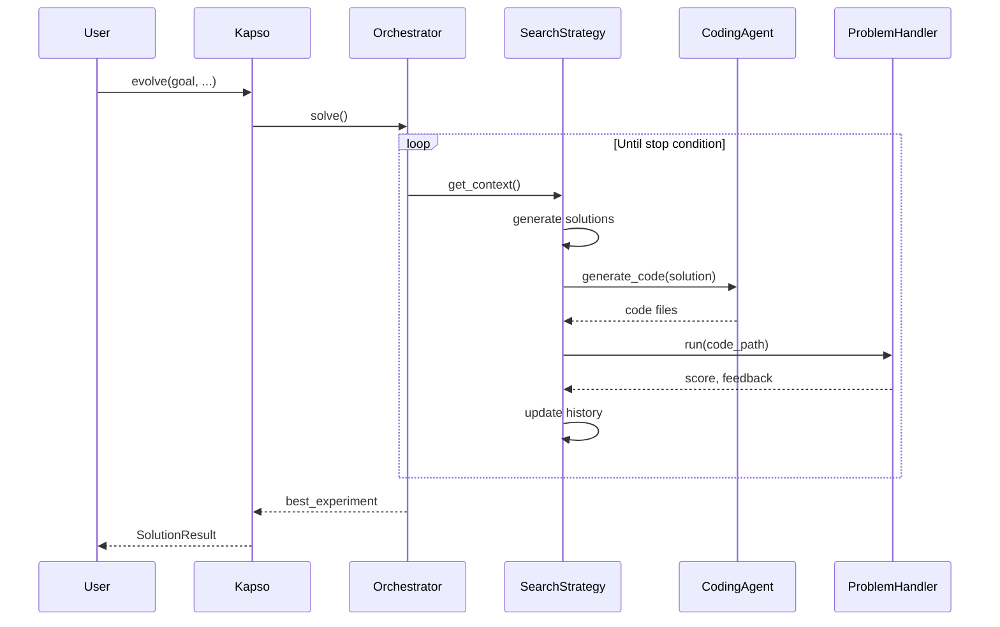

## Overview

When you call `kapso.evolve()`, Kapso orchestrates a multi-step process that generates, tests, and refines code until a satisfactory solution is found.



## Step-by-Step Execution

### 1. Initialization

When `evolve()` is called:

```python
solution = kapso.evolve(
    goal="Build a classifier with 95% accuracy",
    output_path="./models/v1",
    evaluator="regex_pattern",
    evaluator_params={"pattern": r"Accuracy: ([\d.]+)"},
    stop_condition="threshold",
    stop_condition_params={"threshold": 0.95},
)
```

Kapso creates:
1. **ProblemHandler** - Wraps the goal with evaluation logic
2. **OrchestratorAgent** - Coordinates the solve loop
3. **SearchStrategy** - Manages solution exploration
4. **ExperimentWorkspace** - Git repository for experiments

### 2. The Solve Loop

The orchestrator runs iterations until a stop condition is met:

```python
def solve(self, experiment_max_iter, time_budget_minutes, cost_budget):
    for i in range(experiment_max_iter):
        # Calculate budget progress (0-100%)
        budget_progress = max(
            (time.time() - start_time) / (time_budget_minutes * 60),
            i / experiment_max_iter,
            self.get_cumulative_cost() / cost_budget
        ) * 100

        # Check stopping conditions
        if self.problem_handler.stop_condition() or budget_progress >= 100:
            break

        # Get enriched context
        context = self.context_manager.get_context(budget_progress)

        # Check if LLM decided COMPLETE
        if self.context_manager.should_stop():
            break

        # Run one search iteration
        self.search_strategy.run(context, budget_progress)
```

### 3. Context Gathering

The context manager assembles information for the coding agent:

```python
@dataclass
class ContextData:
    problem: str           # Problem description
    additional_info: str   # Workflow guidance, constraints
    kg_results: str        # Knowledge graph context
    kg_code_results: str   # Implementation examples from KG
    experiment_history: str # Past experiments and scores
```

If Knowledge Search is enabled, relevant wiki pages are retrieved:

```python
if self.knowledge_search.is_enabled():
    result = self.knowledge_search.search(
        query=problem,
        filters=KGSearchFilters(top_k=5)
    )
    context.kg_results = result.to_context_string()
```

### 4. Solution Generation

The search strategy generates solution candidates:

**Linear Search** (simple):
```python
def run(self, context, budget_progress):
    # Generate one solution per iteration
    solution = self.llm.generate(
        f"Solve this problem: {context.problem}"
    )
    self._implement_n_debug(solution, context)
```

**Tree Search** (advanced):
```python
def run(self, context, budget_progress):
    # Expand: Generate new child solutions
    self.expand(context, budget_progress)

    # Select: Pick best nodes to experiment
    best_nodes = self.select(context, top_k=experiments_count)

    # Run experiments in parallel
    for node in best_nodes:
        self._run_for_node(node, context, branch_name)
```

### 5. Code Generation

The coding agent receives a prompt and generates code:

```python
def implement_solution(self, solution, context, session):
    # Build prompt with RepoMemory context
    repo_memory_brief = RepoMemoryManager.render_summary_and_toc(...)

    prompt = f"""
    # Problem
    {context.problem}

    # Solution to Implement
    {solution}

    # Repo Memory (Summary + TOC)
    {repo_memory_brief}

    # Knowledge Graph Context
    {context.kg_code_results}
    """

    # Generate code via coding agent
    session.generate_code(prompt)

    # Run and evaluate
    return self.problem_handler.run(session.session_folder)
```

### 6. Debugging Loop

If code fails, the debug loop attempts fixes:

```python
def _implement_n_debug(self, solution, context, code_debug_tries, branch_name):
    session = self.workspace.create_experiment_session(branch_name)
    result = self.implement_solution(solution, context, session)

    for i in range(code_debug_tries):
        if result.run_had_error and result.continue_debugging:
            result = self.debug_solution(solution, context, result.error_details, session)
        else:
            break

    # Update RepoMemory with experiment results
    session.schedule_repo_memory_update(solution_spec=solution, run_result=result)
    self.workspace.finalize_session(session)
    return result
```

### 7. Evaluation

The problem handler runs the code and scores it:

```python
class GenericProblemHandler(ProblemHandler):
    def run(self, file_path, run_data_dir, solution, debug=False):
        # Execute the code
        output = subprocess.run(
            ["python", self.main_file],
            cwd=file_path,
            timeout=self.timeout,
            capture_output=True
        )

        # Evaluate with configured evaluator
        eval_result = self.evaluator.evaluate(
            output=output.stdout,
            file_path=file_path,
            problem=self.problem_description,
            solution=solution,
        )

        return ProblemRunResult(
            score=eval_result.score,
            output=output.stdout,
            feedbacks=eval_result.feedback,
        )
```

### 8. Stop Condition Check

After each experiment, stop conditions are checked:

```python
def stop_condition(self):
    decision = self._stop_condition.check(
        best_score=self.best_score,
        current_score=self.current_score,
        iteration=self.iteration,
    )
    return decision.should_stop
```

### 9. Result Collection

When the loop ends, the best solution is returned:

```python
# Checkout to best solution branch
orchestrator.search_strategy.checkout_to_best_experiment_branch()

# Final evaluation
final_result = handler.final_evaluate(workspace_path)

# Create solution result
solution = SolutionResult(
    goal=goal,
    code_path=output_path,
    experiment_logs=experiment_logs,
    metadata={
        "cost": f"${cost:.3f}",
        "final_evaluation": final_result,
    }
)
```

## Git Branch Structure

Each experiment runs on its own branch:

```
main
├── experiment_0 (first attempt)
├── experiment_1 (second attempt)
│   └── experiment_2 (refined from experiment_1)
└── experiment_3 (different approach)
```

The workspace manages branching:

```python
class ExperimentWorkspace:
    def create_experiment_session(self, branch_name, parent_branch="main"):
        # Create new branch from parent
        self.repo.git.checkout(parent_branch)
        self.repo.git.checkout("-b", branch_name)

        # Return session for code generation
        return ExperimentSession(
            workspace=self,
            branch_name=branch_name,
            coding_agent=self.coding_agent,
        )
```

## RepoMemory Updates

RepoMemory tracks understanding across experiments:

```python
# After each experiment, update memory
RepoMemoryManager.update_after_experiment(
    repo_root=session.session_folder,
    llm=self.llm,
    branch_name=branch_name,
    solution_spec=solution,
    run_result={
        "score": result.score,
        "run_had_error": result.run_had_error,
        "error_message": result.error_message,
    },
)
```

Memory is committed to each branch, so child experiments inherit parent knowledge.

## Parallel Execution

Tree search runs experiments in parallel:

```python
def run(self, context, budget_progress):
    best_nodes = self.select(context, top_k=experiments_count)

    # Run experiments in parallel
    with ThreadPoolExecutor(max_workers=len(best_nodes) + 1) as executor:
        futures = [
            executor.submit(self._run_for_node, node, context, branch_name)
            for node, branch_name in zip(best_nodes, branch_names)
        ]
        for future in as_completed(futures):
            future.result()
```

## Budget Tracking

The orchestrator tracks three budgets:

| Budget | Description |
|--------|-------------|
| **Time** | Wall-clock time since start |
| **Iterations** | Number of experiment iterations |
| **Cost** | Cumulative LLM API cost |

```python
budget_progress = max(
    elapsed_time / time_budget,
    iteration / max_iterations,
    cumulative_cost / cost_budget
) * 100
```

When any budget reaches 100%, the loop stops.

## Error Handling

Errors are captured and fed back for debugging:

```python
@dataclass
class ProblemRunResult:
    score: float = 0
    output: str = ""
    run_had_error: bool = False
    error_message: str = ""
    error_details: str = ""
    feedbacks: str = ""
    continue_debugging: bool = True  # False if unrecoverable
```

The debug prompt includes error details:

```python
def debug_solution(self, solution, context, error, session):
    prompt = f"""
    # Problem
    {context.problem}

    # Solution
    {solution}

    # Error to Fix
    {error}
    """
    session.generate_code(prompt, debug_mode=True)
```

## Next Steps

<CardGroup cols={2}>
  <Card title="Tree Search" icon="sitemap" href="/docs/concepts/tree-search">
    LLM-guided solution exploration
  </Card>
  <Card title="Orchestrator" icon="gears" href="/docs/components/orchestrator">
    Deep dive into the orchestrator
  </Card>
  <Card title="Search Strategies" icon="magnifying-glass" href="/docs/components/search-strategies">
    Explore different search strategies
  </Card>
  <Card title="Evaluators" icon="scale-balanced" href="/docs/components/evaluators">
    How solutions are scored
  </Card>
</CardGroup>
