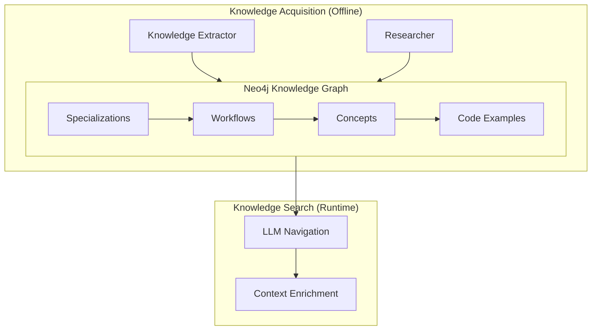
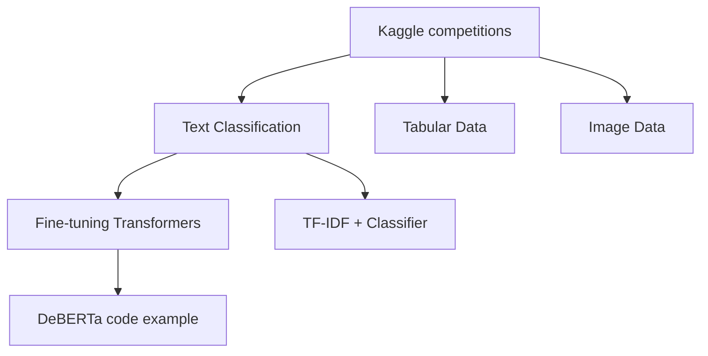

## Overview

The knowledge system provides domain-specific guidance during problem-solving, helping the agent recommend proven approaches and avoid common pitfalls.



## Knowledge Graph Structure

The graph contains four node types organized hierarchically:

| Type | Purpose | Example |
|------|---------|---------|
| `specialization` | Root category | "Kaggle competitions" |
| `workflow` | Step-by-step approach | "Text Classification Best Approaches" |
| `concept` | Detailed tips | "Fine-tuning Transformers" |
| `code` | Working examples | "DeBERTa-v3 training code" |

### Example Graph



## LLM-Guided Navigation

The search algorithm navigates the graph using LLM guidance:

```python
def search(self, query, context):
    # 1. Find starting nodes by keyword
    nodes = self.keyword_search(query, node_type="specialization")
    
    # 2. Navigate graph with LLM guidance
    for step in range(navigation_steps):
        neighbors = self.get_neighbors(nodes)
        
        # LLM selects relevant neighbors
        selected = llm.call(f"""
            Problem: {query}
            Already explored: {nodes}
            Available neighbors: {neighbors}
            Which neighbors are relevant?
        """)
        
        nodes.extend(selected)
    
    # 3. Return aggregated knowledge
    return KnowledgeResult(
        text_results="\n".join(n.content for n in nodes),
        code_results="\n".join(n.content for n in nodes if n.type == "code")
    )
```

## Context Enrichment

Knowledge flows into solution generation via the Context Manager:

```python
class KGEnrichedContextManager(ContextManager):
    def get_context(self, budget_progress):
        # Get problem description
        problem = self.problem_handler.get_problem_context(budget_progress)
        
        # Get experiment history
        history = self.search_strategy.get_experiment_history()
        
        # Query knowledge search
        if self.knowledge_search.is_enabled():
            result = self.knowledge_search.search(
                query=problem,
                context=str(history[-1]) if history else None
            )
            kg_results = result.text_results
            kg_code_results = result.code_results
        
        return ContextData(
            problem=problem,
            kg_results=kg_results,           # Tips and workflows
            kg_code_results=kg_code_results, # Code examples
            additional_info=format(history)
        )
```

## Configuration

Enable knowledge search in your mode configuration:

```yaml
knowledge_search:
  type: "kg_llm_navigation"
  enabled: true
  params:
    search_top_k: 1           # Initial nodes to find
    navigation_steps: 3       # Graph navigation depth
    expansion_limit: 3        # Nodes per step
    search_node_type: "specialization"
```

## Available Presets

| Preset | search_top_k | navigation_steps | expansion_limit |
|--------|--------------|------------------|-----------------|
| `DEFAULT` | 1 | 3 | 3 |
| `DEEP_SEARCH` | 3 | 5 | 5 |
| `SHALLOW` | 1 | 2 | 2 |
| `MINIMAL` | 1 | 1 | 1 |

## Knowledge Acquisition

Two tools build knowledge offline:

### Knowledge Extractor
Extracts patterns from successful experiments:
```python
# From src/knowledge/acquisition/knowledge_extractor.py
create_knowledge_tree_from_experiments(experiments_dict)
```

### Researcher
Performs web research for domain knowledge:
```python
# From src/knowledge/acquisition/researcher.py
deep_research_for_knowledge(domain, specialization, workflow, notes)
```

<Tip>
The knowledge graph is optional but recommended for MLE-Bench. It significantly improves results on ML problems by providing proven approaches.
</Tip>

