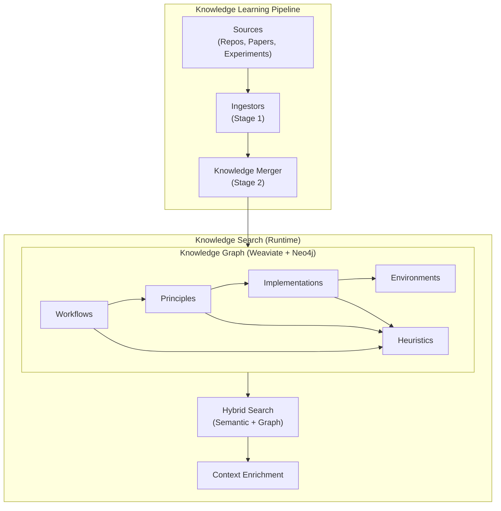
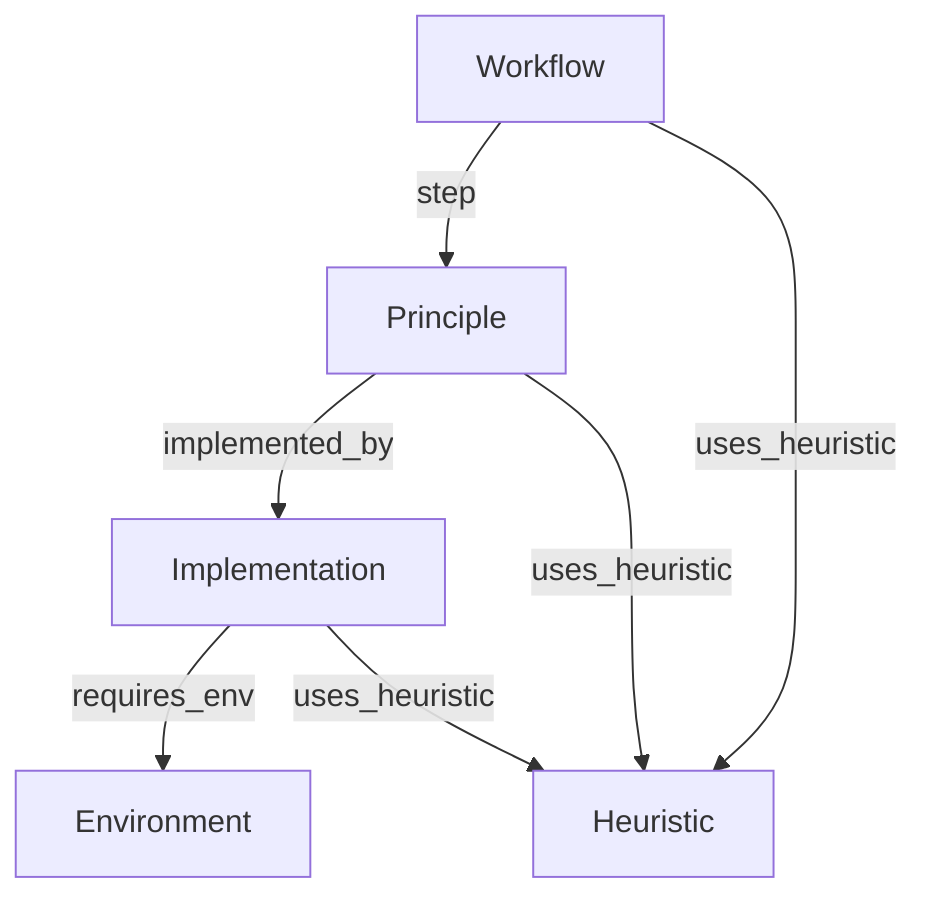

## Overview

The knowledge system provides domain-specific guidance during problem-solving, helping the agent recommend proven approaches and avoid common pitfalls.



## Knowledge Learning Pipeline

The knowledge learning system uses a two-stage pipeline to acquire and integrate knowledge:

### Architecture

```python
from src.knowledge.learners import KnowledgePipeline, Source

pipeline = KnowledgePipeline()

# Full pipeline: ingest + merge
result = pipeline.run(Source.Repo("https://github.com/user/repo"))

# Multiple sources
result = pipeline.run(
    Source.Repo("https://github.com/user/repo"),
    Source.Paper("./research.pdf"),
)
```

### Stage 1: Ingestors

Ingestors extract WikiPages from knowledge sources. Each source type has a dedicated ingestor:

| Ingestor | Source Type | Description |
|----------|-------------|-------------|
| `RepoIngestor` | `Source.Repo` | Clones GitHub repos, uses Claude Code to explore and extract |
| `PaperIngestor` | `Source.Paper` | Extracts knowledge from PDFs (WIP) |
| `ExperimentIngestor` | `Source.Solution` | Learns from completed experiments |

```python
from src.knowledge.learners.ingestors import IngestorFactory

# Create ingestor by type
ingestor = IngestorFactory.create("repo")
pages = ingestor.ingest(Source.Repo("https://github.com/user/repo"))

# Or auto-detect from source
ingestor = IngestorFactory.for_source(Source.Repo("..."))
```

### Stage 2: Knowledge Merger

The merger analyzes proposed pages against the existing KG and decides how to integrate them:

| Action | Description |
|--------|-------------|
| `create_new` | New page for novel knowledge |
| `update_existing` | Improve existing page with better content |
| `add_links` | Add new connections between pages |
| `skip` | Duplicate or low-quality content |

```python
from src.knowledge.learners import KnowledgeMerger

merger = KnowledgeMerger()
result = merger.merge(
    proposed_pages=pages,
    repo_url="https://github.com/user/repo",
)
print(f"Created: {result.created}, Updated: {result.updated}")
```

## Wiki Page Types (Knowledge Graph Schema)

The knowledge graph uses 5 page types organized as a **Top-Down Directed Acyclic Graph (DAG)**:

| Type | Role | Example |
|------|------|---------|
| **Workflow** | The Recipe - ordered sequence of steps | "QLoRA Fine-tuning" |
| **Principle** | The Theory - library-agnostic concepts | "Low Rank Adaptation" |
| **Implementation** | The Code - concrete API reference | "TRL_SFTTrainer" |
| **Environment** | The Context - hardware/dependencies | "CUDA_11_Environment" |
| **Heuristic** | The Wisdom - tips and optimizations | "Learning_Rate_Tuning" |

### Connection Schema



| Edge Type | From | To | Meaning |
|-----------|------|-----|---------|
| `step` | Workflow | Principle | "This step is defined by this theory" |
| `implemented_by` | Principle | Implementation | "This theory is realized by this code" |
| `requires_env` | Implementation | Environment | "This code needs this context" |
| `uses_heuristic` | Any | Heuristic | "This is optimized by this wisdom" |

## Hybrid Knowledge Search

The search system combines:
- **Weaviate**: Vector embeddings for semantic search
- **Neo4j**: Graph structure for connection traversal

### Search Flow

```python
from src.knowledge.search import KnowledgeSearchFactory, KGSearchFilters

# Create search instance
search = KnowledgeSearchFactory.create("kg_graph_search")

# Search with filters
result = search.search(
    query="How to fine-tune LLM with limited GPU memory?",
    filters=KGSearchFilters(
        top_k=5,
        page_types=["Workflow", "Heuristic"],
        domains=["LLMs", "PEFT"],
    )
)

# Use results
for item in result:
    print(f"{item.page_title} ({item.page_type}): {item.score:.2f}")
    
# Get formatted context for LLM
context = result.to_context_string(max_results=3)
```

### Search Algorithm

1. **Query → Embedding** - Generate embedding with OpenAI
2. **Vector Search** - Find top-k similar pages in Weaviate
3. **LLM Reranking** - Reorder results based on query relevance
4. **Graph Enrichment** - Add connected pages from Neo4j
5. **Return KGOutput** - Ranked results with scores and connections

## Context Enrichment

Knowledge flows into solution generation via the Context Manager:

```python
class KGEnrichedContextManager(ContextManager):
    def get_context(self, budget_progress):
        # Get problem description
        problem = self.problem_handler.get_problem_context(budget_progress)
        
        # Query knowledge search
        if self.knowledge_search.is_enabled():
            result = self.knowledge_search.search(
                query=problem,
                filters=KGSearchFilters(top_k=5)
            )
            # Format results for LLM context
            kg_context = result.to_context_string(max_results=5)
            code_results = result.get_by_type("Implementation")
        
        return ContextData(
            problem=problem,
            kg_results=kg_context,
            kg_code_results=code_results,
        )
```

## CLI Usage

```bash
# Learn from a GitHub repository
python -m src.knowledge.learners https://github.com/user/repo

# Dry run (analyze without modifying KG)
python -m src.knowledge.learners https://github.com/user/repo --dry-run

# Extract only (preview pages without merging)
python -m src.knowledge.learners https://github.com/user/repo --extract-only

# Learn from a paper (when implemented)
python -m src.knowledge.learners ./paper.pdf --type paper
```

## Configuration

Enable knowledge search in your mode configuration:

```yaml
knowledge_search:
  type: "kg_graph_search"
  enabled: true
  params:
    embedding_model: "text-embedding-3-large"
    weaviate_collection: "WikiPages"
    include_connected_pages: true
    use_llm_reranker: true
    reranker_model: "gpt-4.1-mini"
```

## Available Search Presets

| Preset | top_k | LLM Reranker | Connected Pages |
|--------|-------|--------------|-----------------|
| `DEFAULT` | 10 | Yes | Yes |
| `FAST` | 5 | No | No |
| `THOROUGH` | 20 | Yes | Yes |

<Tip>
The knowledge graph is optional but highly recommended for complex domains. It significantly improves results by providing proven approaches and avoiding common pitfalls.
</Tip>
