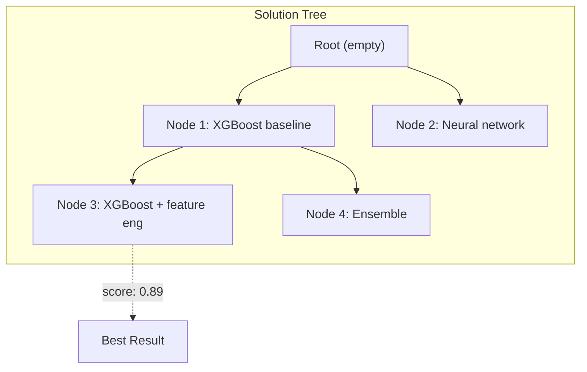
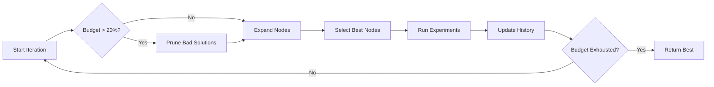
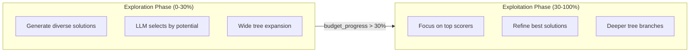

## Overview

Kapso Agent uses an LLM-steered tree search to explore the solution space. Each node represents a solution idea, and the algorithm iteratively expands, selects, and prunes nodes.



## Algorithm Flow



## Node Structure

Each node contains:

```python
class Node:
    node_id: int              # Unique identifier
    parent_node: Node         # Parent reference (None for root)
    solution: str             # Solution description
    branch_name: str          # Git branch for this experiment
    is_terminated: bool       # Pruned or failed
    experiment_result: ExperimentResult  # Score, output, errors
    children: List[Node]      # Child nodes
```

## Key Operations

### Expand

Generates new solution candidates from selected nodes.

```python
def expand(self, context, budget_progress):
    if budget_progress >= exploration_budget_percent:
        # Exploitation: expand top-scoring nodes
        selected_nodes = [self.nodes[exp.node_id] for exp in top_experiments]
    else:
        # Exploration: LLM selects promising nodes
        selected_nodes = self.select(context, criteria="potential for improvement")
    
    for node in selected_nodes:
        new_solutions = self.solution_generation(parent_solution=node.solution)
        for solution in new_solutions:
            child = Node(parent=node, solution=solution)
            node.children.append(child)
```

### Select

LLM-guided selection of nodes to experiment with.

```python
def select(self, context, top_k, criteria):
    leaf_nodes = [n for n in self.nodes if n.is_leaf and not n.is_terminated]
    
    # LLM prompt: "Select top {k} solutions based on {criteria}"
    prompt = f"""
    Problem: {context.problem}
    Knowledge: {context.kg_results}
    Candidates: {[node.solution for node in leaf_nodes]}
    """
    
    selected_ids = llm.call(prompt)  # Returns list of node IDs
    return [n for n in leaf_nodes if n.node_id in selected_ids]
```

### Prune

Removes unpromising solutions to focus resources.

```python
def prune_bad_solutions(self, context):
    leaf_nodes = [n for n in self.nodes if n.is_leaf and not n.is_terminated]
    
    # LLM identifies solutions unlikely to improve
    bad_ids = llm.call("Select solutions to delete based on history")
    
    for node in leaf_nodes:
        if node.node_id in bad_ids:
            node.is_terminated = True
```

## Configuration Parameters

| Parameter | Default | Description |
|-----------|---------|-------------|
| `node_expansion_limit` | 2 | Nodes to expand per iteration |
| `node_expansion_new_childs_count` | 5 | Solutions generated per expansion |
| `code_debug_tries` | 5 | Max debug attempts per solution |
| `exploration_budget_percent` | 30 | When to switch from exploration to exploitation |
| `idea_generation_model` | `gpt-4.1-mini` | Model for solution generation |

## Exploration vs Exploitation



The `exploration_budget_percent` parameter controls this transition. Early iterations prioritize diversity; later iterations focus on refining the best solutions.

