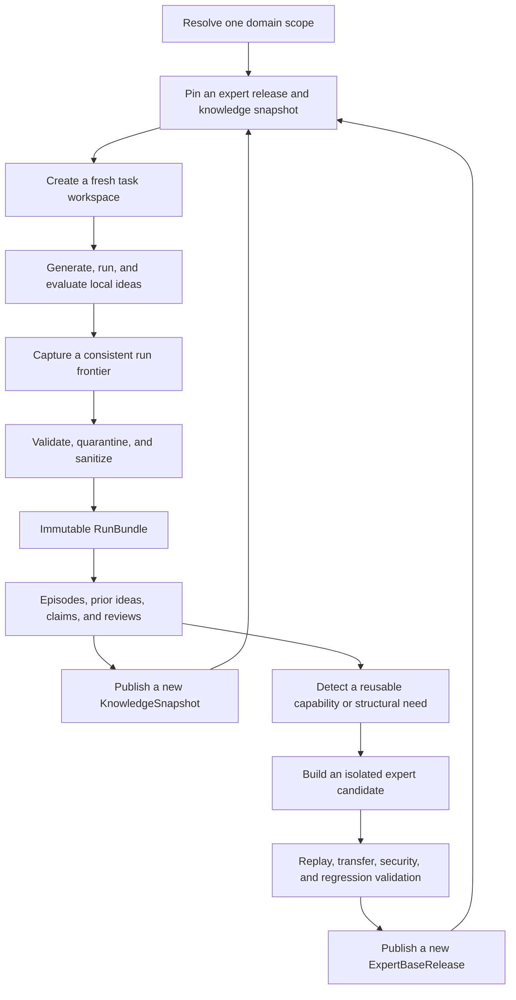

# Expert and Knowledge Learning

Kapso learns across tasks in two deliberately different forms:

- The **knowledge repository** is the scientific memory: what was tried, what
  happened, where it may apply, and how strongly the evidence is trusted.
- The **expert repository** is the executable toolkit: reusable code and tests
  that have survived independent validation across relevant tasks.

Knowledge can influence future ideas. Expert code becomes the starting point for
future work. A successful experiment never moves directly into the expert
repository.

This page describes the cross-run learning used by `evolve`. It is separate from
Kapso's general `learn`/research knowledge graph.

## The three levels of memory

| Level | Contents | Lifetime | Role in a new task |
|---|---|---|---|
| **Run memory** | Local ideas, experiments, outcomes, code branches, and artifacts | One run | Records the current search and remains its source of truth |
| **Knowledge snapshot** | Sanitized episodes, untried ideas, reviewed claims, contradictions, and search indexes | Across runs | Supplies read-only evidence and inspiration |
| **Expert release** | Reusable source code, tests, capability contracts, repository map, and semantic book | Across runs | Supplies the tested starting repository |

This separation prevents foreign experiments from being inserted into the current
run as if they happened locally, and prevents plausible prose from silently
becoming executable behavior.

## End-to-end flow

There are two learning speeds. Knowledge snapshots can grow whenever new safe
evidence is admitted. Expert releases evolve more slowly because they change the
code every future task will inherit.

### 1. Start from exact, trusted inputs

A task selects a configured **scope**, task family, and adapter—not repository
URLs. For example, language-model post-training and relational prediction may
share the broad `ml_ai` scope while retaining different task contexts and
evaluators.

Kapso resolves the scope to its expert, knowledge, and security repositories and
pins exact immutable releases in a `LaunchManifest`. It then creates a fresh,
self-contained workspace containing the expert source, knowledge package, task
adapter, and task inputs. Moving `CURRENT` pointers cannot change a running task.

### 2. Experiment locally

During evolve, the current run owns its `IdeaArchive`, experiment history,
execution journal, and code branches. Ideation may retrieve a small, relevant
packet from the pinned knowledge snapshot, including positive, negative,
inconclusive, and untried evidence.

Retrieved material is advisory. A prior idea must be adapted into a new local
idea and pass the current run's novelty, evidence, and selection process. It
cannot become a local parent or executable experiment by reference.

### 3. Turn the run into safe evidence

At a consistent checkpoint, Kapso captures the run's mutually compatible state.
The capture enters a restricted quarantine, where paths, provenance, evaluator
identity, completeness, secrets, data, weights, logs, and unsafe artifacts are
validated. The allowed result becomes an immutable `RunBundle`.

The bundle records the honest frontier of a completed, stopped, or crashed run.
It preserves technical failures and interrupted attempts instead of keeping only
the latest successful result.

### 4. Build the knowledge snapshot

The catalog projects each executed idea into a `TransferEpisode`; a never-executed
idea becomes a `PriorIdea`. Coding-agent roles may propose general claims and
independent coding-agent roles review them. Claims must name their applicability,
exclusions, supporting evidence, and contradictions.

Deterministic policy—not an LLM—decides admission, disputes, supersession, taint,
and revocation. The publisher then creates a self-contained `KnowledgeSnapshot`
with complete normalized records, proof dependencies, metadata, lexical search,
and semantic vectors. GitHub stores immutable releases; `CURRENT.json` selects
the active one through an atomic compare-and-swap update.

At runtime, compatibility filters run before search ranking. Embeddings help find
semantically related records, but never decide whether a claim is true, whether
an experiment improved, or whether two evaluations are comparable.

### 5. Evolve the expert repository

Expert evolution begins only when evidence indicates a reusable need: repeated
success or difficulty across independent contexts, a general reliability fix, a
supported claim that can remove repeated work, or a genuine repository-structure
problem.

A coding agent edits an isolated candidate workspace. On an empty scope, the
architect creates the initial structure. Later it may add a capability or
restructure the repository as domains and interfaces evolve. Kapso derives and
checks the machine-readable repository map, module contracts, capability lineage,
and `EXPERT_REPO.md` semantic book; the agent cannot certify its own proposal.

The candidate must pass an ordered validation cascade covering source replay,
fresh tasks, task-family transfer, security and sanitation, dependencies and
licenses, cost, regressions, and independent review. Only an eligible candidate
is assembled into an immutable, history-free `ExpertBaseRelease` and promoted to
`CURRENT`.

## What each repository contains

### Knowledge repository

Each release is a portable evidence package containing:

- normalized transfer episodes and untried prior ideas;
- reviewed claims, contradictions, trust state, and their full proof closure;
- scope, task-context, evaluator, provenance, sanitation, and policy identities;
- deterministic metadata and lexical indexes; and
- embedding-space-specific semantic indexes that can be rebuilt from canonical
  records.

It does not depend on old task workspaces or raw traces for normal retrieval.

### Expert repository

Each release is a self-contained capability repository containing:

- reusable implementation code and tests;
- explicit module interfaces, preconditions, incompatibilities, resource bounds,
  dependencies, and known failures;
- a machine-readable `ExpertRepositoryMap` describing capability ownership and
  dependency topology;
- a generated `EXPERT_REPO.md` that explains the repository to another coding
  agent at a glance; and
- the exact release manifest and validation evidence required to authenticate it.

It contains no experiment histories, datasets, model weights, task outputs,
hidden evaluations, or benchmark-specific decision tree. Task-specific behavior
stays behind typed adapters; reusable capabilities remain domain-neutral.

## Module responsibilities

| Module | Responsibility |
|---|---|
| **Contracts and scope routing** | Defines domain-neutral records and maps a scope to its expert, knowledge, and security authorities |
| **Launch and resume** | Resolves exact releases, creates the workspace, pins the launch, and resumes without consulting moving remote state |
| **Run capture** | Reconciles local memories and artifacts, quarantines raw output, sanitizes it, and publishes a `RunBundle` |
| **Scientific catalog** | Projects episodes and prior ideas, manages claims and reviews, and derives trust, contradiction, and revocation state |
| **Knowledge packaging and retrieval** | Builds immutable snapshots and indexes, then returns bounded, proof-complete prior-knowledge packets |
| **Ideation bridge** | Gives ideation read-only prior evidence while preserving strict separation from local ideas and experiments |
| **Expert architecture and candidates** | Detects reusable needs, invokes the architect/generalizer, and seals code, contracts, topology, lineage, and semantic book |
| **Expert validation and release** | Runs replay and transfer gates, independent review, composition, promotion, publication, and release-use enforcement |
| **GitHub control plane** | Publishes immutable assets and advances authenticated `CURRENT` pointers without using GitHub as a query database |
| **Security authority** | Maintains a cumulative denylist and blocks revoked evidence, candidates, releases, launch, resume, or derivative work |

Configured coding-agent CLIs such as Codex or Claude Code provide semantic
judgment and generate proposed changes. OpenAI embeddings support semantic
retrieval. Kapso's deterministic code retains all authority over identities,
provenance, admission, validation state, publication, and revocation.

## Core guarantees

- **Evidence before code:** one good result is not a reusable capability.
- **Immutable lineage:** snapshots, candidates, and releases are content-addressed
  and never rewritten in place.
- **Self-contained startup:** a future task needs the pinned expert release and
  knowledge snapshot, not historical task directories.
- **Local-memory isolation:** cross-run records inform a run but never masquerade
  as its own experiments.
- **Domain neutrality:** new ML/AI task families add scope contracts and adapters,
  not hardcoded benchmark branches in the expert core.
- **Fail-closed authority:** missing, stale, corrupt, mismatched, or revoked inputs
  stop the operation instead of triggering an implicit fallback.

After many tasks, the expected result is a broad evidence library, a smaller set
of reviewed general claims, and a much smaller number of battle-tested expert
capabilities. That asymmetry is intentional.

For operator-facing details, see
[Cross-Run Operations](/docs/cross-run/operations) and
[GitHub Setup](/docs/cross-run/github-setup).
