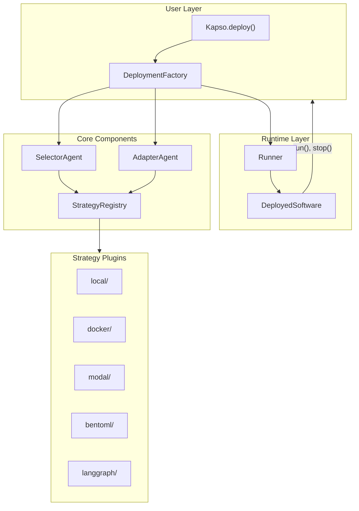
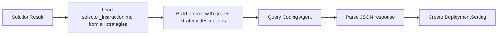
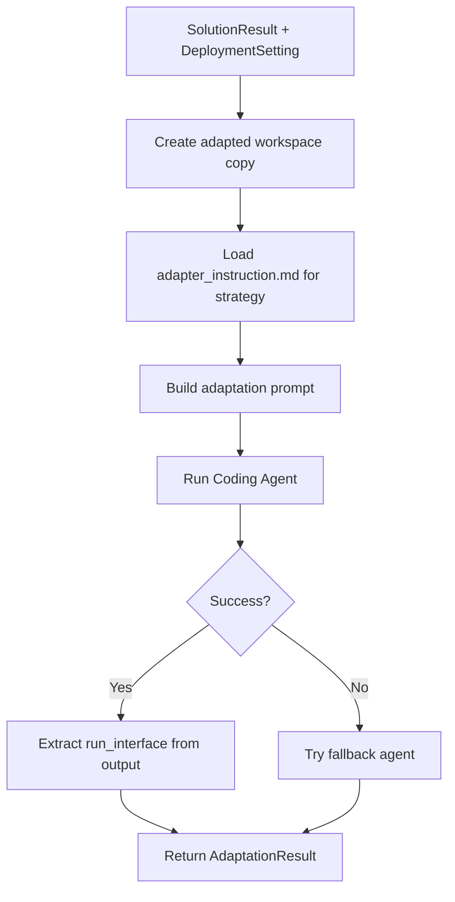
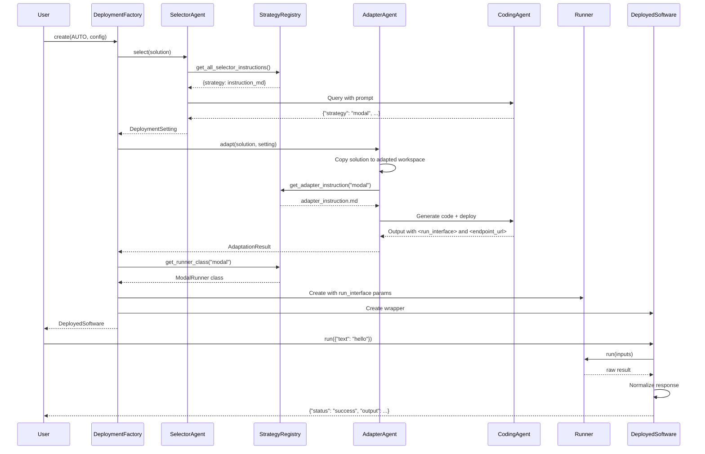

## System Architecture

The deployment system uses a **plugin-based architecture** where strategies are self-contained packages that can be added without modifying core code.



## Module Breakdown

### Directory Structure

```
src/deployment/
├── __init__.py              # Public exports
├── base.py                  # Data models and abstractions
├── factory.py               # DeploymentFactory orchestration
├── software.py              # DeployedSoftware unified wrapper
├── selector/
│   ├── agent.py             # SelectorAgent (strategy selection)
│   ├── selection_prompt.md  # LLM prompt template
│   └── correction_prompt.md # Error correction prompt
├── adapter/
│   ├── agent.py             # AdapterAgent (code transformation)
│   ├── adaptation_prompt.txt # LLM prompt template
│   └── validator.py         # Adaptation validation
└── strategies/
    ├── base.py              # Runner ABC, StrategyRegistry
    ├── README.md            # Strategy development guide
    ├── local/               # Local strategy plugin
    ├── docker/              # Docker strategy plugin
    ├── modal/               # Modal strategy plugin
    ├── bentoml/             # BentoML strategy plugin
    └── langgraph/           # LangGraph strategy plugin
```

---

## Core Components

### 1. DeploymentFactory (`factory.py`)

The **orchestrator** that manages the full deployment pipeline.

**Responsibilities:**
- Coordinate selection, adaptation, and runner creation
- Handle strategy validation
- Create unified Software instances

**Input/Output:**

| Method | Input | Output |
|--------|-------|--------|
| `create()` | `DeployStrategy`, `DeployConfig`, optional `strategies` list | `Software` |
| `list_strategies()` | None | `List[str]` |
| `explain_strategy()` | `strategy: str` | `str` description |

**Flow:**

```python
# Phase 1: Selection
if strategy == DeployStrategy.AUTO:
    setting = cls._select_strategy(config, strategies)
else:
    setting = cls._create_setting(strategy)

# Phase 2: Adaptation  
adaptation = cls._adapt_repo(config, setting, strategies)

# Phase 3: Runner creation
runner = cls._create_runner(config, setting, adaptation)

# Phase 4: Wrap in unified interface
return DeployedSoftware(config=config, runner=runner, info=info)
```

---

### 2. SelectorAgent (`selector/agent.py`)

**LLM-based strategy selection** that analyzes code and chooses the optimal deployment target.

**Responsibilities:**
- Gather selector instructions from all strategies
- Query coding agent to analyze repository
- Return `DeploymentSetting` with chosen strategy

**Input/Output:**

| Method | Input | Output |
|--------|-------|--------|
| `select()` | `SolutionResult`, optional `allowed_strategies`, optional `resources` | `DeploymentSetting` |
| `explain()` | `SolutionResult` | `str` human-readable explanation |

**Flow:**



**Example Prompt:**

```markdown
# Strategy Selection Task

## Goal
Create a sentiment analysis API

## Available Strategies
[Contents of local/selector_instruction.md]
[Contents of docker/selector_instruction.md]
...

## Output Format
Return JSON: {"strategy": "...", "reasoning": "...", "resources": {...}}
```

---

### 3. AdapterAgent (`adapter/agent.py`)

**Code transformation and deployment** using coding agents.

**Responsibilities:**
- Create adapted workspace (copy of original)
- Load adapter instructions for target strategy
- Run coding agent to transform code
- Extract endpoint URL and run interface from output
- Return `AdaptationResult`

**Input/Output:**

| Method | Input | Output |
|--------|-------|--------|
| `adapt()` | `SolutionResult`, `DeploymentSetting`, optional `allowed_strategies` | `AdaptationResult` |

**Flow:**



**Key Output Extraction:**

The adapter looks for special XML tags in the coding agent's output:

```xml
<!-- Run interface configuration -->
<run_interface>{"type": "function", "module": "main", "callable": "predict"}</run_interface>

<!-- Deployment endpoint (for HTTP strategies) -->
<endpoint_url>https://my-app.modal.run</endpoint_url>
```

---

### 4. StrategyRegistry (`strategies/base.py`)

**Auto-discovery system** for deployment strategies.

**Responsibilities:**
- Scan `strategies/` directory on startup
- Load configuration and instructions for each strategy
- Provide access to strategy metadata and runner classes

**Input/Output:**

| Method | Input | Output |
|--------|-------|--------|
| `list_strategies()` | optional `allowed: List[str]` | `List[str]` |
| `get_strategy()` | `name: str` | `DeployStrategyConfig` |
| `get_selector_instruction()` | `name: str` | `str` markdown content |
| `get_adapter_instruction()` | `name: str` | `str` markdown content |
| `get_runner_class()` | `name: str` | `type` (Runner subclass) |
| `get_default_run_interface()` | `name: str` | `Dict[str, Any]` |

**Discovery Process:**

```python
def _discover(self) -> None:
    strategies_dir = Path(__file__).parent
    
    for path in sorted(strategies_dir.iterdir()):
        # Skip non-directories, hidden, __pycache__
        if not path.is_dir() or path.name.startswith("_"):
            continue
        
        # Must have both instruction files
        if (path / "selector_instruction.md").exists() and \
           (path / "adapter_instruction.md").exists():
            self._strategies[path.name] = DeployStrategyConfig(...)
```

---

### 5. Runner (Abstract Base Class)

**Infrastructure-specific execution** handler.

**Responsibilities:**
- Execute code (via import, subprocess, HTTP, etc.)
- Health checking
- Resource cleanup

**Interface:**

```python
class Runner(ABC):
    @abstractmethod
    def run(self, inputs: Union[Dict, str, bytes]) -> Any:
        """Execute with inputs and return result."""
        pass
    
    @abstractmethod
    def stop(self) -> None:
        """Stop and cleanup resources."""
        pass
    
    @abstractmethod
    def is_healthy(self) -> bool:
        """Check if runner is healthy and ready."""
        pass
    
    def get_logs(self) -> str:
        """Get runner-specific logs (default: empty)."""
        return ""
```

**Runner Types:**

| Runner | Strategy | Execution Method |
|--------|----------|------------------|
| `LocalRunner` | local | Python `importlib` + function call |
| `DockerRunner` | docker | HTTP requests to container |
| `ModalRunner` | modal | `modal.Function.remote()` |
| `BentoMLRunner` | bentoml | HTTP to BentoCloud/local |
| `LangGraphRunner` | langgraph | LangGraph Cloud API |

---

### 6. DeployedSoftware (`software.py`)

**Unified wrapper** that users interact with.

**Responsibilities:**
- Wrap any runner with consistent interface
- Normalize all responses to `{"status": "...", "output": ...}`
- Provide convenience methods

**Interface:**

```python
class DeployedSoftware(Software):
    def run(self, inputs) -> Dict[str, Any]:
        """Execute and return normalized response."""
        
    def stop(self) -> None:
        """Stop the software and cleanup."""
        
    def logs(self) -> str:
        """Get execution logs."""
        
    def is_healthy(self) -> bool:
        """Check if software is running."""
        
    # Metadata access
    def get_adapted_path(self) -> str
    def get_endpoint(self) -> Optional[str]
    def get_deployment_info(self) -> Dict[str, Any]
    def get_strategy(self) -> str
    def get_provider(self) -> Optional[str]
```

---

## Data Models

### DeployConfig

Configuration for deploying software.

```python
@dataclass
class DeployConfig:
    solution: SolutionResult  # The built solution
    env_vars: Dict[str, str]  # Environment variables
    timeout: int = 300        # Execution timeout (seconds)
    coding_agent: str = "claude_code"  # Agent for adaptation
```

### DeploymentSetting

Result of strategy selection.

```python
@dataclass
class DeploymentSetting:
    strategy: str              # "local", "docker", "modal", etc.
    provider: Optional[str]    # Cloud provider name
    resources: Dict[str, Any]  # CPU, memory, GPU requirements
    interface: str             # "function", "http", etc.
    reasoning: str             # Why this was selected
```

### AdaptationResult

Result of code adaptation.

```python
@dataclass
class AdaptationResult:
    success: bool
    adapted_path: str           # Path to adapted repo (copy)
    run_interface: Dict[str, Any]  # How to call .run()
    files_changed: List[str]
    error: Optional[str]
```

### DeploymentInfo

Metadata about the deployment.

```python
@dataclass
class DeploymentInfo:
    strategy: str
    provider: Optional[str]
    endpoint: Optional[str]     # HTTP endpoint if applicable
    adapted_path: str
    adapted_files: List[str]
    resources: Dict[str, Any]
```

---

## Complete Data Flow



---

## Strategy Plugin Architecture

Each strategy is a self-contained directory with:

```
strategies/{name}/
├── config.yaml              # Strategy configuration
├── selector_instruction.md  # When to use this strategy
├── adapter_instruction.md   # How to adapt code
├── runner.py                # Runtime execution class
└── __init__.py              # Exports
```

### config.yaml Structure

```yaml
# Strategy identification
name: modal
provider: modal
interface: function  # or "http"

# Runner class name (must exist in runner.py)
runner_class: ModalRunner

# Default resource requirements
default_resources:
  gpu: T4
  memory: 16Gi

# Default run interface (passed to runner constructor)
run_interface:
  type: modal
  function_name: predict
```

### How Strategies Are Discovered

1. On import, `StrategyRegistry.get()` scans `strategies/` directory
2. Each subdirectory with `selector_instruction.md` AND `adapter_instruction.md` is registered
3. `DeployStrategy` enum is dynamically created from discovered strategies
4. Runner classes are lazy-loaded from `runner.py` when needed

This means **adding a new strategy is just adding a directory** - no code changes required in the core system.

---

## Next Steps

<CardGroup cols={2}>
  <Card title="Strategies Reference" icon="layer-group" href="/docs/deployment/strategies">
    Detailed guide to each deployment strategy
  </Card>
  <Card title="Adding New Strategies" icon="plus" href="/docs/deployment/adding-strategies">
    Step-by-step guide to add your own deployment targets
  </Card>
</CardGroup>

