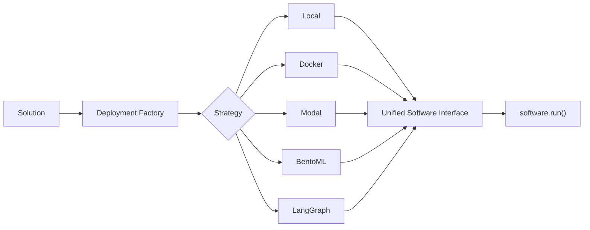

## Introduction

The Deployment module transforms built solutions into runnable software. It provides a **unified interface** that works the same whether you're running locally, in Docker, on Modal, or any other platform.



## Key Features

| Feature | Description |
|---------|-------------|
| **Unified Interface** | Same `run()`, `stop()`, `start()`, `logs()` API regardless of deployment target |
| **Full Lifecycle** | Start, stop, and restart deployments programmatically |
| **Plugin Architecture** | Strategies are self-contained packages - add new ones without changing core code |
| **Auto-Selection** | LLM-based selector chooses optimal strategy based on your code |
| **Agent-Driven Adaptation** | Coding agents transform your code and handle deployment |

## Quick Start

### Basic Usage

```python
from src.kapso import Kapso

# Build a solution
kapso = Kapso()
solution = kapso.evolve("Create a sentiment analysis API")

# Deploy it (AUTO selects best strategy)
software = kapso.deploy(solution)

# Use it
result = software.run({"text": "I love this product!"})
print(result)
# {"status": "success", "output": {"sentiment": "positive"}}

# Clean up
software.stop()
```

### Full Lifecycle Management

```python
# Deploy
software = kapso.deploy(solution, strategy=DeployStrategy.DOCKER)

# Run
result = software.run({"text": "hello"})

# Stop (terminates container/cloud deployment)
software.stop()

# Restart (re-creates container/re-deploys to cloud)
software.start()

# Run again after restart
result = software.run({"text": "world"})

# Final cleanup
software.stop()
```

### Specify a Strategy

```python
from src.deployment import DeployStrategy

# Force a specific deployment target
software = kapso.deploy(solution, strategy=DeployStrategy.MODAL)
software = kapso.deploy(solution, strategy=DeployStrategy.DOCKER)
software = kapso.deploy(solution, strategy=DeployStrategy.LOCAL)
```

### Using Context Manager

```python
# Auto-cleanup when done
with kapso.deploy(solution) as software:
    result = software.run({"input": "data"})
    print(result)
# software.stop() called automatically
```

### Direct Factory Usage

```python
from src.deployment import DeploymentFactory, DeployStrategy, DeployConfig

config = DeployConfig(
    solution=solution,
    env_vars={"API_KEY": "xxx"},
    timeout=300,
)

software = DeploymentFactory.create(DeployStrategy.AUTO, config)
```

## Deployment Flow

The system works in **four phases**:

```
┌─────────────────────────────────────────────────────────────────────────┐
│  Phase 1: SELECTION                                                     │
│  ─────────────────                                                      │
│  SelectorAgent analyzes your code and chooses the best strategy         │
│  (skipped if you specify a strategy explicitly)                         │
└─────────────────────────────────────────────────────────────────────────┘
                                   │
                                   ▼
┌─────────────────────────────────────────────────────────────────────────┐
│  Phase 2: ADAPTATION                                                    │
│  ───────────────────                                                    │
│  AdapterAgent transforms your code for the target platform:             │
│  - Creates deployment files (Dockerfile, modal_app.py, etc.)            │
│  - Adds entry point (main.py with predict() function)                   │
│  - Runs the deployment command                                          │
│  - Reports the endpoint URL                                             │
└─────────────────────────────────────────────────────────────────────────┘
                                   │
                                   ▼
┌─────────────────────────────────────────────────────────────────────────┐
│  Phase 3: RUNNER CREATION                                               │
│  ────────────────────────                                               │
│  Factory creates the appropriate Runner for the strategy:               │
│  - LocalRunner: imports and calls Python functions                      │
│  - ModalRunner: calls Modal remote functions                            │
│  - DockerRunner: makes HTTP requests to container                       │
└─────────────────────────────────────────────────────────────────────────┘
                                   │
                                   ▼
┌─────────────────────────────────────────────────────────────────────────┐
│  Phase 4: SOFTWARE WRAPPER                                              │
│  ─────────────────────────                                              │
│  DeployedSoftware wraps the runner with unified interface:              │
│  - Normalizes all responses to {"status": "...", "output": ...}         │
│  - Provides run(), stop(), logs(), is_healthy()                         │
│  - Hides all infrastructure complexity from users                       │
└─────────────────────────────────────────────────────────────────────────┘
```

## Available Strategies

| Strategy | Interface | Best For | GPU Support |
|----------|-----------|----------|-------------|
| **LOCAL** | Function import | Development, testing | No |
| **DOCKER** | HTTP | Microservices, containerization | Optional |
| **MODAL** | Remote function | Serverless GPU, ML inference | Yes |
| **BENTOML** | HTTP | Production ML serving, batching | Optional |
| **LANGGRAPH** | LangGraph Cloud | Agent deployments | No |

See [Strategies Reference](/docs/deployment/strategies) for detailed information on each.

## Response Format

All `software.run()` calls return a **consistent format**:

```python
# Success
{
    "status": "success",
    "output": {...}  # Your function's return value
}

# Error
{
    "status": "error",
    "error": "Error message here"
}
```

This consistency holds regardless of whether you're running locally or on a cloud platform.

## Next Steps

<CardGroup cols={2}>
  <Card title="Architecture" icon="sitemap" href="/docs/deployment/architecture">
    Deep dive into modules and data flow
  </Card>
  <Card title="Strategies" icon="layer-group" href="/docs/deployment/strategies">
    Detailed guide to each deployment strategy
  </Card>
  <Card title="Adding Strategies" icon="plus" href="/docs/deployment/adding-strategies">
    Step-by-step guide to add new deployment targets
  </Card>
  <Card title="API Reference" icon="book" href="/docs/deployment/api-reference">
    Complete API documentation
  </Card>
</CardGroup>

