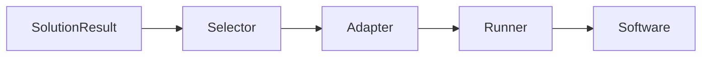

## Overview

After `evolve()` generates a solution, `deploy()` turns it into running software. The deployment pipeline handles adaptation, strategy selection, and execution.

## Deployment Flow



1. **Selector**: Analyzes code and chooses deployment strategy
2. **Adapter**: Modifies code for the chosen strategy
3. **Runner**: Executes the adapted code
4. **Software**: Unified interface for running and managing

## Quick Start

```python
from src.kapso import Kapso, DeployStrategy

kapso = Kapso()
solution = kapso.evolve(goal="Build a classifier")

# Deploy with explicit strategy
software = kapso.deploy(solution, strategy=DeployStrategy.LOCAL)

# Run inference
result = software.run({"data_path": "./test.csv"})
print(result)  # {"status": "success", "output": ...}

# Lifecycle management
software.stop()
software.start()
software.stop()
```

## Deployment Strategies

| Strategy | Description | Best For |
|----------|-------------|----------|
| `AUTO` | System chooses best strategy | Default |
| `LOCAL` | Run as local Python process | Development, testing |
| `DOCKER` | Run in Docker container | Isolation, reproducibility |
| `MODAL` | Deploy to Modal.com | Serverless, GPU |
| `BENTOML` | Deploy with BentoML | Production ML |
| `LANGGRAPH` | Deploy as LangGraph agent | Agent workflows |

## DeployStrategy Enum

```python
from src.deployment import DeployStrategy

DeployStrategy.AUTO      # System selects
DeployStrategy.LOCAL     # Local process
DeployStrategy.DOCKER    # Docker container
DeployStrategy.MODAL     # Modal.com
DeployStrategy.BENTOML   # BentoML
DeployStrategy.LANGGRAPH # LangGraph
```

## Software Interface

All deployments return a `Software` instance with a unified interface:

```python
class Software:
    def run(self, inputs: Dict) -> Dict:
        """Execute with input data."""
        # Returns: {"status": "success", "output": ...}
        # Or: {"status": "error", "error": ...}

    def stop(self) -> None:
        """Stop and cleanup resources."""

    def start(self) -> None:
        """Restart a stopped deployment."""

    def is_healthy(self) -> bool:
        """Check if service is running."""

    def logs(self) -> str:
        """Get execution logs."""
```

## Response Format

All `run()` calls return a consistent format:

```python
# Success
{"status": "success", "output": <result>}

# Error
{"status": "error", "error": <message>}
```

## Configuration

```python
from src.deployment import DeployConfig

config = DeployConfig(
    solution=solution,
    env_vars={"API_KEY": "..."},
    coding_agent="claude_code",
)

software = DeploymentFactory.create(DeployStrategy.LOCAL, config)
```

## Deployment Info

Get details about the deployment:

```python
# Get deployment metadata
info = software.get_deployment_info()
print(info)
# {
#     "strategy": "local",
#     "provider": None,
#     "endpoint": None,
#     "adapted_path": "/path/to/adapted",
#     "adapted_files": ["main.py", "run.py"],
#     "resources": {}
# }

# Individual accessors
software.get_strategy()      # "local"
software.get_adapted_path()  # Path to adapted code
software.get_endpoint()      # HTTP endpoint (if applicable)
```

## Lifecycle Management

```python
software = kapso.deploy(solution, strategy=DeployStrategy.LOCAL)

# Initial run
result = software.run({"data": "..."})

# Check health
if software.is_healthy():
    print("Service is running")

# Stop (cleanup resources)
software.stop()

# Restart
software.start()

# Run again
result = software.run({"data": "..."})

# Final cleanup
software.stop()
```

## Error Handling

```python
result = software.run({"data": "..."})

if result["status"] == "error":
    print(f"Error: {result['error']}")
    print(f"Logs: {software.logs()}")
```

## Next Steps

<CardGroup cols={2}>
  <Card title="Strategies" icon="layer-group" href="/docs/deployment/strategies">
    Details on each deployment strategy
  </Card>
  <Card title="Adding Strategies" icon="plus" href="/docs/deployment/adding-strategies">
    Create custom deployment strategies
  </Card>
</CardGroup>
