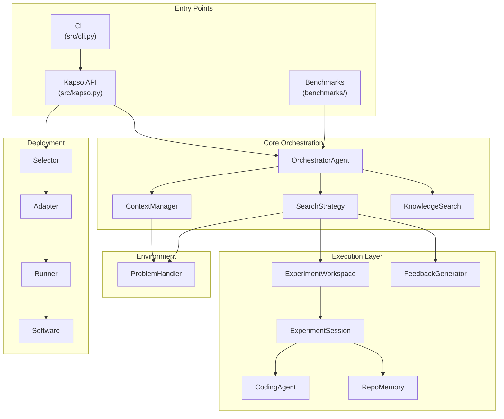
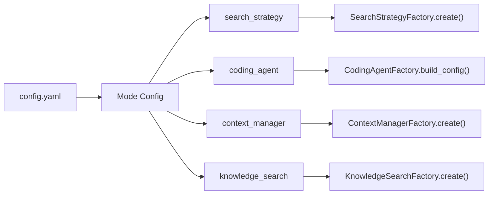

## Overview

Kapso uses a modular architecture with pluggable components connected through factories. The system is designed around a central orchestration loop that coordinates experimentation.



## Component Responsibilities

### Kapso (Main API)

The user-facing entry point that provides the four-pillar API:

```python
class Kapso:
    def research(objective, mode, depth) -> Source.Research
    def learn(*sources, wiki_dir) -> PipelineResult
    def evolve(goal, ...) -> SolutionResult
    def deploy(solution, strategy) -> Software
    def index_kg(wiki_dir, save_to) -> str
```

### OrchestratorAgent

The central coordinator that manages the solve loop:

```python
def solve(self, experiment_max_iter, time_budget_minutes, cost_budget):
    for i in range(experiment_max_iter):
        # Calculate budget progress (0-100)
        budget_progress = max(time, iterations, cost) * 100

        # Check stopping conditions
        if self.problem_handler.stop_condition() or budget_progress >= 100:
            break

        # Get enriched context (problem + KG + history)
        context = self.context_manager.get_context(budget_progress)

        # Check if LLM decided COMPLETE
        if self.context_manager.should_stop():
            break

        # Run one search iteration
        self.search_strategy.run(context, budget_progress)
```

### Pluggable Components

All major components are created via factories and can be swapped via configuration:

| Component | Factory | Registered Types |
|-----------|---------|------------------|
| Search Strategy | `SearchStrategyFactory` | `llm_tree_search`, `linear_search`, `benchmark_tree_search` |
| Context Manager | `ContextManagerFactory` | `token_efficient`, `kg_enriched`, `cognitive` |
| Knowledge Search | `KnowledgeSearchFactory` | `kg_graph_search`, `kg_llm_navigation` |
| Coding Agent | `CodingAgentFactory` | `aider`, `gemini`, `claude_code`, `openhands` |
| Feedback Generator | Uses `CodingAgentFactory` | Same as coding agents (default: `claude_code`) |

### Configuration Flow



## Data Flow

1. **Problem Handler** provides problem context
2. **Context Manager** gathers problem + history + knowledge
3. **Search Strategy** generates and selects solutions
4. **Experiment Workspace** manages git branches
5. **Coding Agent** generates code and runs evaluation
6. **Developer Agent** returns structured JSON with evaluation results
7. **Feedback Generator** validates evaluation and decides stop/continue
8. **RepoMemory** tracks code understanding across experiments

## Directory Structure

```
src/
├── kapso.py                 # Main Kapso API
├── cli.py                   # CLI entry point
├── config.yaml              # Default configuration
│
├── core/                    # Core utilities
│   ├── config.py            # YAML config loading
│   ├── llm.py               # LLM backend (OpenAI, etc.)
│   └── prompt_loader.py     # Prompt template loading
│
├── environment/             # Problem environment
│   └── handlers/            # Problem handlers
│       ├── base.py          # ProblemHandler ABC
│       └── generic.py       # GenericProblemHandler
│
├── execution/               # Execution layer
│   ├── orchestrator.py      # OrchestratorAgent
│   ├── solution.py          # SolutionResult dataclass
│   │
│   ├── feedback_generator/  # Feedback generation
│   │   ├── feedback_generator.py
│   │   └── prompts/
│   │       └── feedback_generator.md
│   │
│   ├── search_strategies/   # Solution exploration
│   │   ├── base.py          # SearchStrategy ABC
│   │   ├── factory.py       # SearchStrategyFactory
│   │   ├── llm_tree_search.py
│   │   ├── linear_search.py
│   │   └── benchmark_tree_search.py  # For MLE/ALE benchmarks
│   │
│   ├── context_manager/     # Context gathering
│   │   ├── base.py          # ContextManager ABC
│   │   ├── factory.py       # ContextManagerFactory
│   │   └── types.py         # ContextData dataclass
│   │
│   ├── experiment_workspace/ # Git workspace management
│   │   ├── experiment_workspace.py
│   │   └── experiment_session.py
│   │
│   ├── coding_agents/       # Code generation
│   │   ├── base.py          # CodingAgentInterface ABC
│   │   ├── factory.py       # CodingAgentFactory
│   │   └── adapters/        # Agent implementations
│   │       ├── aider_agent.py
│   │       ├── gemini_agent.py
│   │       ├── claude_code_agent.py
│   │       └── openhands_agent.py
│   │
│   └── prompts/             # Prompt templates
│       ├── coding_agent_implement.md
│       └── coding_agent_debug.md
│
├── knowledge/               # Knowledge system
│   ├── search/              # KG search backends
│   │   ├── base.py          # KnowledgeSearch ABC
│   │   ├── factory.py       # KnowledgeSearchFactory
│   │   ├── kg_graph_search.py
│   │   ├── kg_llm_navigation_search.py
│   │   └── workflow_search.py  # Find starter repos
│   │
│   ├── learners/            # Knowledge learning pipeline
│   │   ├── knowledge_learner_pipeline.py
│   │   ├── merger/          # Stage 2: WikiPages → KG
│   │   │   └── knowledge_merger.py
│   │   ├── sources.py       # Source type wrappers
│   │   └── ingestors/       # Stage 1: source → WikiPages
│   │       ├── base.py
│   │       ├── factory.py
│   │       ├── repo_ingestor/
│   │       └── research_ingestor/
│   │
│   ├── researcher/           # Deep web research
│   │   ├── researcher.py
│   │   └── prompts/
│   │
│   └── wiki_structure/      # Wiki page definitions
│
├── memory/                  # Memory systems
│   ├── cognitive_controller.py
│   ├── episodic.py
│   └── types.py
│
├── repo_memory/             # Repository memory
│   ├── manager.py           # RepoMemoryManager
│   ├── builders.py          # LLM-based model building
│   └── observation.py       # Section extraction
│
└── deployment/              # Deployment pipeline
    ├── base.py              # Software, DeployConfig
    ├── factory.py           # DeploymentFactory
    ├── software.py          # DeployedSoftware
    ├── selector/            # Strategy selection
    ├── adapter/             # Code adaptation
    └── strategies/          # Deployment strategies
        ├── local/
        ├── docker/
        ├── modal/
        ├── bentoml/
        └── langgraph/
```

## Key Design Patterns

### Factory Pattern

All pluggable components use factories with decorator-based registration:

```python
# Registration
@register_strategy("llm_tree_search")
class LlmSteeredTreeSearch(SearchStrategy):
    ...

# Creation
strategy = SearchStrategyFactory.create(
    strategy_type="llm_tree_search",
    problem_handler=handler,
    llm=llm,
    coding_agent_config=config,
    params=params,
)
```

### Configuration Modes

Configuration is organized into modes that bundle related settings:

```yaml
modes:
  GENERIC:
    search_strategy:
      type: "linear_search"
      params: { ... }
    coding_agent:
      type: "aider"
      model: "gpt-4o-mini"
    context_manager:
      type: "kg_enriched"
    knowledge_search:
      type: "kg_graph_search"
      enabled: true
```

### Git-Based Experiment Isolation

Each experiment runs on its own git branch, enabling:
- Parallel experimentation
- Easy rollback to any state
- Tree-based solution exploration
- RepoMemory inheritance across branches

## Next Steps

<CardGroup cols={2}>
  <Card title="Execution Flow" icon="diagram-project" href="/docs/evolve/execution-flow">
    Step-by-step execution process
  </Card>
  <Card title="Feedback Generator" icon="comments" href="/docs/evolve/feedback-generator">
    How evaluation is validated and feedback generated
  </Card>
  <Card title="Knowledge System" icon="brain" href="/docs/knowledge/overview">
    How knowledge is acquired and used
  </Card>
  <Card title="Components" icon="puzzle-piece" href="/docs/evolve/orchestrator">
    Deep dive into core components
  </Card>
</CardGroup>
