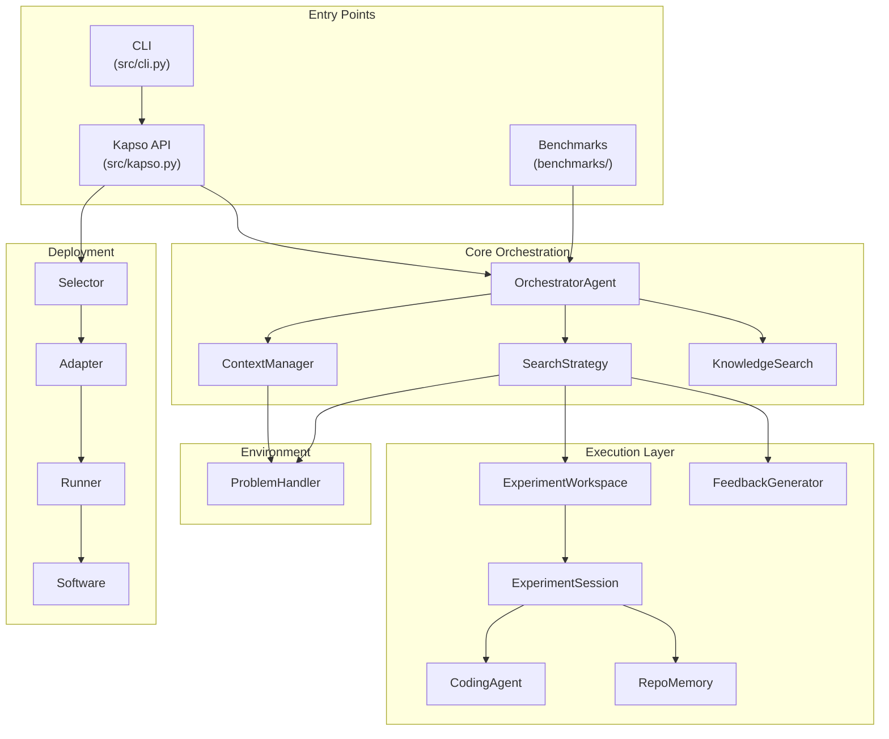
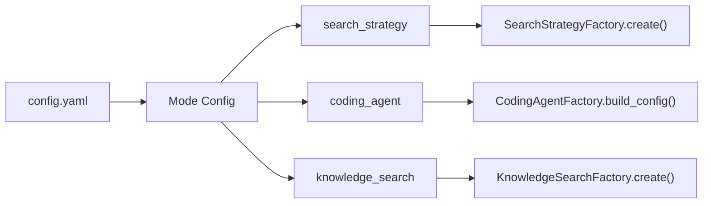

## Overview

Kapso uses a modular architecture with pluggable components connected through factories. The system is designed around a central orchestration loop that coordinates experimentation.


```mermaid
flowchart TB
    subgraph Entry["Entry Points"]
        API["Kapso API\n(src/kapso.py)"]
        CLI["CLI\n(src/cli.py)"]
        BENCH["Benchmarks\n(benchmarks/)"]
    end

    subgraph Core["Core Orchestration"]
        ORCH["OrchestratorAgent"]
        STRAT["SearchStrategy"]
        CTX["ContextManager"]
        KS["KnowledgeSearch"]
    end

    subgraph Execution["Execution Layer"]
        WS["ExperimentWorkspace"]
        SESS["ExperimentSession"]
        AGENT["CodingAgent"]
        REPO["RepoMemory"]
        FG["FeedbackGenerator"]
    end

    subgraph Env["Environment"]
        HAND["ProblemHandler"]
    end

    subgraph Deploy["Deployment"]
        SEL["Selector"]
        ADAPT["Adapter"]
        RUN["Runner"]
        SOFT["Software"]
    end

    API --> ORCH
    CLI --> API
    BENCH --> ORCH

    ORCH --> STRAT
    ORCH --> CTX
    ORCH --> KS

    STRAT --> WS
    STRAT --> FG
    WS --> SESS
    SESS --> AGENT
    SESS --> REPO

    CTX --> HAND
    STRAT --> HAND

    API --> SEL
    SEL --> ADAPT
    ADAPT --> RUN
    RUN --> SOFT
```

## Component Responsibilities

### Evidence-directed Generic path


```mermaid
flowchart LR
    O["Orchestrator: budget and fidelity"] --> E["Evidence + deterministic policy"]
    E --> A["IdeaArchive: PLANNED"]
    A --> G["Codex / Claude candidate calls"]
    G --> N["Rules + OpenAI embedding neighbors"]
    N --> S["Codex / Claude selector"]
    S --> B["IdeaArchive: SELECTED / BRIDGED"]
    B --> X["Implementation + evaluation (registered when configured)"]
    X --> W["Evidence author"]
    W --> V["Optional external evaluator"]
    V --> H["ExperimentHistoryStore"]
    H --> C["IdeaOutcome"]
    C --> K["Run checkpoint"]
```

The candidate population, analyses, and decision are durable before execution.
Executed memory is then written before the linked idea outcome, and the run
checkpoint is last. See the
[implemented-system reference](../research/ideation-v3-implemented-system.md)
for the exact lifecycle and recovery seams.

### Kapso (Main API)

The user-facing entry point that provides the four-pillar API:

```python
class Kapso:
    def research(objective, mode, depth) -> Source.Research
    def learn(*sources, wiki_dir) -> PipelineResult
    def evolve(goal, ...) -> SolutionResult
    def deploy(solution, strategy) -> Software
    def index_kg(wiki_dir, save_to) -> str
```

### OrchestratorAgent

The central coordinator that manages the solve loop:

```python
def solve(self, experiment_max_iter, time_budget_minutes, cost_budget):
    register_and_reconcile_evaluation()
    save_bootstrap_checkpoint()
    for i in range(experiment_max_iter):
        capacity = build_budget_and_fidelity_snapshot()
        if capacity.exhausted:
            save_resumable_budget_stop()
            break
        node = self.search_strategy.run(problem, capacity.progress_percent)
        finalized = new_nodes_or_execution_revisions(node)
        attach_optional_external_evaluation(finalized)
        persist_experiment_then_idea_outcome(finalized)
        save_checkpoint(completed=node.should_stop)
```

### Pluggable Components

All major components are created via factories and can be swapped via configuration:

| Component | Factory | Registered Types |
|-----------|---------|------------------|
| Search Strategy | `SearchStrategyFactory` | `generic`, `benchmark_tree_search` |
| Knowledge Search | `KnowledgeSearchFactory` | `kg_graph_search`, `kg_llm_navigation` |
| Coding Agent | `CodingAgentFactory` | `aider`, `gemini`, `claude_code`, `openhands` |
| Feedback Generator | Uses `CodingAgentFactory` | Same as coding agents (default: `claude_code`) |

### Configuration Flow


```mermaid
flowchart LR
    YAML["config.yaml"] --> MODE["Mode Config"]
    MODE --> SS["search_strategy"]
    MODE --> CA["coding_agent"]
    MODE --> KS["knowledge_search"]

    SS --> SSF["SearchStrategyFactory.create()"]
    CA --> CAF["CodingAgentFactory.build_config()"]
    KS --> KSF["KnowledgeSearchFactory.create()"]
```

## Data Flow

1. **Problem Handler** provides the complete problem.
2. **GenericSearch** projects linked `SearchNode` history into frozen evidence.
3. **Policy and operators** choose bootstrap/explore/exploit/verify/recover and
   concrete parent plans.
4. **Candidate agents, analyzer, embeddings, and selector** advance the
   `IdeaArchive` through `PLANNED → GENERATED → ANALYZED → SELECTED`.
5. **Experiment Workspace** freezes the parent ref and creates the linked
   branch/node (`BRIDGED`).
6. **Implementation, integrity, registered evaluation, feedback, and evidence
   authoring** finalize the node.
7. **Orchestrator** attaches optional external evaluation, writes the executed
   `ExperimentRecord`, writes the `IdeaOutcome`, then checkpoints.
8. **RepoMemory** remains branch-specific repository understanding.

## Directory Structure

```
src/
├── kapso.py                 # Main Kapso API
├── cli.py                   # CLI entry point
├── config.yaml              # Default configuration
│
├── core/                    # Core utilities
│   ├── config.py            # YAML config loading
│   ├── llm.py               # LLM backend (OpenAI, etc.)
│   └── prompt_loader.py     # Prompt template loading
│
├── environment/             # Problem environment
│   └── handlers/            # Problem handlers
│       ├── base.py          # ProblemHandler ABC
│       └── generic.py       # GenericProblemHandler
│
├── execution/               # Execution layer
│   ├── orchestrator.py      # OrchestratorAgent
│   ├── solution.py          # SolutionResult dataclass
│   │
│   ├── search_strategies/   # Solution exploration
│   │   ├── base.py          # SearchStrategy ABC
│   │   ├── factory.py       # SearchStrategyFactory
│   │   ├── strategies.yaml  # Strategy presets
│   │   ├── generic/         # Evidence-directed Generic search
│   │   │   ├── strategy.py # Execution bridge and recovery
│   │   │   └── ideation/   # Archive, evidence, policy, agents, analysis, selection
│   │   └── benchmark_tree_search.py  # For MLE/ALE benchmarks
│   │
│   ├── types.py             # ContextData, ExperimentHistoryProvider
│   │
│   ├── experiment_workspace/ # Git workspace management
│   │   ├── experiment_workspace.py
│   │   └── experiment_session.py
│   │
│   ├── coding_agents/       # Code generation
│   │   ├── base.py          # CodingAgentInterface ABC
│   │   ├── factory.py       # CodingAgentFactory
│   │   ├── agents.yaml      # Agent registry
│   │   └── adapters/        # Agent implementations
│   │       ├── aider_agent.py
│   │       ├── gemini_agent.py
│   │       ├── claude_code_agent.py
│   │       └── openhands_agent.py
│   │
│   └── memories/            # Memory systems
│       ├── experiment_memory/  # Experiment history storage
│       └── repo_memory/        # Repository understanding
│
├── knowledge_base/          # Knowledge system
│   ├── types.py             # Source types, ResearchFindings
│   │
│   ├── search/              # KG search backends
│   │   ├── base.py          # KnowledgeSearch ABC
│   │   ├── factory.py       # KnowledgeSearchFactory
│   │   ├── kg_graph_search.py
│   │   ├── kg_llm_navigation_search.py
│   │   └── workflow_search.py  # Find starter repos
│   │
│   ├── learners/            # Knowledge learning pipeline
│   │   ├── knowledge_learner_pipeline.py
│   │   ├── sources.py       # Source type wrappers
│   │   ├── merger/          # Stage 2: WikiPages → KG
│   │   │   └── knowledge_merger.py
│   │   └── ingestors/       # Stage 1: source → WikiPages
│   │       ├── base.py
│   │       ├── factory.py
│   │       └── repo_ingestor/
│   │
│   └── wiki_structure/      # Wiki page definitions
│
├── researcher/              # Deep web research
│   ├── researcher.py
│   └── prompts/
│
├── gated_mcp/               # MCP server with selective tool exposure
│   ├── server.py            # Internal gates (idea, code, research, etc.)
│   ├── presets.py           # Gate definitions + external server config (leeroopedia-mcp)
│   └── gates/
│
└── deployment/              # Deployment pipeline
    ├── base.py              # Software, DeployConfig
    ├── factory.py           # DeploymentFactory
    ├── software.py          # DeployedSoftware
    ├── selector/            # Strategy selection
    ├── adapter/             # Code adaptation
    └── strategies/          # Deployment strategies
        ├── local/
        ├── docker/
        ├── modal/
        ├── bentoml/
        └── langgraph/
```

## Key Design Patterns

### Factory Pattern

All pluggable components use factories with decorator-based registration:

```python
# Registration
@register_strategy("generic")
class GenericSearch(SearchStrategy):
    ...

# Creation
strategy = SearchStrategyFactory.create(
    strategy_type="generic",
    problem_handler=handler,
    llm=llm,
    coding_agent_config=config,
    params=params,
)
```

### Configuration Modes

Configuration is organized into modes that bundle related settings:

```yaml
modes:
  GENERIC:
    ideation_profile: "DEFAULT"
    search_strategy:
      type: "generic"
      params: { ... }
    coding_agent:
      type: "aider"
      model: "gpt-4o-mini"
    context_manager:
      type: "kg_enriched"
    knowledge_search:
      type: "kg_graph_search"
      enabled: true
```

### Git-Based Experiment Isolation

Each experiment runs on its own git branch, enabling:
- Parallel experimentation
- Easy rollback to any state
- Tree-based solution exploration
- RepoMemory inheritance across branches

## Next Steps

<CardGroup cols={2}>
  <Card title="Execution Flow" icon="diagram-project" href="/docs/evolve/execution-flow">
    Step-by-step execution process
  </Card>
  <Card title="Feedback Generator" icon="comments" href="/docs/evolve/feedback-generator">
    How evaluation is validated and feedback generated
  </Card>
  <Card title="Knowledge System" icon="brain" href="/docs/knowledge/overview">
    How knowledge is acquired and used
  </Card>
  <Card title="Components" icon="puzzle-piece" href="/docs/evolve/orchestrator">
    Deep dive into core components
  </Card>
</CardGroup>
