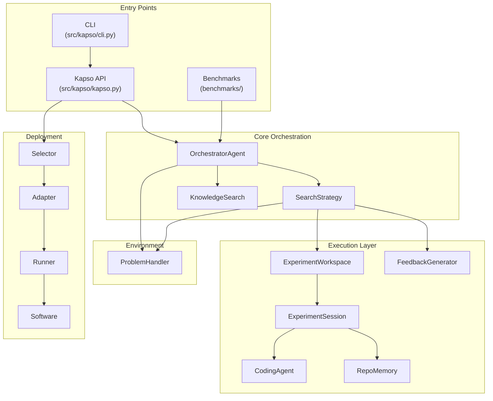
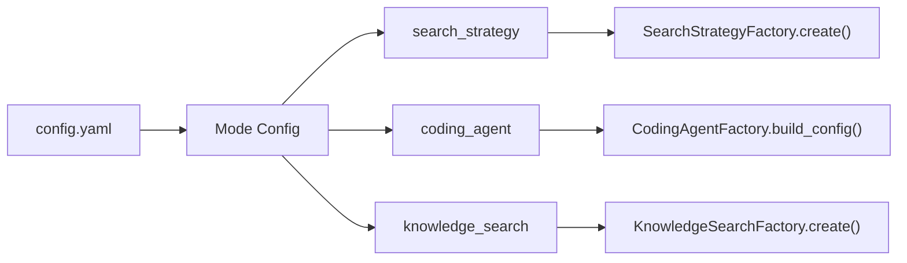

Kapso is a set of pluggable components wired together by factories around a central orchestration loop. Swapping a coding agent, a search strategy or a knowledge backend is a config change, not a code change.


```mermaid
flowchart TB
    subgraph Entry["Entry Points"]
        API["Kapso API\n(src/kapso/kapso.py)"]
        CLI["CLI\n(src/kapso/cli.py)"]
        BENCH["Benchmarks\n(benchmarks/)"]
    end

    subgraph Core["Core Orchestration"]
        ORCH["OrchestratorAgent"]
        STRAT["SearchStrategy"]
        KS["KnowledgeSearch"]
    end

    subgraph Execution["Execution Layer"]
        WS["ExperimentWorkspace"]
        SESS["ExperimentSession"]
        AGENT["CodingAgent"]
        REPO["RepoMemory"]
        FG["FeedbackGenerator"]
    end

    subgraph Env["Environment"]
        HAND["ProblemHandler"]
    end

    subgraph Deploy["Deployment"]
        SEL["Selector"]
        ADAPT["Adapter"]
        RUN["Runner"]
        SOFT["Software"]
    end

    API --> ORCH
    CLI --> API
    BENCH --> ORCH

    ORCH --> STRAT
    ORCH --> KS

    STRAT --> WS
    STRAT --> FG
    WS --> SESS
    SESS --> AGENT
    SESS --> REPO

    ORCH --> HAND
    STRAT --> HAND

    API --> SEL
    SEL --> ADAPT
    ADAPT --> RUN
    RUN --> SOFT
```

## Component Responsibilities

### Kapso (Main API)

The user-facing entry point that provides the four-pillar API:

```python
class Kapso:
    def research(objective, mode, depth) -> ResearchFindings
    def learn(source) -> LessonResult              # mine one finished campaign
    def learn_knowledge(*sources, wiki_dir) -> PipelineResult  # ingest into the KG
    def evolve(goal, ...) -> SolutionResult
    def deploy(solution, strategy) -> Software
    def index_kg(wiki_dir, save_to) -> str
```

### OrchestratorAgent

The central coordinator. Each iteration it computes budget progress, hands the strategy the problem statement plus the previous iteration's feedback, runs one search iteration, and stops when the judge's verdict says the goal is met (and the handler's task semantics honor that vote) or a budget dial reaches 100%. The faithful loop sketch lives on the [orchestrator page](/docs/evolve/orchestrator#what-happens-in-one-iteration); `solve()` returns a `SolveResult` with the deliverable experiment and the stop reason.

### Pluggable Components

All major components are created via factories and can be swapped via configuration:

| Component | Factory | Registered Types |
|-----------|---------|------------------|
| Search Strategy | `SearchStrategyFactory` | `generic` |
| Knowledge Search | `KnowledgeSearchFactory` | `kg_graph_search`, `kg_llm_navigation` |
| Coding Agent | `CodingAgentFactory` | `claude_code` (default), `codex`, `gemini`, `openhands`, `oss_claude_code`, plus `aider` as an optional extra |
| Feedback Generator | Uses `CodingAgentFactory` | Same as coding agents (default: `claude_code`) |

### Configuration Flow


```mermaid
flowchart LR
    YAML["config.yaml"] --> MODE["Mode Config"]
    MODE --> SS["search_strategy"]
    MODE --> CA["coding_agent"]
    MODE --> KS["knowledge_search"]

    SS --> SSF["SearchStrategyFactory.create()"]
    CA --> CAF["CodingAgentFactory.build_config()"]
    KS --> KSF["KnowledgeSearchFactory.create()"]
```

## Data Flow

1. **Problem Handler** provides problem context
2. **Experiment History** accessed via MCP tools
3. **Search Strategy** generates and selects solutions
4. **Experiment Workspace** manages git branches
5. **Coding Agent** generates code and runs evaluation
6. **Coding agent** ends its session with XML result tags (summary, evaluation path and output, score)
7. **Feedback Generator** validates evaluation and decides stop/continue
8. **RepoMemory** tracks code understanding across experiments

## Directory Structure

```text
src/kapso/
├── kapso.py                 # Main Kapso API
├── cli.py                   # CLI entry point
├── config.yaml              # Default configuration
│
├── core/                    # Core utilities
│   ├── config.py            # YAML config loading
│   ├── llm.py               # LLMBackend (embeddings) + retry policy
│   ├── cli_inference.py     # Completions as coding-agent CLI sessions
│   ├── preflight.py         # Per-verb requirement checks (kapso doctor)
│   └── prompt_loader.py     # Prompt template loading
│
├── environment/             # Problem environment
│   └── handlers/            # Problem handlers
│       ├── base.py          # ProblemHandler ABC
│       └── generic.py       # GenericProblemHandler
│
├── execution/               # Execution layer
│   ├── orchestrator.py      # OrchestratorAgent
│   ├── solution.py          # SolutionResult dataclass
│   │
│   ├── search_strategies/   # Solution exploration
│   │   ├── base.py          # SearchStrategy ABC
│   │   ├── factory.py       # SearchStrategyFactory
│   │   ├── strategies.yaml  # Strategy presets
│   │   └── generic/         # The shipped strategy
│   │       ├── strategy.py
│   │       ├── ideation.py / implementation.py
│   │       ├── feedback_flow.py / feedback_generator/
│   │       └── expansion_lanes.py
│   │
│   ├── types.py             # ContextData, ExperimentHistoryProvider
│   │
│   ├── experiment_workspace/ # Git workspace management
│   │   ├── experiment_workspace.py
│   │   └── experiment_session.py
│   │
│   ├── coding_agents/       # Code generation
│   │   ├── base.py          # CodingAgentInterface ABC
│   │   ├── factory.py       # CodingAgentFactory
│   │   ├── agents.yaml      # Agent registry
│   │   └── adapters/        # Agent implementations
│   │       ├── claude_code_agent.py
│   │       ├── codex_agent.py
│   │       ├── gemini_agent.py
│   │       ├── openhands_agent.py
│   │       ├── oss_claude_code_agent.py
│   │       └── aider_agent.py
│   │
│   └── memories/            # Memory systems
│       ├── experiment_memory/  # Experiment history storage
│       └── repo_memory/        # Repository understanding
│
├── knowledge_base/          # Knowledge graph
│   ├── types.py             # Source types, ResearchFindings
│   │
│   ├── search/              # KG search backends
│   │   ├── base.py          # KnowledgeSearch ABC
│   │   ├── factory.py       # KnowledgeSearchFactory
│   │   ├── kg_graph_search.py
│   │   ├── kg_llm_navigation_search.py
│   │   └── workflow_search.py  # Find starter repos
│   │
│   ├── learners/            # Knowledge learning pipeline
│   │   ├── knowledge_learner_pipeline.py
│   │   ├── sources.py       # Source type wrappers
│   │   ├── merger/          # Stage 2: WikiPages → KG
│   │   │   └── knowledge_merger.py
│   │   └── ingestors/       # Stage 1: source → WikiPages
│   │       ├── base.py
│   │       ├── factory.py
│   │       └── repo_ingestor/
│   │
│   └── wiki_structure/      # Wiki page definitions
│
├── researcher/              # Deep web research
│   ├── researcher.py
│   └── prompts/
│
├── gated_mcp/               # MCP server with selective tool exposure
│   ├── server.py            # Internal gates (idea, code, research, etc.)
│   ├── presets.py           # Gate definitions + external server config (leeroopedia-mcp)
│   └── gates/
│
└── deployment/              # Deployment pipeline
    ├── base.py              # Software, DeployConfig
    ├── factory.py           # DeploymentFactory
    ├── software.py          # DeployedSoftware
    ├── selector/            # Strategy selection
    ├── adapter/             # Code adaptation
    └── strategies/          # Deployment strategies
        ├── local/
        ├── docker/
        ├── modal/
        ├── bentoml/
        └── langgraph/
```

## Key Design Patterns

### Factory Pattern

All pluggable components use factories with decorator-based registration:

```python
# Registration
@register_strategy("generic")
class GenericSearch(SearchStrategy):
    ...

# Creation
strategy = SearchStrategyFactory.create(
    strategy_type="generic",
    problem_handler=handler,
    llm=llm,
    coding_agent_config=config,
    params=params,
)
```

### Configuration Modes

Configuration is organized into modes that bundle related settings:

```yaml
modes:
  GENERIC:
    search_strategy:
      type: "generic"
      params: { ... }
    coding_agent:
      type: "claude_code"
      model: "claude-opus-5"
    knowledge_search:
      type: "kg_graph_search"
      enabled: true
      preset: "DEFAULT"
```

### Git-Based Experiment Isolation

Each experiment runs on its own git branch, enabling:
- Parallel experimentation
- Easy rollback to any state
- Parent/child lineage across candidates
- RepoMemory inheritance across branches

## Next Steps

<CardGroup cols={2}>
  <Card title="Execution Flow" icon="diagram-project" href="/docs/evolve/execution-flow">
    Step-by-step execution process
  </Card>
  <Card title="Feedback Generator" icon="comments" href="/docs/evolve/feedback-generator">
    How evaluation is validated and feedback generated
  </Card>
  <Card title="Knowledge graph" icon="brain" href="/docs/knowledge/overview">
    How knowledge is acquired and used
  </Card>
  <Card title="Components" icon="puzzle-piece" href="/docs/evolve/orchestrator">
    Deep dive into core components
  </Card>
</CardGroup>
