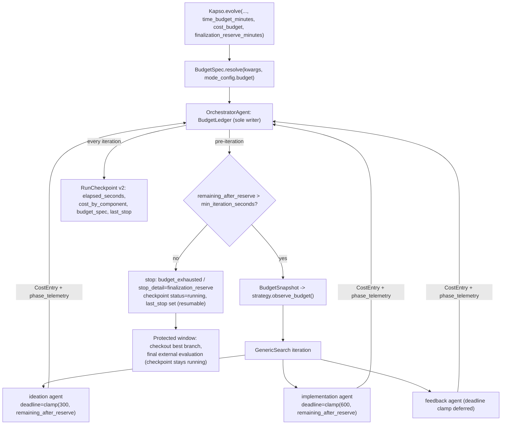

Status: **design proposal** (2026-07-13, against `main @ 31db3ff4`). Companion analyses: the
competitor mechanism survey (`archive/competitor_search/mechanisms_ranked.md`) and the
Research-Planner related-work study (`archive/competitor_search/research_planner_related_work.md`).
This design is the budget slice of that larger direction, scoped to land independently.

## Executive summary

Kapso already *computes* a budget signal — `solve()` derives `budget_progress` from iteration,
time, and cost fractions every iteration (`orchestrator.py:697-705`) — but the signal is fed by
meters that miss most of the real spend, is consumed by almost nothing, and does not survive a
resume. Budget-aware experimentation therefore starts as a **data-plane problem, not a planner
problem**: make the recorded state true first, then make enforcement mechanical, and keep every
budget decision in deterministic orchestrator code. That ordering is the strongest consensus of
the 12-system competitor survey: every high-performing system (ShinkaEvolve, MLEvolve, R&D-Agent,
AI Scientist v2, AIRA-dojo) keeps budget authority in a non-LLM control plane and gives the LLM
at most an advisory view of remaining budget.

The design adds one new module (`src/kapso/execution/budget.py` — `BudgetSpec`, `BudgetLedger`,
`BudgetSnapshot`), per-iteration telemetry on `SearchNode`, a v2 `RunCheckpoint` that persists
elapsed time, cost harvesting from the three agents whose spend is currently invisible, an
advisory `{{budget_status}}` prompt block, budget-clamped agent timeouts, and a mechanical
finalization reserve. When no budget is configured, behavior is unchanged.

## Why now: the verified gaps

Audited against `main @ 31db3ff4`; each gap is a fact of the current code, not a projection.

| # | Gap | Evidence |
|---|-----|----------|
| G1 | **The cost ledger misses the three dominant spenders.** `get_cumulative_cost()` sums checkpoint-seeded prior cost, `LLMBackend` cost, and `workspace.previous_sessions_cost` (`orchestrator.py:524-530`). But `GenericSearch` directly instantiates its ideation agent (`generic/strategy.py:343`) and implementation agent (`generic/strategy.py:524`) and never harvests their cost; `ExperimentSession.get_cumulative_cost()` reads only the factory-created session agent (`experiment_session.py:342`), which generic mode uses only for one-time workspace initialization (`generic/strategy.py:154-164`), never for iteration work; the `FeedbackGenerator` agent's cost is likewise dropped. `cost_budget` currently meters repo-memory inference, insight extraction, and commit messages — the cheap parts. | `grep cost generic/strategy.py` → no matches |
| G2 | **Elapsed time does not survive resume.** `solve()` sets `start_time = time.time()` (`orchestrator.py:689`); `RunCheckpoint` persists `cumulative_cost` but no elapsed-seconds field (`run_checkpoint.py:51-64`). A resumed campaign silently restarts its time budget. | `run_checkpoint.py:51-95` |
| G3 | **The budget signal reaches no prompt.** `GenericSearch` only prints `budget_progress` (`generic/strategy.py:184`); `_build_ideation_prompt` receives only `problem` and `repo_memory_brief` (`generic/strategy.py:368-382`). The ideation agent cannot know it is on iteration 9 of 10. | prompt templates have no budget placeholder |
| G4 | **Nothing protects finalization.** No reserve exists; if the last admitted iteration consumes the remaining wall-clock, best-branch checkout and final validation run on borrowed time. `stopped_reason` has no finalization semantics (`orchestrator.py:60`). | — |
| G5 | **No public budget API.** `time_budget_minutes` / `cost_budget` exist only on `solve()` (`orchestrator.py:660-665`); `Kapso.evolve()` exposes neither. | `kapso.py:477-496` |
| G6 | **No per-iteration telemetry.** `SearchNode` records no duration or cost (`base.py:44-89`), so empirical runtime models — the only admission basis the survey found defensible — have no substrate. | — |
| G7 | **Static timeouts ignore the budget.** Ideation 300 s, implementation 600 s (`generic/strategy.py:110,119`) are configured without regard to remaining budget. | — |
| G8 | **Configured timeouts are not enforced on the code path generic mode uses.** The adapter enforces `agent_specific["timeout"]` only in its buffered path (`subprocess.run(..., timeout=...)`, `claude_code_agent.py:422`); the streaming path `_run_streaming` has no deadline check and no kill, and both generic-mode agents set `streaming: True` (`generic/strategy.py:330,501`). The 300 s/600 s values are stored but never enforced — an agent call can run indefinitely today. | `claude_code_agent.py:460-679` |

Two smaller honesty bugs compound G1: the Claude Code adapter's failure path drops the parsed
cost of a failed call (success records it; failure does not — `claude_code_agent.py:615-638`),
and the non-streaming path only estimates cost. Expensive *failed* iterations are exactly the
ones a cost budget exists to bound.

## Design principles

Derived from the related-work evidence and the binding constraints in
`docs/evolve/reliability-roadmap.mdx`:

1. **Deterministic budget authority.** The orchestrator computes, enforces, and persists all
   budget state. Strategies are read-only consumers of budget *decisions and snapshots*; the
   one thing they send upward is attributed telemetry (`CostEntry` records) through a narrow
   reporting interface, and reported entries never trigger enforcement mid-iteration. No
   surveyed system lets an LLM own budget decisions, and the ones that tried adjacent ideas
   (LLM duration estimates) have no validation story.
2. **Telemetry before policy.** Every future capability — empirical runtime models, admission,
   phase policies, planners — must be a pure function over recorded per-iteration state. Nothing
   in this design estimates; it measures.
3. **Mechanical enforcement, advisory prompts.** Prompt text is never a protection mechanism
   (`reliability-roadmap.mdx:47-48`). Enforcement points are the pre-iteration stop gate, the
   reserve arithmetic, and subprocess deadline kills — which Phase 4 must first *implement* in
   the adapter's streaming path (G8), since today's timeout is only enforced when buffering.
4. **Additive compatibility.** Unbudgeted runs behave identically. `SearchNode.from_dict`
   already tolerates newer fields (`base.py:104-109`); the checkpoint schema is versioned
   deliberately; `BenchmarkTreeSearch` keeps seeing the same `budget_progress` float and is
   otherwise untouched (the survey's rank-9/10 audits identify dual-strategy lockstep as the
   dominant integration cost — this design pays none of it).
5. **Budgets are operator dials, not campaign identity.** Like `max_iterations` (a `solve()`
   argument that was never fingerprinted), budget settings must be excluded from
   `config_fingerprint` so "resume with a bigger budget" works under strict resume validation.
   For that to hold, budget exhaustion must not mark the campaign `completed` — see the
   checkpoint-status change below, which this design makes deliberately.

## Architecture

### New module: `src/kapso/execution/budget.py`

```python
@dataclass(frozen=True)
class BudgetSpec:
    """Campaign budget declaration. Validated, JSON-round-trippable."""
    max_iterations: int
    time_budget_seconds: Optional[float] = None
    cost_budget_usd: Optional[float] = None
    finalization_reserve_seconds: float = 0.0
    min_iteration_seconds: float = 60.0      # floor for the reserve gate
    min_agent_timeout_seconds: float = 60.0  # floor for deadline clamps
    # The 60 s floors are provisional: below adapter startup plus a single
    # tool round-trip an agent call cannot do useful work, and clamping to
    # near-zero would burn an iteration on guaranteed timeouts. Revisit once
    # Phase 1 phase_telemetry provides measured call-duration distributions.

    @classmethod
    def resolve(cls, *, evolve_kwargs, mode_config) -> "BudgetSpec":
        """Explicit evolve() kwargs > mode_config['budget'] block > defaults."""

@dataclass(frozen=True)
class CostEntry:
    """One attributed spend record."""
    phase: str            # "ideation" | "implementation" | "feedback"
    cost_usd: float
    duration_seconds: float
    source: str           # e.g. "claude_code:stream_result"

class BudgetLedger:
    """Owned by OrchestratorAgent — the sole owner and mutator of accumulated
    budget state. Strategies may append attributed CostEntry records through
    record(); all reads, derived arithmetic, and enforcement decisions stay
    orchestrator-side.

    - Seeds prior_elapsed_seconds / prior_cost_usd / prior_cost_by_component
      from the resume checkpoint.
    - Measures the live slice with time.monotonic() (durations) against a
      single wall-clock base recorded at solve() start (checkpoint elapsed).
    - record(entry: CostEntry) accumulates attributed agent spend.
    - Samples LLMBackend and workspace meters as separate aggregates;
      total_cost() replaces the blind sum at orchestrator.py:524-530.
    """

@dataclass(frozen=True)
class BudgetSnapshot:
    """Per-iteration read model handed to strategies. Never written by them."""
    iteration_index: int
    max_iterations: int
    elapsed_seconds: float
    cost_usd: float
    time_budget_seconds: Optional[float]
    cost_budget_usd: Optional[float]
    finalization_reserve_seconds: float
    # Derived: remaining_seconds, remaining_after_reserve, remaining_usd,
    # progress_percent (identical arithmetic to today's budget_progress).
```

Double-counting invariant: in generic mode the session's factory agent never runs (only
`_initialize_workspace` uses `session.generate_code`), so `finalize_session`'s existing harvest
(`experiment_workspace.py:394-396`) contributes nothing for the directly-instantiated agents;
each agent's cost flows through exactly one meter.

### Contract extensions

**`SearchNode` telemetry (closes G6)** — additive fields with `None`/`{}` defaults, validated
finite-and-non-negative-or-absent in `from_dict` (never zero-filled):

```python
duration_seconds: Optional[float] = None
cost_usd: Optional[float] = None
started_at: str = ""                                # ISO-8601 UTC
phase_telemetry: Dict[str, Dict[str, float]] = field(default_factory=dict)
# {"ideation": {"cost_usd": ..., "duration_seconds": ...}, "implementation": ..., "feedback": ...}
```

**`RunCheckpoint` schema v2 (closes G2)** — `SCHEMA_VERSION = 2` with a deterministic,
loudly-logged `_upgrade_v1()` applied in `from_dict` before required-field checks; v3+ still
rejected; `save()` always writes v2:

```python
elapsed_seconds: float = 0.0        # v1 checkpoints migrate to 0.0 — semantically
                                    # identical to today's clock restart, real from
                                    # the first v2 save onward
cost_by_component: Dict[str, float] = field(default_factory=dict)
budget_spec: Optional[Dict] = None  # last-slice BudgetSpec.to_dict(); reporting only,
                                    # never fingerprinted, never validated on resume
last_stop: Optional[str] = None     # "time_budget" | "cost_budget" |
                                    # "finalization_reserve" | None
```

**Checkpoint-status semantics change (deliberate).** Today budget exhaustion writes
`status="completed"` (`orchestrator.py:802-807`), and `validate_resume` raises
`RunCheckpointCompletedError` *before* the fingerprint comparison
(`run_checkpoint.py:203-207`) — so the fingerprint carve-out alone could never enable the
headline "resume with a bigger budget" scenario: the runs that most need a top-up would be
terminal. This design therefore reserves `status="completed"` for **goal achievement**;
time/cost/reserve stops persist `status="running"` with the stop recorded in `last_stop`.
A budget-exhausted campaign is paused, not finished. This deliberately **amends** the
budget-exhaustion-marks-completed semantics pinned by `tests/test_run_checkpoint.py:394` —
that test changes with this design, and the change is called out here rather than discovered
in review. Goal-achieved runs keep today's completed-at-stop behavior unchanged.

**`SolveResult.stop_detail`** — `stopped_reason` keeps its four-value vocabulary
(`orchestrator.py:60`; pinned by tests). A new additive `stop_detail: Optional[str]` carries
`"finalization_reserve" | "time_budget" | "cost_budget"` under
`stopped_reason="budget_exhausted"`.

**`FeedbackResult`** — additive `cost_usd: float = 0.0` and
`duration_seconds: Optional[float] = None`, measured in `FeedbackGenerator.generate()` as the
delta of the persistent agent's `get_cumulative_cost()` around the `generate_code` call
(agent built once at `feedback_generator.py:89`; call site `feedback_generator.py:142`).

**Strategy interface** — no `run()` signature change and no config injection. The base class
gains two additive members set by the orchestrator before each iteration:

```python
class SearchStrategy:
    budget_snapshot: Optional[BudgetSnapshot] = None
    def observe_budget(self, snapshot, cost_reporter=None) -> None:
        self.budget_snapshot = snapshot
        self._cost_reporter = cost_reporter   # Callable[[CostEntry], None] | None
```

`BenchmarkTreeSearch` inherits both inertly and continues to consume the unchanged
`budget_progress` float. `GenericSearch` stamps node telemetry unconditionally (free) and
reports `CostEntry` records only when a reporter is set.

### Authority model



## Revised system flow

One `solve()` iteration, with additions in bold:

1. **Ledger refresh**: elapsed = prior (checkpoint) + monotonic live slice; total cost =
   prior + LLM backend + workspace + **attributed agent entries**.
2. Compute `budget_progress` (unchanged formula) and **`BudgetSnapshot`**.
3. Existing stop gate at `budget_progress >= 100`; **new reserve gate**: if a time budget is
   set and `remaining_after_reserve <= min_iteration_seconds`, stop with
   `stop_detail="finalization_reserve"` and checkpoint `status="running"` + `last_stop`
   (budget stops are resumable; only goal achievement completes a campaign). Hard arithmetic
   only — no duration estimation.
4. **`strategy.observe_budget(snapshot, ledger.record)`**, then `strategy.run(context,
   budget_progress)` exactly as today.
5. Inside `GenericSearch.run()`:
   - ideation and implementation agents get **clamped deadlines**
     `max(min_agent_timeout_seconds, min(configured, remaining_after_reserve))` passed via
     `agent_specific["timeout"]` (`generic/strategy.py:329,500`). Enforcement is *new work*:
     today the adapter honors the timeout only in its buffered path
     (`claude_code_agent.py:422`), and generic mode always streams (G8) — Phase 4 adds a
     deadline check and kill to `_run_streaming`, recording wall-clock duration (and any
     cost parsed before the kill) for the terminated call;
   - both prompts render the **`{{budget_status}}`** block (always rendered — neutral
     "Iteration i of N; no time or cost budget set" when unbudgeted, so no template ships a
     literal unmatched placeholder; `prompt_loader.py` leaves unknown placeholders verbatim);
   - each agent call is wrapped with monotonic timing; **cost is harvested** from
     `CodingResult.cost` reconciled against `agent.get_cumulative_cost()` in the existing
     `finally` blocks (`generic/strategy.py:365-366,534-535`) into `node.phase_telemetry` and
     the ledger.
6. Integrity enforcement, external evaluation, history persistence, and the per-iteration
   checkpoint write proceed unchanged — the checkpoint now carrying elapsed time and
   per-component cost.
7. Post-iteration budget checks switch from process-local to **persisted-elapsed arithmetic**,
   and budget-triggered stops now persist `status="running"` + `last_stop` instead of
   `status="completed"` (the deliberate semantics change described above; the affected
   `test_run_checkpoint` expectations change with it, goal-achieved behavior does not).

`Kapso.evolve()` forwards the three new optional parameters; `SolutionResult.metadata` gains
`cost_by_component` and `stop_detail` alongside the existing `cumulative_iterations` /
`best_branch` / `external_metrics`.

## Configuration

```yaml
modes:
  GENERIC:
    budget:                                # optional; absent = today's behavior
      time_budget_minutes: 120
      cost_budget_usd: 25.0
      finalization_reserve_minutes: 10
      min_agent_timeout_seconds: 60
```

Resolution order: explicit `evolve()` kwargs > mode-config `budget` block > unset. The block is
**popped before config fingerprinting** (`orchestrator.py:146-152`) with a test asserting that
configs without the block produce byte-identical fingerprints. Together with the
checkpoint-status change (budget stops persist `status="running"`), budget top-up on resume
works from either the API or YAML without tripping `validate_resume` — for interrupted,
max-iteration, and budget-exhausted runs alike. Only goal-achieved campaigns are terminal.

## Delivery phases

Each phase is independently shippable, test-pinned, and behavior-preserving when unbudgeted.

**Phase 1 — Telemetry honesty (G1, G6).** `SearchNode` telemetry fields; cost/duration
harvesting in `GenericSearch` and `FeedbackGenerator`; Claude Code adapter failure-path cost fix
(`claude_code_agent.py:615-638`). Acceptance: in an integration test with a mock adapter
reporting known costs, the sum of `phase_telemetry` `cost_usd` equals the sum of
`CodingResult.cost` / `get_cumulative_cost()` deltas within $0.001; failed calls report cost;
no behavior change; `$0`-harvest logs a warning when a cost budget is set.

**Phase 2 — Durable clock (G2).** `RunCheckpoint` v2 with `_upgrade_v1`; `solve()` seeds
`_prior_elapsed_seconds` beside `_prior_cost` with plain orchestrator arithmetic (the ledger
abstraction subsumes this in Phase 3); post-iteration checks use persisted arithmetic;
budget-stop status change (`status="running"` + `last_stop`). Budgeted runs in this phase exist
only via the existing `solve(time_budget_minutes=...)` path. Acceptance: resume of an
interrupted budgeted run continues the clock (pinned test); a budget-exhausted run is resumable
and a goal-achieved run is not; v1 checkpoints migrate loudly with elapsed 0.0; the remainder of
the `test_run_checkpoint` suite passes unchanged.

**Phase 3 — Contracts and API (G5).** `budget.py` (`BudgetSpec`/`BudgetLedger`/`BudgetSnapshot`);
`evolve()` parameters; config `budget` block with fingerprint carve-out; `observe_budget()` hook.
Acceptance: unbudgeted fingerprints byte-identical; budget top-up on a budget-exhausted resume
validated end-to-end; BTS untouched by diff.

**Phase 4 — Consumption and enforcement (G3, G4, G7, G8).** `{{budget_status}}` in both
templates (render-tested in budgeted and unbudgeted modes); **deadline enforcement (kill +
duration capture) implemented in the adapter's streaming path** — the prerequisite G8 fix;
deadline clamps in `GenericSearch`; reserve gate + `stop_detail`. Acceptance: a streaming agent
call provably terminates at its deadline (new adapter test); with a 1-minute remaining budget
the implementation agent's effective deadline is clamped; the reserve gate refuses admission
whenever `remaining_after_reserve <= min_iteration_seconds`, and on a synthetic slow campaign
finalization completes within the reserve (given the sizing precondition from limitation 2);
prompts unchanged byte-for-byte except the block.

## Explicitly rejected (for now), with evidence

- **LLM duration/cost estimates for admission.** No surveyed system validates them; admission
  beyond hard arithmetic waits for empirical per-repo runtime models over `phase_telemetry`
  (≥ N recorded iterations), which this design makes possible but does not build.
- **An agentic budget planner.** AIRA-dojo's evidence: well-operatored greedy is competitive
  with sophisticated planners at ~10-iteration scale; every strong executive in the survey is
  deterministic. Revisit only with an A/B once telemetry exists.
- **Fidelity ladder / cascaded evaluation.** Unenforceable while the implementation agent runs
  evaluation in-session under one timeout; blocked on the Kapso-owned evaluator process the
  reliability roadmap already defers (`reliability-roadmap.mdx:293-294`).
- **A categorical complexity hint in the prompt block.** AIRA derives it from tree child count;
  GenericSearch's linear chain has no analogue. The block carries only iterations, minutes,
  dollars, and reserve.
- **Changing `run()`'s signature or injecting the ledger into strategies.** Dual-strategy
  lockstep is the dominant integration cost (survey ranks 9/10/12); the `observe_budget()` hook
  costs none of it.

## Known limitations and open questions

Stated plainly because budget enforcement that overpromises is worse than none:

1. **Cost is a floor, not a meter.** Claude Code reports `$0` under subscription auth; the
   non-streaming path estimates; aider/gemini adapters under-report; and a streaming call
   killed at its Phase-4 deadline emits no final result event, so its cost is lost (beyond
   whatever was parsed before the kill) even though its *duration* is always recorded.
   Mitigations: warn on `$0` harvest under a cost budget; document `cost_budget` as
   best-effort and time budgets as the reliable dial; future cross-check of harvested totals
   against token counts × `ModelRouter` pricing.
2. **The reserve gates between iterations only.** After admission, the clamped agent calls
   bound most of the iteration, but the tail — repo-memory inference, insight extraction,
   commit-message generation, checkpoint I/O, and `IterationEvaluator` external runs
   (`orchestrator.py:602-658`) — is unclamped and eats into the reserve. `phase_telemetry`
   deliberately records tail duration so reserve sizing becomes data-driven; guidance is
   reserve ≥ observed p95 tail + finalization cost. An optional future policy may skip
   external evaluation once inside the reserve — safe with respect to the
   holdout-observational constraint, but it would break the "evaluator runs exactly once per
   completed candidate" guarantee pinned by the reliability roadmap's milestone-4 tests
   (`reliability-roadmap.mdx:268`), so it must either relax that acceptance explicitly or
   record a typed skipped-for-reserve marker on the node.
3. **The FeedbackGenerator deadline is not clamped in v1.** Its agent is built once
   (`feedback_generator.py:89`) with a 120 s timeout fixed at construction (class default at
   `feedback_generator.py:82`; the GENERIC mode config sets the same value) — clamping it
   per-call requires per-call timeout support in the adapter interface. Deferred explicitly
   rather than claimed.
4. **Reserve calibration has no precedent.** No surveyed system protects finalization time at
   all — this is one of Kapso's genuinely novel pieces. Start with an operator-set value and
   revisit once tail telemetry accumulates.
