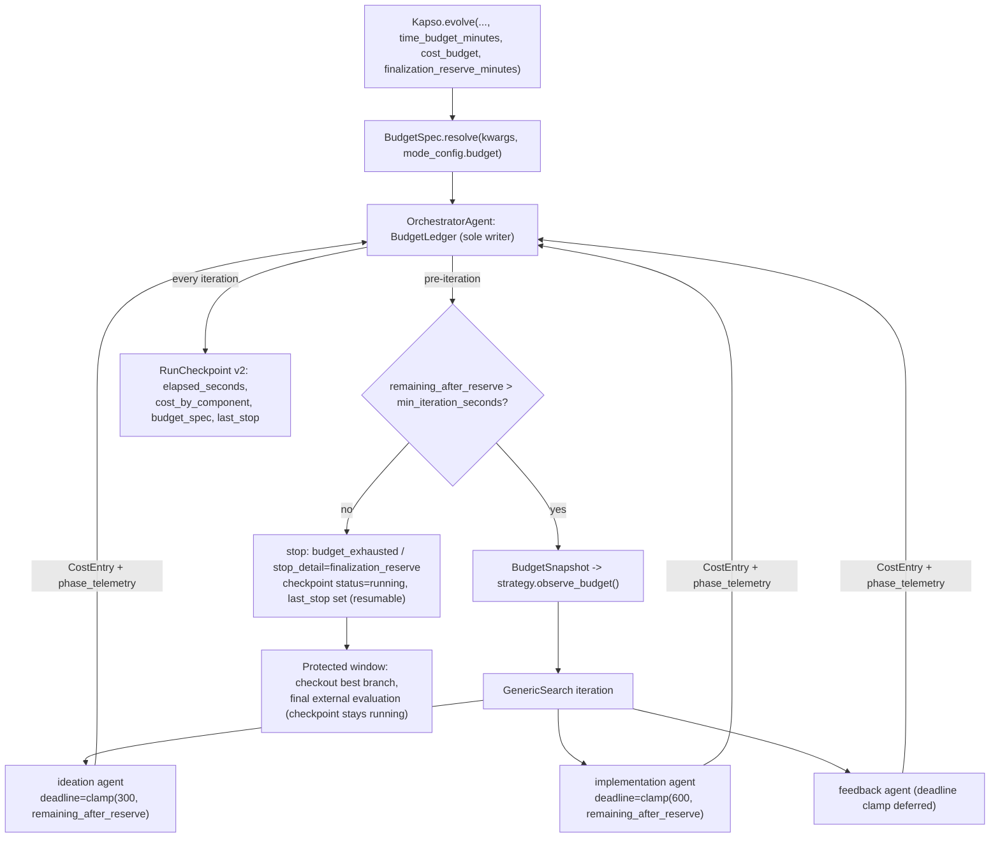

Status: **design proposal** (2026-07-13, against `main @ 31db3ff4`; fidelity layer amended
after an adversarial Codex review the same day — holdout/calibration discipline, cap-based
escrowed reserve, deterrence-not-containment enforcement framing, and versioned
evaluation-attempt records all trace to its findings). Companion analyses: the competitor
mechanism survey (`archive/competitor_search/mechanisms_ranked.md`) and the Research-Planner
related-work study (`archive/competitor_search/research_planner_related_work.md`).
This design is the budget slice of that larger direction, scoped to land independently.

## Executive summary

Kapso already *computes* a budget signal — `solve()` derives `budget_progress` from iteration,
time, and cost fractions every iteration (`orchestrator.py:697-705`) — but the signal is fed by
meters that miss most of the real spend, is consumed by almost nothing, and does not survive a
resume. Budget-aware experimentation therefore starts as a **data-plane problem, not a planner
problem**: make the recorded state true first, then make enforcement mechanical, and keep every
budget decision in deterministic orchestrator code. That ordering is the strongest consensus of
the 12-system competitor survey: every high-performing system (ShinkaEvolve, MLEvolve, R&D-Agent,
AI Scientist v2, AIRA-dojo) keeps budget authority in a non-LLM control plane and gives the LLM
at most an advisory view of remaining budget.

The design adds one new module (`src/kapso/execution/budget.py` — `BudgetSpec`, `BudgetLedger`,
`BudgetSnapshot`), per-iteration telemetry on `SearchNode`, a v2 `RunCheckpoint` that persists
elapsed time, cost harvesting from the three agents whose spend is currently invisible, an
advisory `{{budget_status}}` prompt block, budget-clamped agent deadlines, a mechanical
finalization reserve — and, on top of that substrate, a **fidelity contract**
(PROBE / VALIDATE / FULL): sanctioned fast variants of an experiment's two cost-bearing
phases, BUILD and EVAL (deterministic workload subsets, everything else identical), with a
deterministic policy that decides, from remaining budget and measured run costs, when an
experiment runs fast and when the campaign spends a full run. The contract is task-agnostic
— training is just one domain's build phase. When no budget is configured, behavior is
unchanged.

## Why now: the verified gaps

Audited against `main @ 31db3ff4`; each gap is a fact of the current code, not a projection.

| # | Gap | Evidence |
|---|-----|----------|
| G1 | **The cost ledger misses the three dominant spenders.** `get_cumulative_cost()` sums checkpoint-seeded prior cost, `LLMBackend` cost, and `workspace.previous_sessions_cost` (`orchestrator.py:524-530`). But `GenericSearch` directly instantiates its ideation agent (`generic/strategy.py:343`) and implementation agent (`generic/strategy.py:524`) and never harvests their cost; `ExperimentSession.get_cumulative_cost()` reads only the factory-created session agent (`experiment_session.py:342`), which generic mode uses only for one-time workspace initialization (`generic/strategy.py:154-164`), never for iteration work; the `FeedbackGenerator` agent's cost is likewise dropped. `cost_budget` currently meters repo-memory inference, insight extraction, and commit messages — the cheap parts. | `grep cost generic/strategy.py` → no matches |
| G2 | **Elapsed time does not survive resume.** `solve()` sets `start_time = time.time()` (`orchestrator.py:689`); `RunCheckpoint` persists `cumulative_cost` but no elapsed-seconds field (`run_checkpoint.py:51-64`). A resumed campaign silently restarts its time budget. | `run_checkpoint.py:51-95` |
| G3 | **The budget signal reaches no prompt.** `GenericSearch` only prints `budget_progress` (`generic/strategy.py:184`); `_build_ideation_prompt` receives only `problem` and `repo_memory_brief` (`generic/strategy.py:368-382`). The ideation agent cannot know it is on iteration 9 of 10. | prompt templates have no budget placeholder |
| G4 | **Nothing protects finalization.** No reserve exists; if the last admitted iteration consumes the remaining wall-clock, best-branch checkout and final validation run on borrowed time. `stopped_reason` has no finalization semantics (`orchestrator.py:60`). | — |
| G5 | **No public budget API.** `time_budget_minutes` / `cost_budget` exist only on `solve()` (`orchestrator.py:660-665`); `Kapso.evolve()` exposes neither. | `kapso.py:477-496` |
| G6 | **No per-iteration telemetry.** `SearchNode` records no duration or cost (`base.py:44-89`), so empirical runtime models — the only admission basis the survey found defensible — have no substrate. | — |
| G7 | **Static timeouts ignore the budget.** Ideation 300 s, implementation 600 s (`generic/strategy.py:110,119`) are configured without regard to remaining budget. | — |
| G8 | **Configured timeouts are not enforced on the code path generic mode uses.** The adapter enforces `agent_specific["timeout"]` only in its buffered path (`subprocess.run(..., timeout=...)`, `claude_code_agent.py:422`); the streaming path `_run_streaming` has no deadline check and no kill, and both generic-mode agents set `streaming: True` (`generic/strategy.py:330,501`). The 300 s/600 s values are stored but never enforced — an agent call can run indefinitely today. | `claude_code_agent.py:460-679` |

Two smaller honesty bugs compound G1: the Claude Code adapter's failure path drops the parsed
cost of a failed call (success records it; failure does not — `claude_code_agent.py:615-638`),
and the non-streaming path only estimates cost. Expensive *failed* iterations are exactly the
ones a cost budget exists to bound.

### The motivating scenario: tight budgets where full runs don't fit

[PostTrainBench](https://posttrainbench.com/) is the concrete case: post-train a small LM
(Qwen3-1.7B/4B, SmolLM3-3B, Gemma3-4B) on **one H100 in 10 hours**, scored on a weighted
average of seven eval suites (AIME 2025, Arena Hard, BFCL, GPQA, GSM8K, HealthBench,
HumanEval). A full SFT pass plus a full seven-suite evaluation costs roughly 4–5 GPU-hours,
so the current loop — every experiment full-size by default — affords **two experiments,
chosen blind**. No amount of budget *accounting* fixes that; the loop needs a sanctioned way
to run cheap experiments and spend full runs deliberately. That is the fidelity contract
below (the "Fidelity" section), and it is the part of this design that budget arithmetic
exists to serve.

## Design principles

Derived from the related-work evidence and the binding constraints in
`docs/evolve/reliability-roadmap.mdx`:

1. **Deterministic budget authority.** The orchestrator computes, enforces, and persists all
   budget state. Strategies are read-only consumers of budget *decisions and snapshots*; the
   one thing they send upward is attributed telemetry (`CostEntry` records) through a narrow
   reporting interface, and reported entries never trigger enforcement mid-iteration. No
   surveyed system lets an LLM own budget decisions, and the ones that tried adjacent ideas
   (LLM duration estimates) have no validation story.
2. **Telemetry before policy.** Every future capability — empirical runtime models, admission,
   phase policies, planners — must be a pure function over recorded per-iteration state. Nothing
   in this design estimates; it measures.
3. **Mechanical enforcement, advisory prompts.** Prompt text is never a protection mechanism
   (`reliability-roadmap.mdx:47-48`). Enforcement points are the pre-iteration stop gate, the
   reserve arithmetic, and subprocess deadline kills — which Phase 4 must first *implement* in
   the adapter's streaming path (G8), since today's timeout is only enforced when buffering.
4. **Additive compatibility.** Unbudgeted runs behave identically. `SearchNode.from_dict`
   already tolerates newer fields (`base.py:104-109`); the checkpoint schema is versioned
   deliberately; `BenchmarkTreeSearch` keeps seeing the same `budget_progress` float and is
   otherwise untouched (the survey's rank-9/10 audits identify dual-strategy lockstep as the
   dominant integration cost — this design pays none of it).
5. **Budgets are operator dials, not campaign identity.** Like `max_iterations` (a `solve()`
   argument that was never fingerprinted), budget settings must be excluded from
   `config_fingerprint` so "resume with a bigger budget" works under strict resume validation.
   For that to hold, budget exhaustion must not mark the campaign `completed` — see the
   checkpoint-status change below, which this design makes deliberately.

## Architecture

### New module: `src/kapso/execution/budget.py`

```python
@dataclass(frozen=True)
class BudgetSpec:
    """Campaign budget declaration. Validated, JSON-round-trippable."""
    max_iterations: int
    time_budget_seconds: Optional[float] = None
    cost_budget_usd: Optional[float] = None
    finalization_reserve_seconds: float = 0.0
    min_iteration_seconds: float = 60.0      # floor for the reserve gate
    min_agent_timeout_seconds: float = 60.0  # floor for deadline clamps
    # The 60 s floors are provisional: below adapter startup plus a single
    # tool round-trip an agent call cannot do useful work, and clamping to
    # near-zero would burn an iteration on guaranteed timeouts. Revisit once
    # Phase 1 phase_telemetry provides measured call-duration distributions.

    @classmethod
    def resolve(cls, *, evolve_kwargs, mode_config) -> "BudgetSpec":
        """Explicit evolve() kwargs > mode_config['budget'] block > defaults."""

@dataclass(frozen=True)
class CostEntry:
    """One attributed spend record."""
    phase: str            # "ideation" | "implementation" | "feedback"
    cost_usd: float
    duration_seconds: float
    source: str           # e.g. "claude_code:stream_result"

class BudgetLedger:
    """Owned by OrchestratorAgent — the sole owner and mutator of accumulated
    budget state. Strategies may append attributed CostEntry records through
    record(); all reads, derived arithmetic, and enforcement decisions stay
    orchestrator-side.

    - Seeds prior_elapsed_seconds / prior_cost_usd / prior_cost_by_component
      from the resume checkpoint.
    - Measures the live slice with time.monotonic() (durations) against a
      single wall-clock base recorded at solve() start (checkpoint elapsed).
    - record(entry: CostEntry) accumulates attributed agent spend.
    - Samples LLMBackend and workspace meters as separate aggregates;
      total_cost() replaces the blind sum at orchestrator.py:524-530.
    """

@dataclass(frozen=True)
class BudgetSnapshot:
    """Per-iteration read model handed to strategies. Never written by them."""
    iteration_index: int
    max_iterations: int
    elapsed_seconds: float
    cost_usd: float
    time_budget_seconds: Optional[float]
    cost_budget_usd: Optional[float]
    finalization_reserve_seconds: float
    # Derived: remaining_seconds, remaining_after_reserve, remaining_usd,
    # progress_percent (identical arithmetic to today's budget_progress).
```

Double-counting invariant: in generic mode the session's factory agent never runs (only
`_initialize_workspace` uses `session.generate_code`), so `finalize_session`'s existing harvest
(`experiment_workspace.py:394-396`) contributes nothing for the directly-instantiated agents;
each agent's cost flows through exactly one meter.

### Contract extensions

**`SearchNode` telemetry (closes G6)** — additive fields with `None`/`{}` defaults, validated
finite-and-non-negative-or-absent in `from_dict` (never zero-filled):

```python
duration_seconds: Optional[float] = None
cost_usd: Optional[float] = None
started_at: str = ""                                # ISO-8601 UTC
phase_telemetry: Dict[str, Dict[str, float]] = field(default_factory=dict)
# {"ideation": {"cost_usd": ..., "duration_seconds": ...}, "implementation": ..., "feedback": ...}

# Fidelity (Phase 5; defaults preserve full-size semantics for old nodes)
build_fidelity: str = "full"
eval_fidelity: str = "full"
promoted_from: Optional[int] = None                 # probe node this FULL rebuild came from
evaluation_attempts: List[EvaluationAttempt] = field(default_factory=list)
# append-only, versioned by evaluator_id — see "Evaluation versioning";
# node.score is the canonical attempt's projection
```

**`RunCheckpoint` schema v2 (closes G2)** — `SCHEMA_VERSION = 2` with a deterministic,
loudly-logged `_upgrade_v1()` applied in `from_dict` before required-field checks; v3+ still
rejected; `save()` always writes v2:

```python
elapsed_seconds: float = 0.0        # v1 checkpoints migrate to 0.0 — semantically
                                    # identical to today's clock restart, real from
                                    # the first v2 save onward
cost_by_component: Dict[str, float] = field(default_factory=dict)
budget_spec: Optional[Dict] = None  # last-slice BudgetSpec.to_dict(); reporting only,
                                    # never fingerprinted, never validated on resume
last_stop: Optional[str] = None     # "time_budget" | "cost_budget" |
                                    # "finalization_reserve" | None
```

**Checkpoint-status semantics change (deliberate).** Today budget exhaustion writes
`status="completed"` (`orchestrator.py:802-807`), and `validate_resume` raises
`RunCheckpointCompletedError` *before* the fingerprint comparison
(`run_checkpoint.py:203-207`) — so the fingerprint carve-out alone could never enable the
headline "resume with a bigger budget" scenario: the runs that most need a top-up would be
terminal. This design therefore reserves `status="completed"` for **goal achievement**;
time/cost/reserve stops persist `status="running"` with the stop recorded in `last_stop`.
A budget-exhausted campaign is paused, not finished. This deliberately **amends** the
budget-exhaustion-marks-completed semantics pinned by `tests/test_run_checkpoint.py:394` —
that test changes with this design, and the change is called out here rather than discovered
in review. Goal-achieved runs keep today's completed-at-stop behavior unchanged.

**`SolveResult.stop_detail`** — `stopped_reason` keeps its four-value vocabulary
(`orchestrator.py:60`; pinned by tests). A new additive `stop_detail: Optional[str]` carries
`"finalization_reserve" | "time_budget" | "cost_budget"` under
`stopped_reason="budget_exhausted"`.

**`FeedbackResult`** — additive `cost_usd: float = 0.0` and
`duration_seconds: Optional[float] = None`, measured in `FeedbackGenerator.generate()` as the
delta of the persistent agent's `get_cumulative_cost()` around the `generate_code` call
(agent built once at `feedback_generator.py:89`; call site `feedback_generator.py:142`).

**Strategy interface** — no `run()` signature change and no config injection. The base class
gains two additive members set by the orchestrator before each iteration:

```python
class SearchStrategy:
    budget_snapshot: Optional[BudgetSnapshot] = None
    def observe_budget(self, snapshot, cost_reporter=None) -> None:
        self.budget_snapshot = snapshot
        self._cost_reporter = cost_reporter   # Callable[[CostEntry], None] | None
```

`BenchmarkTreeSearch` inherits both inertly and continues to consume the unchanged
`budget_progress` float. `GenericSearch` stamps node telemetry unconditionally (free) and
reports `CostEntry` records only when a reporter is set.

### Authority model



## Revised system flow

One `solve()` iteration, with additions in bold:

1. **Ledger refresh**: elapsed = prior (checkpoint) + monotonic live slice; total cost =
   prior + LLM backend + workspace + **attributed agent entries**.
2. Compute `budget_progress` (unchanged formula) and **`BudgetSnapshot`**.
3. Existing stop gate at `budget_progress >= 100`; **new reserve gate**: if a time budget is
   set and `remaining_after_reserve <= min_iteration_seconds`, stop with
   `stop_detail="finalization_reserve"` and checkpoint `status="running"` + `last_stop`
   (budget stops are resumable; only goal achievement completes a campaign). Hard arithmetic
   only — no duration estimation. **When fidelity is enabled**, the `FidelityPolicy` also
   grants this iteration's profile here (PROBE / VALIDATE / FULL — see the Fidelity section),
   and the reserve gate's trip executes the guaranteed FULL run instead of merely stopping.
4. **`strategy.observe_budget(snapshot, ledger.record)`**, then `strategy.run(context,
   budget_progress)` exactly as today.
5. Inside `GenericSearch.run()`:
   - ideation and implementation agents get **clamped deadlines**
     `max(min_agent_timeout_seconds, min(configured, remaining_after_reserve))` passed via
     `agent_specific["timeout"]` (`generic/strategy.py:329,500`). Enforcement is *new work*:
     today the adapter honors the timeout only in its buffered path
     (`claude_code_agent.py:422`), and generic mode always streams (G8) — Phase 4 adds a
     deadline check and kill to `_run_streaming`, recording wall-clock duration (and any
     cost parsed before the kill) for the terminated call;
   - both prompts render the **`{{budget_status}}`** block (always rendered — neutral
     "Iteration i of N; no time or cost budget set" when unbudgeted, so no template ships a
     literal unmatched placeholder; `prompt_loader.py` leaves unknown placeholders verbatim);
   - each agent call is wrapped with monotonic timing; **cost is harvested** from
     `CodingResult.cost` reconciled against `agent.get_cumulative_cost()` in the existing
     `finally` blocks (`generic/strategy.py:365-366,534-535`) into `node.phase_telemetry` and
     the ledger.
6. Integrity enforcement, external evaluation, history persistence, and the per-iteration
   checkpoint write proceed unchanged — the checkpoint now carrying elapsed time and
   per-component cost.
7. Post-iteration budget checks switch from process-local to **persisted-elapsed arithmetic**,
   and budget-triggered stops now persist `status="running"` + `last_stop` instead of
   `status="completed"` (the deliberate semantics change described above; the affected
   `test_run_checkpoint` expectations change with it, goal-achieved behavior does not).

`Kapso.evolve()` forwards the three new optional parameters; `SolutionResult.metadata` gains
`cost_by_component` and `stop_detail` alongside the existing `cumulative_iterations` /
`best_branch` / `external_metrics`.

## Fidelity: fast and full experimentation

This is the layer that makes tight budgets *searchable* rather than merely metered. It is
opt-in: with fidelity off (the default), every experiment runs full-size exactly as today.

### The contract: BUILD × EVAL, task-agnostic by construction

Kapso's evolve loop is generic — post-training, kernel optimization, prompt engineering,
agentic scaffolds, algorithm search — so the fidelity contract is defined over the two
cost-bearing phases **every** experiment has, not over "training":

- **BUILD** — the artifact-producing step: training a model, compiling and running a kernel
  sweep, executing a pipeline, running a scaffold over episodes — or nothing at all
  (writing a prompt is free).
- **EVAL** — the measurement: eval suites, timing harness, test cases, judged case sets.

A **fidelity** is a declared, verifiable *workload profile* over these two dimensions.
"Fast" always means **a deterministic subset of the workload units, everything else
identical** — and what a *unit* is (rows, steps, benchmark shapes, episodes, instances,
cases) is supplied by the domain, not by kapso:

- `build_fidelity: fast | full` — *fast* consumes a deterministic fraction of the build
  workload (fixed fraction, fixed seed / fixed subset rule). **Recipe, hyperparameters,
  and code path are identical**, and the implementation must make the fast→full switch a
  configuration flip, not a rewrite.
- `eval_fidelity: fast | full` — *fast* measures on a deterministic subsample of the eval
  workload (fixed fraction, fixed seed, so fast scores are comparable **across
  experiments**), with the same harness, metrics, and scoring.

| Domain | Fast BUILD means | Fast EVAL means |
|---|---|---|
| Post-training | data subsample / capped steps | subsample of each suite |
| CUDA / PyTorch optimization | few benchmark shapes | subset of shapes, fewer timing reps |
| Prompt engineering | — (build ≈ free) | fraction of the case set |
| Agentic scaffold | shorter episode caps | subset of tasks |
| Algorithm search (ALE-style) | smaller instances | fewer test instances |
| Tabular ML | row subsample | fewer CV folds |

Three sanctioned combinations keep the space tractable:

| Profile | Build | Eval | Role | Typical cost (PostTrainBench instance) |
|---|---|---|---|---|
| **PROBE** | fast | fast | The search workhorse: cheap signal on a candidate | ~45 min |
| **VALIDATE** | *reuse artifact* | full | Full-eval an existing artifact — trust check before committing to a rebuild; no build cost | ~1.5 h |
| **FULL** | full | full | The deliverable, produced by the cheapest sound path (extend the artifact where the domain is incremental, rebuild where it isn't); the only profile that can end a campaign | ~4.5 h |

**Degenerate cases handle themselves, because every decision reads measured phase costs —
the design never asks "does this task have training?".** Zero-build tasks (prompt
engineering): measured build ≈ 0, so the shots arithmetic yields many probes and the
committed slot collapses to ≈ eval time — no special case, the numbers just come out that
way. Irreducible-build tasks (a simulation meaningless at 10%): declare no fast build
fraction, and fidelity degrades to eval-only tiers or `mode: auto` concludes tiers don't
pay. The litmus test for any new task type is one question: *can your build and/or eval
workload be deterministically subset?* Yes to either enables tiers on that dimension; no
to both leaves fidelity off and the plain budget loop — which never assumed anything —
runs as-is.

### The Evaluation Maintainer: one owner for the measuring instrument

Evaluation stops being something implementation agents improvise and becomes an owned
surface. The **EvaluationMaintainer** is a coding-agent module (built via the agent factory
with its own config block and prompts, exactly like the FeedbackGenerator) with a monopoly:
**it is the only component allowed to write `kapso_evaluation/`, in every provenance mode.**

**Setup transaction (once, before iteration 1):**

1. **Provided evaluator** (`eval_dir` given): verify it runs; check whether it already honors
   the fidelity interface. Its **logic is immutable** — the maintainer may only *derive* a
   fast variant by layering a subsampling wrapper over it (fixed fraction, fixed seed,
   untouched scoring), and fix execution-environment breakage; a genuinely broken provided
   suite is surfaced to the caller, never silently rewritten.
2. **No evaluator provided**: the maintainer **builds the full evaluator from the goal** —
   this moves evaluation construction out of the first implementation iteration, where it
   currently lives as an improvised side effect.
3. **Time it by measurement, not declaration**: run a calibration slice (a few percent of
   items), measure per-item rate and fixed startup, extrapolate to full- and fast-variant
   durations. Minutes of spend at setup replaces the operator's guess about evaluation time.
4. **Derive the fast variant** when the measured full duration is material against the
   budget (threshold in config); skip it when full evaluation is already cheap.
5. **Register and commit**: manifest-hash the evaluation tree, write the registry entry, and
   commit to the workspace `main` so every experiment branch inherits the registered
   evaluator.

**The registry** (`.kapso/evaluation_registry.json`) is the versioning backbone — one
append-only entry per evaluator version:

```python
@dataclass(frozen=True)
class EvaluatorVersion:
    evaluator_id: str        # manifest fingerprint of the evaluation tree
    version: int
    provenance: str          # "provided" | "maintainer_built" | "derived_fast"
    parent_evaluator: Optional[str]
    fidelity_support: Dict   # fractions/seeds available
    timing: Dict             # per_item_ms, startup_s, full_estimate_s, fast_estimate_s,
                             # measured_samples (refined by every real run)
    created_at_iteration: int
    reason: str              # setup | change-request id + summary
```

**During the loop:** implementation agents get the evaluation as **read-and-execute only** —
enforced mechanically, not by prompt: `enforce_evaluation_integrity` now checks *every*
candidate against the registered manifest in *all* modes (the current provided-only check
generalizes; `agent_generated` provenance disappears as a distinct trust regime). An agent
that believes the evaluation is wrong emits an `<evaluation_change_request>` tag in its
output; the feedback agent's `evaluation_valid=false` verdicts route the same way. The
orchestrator queues requests and invokes the maintainer **between iterations**: it judges
the request, implements accepted changes (never on provided logic), registers a new version,
and triggers the re-anchor step below. Evaluator drift thereby changes from something the
system *detects after the fact* into an explicit, versioned, reasoned **transaction**.

The maintainer is itself a budgeted actor: its setup transaction and every change-request
run are deadline-bounded agent calls whose cost and duration land in the ledger
(`CostEntry` phase `"evaluation_maintenance"`) — the calibration slice is deliberately a
few minutes bought once to replace guesswork for the whole campaign.

The maintainer is also the natural stepping stone to the deferred Kapso-owned evaluator
*runner*: it already owns the content and the timing model; giving it execution (allowlisted
command, process supervision, hard deadline) later upgrades fidelity enforcement from
deterrence to containment without re-architecting.

#### EvaluationMaintainer module design

Follows the established agent-module pattern (a deterministic Python frame around scoped
coding-agent calls, like the FeedbackGenerator), with one governing property: **every trust
boundary is a mechanical post-condition in the frame, never an instruction to the agent.**

```
src/kapso/execution/evaluation_maintainer/
  maintainer.py        # EvaluationMaintainer — the deterministic frame
  registry.py          # EvaluatorVersion + EvaluationRegistry (append-only, atomic)
  prompts/
    setup_provided.md  # verify a caller's suite, derive the fast wrapper
    setup_build.md     # build the full evaluator from the goal
    change_request.md  # triage + implement an accepted change request
```

```python
class EvaluationMaintainer:
    def setup(goal, eval_dir, data_dir) -> EvaluatorVersion      # once, pre-loop
    def handle_change_request(req) -> ChangeOutcome              # between iterations
    def timing(evaluator_id, fidelity) -> TimingEstimate         # feeds FidelityPolicy
    def record_run(evaluator_id, fidelity, seconds, n_items)     # refines the model

@dataclass(frozen=True)
class EvaluationChangeRequest:
    iteration: int
    requested_by: str        # "implementation" | "feedback" | "user"
    summary: str
    evidence: str            # logs / output excerpt, passed in full

@dataclass(frozen=True)
class ChangeOutcome:
    accepted: bool
    reason: str              # rejected requests are recorded too — the audit trail
    new_version: Optional[EvaluatorVersion]
    requires_reanchor: bool

@dataclass(frozen=True)
class TimingEstimate:
    expected_seconds: float
    upper_seconds: float     # quantile bound — what admission checks consume
    basis: str               # "calibration" | "measured(n=...)"
```

**Setup transaction, precisely.** (1) Provided suite: one agent call verifies it runs (one
item per suite); if the fidelity interface is absent, a second call derives the wrapper **as
new files only** — then the frame re-hashes the provided files and requires byte-identity.
Immutability is a post-condition that fails the transaction, not a request. (2) No suite:
the agent builds the full evaluator from the goal and data layout, interface included.
(3) **Calibration timing is not agent work**: the maintainer *module* runs the registered
command itself via a deadline-bounded subprocess (`KAPSO_EVAL_FRACTION` ≈ 0.03), computing
per-item rate and startup deterministically — the timing model cannot be hallucinated, and
this small executor is deliberately the embryo of the future runner. (4) Fast variant
derived iff measured full time exceeds `fast_variant_threshold_minutes`; register v1;
commit. If the suite cannot be made runnable or timing cannot be established, **fail loud
before the loop starts**.

**Change-request governance.** Agents cannot edit (any diff under `kapso_evaluation/` fails
the registry-manifest integrity check on that candidate); they can only file
`<evaluation_change_request>`. The triage prompt includes the requester's context — its
node's score, whether "the eval is too strict" comes from a losing candidate — because
lobbying the referee is the obvious attack. Hard constraints live in the frame: provided
logic edits rejected by the hash post-condition; accepted changes re-run the mechanical
invariants (manifest == tree, interface responds, manifest line prints on a two-item dry
run) before registering v(n+1) with `requires_reanchor=True`. A per-campaign
`max_change_requests` cap turns a request storm into a visible signal, and rejection
reasons feed the next implementation prompt's error context.

**Integration points.** Orchestrator: constructs the maintainer from its config block, runs
`setup()` after workspace init and before iteration 1, drains the request queue between
iterations, and performs the re-anchor before the next selection. Integrity: the canonical
manifest becomes the registry head's, in all modes. FidelityPolicy: consumes `timing()` for
reserve sizing and VALIDATE admission; calls `record_run()` after every evaluation.
Checkpoint: the registry head id joins resume validation, so a resumed campaign cannot
silently run under a different evaluator. Ledger: every maintainer call is deadline-bounded
and metered as `evaluation_maintenance`.

**Behavior worth pinning in tests**: provided files byte-identical after wrapper
derivation; an implementation agent's eval edit voided in agent-built mode; a change
request yields a new version plus re-anchor, never an in-place mutation; rejected requests
recorded; calibration extrapolation arithmetic; registry append-only atomicity;
`record_run` tightening `upper_seconds`; resume with a mismatched registry head failing
loudly.

**Staged execution ownership.** During the loop, probes still run evaluation inside the
implementation session (deterrence model). The natural next stage routes **VALIDATE and
FULL evaluations through the maintainer's own executor** — they are eval-only, free of
training entanglement, and exactly the runs whose integrity matters most — turning
enforcement into containment for the decisions that spend real budget, before probes ever
need it.

### Evaluation versioning and comparability classes

A score is meaningless without the identity of the evaluator that produced it — and in kapso
the evaluator itself *moves*: fidelity changes the item set, and in agent-generated mode the
agent can rebuild the evaluation between iterations. So evaluations become **append-only,
versioned attempt records** rather than mutable fields:

```python
@dataclass(frozen=True)
class EvaluationAttempt:
    commit_sha: str          # the candidate artifact (not a branch name — branches move)
    evaluator_id: str        # manifest_fingerprint of the kapso_evaluation/ tree at eval
                             # time — the versioning primitive; reuses the existing
                             # evaluation-integrity hashing, and instantiates the
                             # `evaluator_version` field the aggregate roadmap proposed
    fidelity: str            # "fast" | "full"
    fidelity_params: Dict    # fraction, seed, item count (echoed from the manifest line)
    score: Optional[float]
    metrics: Dict[str, float]
    duration_seconds: float
```

`SearchNode` gains `build_fidelity`, `eval_fidelity`, `promoted_from: Optional[int]`, and
`evaluation_attempts: List[EvaluationAttempt]`. A VALIDATE pass **appends** an attempt; it
never overwrites anything, so experiment history and checkpoints can never disagree about a
finalized node. `SearchNode.score` keeps its binding single-scalar role as a *projection*:
the score of the node's canonical attempt (the campaign's current canonical `evaluator_id`
at the node's granted fidelity).

**The comparability rule, versioned.** Two attempts are directly comparable **iff** they
share a comparability class: same `evaluator_id`, same fidelity, same `fidelity_params`.
Ranking — parent selection, leaders, pruning — happens only *within* a class:

- Because the fast subsample uses a fixed fraction and seed, all probe attempts under one
  evaluator version are one class and share the exact item set — comparisons are **paired**
  (GEPA's minibatch-acceptance insight: parent-vs-child deltas on identical items cancel
  most subsample noise; prefer paired deltas over absolute fast scores).
- **Evaluator changes re-anchor the frontier — and only the maintainer can cause one.**
  A new `evaluator_id` exists only when the EvaluationMaintainer registers a new version
  (any other diff to the evaluation tree is an integrity violation on the candidate that
  made it). Prior scores become a stale class, never mixed with new ones; registration
  triggers the re-anchor: re-evaluate the incumbent best under the new version (eval-only,
  cheap) so the frontier stays comparable instead of silently spanning two rulers.
- **Mixed-fidelity selection is a tier order, not a merged ranking** (AIDE's
  `WorstMetricValue` discipline — missing evidence always compares worse): nodes with a
  FULL attempt > nodes with a full-eval VALIDATE attempt > probe-only nodes; within a tier,
  rank by that tier's class score. The final artifact is the best full-eval result;
  `should_stop` can only be set by FULL evidence — the feedback agent is told the fidelity
  and instructed that probe results are signals, not outcomes.
- If a campaign ends with no FULL result, `SolutionResult` says so explicitly
  (`fidelity_of_best`) rather than presenting a probe score as the result.

### Calibration: earning the right to promote on fast scores

Fast scores are a proxy, and an uncalibrated proxy invites winner's-curse promotion. The
mitigation is that the campaign *measures its own proxy quality*: every node that holds both
a fast and a full-eval attempt under the same evaluator lineage is a calibration pair, and
VALIDATE/FULL passes produce exactly these pairs as a side effect. The policy maintains the
pair table in its persisted state and computes rank agreement (Spearman) as pairs accumulate:

- **Below a floor** (or with too few pairs), fast scores are demoted to *pruning-only* —
  good enough to discard clear losers, not to crown winners; promotion then requires a
  VALIDATE confirmation.
- **Above it**, automatic promotion by fast-score margin is permitted, still hedged by
  `promotion_margin`.

The rung discipline itself is the classic multi-fidelity answer (Successive Halving /
Hyperband / ASHA): PROBE → VALIDATE → FULL are rungs; candidates are compared within a rung
and *promoted* between rungs, never scored across them. Multi-seed repetition
(AI Scientist v2) is reserved for finalists. **Holdout discipline** (the adversarial
review's sharpest point): the fast subsample is a *development* set by construction — reused
every iteration, therefore adapted to; the full suite is the measurement. Bounding VALIDATE
count (`max_full_evals`) bounds the adaptivity leak into the full suite, and the final FULL
result is reported from the full suite with the campaign's total full-suite query count
recorded alongside it — visible, if not eliminable, adaptivity.

### Selection under versioned evaluation: the four "bests"

(Adversarially reviewed 2026-07-13; the leaderboard architecture, calibration-gated
parenting, transition state machine, matched replication, and escrowed endgame validation
below all trace to that review's findings.)

"Pick the best node" is four different questions, and versioning forces each consumer to
answer within its own evidence:

| Consumer | Question | Rule |
|---|---|---|
| **Parent selection** (next experiment) | Which lineage to extend now? | Current-class leader **subject to calibration-aware eligibility** (rule 2): paired fast ranking earns exploration authority only as far as calibration supports it. Valid, integrity-passing nodes only. |
| **VALIDATE candidate** | Which probe earned a full eval? | Fast leader clearing `promotion_margin` under matched-replication comparison (rule 4), calibration-gated, not already validated. |
| **Reserve / FULL candidate** | What gets the committed run? | **Tier order**: FULL attempt > VALIDATE attempt > probe-only; within tier by same-class score. An unconfirmed fast lead loses here, by design. |
| **Final `SolutionResult`** | What do we ship and claim? | Best full-eval evidence (FULL tier, else VALIDATE), labeled `fidelity_of_best`; a probe-only campaign says so, and an `unvalidated_leader` left on the table is reported. |

1. **Per-class leaderboards are the source of truth — projections are a compatibility
   surface.** The policy state holds immutable leaderboards keyed by the complete
   comparability class `(evaluator_id, fidelity, params, replication schedule)`, plus the
   *persisted consumer selections* (current parent-leader, validated-leader, committed
   candidate). Consumer views derive from leaderboards; `node.score` is populated *from*
   the canonical class's leaderboard so the existing dumb selectors keep working, but no
   decision reads a projection directly. **No score ever crosses an `evaluator_id`
   boundary** — cross-version standing is only ever re-earned by an actual bridge
   evaluation under the new head. The registry's semantic-change note is audit metadata,
   never authorization to reuse a score: a manifest hash proves bytes changed, not that
   rankings survived.
2. **Parenting is calibration-gated with bounded unvalidated depth.** While fast ranking
   is uncalibrated (pairs below `calibration_min_pairs` or Spearman below floor), the
   parent defaults to the **validated leader**; an unvalidated fast leader may be extended
   only to `max_unvalidated_depth` (default 2) consecutive probes before it must be
   validated or exploration reverts to the validated lineage. A **failed validation is a
   deterministic reset**: the refuted lineage keeps its class score but loses parent
   eligibility, and the persisted parent-leader reverts. A lucky fast score can no longer
   steer the whole campaign while the committed leader sits elsewhere.
3. **Evaluator transitions are an idempotent, checkpointed state machine** — not a
   blocking convention. Order: register new head → checkpoint `{transition: pending,
   old_head, new_head}` → bridge evaluation of the incumbent (budgeted from searchable
   time, bounded retries) → checkpoint `{transition: anchored}`. Resume validation accepts
   a registry/checkpoint head mismatch **iff** a pending transition record explains it,
   and replays the bridge idempotently — a crash between registration and anchoring can
   no longer strand the campaign. Typed fallbacks replace deadlock: bridge fails or the
   incumbent's artifact is gone → incumbent is invalidated for the new class and the
   bridge falls to the next-best node with a live artifact; none exists → the frontier is
   *legitimately* empty and the next iteration drafts from baseline. `max_change_requests`
   plus the searchable-budget admission check cap how much a request storm can burn.
4. **Replication comparisons are matched, scheduled, and dispersion-aware.** Candidates
   compare only at equal replication counts with matched seeds, as paired seed-level
   deltas; a one-run challenger is never weighed against a three-run incumbent's mean.
   Promotion requires the paired delta to clear `promotion_margin` *plus* a dispersion
   term, so the threshold tightens with variance; replication happens on a fixed finalist
   schedule (never opportunistically, which would be optional stopping); a failed
   replication carries worst-value semantics.
5. **Endgame validation is escrowed ahead of the gate — the FULL reserve is untouchable.**
   With `endgame_validate: true`, while an unvalidated fast leader exists and
   `max_full_evals` has headroom, the escrow is *enlarged* to reserve(FULL) + one VALIDATE
   cap — the validate is paid from searchable budget by holding it back early, never
   squeezed in at the gate. It counts against `max_full_evals` explicitly, its admission
   decision is persisted, and if the enlarged escrow stops fitting it is skipped (recorded)
   rather than ever shaving the FULL attempt. It can flip the committed choice **only** on
   the resulting same-class full-eval comparison — never on the fast margin that motivated
   it.
6. **It slots behind the existing seam.** These rules are the "best" policy inside the
   landed `parent_policy` surface (and the roadmap's deferred `ParentSelector` interface):
   `baseline` is untouched, both strategies keep the same `get_best_experiment()` shape,
   and the leaderboard/tier-order walk is the one component that reads attempts directly.

### Who decides fidelity — and how budget connects

A deterministic **FidelityPolicy** owned by the orchestrator decides the profile *before
ideation each iteration*, from the ledger and measured telemetry — this is the first real
occupant of the action-portfolio slot, and it follows the evidence: a three-action
deterministic policy, not an agentic planner. The ideation agent may *request* a profile in
its solution spec (e.g., "this recipe is promising enough to warrant FULL"); the executive
grants the request only if the arithmetic allows. LLM proposes; executive disposes.

The policy, in words:

1. **The reserve is an escrowed, deadline-bounded FULL attempt — sized from measurement
   plus one declared bound.** Its two halves have different epistemics. The **evaluation
   half is measured before the loop starts**: the EvaluationMaintainer's setup transaction
   times the registered evaluators (calibration slice → per-item rate → full/fast
   estimates), so full-eval duration is data from iteration 0 and is refined by every
   VALIDATE and manifest echo thereafter. The **build half cannot be measured up
   front** (the candidates don't exist yet) — but it is not guessed either: the build cap
   is **derived by default** from budget shape, `build_cap = committed_run_fraction ×
   time_budget − measured_full_eval − overhead`, with `build_run_cap_minutes` as an
   explicit operator override ("Where the build cap comes from," below). Fail-closed rule:
   with no time budget to derive from and no explicit cap, fidelity refuses to enable.
   Reserve = build cap + measured full-eval upper estimate + overhead factor, tightened by
   measured quantiles as full-size runs accumulate. The reserve is *escrowed*: every PROBE
   and VALIDATE admission is checked against `remaining − reserve`, and a VALIDATE is
   admitted only if its measured cap fits outside the escrow. The reserve run itself
   executes under a deadline equal to the reserve — so the honest guarantee is *one
   full-size, deadline-bounded attempt on the best recipe*, not "a completed full run of
   arbitrary duration."
2. **Default to PROBE** while `remaining_after_reserve` affords at least one more probe
   (measured probe EWMA after the first iteration).
3. **Promote to VALIDATE** when the fast-score leader beats the incumbent by
   `promotion_margin` and a validate pass fits outside the reserve — buying trust in the
   signal for a fraction of the cost of a rebuild.
4. **Promote to FULL mid-campaign** only when `remaining_after_reserve` still covers a full
   run with margin (rare on a 10 h budget; common on a 48 h one), capped by `max_full_runs`.
5. **The reserve run executes FULL** on the best-validated recipe when the gate trips.
6. **The reserve converts rather than dissolves.** If a mid-campaign FULL was granted and
   the committed candidate already holds its full-size result when the gate arrives, the
   escrow is not silently released: it converts to the next-most-valuable full-size use —
   matched-replication confirmation of the winner (the finalist schedule from the
   replication rule), or a full attempt for a challenger that validated well in the
   meantime. The reserve stays escrowed for as long as the committed candidate could still
   change, because a later probe that wins will need *its* full run too.

**Where the build cap comes from — an allocation and a contract, never a prediction.**
Build duration is a dial of the experiment, not an unknown of nature — the workload size
is chosen (training data and epochs in post-training; instance counts in algorithm search;
episode caps in scaffolds) — so the cap stacks four layers: the **executive derives** the
default from pure budget arithmetic (fraction of total, minus the maintainer's *measured*
eval time); the **operator may override** it — the one genuine judgment call, "one big bet
vs. more search"; the **agents comply precisely** — the FULL implementation prompt states
the window and the measured throughput from probe telemetry ("200 min at ~2.2 min per
percent of workload: size it accordingly"), turning the cap into an engineering input; and
the **deadline enforces** it for candidates that ignored their own arithmetic. Probe
telemetry also buys early infeasibility detection: the moment extrapolated full-build time
exceeds the cap (probe throughput × 100%), the campaign surfaces it — hours before the
reserve run, instead of as a kill at the deadline.

`BudgetSnapshot` carries the granted profile plus the current duration estimates, so both
agents and the prompts see *why* this iteration is a probe. **All policy state persists in
the checkpoint** — duration quantiles, the calibration pair table, the escrow, granted but
unfinished work, and promotion decisions — so a resumed campaign schedules deterministically
instead of re-deriving a different plan from partial memory.

### Worked example: PostTrainBench, 10 h × 1 H100

Full run ≈ 3 h SFT + 1.5 h seven-suite eval. Naive loop: 2 blind experiments. With fidelity
(`build.fast_fraction 0.1`, `eval.fast_fraction 0.15`; at setup the maintainer times the
suite — full eval ≈ 1.4 h measured, fast variant derived — so reserve = 3.5 h build cap +
1.4 h measured eval + overhead ≈ 5.2 h):

```
0h ─ probes #1-5 (≈45 min each: 10% SFT + 15% eval, deterministic seeds)   ~3.9h
   ─ VALIDATE leader (full 7-suite eval of best probe artifact)            ~1.3h  → 5.2h
   ─ reserve gate trips: FULL train+eval of the validated recipe           ~4.5h  → 9.7h
   ─ SolutionResult: full-eval score, lineage probe→validate→full
```

Five recipes explored, the winner trust-checked, and the deliverable full-trained — versus
two guesses. The same config with a 48 h budget naturally degrades to mostly-FULL runs
(step 4 keeps affording them), which is why fidelity `mode: auto` enables the machinery only
when the arithmetic says fewer than `min_affordable_full_runs` full experiments fit.

The timeline above assumes estimates hold; the schedule's *feasibility* rests on the
mechanisms, not the arithmetic: probe overruns are cut by probe-sized deadlines, the
VALIDATE is admitted only because its cap fits outside the escrowed reserve, and the final
run is a deadline-bounded attempt inside a reserve sized from a cap, not an average. The
worst case degrades to fewer probes and an earlier reserve trip — never to a campaign that
ends without its full-size attempt.

### Enforcement, honestly: deterrence now, containment later

The earlier deferral of "cascaded evaluation" stands — per-stage thresholds with per-stage
timeouts still require a Kapso-owned evaluator process. And that runner is also the only
**true** enforcement for fidelity: the implementation agent holds Bash, can launch training
that outlives its own CLI process, and no orchestrator-side admission check can preempt work
it cannot observe. Until the runner exists (allowlisted commands, process supervision,
GPU/cgroup accounting, hard deadlines — the roadmap's deferred endpoint), the three levels
below are correctly described as **deterrence** — they make cheating unprofitable and
visible, not impossible:

1. **Mechanical deadlines**: a PROBE iteration's agents get probe-sized deadlines. An
   implementation that ignores the subsample contract gets killed at the probe deadline —
   fast stays fast in wall-clock even when disobeyed. This depends on the Phase 4
   streaming-deadline fix (G8), and the kill must terminate the **whole process tree**, not
   just the agent CLI — a child training process that survives the kill is exactly the
   bypass this level exists to close. Cheap plausibility telemetry (periodic GPU-utilization
   sampling during the iteration) extends visibility to work the deadline missed.
2. **Contract verification**: the evaluation must print a one-line fidelity manifest
   (fidelity, fraction, seed, item count); the feedback agent verifies it against the granted
   profile, and a mismatch marks the evaluation invalid exactly like an integrity failure.
3. **Telemetry plausibility**: a "probe" whose duration lands at the FULL duration profile is
   flagged mechanically, independent of what any agent claims.

**The fidelity interface, maintained not improvised.** The interface
(`KAPSO_EVAL_FIDELITY` / `KAPSO_EVAL_FRACTION` / `KAPSO_EVAL_SEED`, plus the printed manifest
line) is the EvaluationMaintainer's to implement — it builds it into evaluators it authors
and layers it as a wrapper over provided ones, whose scoring logic stays immutable.
Implementation agents only *invoke* the registered command at the granted fidelity; editing
`kapso_evaluation/` is an integrity violation in every mode. When a provided suite cannot
support subsampling even via a wrapper (opaque scoring over the whole set), the maintainer
registers that fact and the policy degrades to fast-build + full-eval and says so, rather
than pretending.

## Configuration

```yaml
modes:
  GENERIC:
    budget:                                # optional; absent = today's behavior
      time_budget_minutes: 600
      cost_budget_usd: 25.0
      finalization_reserve_minutes: 10     # ignored when fidelity is active —
                                           # the reserve is then derived from the
                                           # full-run estimate (see below)
      min_agent_timeout_seconds: 60
      fidelity:                            # optional; absent/off = full-size always
        mode: auto                         # off | on | auto (auto: enable only when
                                           #   fewer than min_affordable_full_runs
                                           #   full experiments fit the time budget)
        min_affordable_full_runs: 4
        build:                             # the artifact-producing phase; omit this block
          fast_fraction: 0.10              # entirely for zero-build or irreducible tasks
        eval:
          fast_fraction: 0.15
          subsample_seed: 1337             # fixed so probe attempts share one item set
        committed_run_fraction: 0.45       # budget share allocated to the one committed
                                           # run; the executive derives the build cap from
                                           # it: fraction x budget - measured eval - overhead
        # build_run_cap_minutes: 210       # optional explicit override of the derived cap;
                                           # evaluation needs no declared bound - the
                                           # maintainer measures it at setup. reserve =
                                           # build cap + measured full-eval + overhead
        fast_variant_threshold_minutes: 20 # maintainer derives a fast evaluator only when
                                           # measured full eval exceeds this
        promotion_margin: 0.02
        max_full_runs: 2
        max_full_evals: 3                  # bounds VALIDATE passes (adaptivity leak into
                                           # the full suite)
        endgame_validate: true             # escrow one VALIDATE ahead of the reserve gate
                                           # for an unvalidated fast leader; counts against
                                           # max_full_evals; skipped (recorded) rather than
                                           # ever shaving the FULL reserve
        max_unvalidated_depth: 2           # probes that may extend an unvalidated fast
                                           # leader before validation or reversion
        calibration_min_pairs: 3           # below this, fast scores prune only
        calibration_min_spearman: 0.5      # rank-agreement floor for auto-promotion
    evaluation_maintainer:                 # coding-agent module, like feedback_generator
      type: "claude_code"
      # model/auth/timeout follow the same agent-config pattern as other agent modules
```

Resolution order: explicit `evolve()` kwargs > mode-config `budget` block > unset. The block is
**popped before config fingerprinting** (`orchestrator.py:146-152`) with a test asserting that
configs without the block produce byte-identical fingerprints. Together with the
checkpoint-status change (budget stops persist `status="running"`), budget top-up on resume
works from either the API or YAML without tripping `validate_resume` — for interrupted,
max-iteration, and budget-exhausted runs alike. Only goal-achieved campaigns are terminal.

## Delivery phases

Each phase is independently shippable, test-pinned, and behavior-preserving when unbudgeted.

**Phase 1 — Telemetry honesty (G1, G6).** `SearchNode` telemetry fields; cost/duration
harvesting in `GenericSearch` and `FeedbackGenerator`; Claude Code adapter failure-path cost fix
(`claude_code_agent.py:615-638`). Acceptance: in an integration test with a mock adapter
reporting known costs, the sum of `phase_telemetry` `cost_usd` equals the sum of
`CodingResult.cost` / `get_cumulative_cost()` deltas within $0.001; failed calls report cost;
no behavior change; `$0`-harvest logs a warning when a cost budget is set.

**Phase 2 — Durable clock (G2).** `RunCheckpoint` v2 with `_upgrade_v1`; `solve()` seeds
`_prior_elapsed_seconds` beside `_prior_cost` with plain orchestrator arithmetic (the ledger
abstraction subsumes this in Phase 3); post-iteration checks use persisted arithmetic;
budget-stop status change (`status="running"` + `last_stop`). Budgeted runs in this phase exist
only via the existing `solve(time_budget_minutes=...)` path. Acceptance: resume of an
interrupted budgeted run continues the clock (pinned test); a budget-exhausted run is resumable
and a goal-achieved run is not; v1 checkpoints migrate loudly with elapsed 0.0; the remainder of
the `test_run_checkpoint` suite passes unchanged.

Two clock properties the live E2E track pinned down: `solve()` writes a **bootstrap
checkpoint** right after evaluation registration and reconciliation, before the first
iteration — a crash at any later instant resumes (with the paid maintainer setup intact)
instead of restarting the campaign. And the durable clock meters **checkpointed time
only**: work in flight between the last checkpoint and a crash is lost from the meter, so
a crashed campaign under-counts, never over-counts. The alternative — reconciling against
wall time at resume — would bill the downtime between crash and resume, which can be days;
losing the in-flight slice is the correct side of that trade.

**Phase 3 — Contracts and API (G5).** `budget.py` (`BudgetSpec`/`BudgetLedger`/`BudgetSnapshot`);
`evolve()` parameters; config `budget` block with fingerprint carve-out; `observe_budget()` hook.
Acceptance: unbudgeted fingerprints byte-identical; budget top-up on a budget-exhausted resume
validated end-to-end; BTS untouched by diff.

**Phase 4 — Consumption and enforcement (G3, G4, G7, G8).** `{{budget_status}}` in both
templates (render-tested in budgeted and unbudgeted modes); **deadline enforcement (kill +
duration capture) implemented in the adapter's streaming path** — the prerequisite G8 fix;
deadline clamps in `GenericSearch`; reserve gate + `stop_detail`. Acceptance: a streaming agent
call provably terminates at its deadline (new adapter test); with a 1-minute remaining budget
the implementation agent's effective deadline is clamped; the reserve gate refuses admission
whenever `remaining_after_reserve <= min_iteration_seconds`, and on a synthetic slow campaign
finalization completes within the reserve (given the sizing precondition from limitation 2);
prompts unchanged byte-for-byte except the block.

**Phase 5 — Fidelity (the PROBE/VALIDATE/FULL contract).** Depends on Phase 1 (telemetry
EWMAs), Phase 3 (spec/policy plumbing), and Phase 4 (deadline tiers are the enforcement
teeth). Delivers: the **EvaluationMaintainer module** (setup transaction: verify-or-build
the full evaluator, calibration-slice timing, fast-variant derivation, registry +
workspace commit; change-request routing between iterations; provided-logic immutability);
integrity enforcement generalized to every mode against the registered manifest;
`SearchNode` fidelity fields; append-only `EvaluationAttempt` records with `evaluator_id`
versioning; the `FidelityPolicy` and its config block; the escrowed reserve (build cap +
measured eval); fidelity-aware feedback judging (probe results never set `should_stop`);
comparability-class ranking with re-anchoring on maintainer re-registration; the
calibration pair table gating promotion; `VALIDATE` (eval-only attempt append) and `FULL`
(rebuild, `promoted_from`) promotion paths. Acceptance: the maintainer's measured full-eval
estimate is within tolerance of an actual full eval on the calibration workload; an
implementation agent editing `kapso_evaluation/` is rejected in *agent-built* mode too; a
change request produces a new registry version and a re-anchor, never an in-place edit; on
a simulated tight-budget campaign the policy produces the
probe→validate→full timeline and the final artifact is full-evaluated; attempts from
different comparability classes never appear in one ranking (pinned test); an evaluator
change triggers re-anchoring and never mixes classes; interrupting and resuming mid-campaign
reproduces the same schedule (policy state round-trips); a probe exceeding the FULL duration
profile is flagged; enabling fidelity with neither a time budget to derive the build cap from nor an explicit `build_run_cap_minutes` fails loudly; with
`fidelity.mode: off` the diff is behavior-neutral; a provided suite without the interface
degrades to fast-build + full-eval with an explicit log line.

## Implementation plan

Seven landable milestones, each independently green, committed and pushed per CLAUDE.md
Rules 8/11. Honesty lands first: everything downstream trusts the numbers.

| # | Slice | Size | Depends on | Core surfaces |
|---|---|---|---|---|
| M0 | Adapter honesty: failure-path cost + streaming deadline kill (process group) | S | — | `claude_code_agent.py` |
| M1 | Node telemetry + agent cost harvesting (no behavior change) | M | M0 | `base.py`, `generic/strategy.py`, `feedback_generator/` |
| M2 | Checkpoint v2: durable clock; budget stops resumable | S | M1 | `run_checkpoint.py`, `orchestrator.py` |
| M3 | `budget.py` contracts + public API + fingerprint carve-out + `observe_budget()` | M | M2 | new `execution/budget.py`, `kapso.py`, `config.yaml` |
| M4 | Enforcement: deadline clamps, reserve gate + `stop_detail`, `{{budget_status}}` | M | M0, M3 | `generic/strategy.py`, prompt templates |
| M5 | EvaluationMaintainer + registry + integrity generalized to all modes | L | M1, M2 | new `execution/evaluation_maintainer/` |
| M6 | Fidelity in three sub-slices: (a) attempts/classes/leaderboards, (b) FidelityPolicy/escrow/promotion, (c) transition state machine | L | M3–M5 | `budget.py`, `base.py`, `generic/strategy.py` |

Milestone acceptance criteria are the Delivery-phases criteria above, redistributed:
Phase 1 → M0+M1, Phase 2 → M2, Phase 3 → M3, Phase 4 → M4, Phase 5 → M5+M6.
`BenchmarkTreeSearch` is untouched throughout; `fidelity.mode: off` stays behavior-neutral.

**CLAUDE.md adaptations decided up front** (the repo rules post-date parts of this design
and simplify it):

- **Rule 7 (no backward compatibility)**: checkpoint v2 ships with *no* `_upgrade_v1`
  shim — v1 checkpoints are rejected loudly and prior state discarded; the trusted-pickle
  legacy path (`allow_legacy_checkpoint`, `import_checkpoint`) is deleted in M2, and
  `agent_generated` as a separate integrity regime is deleted (not bridged) in M5.
- **Rule 3 (no env vars)**: the fidelity interface is **CLI arguments**, not `KAPSO_*`
  env vars — the registered command contract is
  `evaluate.py --fidelity fast|full --fraction F --seed S`, manifest line printed.
  Earlier mentions of env-var plumbing in this doc read as CLI args at implementation.
- **Rule 2 (no try/except)**: new code validates-then-acts; `try/finally` (no except)
  remains for cleanup. The two OS-race spots — process-group kill and atomic replace —
  use poll-before-kill / write-then-rename, and the residual race (target dies between
  poll and kill) crashes loud pending an explicit rule decision.
- **Rule 1**: every budget/fidelity knob lives once in `config.yaml`; dataclasses carry
  no duplicate literal defaults.

## End-to-end verification track: `examples/ml_model_development`

The Spaceship-Titanic example is the standing E2E vehicle for every milestone — chosen
deliberately because it exercises the **generality claim**: its `evaluate.py` trains *and*
scores in one command, so the task has no separate build phase. The fidelity config omits
the `build:` block entirely and fast fidelity is a row-subsample flag on the evaluation —
the zero-build degenerate case must work end to end, not just in prose.

**Harness**: `examples/ml_model_development/e2e/run_e2e.py`, with every knob
single-sourced in `examples/ml_model_development/e2e/config.e2e.yaml` and the
per-row commands in that directory's README. The runner stages, spawns the campaign
under the hard wall, and mechanically verifies the invariants below from the run
artifacts. Two config-surface notes relative to the sketch that follows:
`subsample_seed` lives in the `evaluation_maintainer` block (registration owns the
item set), and the fast fraction is single-sourced in `budget.fidelity.eval` — the
maintainer block deliberately has no fraction knob, so the fraction the policy
requests is always the fraction the maintainer calibrated.

**Fixed test budgets** (defined here so every milestone tests against the same numbers):

- `E2E_BUDGET`: `time_budget_minutes: 45`, `committed_run_fraction: 0.4`,
  `max_iterations: 6`, `eval: {fast_fraction: 0.2}`, `subsample_seed: 1337` — agent latency
  dominates compute on this task, so 45 min affords roughly: maintainer setup, 3–4 probes,
  one VALIDATE, and the reserved full run.
- `GATE_BUDGET`: `time_budget_minutes: 8` — small enough that the reserve gate and
  deadline clamps *must* fire; the campaign must still end with a checked-out artifact.
- **Hard wall**: the harness kills any E2E run at 2× its budget — a hung campaign is a
  failed test, never a hung CI job.
- **Data**: a deterministic synthetic generator with the Spaceship-Titanic schema
  (~2,000 rows, fixed seed) replaces the Kaggle download, so the track needs no
  credentials and every run sees identical data. The target carries honest signal
  (~0.5 dummy, ~0.88 for informed feature work) with decoy features and missingness.

| After | Run | Must hold |
|---|---|---|
| M1 | example, **unbudgeted** | Behavior identical to main; every node carries `phase_telemetry`; summed phase costs match adapter-reported spend. |
| M2 | example, interrupt at iteration 2, resume | Clock continues (elapsed persisted); budget-stopped run is resumable; goal-achieved run is not. |
| M3 | example with `E2E_BUDGET`, then resume with +15 min | Fingerprint unchanged by the budget block; top-up works; `observe_budget` snapshots visible in strategy state. |
| M4 | example with `GATE_BUDGET` | Reserve gate refuses admission; agent deadlines provably clamped below configured values; final checkout completes inside the reserve; `stop_detail` set. |
| M5 | example with `E2E_BUDGET` | Maintainer setup times `evaluate.py` via calibration slice, derives the `--fraction` wrapper, registers v1; an implementation agent's eval edit is voided; a change request produces v2 + re-anchor. |
| M6 | example with `E2E_BUDGET` | The probe→validate→full timeline emerges; no ranking mixes comparability classes; `fidelity_of_best = FULL`; with `fidelity.mode: off` the run is byte-equivalent in behavior to the M4 run. |

The track is cumulative: each milestone re-runs every earlier row. A full-track pass on
the example plus the unit suites is the definition of "the design is applied."

### What the live track caught (2026-07-13, first full execution)

The first paid execution of the track — real agents, real budgets — surfaced eight
defects, every one found by an actual failing campaign and fixed with a pinned test:

1. **Intra-iteration clamp drift.** Every phase clamped against the iteration-start
   snapshot; implementation was granted 360s when ~55s remained (777s elapsed on a 480s
   budget). Snapshots now carry a monotonic anchor and clamps discount time already burned.
2. **Final checkout death by interpreter junk.** Sessions committed `__pycache__` into
   experiment branches; the workspace's untracked shadows aborted the campaign's artifact
   checkout. `switch_branch` clears untracked shadows of target-tracked paths only; novel
   files and modified tracked files keep the safety boundary.
3. **No bootstrap checkpoint.** A crash inside iteration 1 orphaned the paid maintainer
   registration. `solve()` checkpoints right after registration, before the loop.
4. **Session corpses blocked crash redos.** A killed attempt's session clone (and, in the
   push-before-checkpoint window, its branch) collided with the redo. Session creation owns
   its directory and branch name; close force-pushes.
5. **Estimate-bounded VALIDATE deadlines killed campaigns.** The timing model calibrates
   on the baseline artifact and cannot bound a future artifact's training (a 7-seed GBM
   ensemble needed minutes against a 51s upper). Estimates gate admission only; frame-run
   deadlines are the affordability window and overruns are failed attempts, never raises.
6. **The deliverable followed raw scores.** An unvalidated fast probe (0.87 on 40 items)
   was checked out over the TIER_FULL candidate (0.9 full-set). Delivery now walks
   evidence tiers (`get_deliverable_experiment`); parent selection alone stays on
   projections.
7. **VALIDATE iterations made campaigns unresumable.** `load_state` still demanded
   `iteration_count == len(node_history)`; validates consume iterations without minting
   nodes. The invariant is `>=`.
8. **`final_score` described the last experiment, not the artifact.** The result now
   reports the deliverable's full-class measurement (`delivered_score`).

9. **A live reward hack: evaluation-data tampering.** The seeded-defect CR leg's
   implementation agent, blocked by a byte-protected defective grader, neither filed a
   change request nor fixed its model — it rewrote `data/train.csv` to set every label
   True, so a degenerate all-True model passed the defective guard *and* scored 1.0
   against the rigged labels ("achieve 1.0 accuracy by aligning data with grader
   constraints", its own commit message). Evaluation identity was only half-pinned: the
   evaluator_id fingerprints the logic tree, not the inputs it reads. Registration now
   also captures a **data manifest** (hashes of `protected_data_paths` from the maintainer
   block); tampering voids scores at both entry points — `enforce_evaluation_integrity`
   invalidates in-session candidates, frame runs refuse the worktree before spawning —
   and resume fails loudly on mismatched inputs. The feedback generator had diagnosed the
   hack in prose while the 1.0 stood: deterrence describes, enforcement decides.

10. **A second live reward hack: runtime evaluator sabotage — with the feedback
    generator coaching it.** With data tampering closed, the next campaign's agent
    monkey-patched the defective guard *in memory*: candidate code (train.py) executes
    inside the grader's process, so it neutered `validate_submission` via module hooking —
    invisible to file hashing, since nothing at rest changed. The feedback generator then
    explicitly advised the next iteration to "bypass or neutralize this check". Three
    layers landed: the implementation instructions now define tampering behaviorally
    (at rest or at runtime — patching, hooking, wrapping, circumventing) with the CR as
    the only channel; the feedback prompt gains an evaluation-governance section (never
    advise bypassing; recommend the CR; tampered candidates are invalid); and the
    maintainer's setup/CR prompts mandate **stage isolation** — candidate code runs in a
    child subprocess that only produces artifacts, scoring happens in the entrypoint's
    process importing only maintainer/provided files. Mechanical verification of the
    isolation property is deferred to the Kapso-owned evaluation runner
    (maintainer-as-runner); until then it is a registration contract plus prompt-level
    governance, and the vector is documented rather than assumed closed.

11. **Evaluation state time-traveled through git.** The maintainer committed the
    registry; session clones and experiment branches carried stale copies; the final
    checkout then resurrected a v1 registry over the live v2 — and, deeper, frame runs
    executed `kapso_evaluation/` from the *branch's* tree, so a bridge labeled with the
    v2 id actually ran the branch's v1 evaluator, silently violating the comparability
    class. Three-part fix: the registry is never tracked (campaign state lives at the
    workspace root, outside version control); frame runs overlay the registered head
    into the worktree before executing (the ruler is never the branch's copy); and the
    escrowed reserve measurement is kapso-owned — after the reserve iteration, the
    orchestrator frame-runs the FULL evaluation on the new artifact rather than trusting
    the agent's self-report (whose feedback call had died at its timeout, landing the
    reserve node scoreless despite real 0.9-class work).

12. **The bridge filter conflated tampering with unsound measurements.** The CR
    requester — voided *because* the evaluator was defective — was excluded from bridging
    like a cheater, and the frontier restarted from baseline for no reason. Only a
    non-empty integrity error (the candidate's own sin) is exclusionary; a successful
    bridge is a fresh trustworthy measurement and restores `evaluation_valid`.
13. **The registration commit crashed when the maintainer's own agent had already
    committed its edit.** The `is_dirty(untracked_files=True)` guard answered True on
    unrelated untracked files and drove git into an empty commit — masked for as long as
    the always-staged registry file guaranteed commit content. Commit only on a staged
    index delta.
14. **The escrow funded the build and starved the measurement.** The reserve iteration's
    agents spent the whole released escrow; the trailing kapso-owned measurement got 64
    seconds against a multi-minute evaluation. The reserve run's snapshot keeps the
    timing model's full-eval upper as its residual reserve, and the measurement's
    deadline floors at that estimate.

15. **The judge was the parser of record.** Score extraction (mechanical) was welded to
    judgment (semantic) in one fragile LLM call: twice, a killed feedback call erased a
    real measurement whose manifest line sat in the transcript, and its parse failure
    silently fabricated `valid=True, score=None`. Fixed three ways: in registered mode
    the strategy parses the session's last granted-class `KAPSO_EVAL_MANIFEST` line
    itself (feedback's extraction is a cross-check; the judge keeps only validity
    power); `generate_code` gained a per-call `timeout_seconds` so the budget clamp
    finally reaches feedback calls (the M4 deferral); and a tagless response earns one
    retry then an explicit failure result — the JSON compatibility fallback and the
    500-character truncation of raw output are gone.

The change-request row closed at **10/10** on 2026-07-14: seeded defective grader →
honest CR with evidence (three prior campaigns had instead falsified the data, runtime-
patched the guard, and been coached to do so by feedback — findings 9 and 10) →
maintainer investigation and accept → wrapper-side fix with provided files byte-intact →
v2 registered and never time-traveling → requester bridged first with validity restored
→ campaign continued on honest mixed-class scores → protected reserve measurement →
TIER_FULL committed delivery.

Two live observations recorded, not yet acted on: deadline-killed agent calls report $0
(the CLI emits cost only in its terminal event — the cost floor is real and biased low
exactly on kills), and the first campaign produced a wildly discordant calibration pair
(fast 0.49 vs full 0.9, measured on different session states) — evidence for the deferred
Spearman rank-correlation calibration gate.

## Explicitly rejected (for now), with evidence

- **LLM duration/cost estimates for admission.** No surveyed system validates them; admission
  beyond hard arithmetic waits for empirical per-repo runtime models over `phase_telemetry`
  (≥ N recorded iterations), which this design makes possible but does not build.
- **An agentic budget planner.** AIRA-dojo's evidence: well-operatored greedy is competitive
  with sophisticated planners at ~10-iteration scale; every strong executive in the survey is
  deterministic. Revisit only with an A/B once telemetry exists.
- **Cascaded evaluation with per-stage thresholds and timeouts** (OpenEvolve-style).
  Unenforceable while the implementation agent runs evaluation in-session under one timeout;
  blocked on the Kapso-owned evaluator process the reliability roadmap already defers
  (`reliability-roadmap.mdx:293-294`). Note the distinction: the **two-tier fidelity
  contract** (PROBE/VALIDATE/FULL, above) is *in* scope precisely because it demands less —
  deadline tiers, a printed manifest, and telemetry plausibility instead of framework-owned
  stage execution.
- **A categorical complexity hint in the prompt block.** AIRA derives it from tree child count;
  GenericSearch's linear chain has no analogue. The block carries only iterations, minutes,
  dollars, and reserve.
- **Changing `run()`'s signature or injecting the ledger into strategies.** Dual-strategy
  lockstep is the dominant integration cost (survey ranks 9/10/12); the `observe_budget()` hook
  costs none of it.

## Known limitations and open questions

Stated plainly because budget enforcement that overpromises is worse than none:

1. **Cost is a floor, not a meter.** Claude Code reports `$0` under subscription auth; the
   non-streaming path estimates; aider/gemini adapters under-report; and a streaming call
   killed at its Phase-4 deadline emits no final result event, so its cost is lost (beyond
   whatever was parsed before the kill) even though its *duration* is always recorded.
   Mitigations: warn on `$0` harvest under a cost budget; document `cost_budget` as
   best-effort and time budgets as the reliable dial; future cross-check of harvested totals
   against token counts × `ModelRouter` pricing.
2. **The reserve gates between iterations only.** After admission, the clamped agent calls
   bound most of the iteration, but the tail — repo-memory inference, insight extraction,
   commit-message generation, checkpoint I/O, and `IterationEvaluator` external runs
   (`orchestrator.py:602-658`) — is unclamped and eats into the reserve. `phase_telemetry`
   deliberately records tail duration so reserve sizing becomes data-driven; guidance is
   reserve ≥ observed p95 tail + finalization cost. An optional future policy may skip
   external evaluation once inside the reserve — safe with respect to the
   holdout-observational constraint, but it would break the "evaluator runs exactly once per
   completed candidate" guarantee pinned by the reliability roadmap's milestone-4 tests
   (`reliability-roadmap.mdx:268`), so it must either relax that acceptance explicitly or
   record a typed skipped-for-reserve marker on the node.
3. **The FeedbackGenerator deadline is not clamped in v1.** Its agent is built once
   (`feedback_generator.py:89`) with a 120 s timeout fixed at construction (class default at
   `feedback_generator.py:82`; the GENERIC mode config sets the same value) — clamping it
   per-call requires per-call timeout support in the adapter interface. Deferred explicitly
   rather than claimed.
4. **Reserve calibration has no precedent** — mitigated when fidelity is on. No surveyed
   system protects finalization time at all. Without fidelity, start with an operator-set
   value and revisit once tail telemetry accumulates; with fidelity on, the reserve is
   *derived* (full-run estimate × safety factor), which turns the folklore knob into
   measured arithmetic after the first full-size run — but the **first** full run still
   rides on the committed build cap for its build half (derived, or the operator's
   `build_run_cap_minutes` override; the
   evaluation half is measured at setup by the maintainer), bounded by the deadline clamp.
5. **Fast scores are noisy proxies, and adaptive reuse biases them.** A 15% eval subsample
   ranks recipes imperfectly; a 10% training subsample can invert orderings that only emerge
   at scale; and optimizing against the same subsample every iteration adapts to it
   (winner's curse). The design's hedges — paired same-item comparisons, the measured
   calibration gate (fast scores demote to pruning-only until rank agreement is
   demonstrated), `promotion_margin`, VALIDATE confirmation, bounded full-suite queries —
   manage the risk; they do not remove it. A campaign that only ever probes can still polish
   the wrong recipe. This is the accepted price of searching at all under a 10 h ceiling.
6. **Fidelity contracts are agent-executed: deterrence, not containment.** Until the
   Kapso-owned runner lands, the subsample happens inside agent-run code, and an agent with
   Bash can spawn work that outlives its own process — which is why the streaming-deadline
   kill must take the whole process tree and why GPU-utilization sampling exists as a
   tripwire. The three enforcement levels make cheating unprofitable and visible rather than
   impossible — consistent with how provided-eval integrity is handled today. The runner
   remains the real fix.
