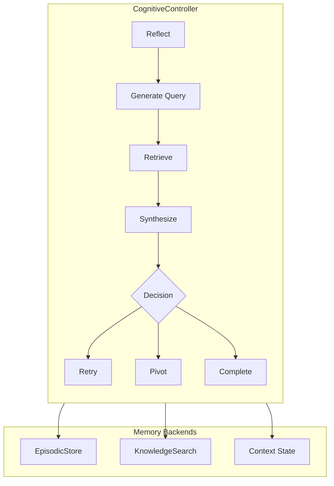

## Overview

The Cognitive Memory system enables Kapso to learn from past experiments and provide contextual briefings. It addresses "context stuffing" by intelligently managing what information gets passed to the agent.

## Architecture



| Component | Backend | Purpose |
|-----------|---------|---------|
| **EpisodicStore** | Weaviate | Stores learned insights from past experiments |
| **KnowledgeSearch** | Neo4j + Weaviate | Retrieves domain knowledge and code patterns |
| **Context State** | In-memory | Tracks current goal, iteration, and working memory |

## Components

### EpisodicStore

Stores learned insights from past experiments.

- **Primary**: Weaviate vector database for semantic search
- **Fallback**: JSON file for persistence without Weaviate
- **Features**: Duplicate detection, confidence filtering, automatic pruning

### CognitiveController

Orchestrates the memory system.

- **Briefing Generation**: Creates context packets for agents
- **Insight Extraction**: Uses LLM to generalize rules from errors
- **State Management**: Persists working memory
- **Decision Making**: RETRY, PIVOT, or COMPLETE

## Usage

### Basic Usage

```python
from src.memory import CognitiveController, Goal
from src.knowledge.search import KnowledgeSearchFactory

# Initialize with KG search
kg = KnowledgeSearchFactory.create("kg_graph_search")
controller = CognitiveController(knowledge_search=kg)

# Initialize goal
goal = Goal.from_string("Fine-tune LLaMA with LoRA")
controller.initialize_goal(goal)

# Get briefing for agent
briefing = controller.prepare_briefing()
print(briefing.to_string())

# Process experiment result
action, meta = controller.process_result(
    success=False,
    error_message="CUDA OOM: reduce batch size",
    score=0.3,
    feedback="Out of memory error"
)
# Returns: action="retry", meta={"reasoning": "..."}

# Clean up
controller.close()
```

### Via Custom Integration

The CognitiveController can be used directly in custom implementations:

```python
from src.memory import CognitiveController

controller = CognitiveController(
    knowledge_search=kg,
    episodic_store_path=".memory_store.json"
)
```

## Data Types

### Insight

A learned rule with confidence and source tracking:

```python
@dataclass
class Insight:
    text: str           # The insight content
    confidence: float   # 0.0 to 1.0
    source: str         # Where it came from
    created_at: str     # Timestamp
```

### Briefing

Synthesized context packet for the agent:

```python
@dataclass
class Briefing:
    goal: str
    workflow: str       # From KG (if available)
    heuristics: List[str]
    code_patterns: List[str]
    episodic_insights: List[Insight]

    def to_string(self) -> str:
        # Format for prompt injection
```

### Goal

Parsed goal with type classification:

```python
@dataclass
class Goal:
    text: str
    goal_type: str      # "ml", "data", "web", etc.

    @classmethod
    def from_string(cls, text: str) -> "Goal":
        # Parse and classify
```

## Configuration

### Default Config

```yaml
defaults:
  episodic:
    embedding_model: "text-embedding-3-small"
    retrieval_top_k: 5
    min_confidence: 0.5
    max_insights: 1000

  controller:
    llm_model: "gpt-4o-mini"
    fallback_models: ["gpt-4.1-mini"]
    max_error_length: 1000

  insight_extraction:
    enabled: true
    max_insight_length: 500
    default_confidence: 0.8

  briefing:
    max_episodic_insights: 5
```

### Presets

| Preset | Use Case |
|--------|----------|
| `minimal` | Resource-constrained (100 insights) |
| `high_quality` | Better accuracy (large embeddings) |
| `local` | Local development (localhost) |
| `docker` | Docker deployment |

```python
from src.memory.config import CognitiveMemoryConfig

config = CognitiveMemoryConfig.load(preset="high_quality")
controller = CognitiveController(config=config)
```

## Insight Extraction

When an experiment fails, insights are extracted:

```python
# Error: "CUDA OOM when batch_size=32"
# Extracted insight: "For GPU memory issues, reduce batch size below 32"

controller.process_result(
    success=False,
    error_message="CUDA OOM when batch_size=32",
    score=0.0,
)
# Insight stored in EpisodicStore
```

## Decision Making

After processing results, the controller decides:

| Decision | Meaning |
|----------|---------|
| `retry` | Try again with modifications |
| `pivot` | Change approach significantly |
| `complete` | Task is done |

```python
action, meta = controller.process_result(
    success=True,
    score=0.95,
)
# action = "complete" if score meets threshold
```

## Integration

### With Custom Context Manager

The CognitiveController can be integrated into custom context managers:

```python
class CustomContextManager(ContextManager):
    def __init__(self, ..., knowledge_search):
        self.controller = CognitiveController(knowledge_search=knowledge_search)

    def get_context(self, budget_progress):
        briefing = self.controller.prepare_briefing()
        return ContextData(
            problem=self.problem_handler.get_problem_context(),
            additional_info=briefing.to_string(),
            kg_results=briefing.workflow,
        )

    def should_stop(self):
        return self.controller.last_decision == "complete"
```

## Environment Variables

Override settings via environment:

```bash
export COGNITIVE_MEMORY_CONTROLLER_LLM_MODEL=gpt-4-turbo
export COGNITIVE_MEMORY_EPISODIC_EMBEDDING_MODEL=text-embedding-3-large
```

## Switching Modes

The cognitive system components (CognitiveController, EpisodicStore) can be used directly:

```python
from src.memory import CognitiveController

controller = CognitiveController(knowledge_search=kg)
controller.initialize_goal(goal)
briefing = controller.prepare_briefing()
```

