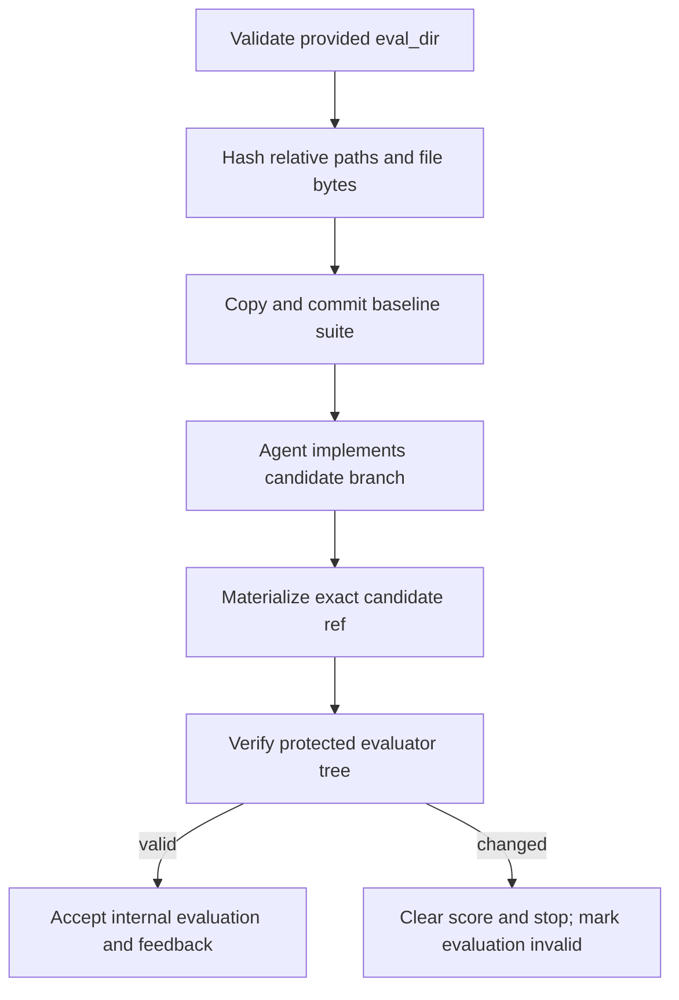

When `eval_dir` is supplied, Kapso treats its files as caller-owned scoring
rules. Candidate branches may run those rules and create runtime outputs, but
they may not modify, delete, replace, or extend the evaluator source.

This boundary prevents an implementation agent from earning a winning score by
weakening the evaluation it is supposed to satisfy.

## Provenance

Every `SearchNode` records one of two values:

- `provided`: the caller passed `eval_dir`; its files are protected.
- `agent_generated`: no suite was supplied, so the agent may build evaluation
  code in `kapso_evaluation/` as before.

The same provenance, validity, and integrity error are stored in experiment
history and resumable checkpoints.

## Provided suite lifecycle

```python
solution = kapso.evolve(
    goal="Improve the support agent",
    output_path="./campaign",
    eval_dir="./evaluation",
    max_iterations=3,
)
```

Kapso validates and fingerprints `eval_dir` before resolving an initial
repository or initializing the experiment workspace. The directory must exist,
contain at least one file, and contain no symlinks.



Verification happens against the finalized candidate Git ref in a temporary
detached worktree. The root workspace checkout is not changed.

## Protected and allowed files

Every file present in the original suite is protected by its relative path and
SHA-256 content hash. Missing or changed files invalidate the candidate.

New evaluator source or configuration is also rejected. This includes common
code and config suffixes such as `.py`, `.sh`, `.js`, `.ts`, `.yaml`, and
`.toml`, plus new executable files without a recognized suffix.

New runtime artifacts are allowed. For example, a provided evaluator can write:

- `result.json`;
- logs, coverage output, and reports;
- caches and compiled bytecode;
- model predictions or other data artifacts.

If a runtime artifact is itself executable evaluator source, write it outside
`kapso_evaluation/` or include it in the original provided suite.

## Rejection semantics

When verification fails, Kapso sets:

```python
node.evaluation_provenance = "provided"
node.evaluation_valid = False
node.evaluation_integrity_error = "Provided evaluation integrity check failed (...)"
node.score = None
node.should_stop = False
```

Feedback generation or benchmark scoring is skipped for that candidate. Invalid
nodes are excluded from:

- generic and tree-search best-candidate selection;
- parent selection based on sorted experiment history;
- top-experiment queries;
- semantic experiment indexing;
- final best-branch checkout.

Recent-history tools can still report the attempt as `INVALID EVALUATION`, so a
later iteration knows not to repeat the same mistake. `SolutionResult.metadata`
includes `invalid_evaluations`, and its experiment logs label the node as
rejected.

## Resume behavior

The provided-suite fingerprint is part of strict run compatibility. Resume
requires the same `eval_dir` contents and restores the protected manifest from
the checkpoint:

```python
solution = kapso.evolve(
    goal="Improve the support agent",
    output_path="./campaign",
    eval_dir="./evaluation",
    resume=True,
    max_iterations=1,
)
```

Omitting `eval_dir`, changing a protected source file, or selecting another
suite produces an incompatible-checkpoint error before candidate work begins.

## Security boundary and limitations

This mechanism verifies the finalized candidate tree. It does not prove that an
agent actually ran the evaluator, prevent it from fabricating a runtime output,
or detect a file that was modified temporarily and restored before the branch
was finalized. The coding agent is not a security sandbox.

For high-stakes scoring, run the evaluator through
`iteration_evaluator` or another caller-owned process against the materialized
candidate ref. Keep true holdout values observational and out of agent-facing
feedback. See [External Iteration Evaluation](/docs/evolve/external-evaluation)
for that isolated callback boundary.
