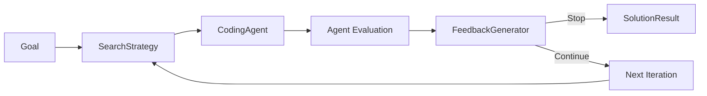
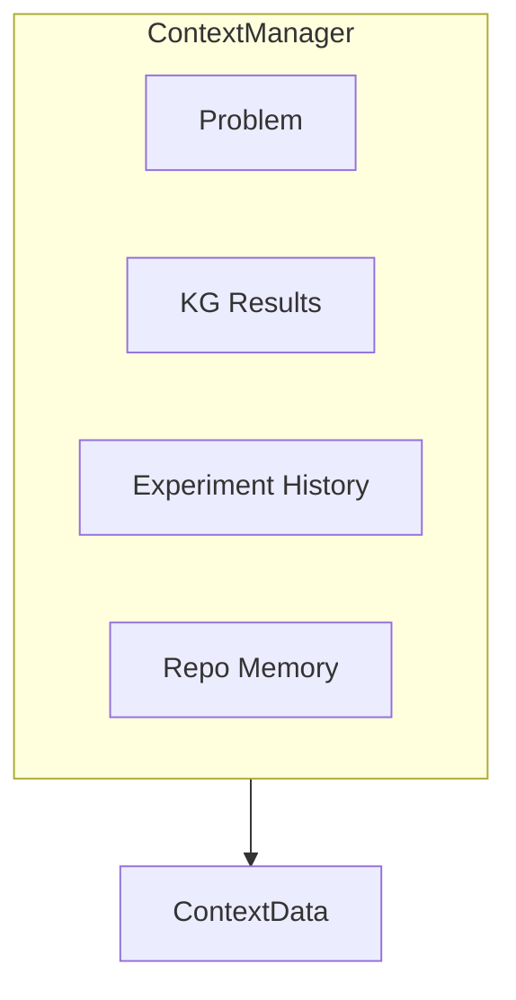

## The Big Picture

When you call `kapso.evolve()`, the **OrchestratorAgent** runs an experiment loop that generates, tests, and refines solutions until the feedback generator decides the goal is achieved.



## Step by Step

### Step 1: Initialize Components

When `evolve()` is called, **Kapso** creates the execution stack:

```python
solution = kapso.evolve(
    goal="Build a classifier with 95% accuracy",
    eval_dir="./evaluation/",  # Optional: user-provided evaluation
    data_dir="./data/",        # Optional: user-provided data
    max_iterations=10,
)
```

| Component | Module | Role |
|-----------|--------|------|
| **ProblemHandler** | `src.environment.handlers` | Wraps goal and problem context |
| **OrchestratorAgent** | `src.execution.orchestrator` | Runs the solve loop |
| **SearchStrategy** | `src.execution.search_strategies` | Generates and selects solutions |
| **ExperimentWorkspace** | `src.execution.experiment_workspace` | Manages Git branches |
| **CodingAgent** | `src.execution.coding_agents` | Writes code and runs evaluation |
| **FeedbackGenerator** | `src.execution.feedback_generator` | Validates results and decides stop |
| **KnowledgeSearch** | `src.knowledge.search` | Retrieves KG context |

### Step 2: Gather Context

The **ContextManager** assembles information for the coding agent:



```python
@dataclass
class ContextData:
    problem: str           # Problem description
    additional_info: str   # Workflow guidance
    kg_results: str        # Knowledge graph context
    kg_code_results: str   # Code examples from KG
    experiment_history: str # Past experiments
```

### Step 3: The Solve Loop

**OrchestratorAgent.solve()** runs the main loop:

```python
def solve(self, experiment_max_iter, time_budget_minutes, cost_budget):
    for i in range(experiment_max_iter):
        # Calculate budget progress (0-100%)
        budget_progress = max(time_pct, iter_pct, cost_pct) * 100

        # Get enriched context
        context = self.context_manager.get_context(budget_progress)

        # Run one search iteration (includes feedback generation)
        node = self.search_strategy.run(context, budget_progress)

        # Check if feedback generator decided to stop
        if node and node.should_stop:
            print("[Orchestrator] Stopping: Goal achieved")
            break

        # Log progress
        print(f"Experiment {i+1} completed with cost: ${self.get_cumulative_cost():.3f}")

    return self.search_strategy.get_best_experiment()
```

### Step 4: Generate Solution Ideas

**SearchStrategy** generates solution candidates:

**LinearSearch** — One idea per iteration:
```python
def run(self, context, budget_progress):
    solution = self.llm.generate(f"Solve: {context.problem}")
    self._implement_n_debug(solution, context, branch_name)
```

**LlmSteeredTreeSearch** — Tree-based exploration:
```python
def run(self, context, budget_progress):
    if budget_progress >= 20:
        self.prune_bad_solutions(context)  # Remove dead ends
    
    self.expand(context, budget_progress)   # Generate children
    best_nodes = self.select(context, top_k=experiments_count)
    
    # Run experiments in parallel
    with ThreadPoolExecutor() as executor:
        for node in best_nodes:
            executor.submit(self._run_for_node, node, context)
```

### Step 5: Write Code and Run Evaluation

**ExperimentSession** coordinates code generation:

```python
def implement_solution(self, solution, context, session):
    # Build prompt with RepoMemory context
    repo_memory_brief = RepoMemoryManager.render_summary_and_toc(
        repo_root=session.session_folder
    )

    prompt = render_prompt(template, {
        "problem": context.problem,
        "solution": solution,
        "repo_memory_brief": repo_memory_brief,
        "kg_code_results": context.kg_code_results,
    })

    # Agent implements solution AND runs evaluation
    # Returns structured JSON with results
    session.generate_code(prompt)
    
    # Extract results from agent's structured JSON output
    return self._extract_agent_result(session.output)
```

The developer agent is responsible for:
1. Implementing the solution code
2. Building evaluation in `kapso_evaluation/`
3. Running the evaluation
4. Returning structured JSON with results

Each experiment gets its own **Git branch** via `ExperimentWorkspace`:

```
main
├── kapso/exp-001  (Score: 0.87)
├── kapso/exp-002  (Score: 0.91)
└── kapso/exp-003  (Score: 0.96, best)
```

### Step 6: Agent Returns Structured JSON

The developer agent returns a structured JSON with evaluation results:

```json
{
    "code_changes_summary": "Implemented random forest classifier with GridSearchCV",
    "evaluation_script_path": "kapso_evaluation/evaluate.py",
    "evaluation_output": "Loading data...\nTraining model...\nAccuracy: 0.95\nAll tests passed."
}
```

This JSON is extracted from the agent's output and used by the feedback generator.

### Step 7: Feedback Generation

The **FeedbackGenerator** validates the evaluation and decides whether to continue:

```python
class FeedbackGenerator:
    def generate(self, goal, idea, implementation, evaluation_result):
        # Use coding agent to analyze results
        feedback_result = self.agent.analyze(
            goal=goal,
            idea=idea,
            implementation=implementation,
            evaluation_result=evaluation_result,
        )
        
        return FeedbackResult(
            stop=feedback_result.goal_achieved,
            evaluation_valid=feedback_result.is_valid,
            feedback=feedback_result.suggestions,
            score=feedback_result.extracted_score,
        )
```

The feedback generator:
1. **Validates evaluation**: Checks if the agent-built evaluation is fair and correct
2. **Extracts score**: Parses the evaluation output to get numeric scores
3. **Checks goal**: Determines if the goal has been achieved
4. **Generates feedback**: Provides actionable suggestions for the next iteration

### Step 8: Check Feedback Result

The search strategy checks the feedback result:

```python
if feedback_result.stop:
    node.should_stop = True
    return node  # Goal achieved, stop iteration

# Continue with feedback for next iteration
node.feedback = feedback_result.feedback
```

### Step 9: Return Result

When the loop ends, **Kapso** returns the best solution:

```python
# Checkout to best solution branch
orchestrator.search_strategy.checkout_to_best_experiment_branch()

# Create result
solution = SolutionResult(
    goal=goal,
    code_path=workspace_path,
    experiment_logs=experiment_logs,
    final_feedback=final_feedback,  # FeedbackResult from last iteration
    metadata={
        "cost": f"${cost:.3f}",
        "iterations": iteration_count,
    }
)

# Check if goal was achieved
if solution.succeeded:
    print(f"Goal achieved with score: {solution.final_score}")
```

---

## Budget Tracking

**OrchestratorAgent** tracks three budgets:

```python
budget_progress = max(
    elapsed_time / time_budget,
    iteration / max_iterations,
    cumulative_cost / cost_budget
) * 100
```

| Budget | Tracked By | Stops When |
|--------|------------|------------|
| **Time** | `time.time()` | Wall-clock limit reached |
| **Iterations** | Loop counter | Max experiments reached |
| **Cost** | `get_cumulative_cost()` | API costs exceed limit |

The loop stops when **any** budget hits 100% OR the stop condition is met.

---

## Error Handling

Errors are captured in **SearchNode**:

```python
@dataclass
class SearchNode:
    node_id: int
    solution: str = ""
    branch_name: str = ""
    code_changes_summary: str = ""
    evaluation_script_path: str = ""
    evaluation_output: str = ""
    feedback: str = ""
    score: Optional[float] = None
    should_stop: bool = False
    evaluation_valid: bool = True
    had_error: bool = False
    error_message: str = ""
```

The debug prompt includes error context:

```python
def debug_solution(self, solution, context, error, session):
    prompt = render_prompt(debug_template, {
        "problem": context.problem,
        "solution": solution,
        "error_details": error,
    })
    session.generate_code(prompt, debug_mode=True)
```

---

## Next Steps

<CardGroup cols={2}>
  <Card title="Search Strategies" icon="sitemap" href="/docs/evolve/search-strategies">
    Linear vs Tree search in detail
  </Card>
  <Card title="Orchestrator" icon="gears" href="/docs/evolve/orchestrator">
    Deep dive into OrchestratorAgent
  </Card>
  <Card title="Feedback Generator" icon="comments" href="/docs/evolve/feedback-generator">
    How evaluation is validated
  </Card>
  <Card title="Coding Agents" icon="code" href="/docs/evolve/coding-agents">
    Pluggable code generators
  </Card>
</CardGroup>
