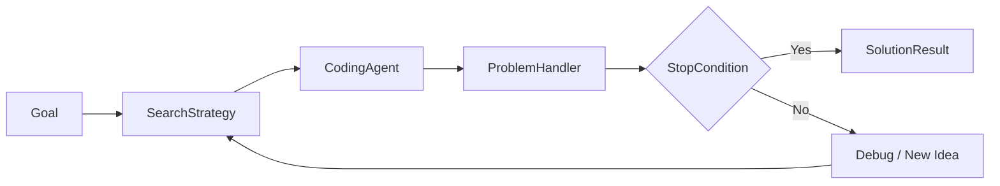
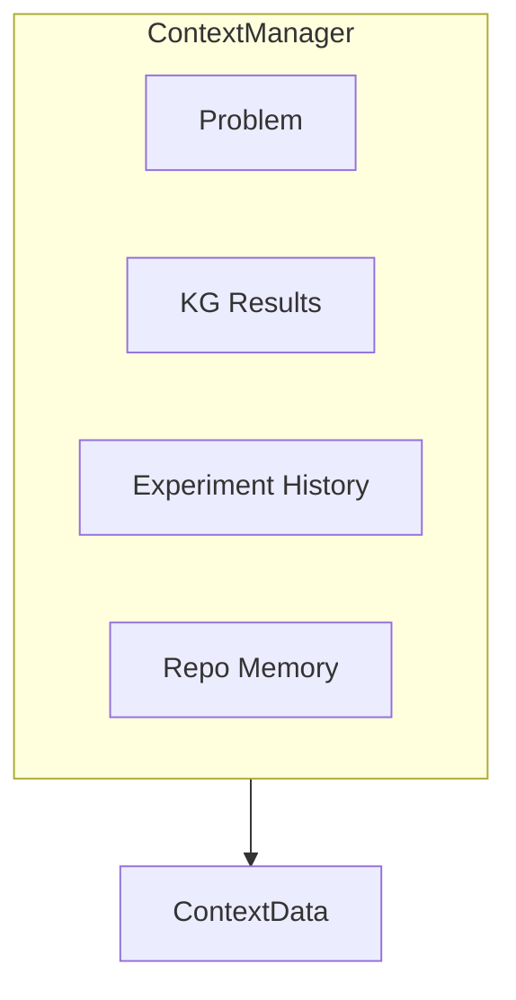

## The Big Picture

When you call `kapso.evolve()`, the **OrchestratorAgent** runs an experiment loop that generates, tests, and refines solutions until one meets your criteria.



## Step by Step

### Step 1: Initialize Components

When `evolve()` is called, **Kapso** creates the execution stack:

```python
solution = kapso.evolve(
    goal="Build a classifier with 95% accuracy",
    evaluator="regex_pattern",
    evaluator_params={"pattern": r"Accuracy: ([\d.]+)"},
    stop_condition="threshold",
    stop_condition_params={"threshold": 0.95},
)
```

| Component | Module | Role |
|-----------|--------|------|
| **ProblemHandler** | `src.environment.handlers` | Wraps goal + evaluator + stop condition |
| **OrchestratorAgent** | `src.execution.orchestrator` | Runs the solve loop |
| **SearchStrategy** | `src.execution.search_strategies` | Generates and selects solutions |
| **ExperimentWorkspace** | `src.execution.experiment_workspace` | Manages Git branches |
| **CodingAgent** | `src.execution.coding_agents` | Writes code (Aider, Claude, etc.) |
| **KnowledgeSearch** | `src.knowledge.search` | Retrieves KG context |

### Step 2: Gather Context

The **ContextManager** assembles information for the coding agent:



```python
@dataclass
class ContextData:
    problem: str           # Problem description
    additional_info: str   # Workflow guidance
    kg_results: str        # Knowledge graph context
    kg_code_results: str   # Code examples from KG
    experiment_history: str # Past experiments
```

### Step 3: The Solve Loop

**OrchestratorAgent.solve()** runs the main loop:

```python
def solve(self, experiment_max_iter, time_budget_minutes, cost_budget):
    for i in range(experiment_max_iter):
        # Calculate budget progress (0-100%)
        budget_progress = max(time_pct, iter_pct, cost_pct) * 100

        # Check stopping conditions
        if self.problem_handler.stop_condition() or budget_progress >= 100:
            break

        # Get enriched context
        context = self.context_manager.get_context(budget_progress)

        # Run one search iteration
        self.search_strategy.run(context, budget_progress)
```

### Step 4: Generate Solution Ideas

**SearchStrategy** generates solution candidates:

**LinearSearch** — One idea per iteration:
```python
def run(self, context, budget_progress):
    solution = self.llm.generate(f"Solve: {context.problem}")
    self._implement_n_debug(solution, context, branch_name)
```

**LlmSteeredTreeSearch** — Tree-based exploration:
```python
def run(self, context, budget_progress):
    if budget_progress >= 20:
        self.prune_bad_solutions(context)  # Remove dead ends
    
    self.expand(context, budget_progress)   # Generate children
    best_nodes = self.select(context, top_k=experiments_count)
    
    # Run experiments in parallel
    with ThreadPoolExecutor() as executor:
        for node in best_nodes:
            executor.submit(self._run_for_node, node, context)
```

### Step 5: Write Code

**ExperimentSession** coordinates code generation:

```python
def implement_solution(self, solution, context, session):
    # Build prompt with RepoMemory context
    repo_memory_brief = RepoMemoryManager.render_summary_and_toc(
        repo_root=session.session_folder
    )

    prompt = render_prompt(template, {
        "problem": context.problem,
        "solution": solution,
        "repo_memory_brief": repo_memory_brief,
        "kg_code_results": context.kg_code_results,
    })

    session.generate_code(prompt)
    return self.problem_handler.run(session.session_folder)
```

Each experiment gets its own **Git branch** via `ExperimentWorkspace`:

```
main
├── kapso/exp-001  (Score: 0.87)
├── kapso/exp-002  (Score: 0.91)
└── kapso/exp-003  (Score: 0.96, best)
```

### Step 6: Run and Evaluate

**ProblemHandler.run()** executes code and scores it:

```python
class GenericProblemHandler(ProblemHandler):
    def run(self, file_path, solution, debug=False):
        # Execute the code
        output = subprocess.run(
            ["python", self.main_file],
            cwd=file_path,
            capture_output=True
        )

        # Score with configured Evaluator
        eval_result = self.evaluator.evaluate(
            output=output.stdout,
            problem=self.problem_description,
        )

        return ProblemRunResult(
            score=eval_result.score,
            output=output.stdout,
            feedbacks=eval_result.feedback,
        )
```

### Step 7: Debug Loop

If code fails, **_implement_n_debug()** retries:

```python
def _implement_n_debug(self, solution, context, code_debug_tries, branch_name):
    session = self.workspace.create_experiment_session(branch_name)
    result = self.implement_solution(solution, context, session)

    for i in range(code_debug_tries):
        if result.run_had_error and result.continue_debugging:
            result = self.debug_solution(
                solution, context, result.error_details, session
            )
        else:
            break

    # Update RepoMemory with learnings
    session.schedule_repo_memory_update(
        solution_spec=solution, 
        run_result=result
    )
    self.workspace.finalize_session(session)
    return result
```

### Step 8: Check Stop Condition

**StopCondition.check()** determines if we're done:

```python
def stop_condition(self):
    decision = self._stop_condition.check(
        best_score=self.best_score,
        current_score=self.current_score,
        iteration=self.iteration,
    )
    return decision.should_stop
```

| Condition | Module | Triggers When |
|-----------|--------|---------------|
| `threshold` | `builtin.ThresholdStopCondition` | Score >= target |
| `plateau` | `builtin.PlateauStopCondition` | No improvement for N iterations |
| `cost_limit` | `builtin.CostLimitStopCondition` | API cost exceeds budget |
| `composite` | `builtin.CompositeStopCondition` | Any/all conditions met |

### Step 9: Return Result

When the loop ends, **Kapso** returns the best solution:

```python
# Checkout to best solution branch
orchestrator.search_strategy.checkout_to_best_experiment_branch()

# Create result
solution = SolutionResult(
    goal=goal,
    code_path=output_path,
    experiment_logs=experiment_logs,
    metadata={
        "cost": f"${cost:.3f}",
        "iterations": iteration_count,
    }
)
```

---

## Budget Tracking

**OrchestratorAgent** tracks three budgets:

```python
budget_progress = max(
    elapsed_time / time_budget,
    iteration / max_iterations,
    cumulative_cost / cost_budget
) * 100
```

| Budget | Tracked By | Stops When |
|--------|------------|------------|
| **Time** | `time.time()` | Wall-clock limit reached |
| **Iterations** | Loop counter | Max experiments reached |
| **Cost** | `get_cumulative_cost()` | API costs exceed limit |

The loop stops when **any** budget hits 100% OR the stop condition is met.

---

## Error Handling

Errors are captured in **ProblemRunResult**:

```python
@dataclass
class ProblemRunResult:
    score: float = 0
    output: str = ""
    run_had_error: bool = False
    error_message: str = ""
    error_details: str = ""      # Full traceback
    feedbacks: str = ""
    continue_debugging: bool = True  # False if unrecoverable
```

The debug prompt includes error context:

```python
def debug_solution(self, solution, context, error, session):
    prompt = render_prompt(debug_template, {
        "problem": context.problem,
        "solution": solution,
        "error_details": error,
    })
    session.generate_code(prompt, debug_mode=True)
```

---

## Next Steps

<CardGroup cols={2}>
  <Card title="Search Strategies" icon="sitemap" href="/docs/evolve/search-strategies">
    Linear vs Tree search in detail
  </Card>
  <Card title="Orchestrator" icon="gears" href="/docs/evolve/orchestrator">
    Deep dive into OrchestratorAgent
  </Card>
  <Card title="Evaluators" icon="scale-balanced" href="/docs/evolve/evaluators">
    How solutions are scored
  </Card>
  <Card title="Stop Conditions" icon="flag-checkered" href="/docs/evolve/stop-conditions">
    When to stop experimenting
  </Card>
</CardGroup>
