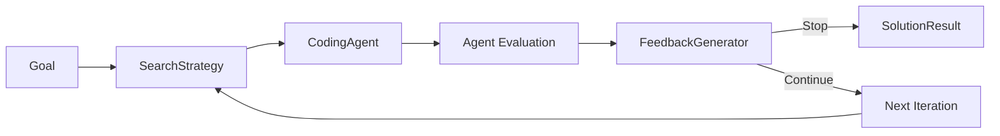

One call to `evolve()` runs a loop: gather context, propose a candidate, implement it on a branch, evaluate it, judge the result, and either continue or stop. This page follows a single pass through it.


```mermaid
flowchart LR
    A[Goal] --> B[SearchStrategy]
    B --> C[CodingAgent]
    C --> D[Agent Evaluation]
    D --> E[FeedbackGenerator]
    E -->|Stop| G[SolutionResult]
    E -->|Continue| F[Next Iteration]
    F --> B
```

## Step by step

### Step 1: Initialize components

When `evolve()` is called, **Kapso** creates the execution stack:

```python
solution = kapso.evolve(
    goal="Build a classifier with 95% accuracy",
    eval_dir="./evaluation/",  # Optional: user-provided evaluation
    data_dir="./data/",        # Optional: user-provided data
    max_iterations=10,
)
```

| Component | Module | Role |
|-----------|--------|------|
| **ProblemHandler** | `kapso.environment.handlers` | Wraps goal and problem context |
| **OrchestratorAgent** | `kapso.execution.orchestrator` | Runs the solve loop |
| **SearchStrategy** | `kapso.execution.search_strategies` | Generates and selects solutions |
| **ExperimentWorkspace** | `kapso.execution.experiment_workspace` | Manages Git branches |
| **CodingAgent** | `kapso.execution.coding_agents` | Writes code and runs evaluation |
| **FeedbackGenerator** | (within search strategy) | Validates results and decides stop |
| **KnowledgeSearch** | `kapso.knowledge_base.search` | Retrieves KG context |

### Step 2: Gather context

The problem handler supplies the problem statement; knowledge search adds graph context. Experiment history and repo memory are **not** packed into the context — the agent pulls them on demand through MCP gates.

```python
@dataclass
class ContextData:
    problem: str           # Problem description
    additional_info: str   # Workflow guidance
    kg_results: str        # Knowledge graph context
    kg_code_results: str   # Code examples from KG
```

### Step 3: The solve loop

**OrchestratorAgent.solve()** runs the main loop: compute budget progress, hand the strategy the problem plus the previous iteration's feedback, run one search iteration, and stop on a judged goal-achieved vote or an exhausted budget. The faithful sketch lives on the [orchestrator page](/docs/evolve/orchestrator#what-happens-in-one-iteration).

### Step 4: Generate solution ideas

**SearchStrategy** generates solution candidates:

The generic strategy picks a parent (see [parent selection](/docs/evolve/parent-selection)), runs ideation against the MCP gates, and carries the chosen solution into implementation:

```python
# One generic-search iteration, simplified
parent = select_parent()                       # best valid candidate, or main
solution = generate_solution(context, parent)  # ideation with MCP gates
node = run_implementation(solution, parent)    # Step 5
feedback = generate_feedback(node)             # Step 7
```

### Step 5: Write code and run evaluation

**ExperimentSession** coordinates code generation:

```python
# run_implementation, simplified
doc = RepoMemoryManager.ensure_exists_in_worktree(session.session_folder)
repo_memory_brief = RepoMemoryManager.render_summary_and_toc(doc, max_chars=3000)

prompt = render_prompt(template, {
    "problem": context.problem,
    "solution": solution,
    "repo_memory_brief": repo_memory_brief,
    "kg_code_results": context.kg_code_results,
})

# Agent implements the solution AND runs evaluation, then ends
# its session with XML result tags
output = session.generate_code(prompt, timeout_seconds=deadline)
result = extract_agent_result(output)   # parses the tags
```

The coding agent is responsible for:
1. Implementing the solution code
2. Building evaluation in `kapso_evaluation/`
3. Running the evaluation
4. Ending its response with the XML result tags

When the caller supplies `eval_dir`, step 2 changes: the agent must run the
provided evaluation without changing its source. Kapso fingerprints the suite
and verifies the finalized candidate ref before accepting its score. See
[Evaluation Integrity](/docs/evolve/evaluation-integrity).

Each experiment gets its own **Git branch** via `ExperimentWorkspace`:

```text
main
├── generic_exp_0  (Score: 0.87)
├── generic_exp_1  (Score: 0.91)
└── generic_exp_2  (Score: 0.96, best)
```

### Step 6: Agent returns XML result tags

The coding agent ends its response with XML tags:

```xml
<code_changes_summary>Implemented random forest classifier with GridSearchCV</code_changes_summary>
<evaluation_script_path>kapso_evaluation/evaluate.py</evaluation_script_path>
<evaluation_output>Loading data...
Training model...
Accuracy: 0.95
All tests passed.</evaluation_output>
<score>0.95</score>
<technical_difficulties>none</technical_difficulties>
```

The tags are extracted from the agent's output and handed to the feedback generator.

### Step 7: Feedback generation

The **[feedback generator](/docs/evolve/feedback-generator)** reads the diff and the session's tags, validates the evaluation, extracts the score, checks the goal, and writes the next iteration's feedback — returning a `FeedbackResult` with `stop`, `evaluation_valid`, `feedback` and `score`.

### Step 8: Check feedback result

The search strategy checks the feedback result:

```python
if feedback_result.stop:
    node.should_stop = True
    return node  # Goal achieved, stop iteration

# Continue with feedback for next iteration
node.feedback = feedback_result.feedback
```

### Step 9: Optional external evaluation

When `iteration_evaluator` is configured, Kapso evaluates every candidate
finalized by the strategy before writing experiment history or a run
checkpoint. Each candidate ref is materialized in a temporary detached
worktree. Returned metrics are stored on `node.metrics` and remain
observational: `node.score` still controls search and best-branch selection.

See [External Iteration Evaluation](/docs/evolve/external-evaluation) for the
callback contract, isolation model, and failure policies.

### Step 10: Return result

When the loop ends, **Kapso** returns the best solution:

```python
# Checkout to best solution branch
best_branch = orchestrator.search_strategy.checkout_to_best_experiment_branch()

# Create result
solution = SolutionResult(
    goal=goal,
    code_path=workspace_path,
    experiment_logs=experiment_logs,
    final_feedback=final_feedback,  # FeedbackResult from last iteration
    metadata={
        "cost": f"${cost:.3f}",
        "iterations": iteration_count,
        "cumulative_iterations": cumulative_iteration_count,
        "best_branch": best_branch,
    }
)

# Check if goal was achieved
if solution.succeeded:
    print(f"Goal achieved with score: {solution.final_score}")
```

---

## How is the budget tracked?

Budget progress is the maximum of the time, iteration and cost dials; the loop stops when any of them reaches 100% or the judge's stop vote is honored. The formula and dials are on the [orchestrator page](/docs/evolve/orchestrator#how-is-the-budget-tracked).

---

## What happens when a step fails?

Errors are captured in **SearchNode**:

```python
@dataclass
class SearchNode:
    node_id: int
    solution: str = ""
    branch_name: str = ""
    code_changes_summary: str = ""
    evaluation_script_path: str = ""
    evaluation_output: str = ""
    feedback: str = ""
    score: Optional[float] = None
    should_stop: bool = False
    evaluation_valid: bool = True
    had_error: bool = False
    error_message: str = ""
```

There is no in-iteration debug loop: an error lands in the node's tags and the judge's verdict, and the next iteration's prompt opens with that feedback.

---

## Related

<CardGroup cols={2}>
  <Card title="Search Strategies" icon="sitemap" href="/docs/evolve/search-strategies">
    The generic strategy in detail
  </Card>
  <Card title="Orchestrator" icon="gears" href="/docs/evolve/orchestrator">
    Deep dive into OrchestratorAgent
  </Card>
  <Card title="Feedback Generator" icon="comments" href="/docs/evolve/feedback-generator">
    How evaluation is validated
  </Card>
  <Card title="Coding Agents" icon="code" href="/docs/evolve/coding-agents">
    Pluggable code generators
  </Card>
</CardGroup>
