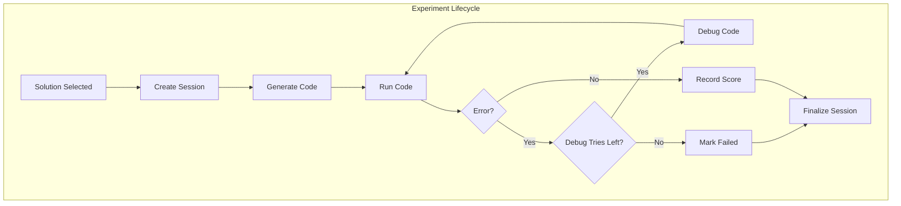
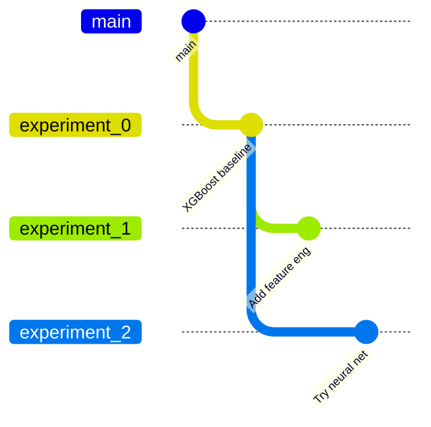

## Overview

Each experiment follows a lifecycle from solution selection through code generation, execution, and optional debugging.



## Git Branch Model

Each experiment runs in its own git branch, inheriting code from its parent experiment.



This enables:
- **Isolation**: Each experiment starts from a clean parent state
- **Inheritance**: Child experiments build on parent solutions
- **Versioning**: All code changes are tracked

## Experiment Session

The `ExperimentSession` manages a single experiment:

```python
class ExperimentSession:
    def __init__(self, main_repo, session_folder, coding_agent_config, 
                 parent_branch_name, branch_name):
        # Clone repo to isolated folder
        self.repo = git.Repo.clone_from(main_repo, session_folder)
        
        # Checkout parent branch (inherit code)
        self.repo.git.checkout(parent_branch_name)
        
        # Create new experiment branch
        self.repo.git.checkout('-b', branch_name)
        
        # Initialize coding agent
        self.coding_agent = CodingAgentFactory.create(coding_agent_config)
```

## Implementation Flow

### 1. Implement Solution

```python
def implement_solution(self, solution, context, session):
    prompt = f"""
    Implement <solution> for <problem>.
    
    <problem>{context.problem}</problem>
    <solution>{solution}</solution>
    <knowledge>{context.kg_code_results}</knowledge>
    
    Requirements:
    - Write clean, functional code
    - Output in Experiment Output Data Directory: ./output_data_{branch}
    """
    
    session.generate_code(prompt)
    return self.problem_handler.run(session.session_folder)
```

### 2. Debug Loop

If the code fails, the debug loop attempts to fix it:

```python
def _implement_n_debug(self, solution, context, code_debug_tries, branch_name):
    session = self.workspace.create_experiment_session(branch_name, parent_branch)
    result = self.implement_solution(solution, context, session)
    
    for i in range(code_debug_tries):
        if result.run_had_error and result.continue_debugging:
            result = self.debug_solution(solution, context, result.error_details, session)
        else:
            break
    
    self.workspace.finalize_session(session)
    return result
```

### 3. Debug Solution

```python
def debug_solution(self, solution, context, error, session):
    prompt = f"""
    Debug the implementation.
    
    <problem>{context.problem}</problem>
    <solution>{solution}</solution>
    <error>{error}</error>
    
    Requirements:
    - Fix errors directly, no try/except workarounds
    - Don't change solution logic
    """
    
    session.generate_code(prompt, debug_mode=True)
    return self.problem_handler.run(session.session_folder)
```

## Result Structure

```python
@dataclass
class ExperimentResult:
    node_id: int          # Tree node ID
    solution: str         # Solution description
    score: float          # Evaluation score
    branch_name: str      # Git branch
    had_error: bool       # Whether it failed
    error_message: str    # Error details
    output: str           # Execution output
    feedbacks: str        # Analysis feedback
```

## Session Finalization

After an experiment completes:

1. **Commit changes** to the experiment branch
2. **Push to origin** (available for child experiments)
3. **Record cost** from coding agent
4. **Cleanup** session folder

```python
def finalize_session(self, session):
    cost = session.get_cumulative_cost()
    self.previous_sessions_cost += cost
    session.close_session()  # commit, push, cleanup
```

