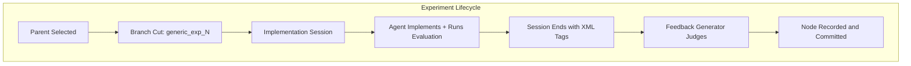
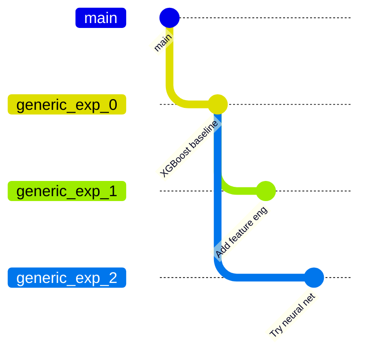

Every experiment follows the same path: a parent is chosen, a branch is cut, a coding agent implements the candidate and runs its evaluation in one session, and the judged result is committed — so the whole search stays inspectable afterwards.


```mermaid
flowchart TB
    subgraph Lifecycle["Experiment Lifecycle"]
        A[Parent Selected] --> B[Branch Cut: generic_exp_N]
        B --> C[Implementation Session]
        C --> D[Agent Implements + Runs Evaluation]
        D --> E[Session Ends with XML Tags]
        E --> F[Feedback Generator Judges]
        F --> G[Node Recorded and Committed]
    end
```

There is no separate debug loop: a failed evaluation surfaces in the session's tags, the judge marks the evaluation invalid or writes corrective feedback, and the **next** iteration addresses it.

## Git branch model

Each experiment runs in its own git branch, inheriting code from its parent experiment.


```mermaid
gitGraph
    commit id: "main"
    branch generic_exp_0
    commit id: "XGBoost baseline"
    branch generic_exp_1
    commit id: "Add feature eng"
    checkout generic_exp_0
    branch generic_exp_2
    commit id: "Try neural net"
```

This enables:
- **Isolation**: Each experiment starts from a clean parent state
- **Inheritance**: Child experiments build on parent solutions
- **Versioning**: All code changes are tracked

## Experiment session

The `ExperimentSession` manages a single experiment:

```python
class ExperimentSession:
    def __init__(self, main_repo, session_folder, coding_agent_config, 
                 parent_branch_name, branch_name):
        # Clone repo to isolated folder
        self.repo = git.Repo.clone_from(main_repo, session_folder)
        
        # Checkout parent branch (inherit code)
        self.repo.git.checkout(parent_branch_name)
        
        # Create new experiment branch
        self.repo.git.checkout('-b', branch_name)
        
        # Initialize coding agent
        self.coding_agent = CodingAgentFactory.create(coding_agent_config)
```

## Implementation flow

One session does the whole build. `run_implementation` renders the implementation prompt — the problem, the chosen solution, the knowledge context and the [repo memory](/docs/evolve/repo-memory) — and hands it to the coding agent with the budget's deadline:

```python
# In the generic strategy
branch_name = f"generic_exp_{node.node_id}"
session = workspace.create_experiment_session(branch_name, parent.branch_name)

node = run_implementation(solution, context, session)   # agent implements,
                                                        # builds and runs
                                                        # kapso_evaluation/,
                                                        # ends with XML tags

feedback = generate_feedback(node)                      # judge validates and
                                                        # decides stop/continue
```

The agent is responsible for running the evaluation itself and reporting the result in its closing tags (`<code_changes_summary>`, `<evaluation_script_path>`, `<evaluation_output>`, `<score>`, `<technical_difficulties>`). Errors are not retried inside the iteration; they become feedback for the next one.

## Result structure

Each experiment is recorded as a `SearchNode` — solution, branch, evaluation tags, judged feedback and score. The full field list is on the [search strategies page](/docs/evolve/search-strategies#node-structure-searchnode).

## Session finalization

After an experiment completes:

1. **Commit changes** to the experiment branch
2. **Push to origin** (available for child experiments)
3. **Record cost** from coding agent
4. **Cleanup** session folder

```python
def finalize_session(self, session):
    cost = session.get_cumulative_cost()
    self.previous_sessions_cost += cost
    session.close_session()  # commit, push, cleanup
```

## Related

<CardGroup cols={2}>
  <Card title="Execution flow" icon="diagram-project" href="/docs/evolve/execution-flow">
    The loop around one experiment
  </Card>
  <Card title="Coding agents" icon="robot" href="/docs/evolve/coding-agents">
    Who writes the code
  </Card>
</CardGroup>

Related pages: [Execution flow](/docs/evolve/execution-flow) · [Coding agents](/docs/evolve/coding-agents) · [Orchestrator](/docs/evolve/orchestrator)

Kapso is an open-source framework by [Leeroo](https://leeroo.com) that builds software toward measurable goals through experiment campaigns. Source code: [github.com/Leeroo-AI/kapso](https://github.com/Leeroo-AI/kapso) · Install: `pip install leeroo-kapso` · Every page as plain text: [llms.txt](https://docs.leeroo.com/llms.txt).
