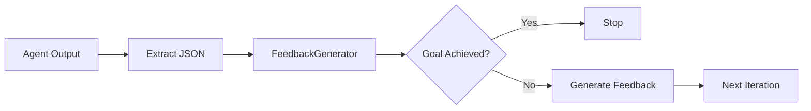

## Overview

The Feedback Generator is an LLM-based component that validates evaluation results and decides whether to continue or stop the experimentation loop. It replaces the traditional evaluator and stop condition components with a more flexible, intelligent approach.

## How It Works



After the developer agent implements a solution and runs evaluation, the feedback generator:

1. **Validates the evaluation**: Checks if the agent-built evaluation is fair and correct
2. **Extracts the score**: Parses evaluation output to get numeric scores
3. **Checks goal completion**: Determines if the goal has been achieved
4. **Generates feedback**: Provides actionable suggestions for the next iteration

## FeedbackResult

The feedback generator returns a `FeedbackResult`:

```python
@dataclass
class FeedbackResult:
    stop: bool                      # Whether to stop iteration
    evaluation_valid: bool          # Whether evaluation is fair/correct
    feedback: str                   # Actionable feedback for next iteration
    score: Optional[float] = None   # Extracted evaluation score
```

## Responsibilities

### 1. Validate Evaluation

The feedback generator checks if the agent-built evaluation is fair and correct:

- Does the evaluation actually test the goal criteria?
- Is the evaluation not trivially passing (e.g., `print("SCORE: 1.0")`)?
- Are the metrics appropriate for the problem?

If the evaluation is invalid, the feedback generator sets `evaluation_valid=False` and provides feedback to fix the evaluation.

### 2. Check Goal Completion

The feedback generator determines if the goal has been achieved by:

- Parsing the evaluation output for success criteria
- Comparing scores against thresholds mentioned in the goal
- Understanding semantic success (e.g., "all tests passed")

### 3. Extract Score

The feedback generator parses the evaluation output to extract numeric scores:

```python
# Example evaluation output
"Training complete. Accuracy: 0.95, F1: 0.92"

# Extracted score
score = 0.95  # Primary metric
```

### 4. Generate Feedback

If the goal is not achieved, the feedback generator provides actionable suggestions:

```python
feedback = """
Current accuracy is 0.85, target is 0.9.
Suggestions:
1. Try increasing the number of estimators in the random forest
2. Consider feature engineering to improve signal
3. Check for class imbalance and apply SMOTE if needed
"""
```

## Usage

### Automatic (via evolve)

The feedback generator is automatically used when you call `kapso.evolve()`:

```python
solution = kapso.evolve(
    goal="Build a classifier with accuracy > 0.9",
    max_iterations=10,
)

# Check if goal was achieved
if solution.succeeded:
    print(f"Goal achieved with score: {solution.final_score}")
else:
    print(f"Final feedback: {solution.final_feedback.feedback}")
```

### Direct Usage

```python
from src.execution.feedback_generator import FeedbackGenerator, FeedbackResult

# Create feedback generator (uses claude_code by default)
feedback_gen = FeedbackGenerator()

# Generate feedback
result = feedback_gen.generate(
    goal="Build a classifier with accuracy > 0.9",
    idea="Use random forest with hyperparameter tuning",
    implementation="...",  # Code diff
    evaluation_code="...",  # Contents of kapso_evaluation/evaluate.py
    evaluation_result={
        "output": "Accuracy: 0.85",
        "score": 0.85,
    },
)

if result.stop:
    print("Goal achieved!")
else:
    print(f"Continue with feedback: {result.feedback}")
```

## Configuration

The feedback generator uses a coding agent (default: `claude_code`) with a specialized prompt. You can configure the agent type:

```python
from src.execution.coding_agents.factory import CodingAgentFactory

# Use a different agent for feedback generation
config = CodingAgentFactory.build_config(
    agent_type="gemini",
    model="gemini-2.0-flash",
)

feedback_gen = FeedbackGenerator(coding_agent_config=config)
```

## Integration with Search Strategy

Feedback generation happens within the search strategy, not the orchestrator. This allows:

- **Per-node feedback** in tree search (each node gets its own feedback)
- **Unified flow** where implementation and feedback are tightly coupled
- **Cleaner orchestrator** that just checks `node.should_stop`

```python
# In SearchStrategy.run()
def run(self, context, budget_progress):
    # 1. Generate solution
    solution = self._generate_solution(context)
    
    # 2. Implement and run evaluation
    node = self._implement_n_debug(solution, context, branch_name)
    
    # 3. Generate feedback
    feedback_result = self._generate_feedback(node)
    
    # 4. Update node with feedback
    node.feedback = feedback_result.feedback
    node.score = feedback_result.score
    node.should_stop = feedback_result.stop
    
    return node
```

## Comparison with Legacy Evaluators

| Aspect | Legacy Evaluators | Feedback Generator |
|--------|-------------------|-------------------|
| Configuration | Predefined patterns (regex, JSON) | LLM understands any format |
| Flexibility | Fixed evaluation logic | Adapts to any domain |
| Stop Decision | Separate stop condition | Integrated in feedback |
| Validation | None | Validates evaluation fairness |
| Feedback | Simple score | Actionable suggestions |

## Best Practices

### 1. Include Success Criteria in Goal

The feedback generator works best when the goal includes clear success criteria:

```python
# Good: Clear criteria
goal = "Build a classifier with accuracy > 0.9 and F1 > 0.85"

# Less good: Vague criteria
goal = "Build a good classifier"
```

### 2. Let Agent Build Evaluation

Don't provide `eval_dir` unless you have specific evaluation requirements. The agent builds domain-appropriate evaluation:

```python
# Agent builds evaluation dynamically
solution = kapso.evolve(
    goal="Optimize inference speed to < 10ms per sample",
    max_iterations=10,
)
```

### 3. Trust the Feedback

The feedback generator provides actionable suggestions. The next iteration's developer agent receives this feedback and uses it to improve:

```
Iteration 1: Accuracy 0.75
Feedback: "Try ensemble methods and feature selection"

Iteration 2: Accuracy 0.88
Feedback: "Close to target. Try hyperparameter tuning"

Iteration 3: Accuracy 0.92
Feedback: "Goal achieved! Accuracy 0.92 > 0.9 target"
```

## Next Steps

<CardGroup cols={2}>
  <Card title="Execution Flow" icon="diagram-project" href="/docs/evolve/execution-flow">
    See how feedback fits in the flow
  </Card>
  <Card title="Search Strategies" icon="sitemap" href="/docs/evolve/search-strategies">
    How strategies use feedback
  </Card>
  <Card title="Coding Agents" icon="code" href="/docs/evolve/coding-agents">
    Agents that power feedback generation
  </Card>
  <Card title="API Reference" icon="book" href="/docs/reference/kapso-api">
    Full API documentation
  </Card>
</CardGroup>
