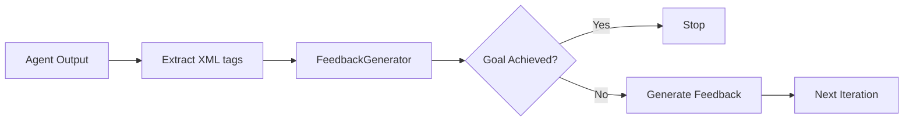

The feedback generator reads an experiment's evaluation output and decides whether the campaign continues. It replaces a fixed score threshold with a judged verdict, so a run stops when the goal is genuinely met rather than when a number crosses a line.

## How does it decide?


```mermaid
flowchart LR
    A[Agent Output] --> B[Extract XML tags]
    B --> C[FeedbackGenerator]
    C --> D{Goal Achieved?}
    D -->|Yes| E[Stop]
    D -->|No| F[Generate Feedback]
    F --> G[Next Iteration]
```

After the coding agent implements a solution and runs evaluation, the feedback generator validates the evaluation, extracts the score, checks goal completion, and generates feedback — each covered in [What does it check?](#what-does-it-check) below.

## FeedbackResult

The feedback generator returns a `FeedbackResult`:

```python
@dataclass
class FeedbackResult:
    stop: bool                      # Whether to stop iteration
    evaluation_valid: bool          # Whether evaluation is fair/correct
    feedback: str                   # Actionable feedback for next iteration
    score: Optional[float] = None   # Extracted evaluation score
    cards_load_bearing: List[str]   # Served bank cards whose guidance mattered
    cost_usd: float = 0.0           # Cost of the feedback agent call
    duration_seconds: Optional[float] = None
```

The judge must answer in five XML tags — `<stop>`, `<evaluation_valid>`, `<score>`, `<feedback>`, `<cards_load_bearing>`. An answer without the tags parses to `None`; the caller retries once, and a second tagless answer becomes an explicit failure result rather than a silent guess.

## What does it check?

### 1. Validate evaluation

The feedback generator checks if the agent-built evaluation is fair and correct:

- Does the evaluation actually test the goal criteria?
- Is the evaluation not trivially passing (e.g., `print("SCORE: 1.0")`)?
- Are the metrics appropriate for the problem?

If the evaluation is invalid, the feedback generator sets `evaluation_valid=False` and provides feedback to fix the evaluation.

### 2. Check goal completion

The feedback generator determines if the goal has been achieved by:

- Parsing the evaluation output for success criteria
- Comparing scores against thresholds mentioned in the goal
- Understanding semantic success (e.g., "all tests passed")

### 3. Extract score

The feedback generator parses the evaluation output to extract numeric scores:

```python
# Example evaluation output
"Training complete. Accuracy: 0.95, F1: 0.92"

# Extracted score
score = 0.95  # Primary metric
```

### 4. Generate feedback

If the goal is not achieved, the feedback generator provides actionable suggestions:

```python
feedback = """
Current accuracy is 0.85, target is 0.9.
Suggestions:
1. Try increasing the number of estimators in the random forest
2. Consider feature engineering to improve signal
3. Check for class imbalance and apply SMOTE if needed
"""
```

## How do I use it?

### Automatic (via evolve)

The feedback generator is automatically used when you call `kapso.evolve()`:

```python
solution = kapso.evolve(
    goal="Build a classifier with accuracy > 0.9",
    max_iterations=10,
)

# Check if goal was achieved
if solution.succeeded:
    print(f"Goal achieved with score: {solution.final_score}")
else:
    print(f"Final feedback: {solution.final_feedback.feedback}")
```

### Direct usage

```python
from kapso.execution.search_strategies.generic import FeedbackGenerator, FeedbackResult

# Create feedback generator (uses claude_code by default)
feedback_gen = FeedbackGenerator()

# Generate feedback — the judge reads the diff itself from the workspace
result = feedback_gen.generate(
    goal="Build a classifier with accuracy > 0.9",
    idea="Use random forest with hyperparameter tuning",
    code_changes_summary="Implemented RF with GridSearchCV",
    base_branch="main",
    head_branch="generic_exp_3",
    evaluation_script_path="kapso_evaluation/evaluate.py",
    evaluation_result="Accuracy: 0.85",
    workspace_dir="./iris_solution",
)

if result.stop:
    print("Goal achieved!")
else:
    print(f"Continue with feedback: {result.feedback}")
```

## Configuration

The feedback generator is integrated within the search strategy. You can configure the agent type in the search strategy configuration:

```yaml
feedback_generator:
  type: "claude_code"
  model: "claude-opus-5"
  agent_specific:
    auth_mode: "oauth"
```

## How does the search strategy use it?

Feedback generation happens within the search strategy, not the orchestrator: each node gets its own verdict right after implementation, and the orchestrator only checks `node.should_stop`.

```python
# In the generic strategy's iteration
solution = generate_solution(context)          # ideation
node = run_implementation(solution, branch)    # coding agent implements + evaluates
feedback = generate_feedback(node)             # the judge reads the session's tags

node.feedback = feedback.feedback
node.should_stop = feedback.stop
# The judged score stands only if the evaluation was ruled valid;
# an invalid evaluation nulls it, and the run's manifest-of-record
# score overrides the judge's reading when present.
node.score = feedback.score if feedback.evaluation_valid else None
```

A fixed score threshold would need the evaluation format known in advance and would trust every evaluation equally; the judged verdict reads any format, checks the evaluation itself for fairness, and returns suggestions rather than a bare number.

## How do I get useful feedback?

### 1. Include success criteria in goal

The feedback generator works best when the goal includes clear success criteria:

```python
# Good: Clear criteria
goal = "Build a classifier with accuracy > 0.9 and F1 > 0.85"

# Less good: Vague criteria
goal = "Build a good classifier"
```

### 2. Let agent build evaluation

Don't provide `eval_dir` unless you have specific evaluation requirements. The agent builds domain-appropriate evaluation:

```python
# Agent builds evaluation dynamically
solution = kapso.evolve(
    goal="Optimize inference speed to < 10ms per sample",
    max_iterations=10,
)
```

### 3. Trust the feedback

The feedback generator provides actionable suggestions. The next iteration's coding agent receives this feedback and uses it to improve:

```text
Iteration 1: Accuracy 0.75
Feedback: "Try ensemble methods and feature selection"

Iteration 2: Accuracy 0.88
Feedback: "Close to target. Try hyperparameter tuning"

Iteration 3: Accuracy 0.92
Feedback: "Goal achieved! Accuracy 0.92 > 0.9 target"
```

## Related

<CardGroup cols={2}>
  <Card title="Execution Flow" icon="diagram-project" href="/docs/evolve/execution-flow">
    See how feedback fits in the flow
  </Card>
  <Card title="Search Strategies" icon="sitemap" href="/docs/evolve/search-strategies">
    How strategies use feedback
  </Card>
  <Card title="Coding Agents" icon="code" href="/docs/evolve/coding-agents">
    Agents that power feedback generation
  </Card>
  <Card title="API Reference" icon="book" href="/docs/reference/kapso-api">
    Full API documentation
  </Card>
</CardGroup>

Related pages: [Execution Flow](/docs/evolve/execution-flow) · [Search Strategies](/docs/evolve/search-strategies) · [Coding Agents](/docs/evolve/coding-agents) · [API Reference](/docs/reference/kapso-api)

Kapso is an open-source framework by [Leeroo](https://leeroo.com) that builds software toward measurable goals through experiment campaigns. Source code: [github.com/Leeroo-AI/kapso](https://github.com/Leeroo-AI/kapso) · Install: `pip install leeroo-kapso` · Every page as plain text: [llms.txt](https://docs.leeroo.com/llms.txt).
