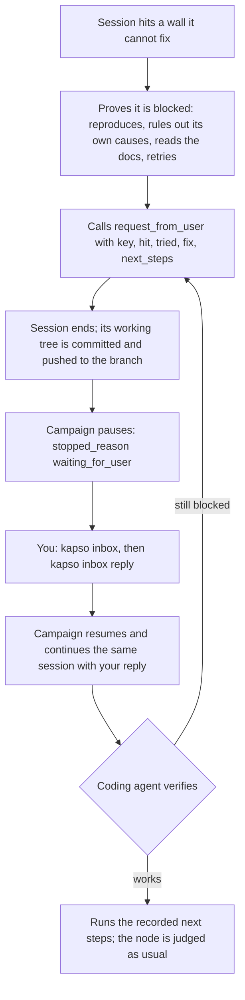

The inbox is how a campaign asks you for something only a person can provide, and how your reply continues the very coding session that asked. A session that needs an API key that is not in `.env`, access to a private bucket or a file that exists only on your laptop records a request, the campaign pauses and exits with `stopped_reason: waiting_for_user`, and `kapso inbox reply` resumes that session with your answer and its context intact.

Nothing polls and nothing runs in the background. Your reply is the only trigger, and a campaign never starts new work while a request is open.

## How does a session ask?

The session first proves the blocker: the session reproduces the failure with the smallest command, rules out the causes the session can fix itself, reads the repository's own docs for how the resource is normally obtained, retries anything that could be transient, and tries routes that need no person. Only then does the session call the `request_from_user` tool with everything the session needs, in one call. The call is the stop signal: the session ends its turn, the working tree is committed and pushed to the experiment branch, the node is suspended, and the campaign pauses. You read the request with `kapso inbox`, act on it, and answer with `kapso inbox reply`. The reply resumes the campaign, which continues the same session through the coding agent's own resume command with a follow-up carrying your reply and the next steps the session recorded. The session verifies for itself; if the session is still blocked, the session asks again, and the new request shows your previous reply.



A suspended node is not judged, never becomes a parent, and does not count as an iteration. The judge only ever sees completed nodes.

## What does a request look like?

At the pause the terminal prints every open request and how to answer:

```text
kapso evolve — waiting on you

  #1  env:OPENAI_API_KEY
      for    node 3 · re-rank candidates with text-embedding-3-large
      hit    openai.AuthenticationError at the embedding step — no key in the environment
      tried  OPENAI_KEY / OPENAI_API_TOKEN unset too; no .env or config in the repo; README says export OPENAI_API_KEY; two retries
      fix    add OPENAI_API_KEY=sk-... to /home/me/churn/.env
      next   embed the candidate texts, re-rank, run kapso_evaluation/evaluate.py

  reply with   kapso inbox reply "…"        # after the fix, or with what to do instead
  any time     kapso inbox /home/me/churn/campaign
```

| Row | What the row tells you |
|-----|-------------------|
| `#1` and the key | The campaign-local id you reply to, and what is missing |
| `for` | The node and the idea that needs the resource |
| `hit` | The exact failure the session reproduced |
| `tried` | What the session ruled out before asking. Judge the request from this row |
| `fix` | Where the value or grant goes. A credential goes there, never into the reply |
| `next` | What the session will do once the resource is there |

The summary block after `kapso evolve` says `WAITING ON YOU` instead of `COMPLETED`, and the exit code stays 0. A pause is not a failure.

## How do I answer?

Two commands:

```bash
kapso inbox                          # what is waiting on you
kapso inbox reply 1 "added the key"  # answer request 1; the campaign resumes
```

Run inside a campaign directory, both commands act on that campaign. Run anywhere else, `kapso inbox` lists every campaign with an open request, and `kapso inbox reply` takes the campaign path first:

```bash
kapso inbox ./campaign
kapso inbox reply ./campaign 1 "added the key"
```

The id may be left out when one request is open. An empty note means done.

Replying records the note and resumes the campaign in the foreground, in your terminal. Wrap the reply in `nohup` to walk away. When a node asked for several things, the node waits until every one of its requests is answered, and the command says so:

```text
#1 answered. #2 still open, so node 3 waits; nothing else to run.
```

The command refuses to run while a live process holds the campaign, so nothing runs twice.

<Warning>
  Replies are stored in plain text in `.kapso/inbox.jsonl` and handed to the
  coding agent as text. Put a credential where the `fix` row says, usually the
  `.env` the run loaded, and reply with a note. A reply shaped like a token is
  refused unless you add `--yes` at the end of the line.
</Warning>

A reply that says the resource is not available is an instruction: the coding agent proceeds without the resource, and no later session in the campaign asks for that key again.

## What happens when the campaign resumes?

The campaign resumes from its checkpoint, and the session that asked is continued through the coding agent's own resume (`claude -p --resume` for Claude Code, `codex exec resume` for Codex) with a follow-up that carries your replies and the next steps the session recorded. The session's earlier context is the CLI's own transcript, so nothing is re-explained. The coding agent verifies for itself. If the coding agent is still blocked, the coding agent asks again with what the coding agent tried, and the new request shows your previous reply next to the new request.

Kapso runs no checks of its own. Nothing is resumed until you reply, and a `kapso evolve --resume` with a request still open pauses again without running anything. Paused time does not count against the campaign's time budget.

## What does the session keep across the pause?

Everything git can hold, plus the campaign directory and the transcript.

- **Code and every file in the session's working tree.** When the session ends after the call, the session close commits the run directory and then everything else on the node's branch, pushes the branch to the campaign repository, and only then deletes the session folder. The resumed session is a fresh checkout of that branch.
- **Datasets.** `kapso_datasets/` is tracked on the branch, since data files are committed at setup. A file you drop into the campaign's `kapso_datasets/` after launch, because a request asked for the file, is copied into the resumed session and becomes tracked when that session closes.
- **Evaluation files, run outputs, `changes.log` and the session's plan file.** On the branch.
- **The idea, the requests and the session's own next steps.** In the checkpoint node and in `.kapso/inbox.jsonl` in the campaign directory.
- **The conversation.** The coding agent's transcript on disk, under `~/.claude/projects` or `~/.codex/sessions`, keyed by the session id stored in the checkpoint node. Claude Code keeps transcripts for 30 days.

Not kept: files git ignores inside the session folder (`*.log` other than `changes.log`, `__pycache__`), anything written outside the session folder such as `/tmp`, exported environment variables, and processes the session started. The resumed session is a fresh process that loads the campaign's `.env` at start.

## Where does the pause show up?

| Surface | What the surface shows |
|---------|---------------|
| `kapso watch ./campaign` | `WAITING ON YOU · 1 request` with the requests, readable after the process is gone |
| `.kapso/run_state.json` | `last_stop: "waiting_for_user"` on a `running` checkpoint |
| `.kapso/status.json` | `state: done` with `stopped_reason: "waiting_for_user"` and the requests |
| `on_status` | Fires once at the pause with the same payload |
| Python | `solution.metadata["stopped_reason"]`, `solution.requests`, `Kapso.inbox(campaign)`, `Kapso.reply(campaign, id, note)` |

A campaign started from Python with an `iteration_evaluator` callback cannot be resumed from the command line, because the callback lives in your script. `kapso inbox reply` records the note and tells you to call `evolve()` again with `resume=True`.

## When does the coding agent ask, and when not?

The implementation prompt sets the bar, and the `tried` row of every request shows the bar was met. A session asks only for something a person must do: installing a package, downloading public data or waiting out a rate limit is the session's own job. A request is load-bearing or the request is not made: a missing key for optional logging is dropped and mentioned in the report. Before asking, the session reproduces the failure with the smallest command, rules out every cause the session can fix itself, reads how the resource is normally obtained in the repository, retries when the failure could be transient, and tries routes that need no person. A location the repository's own README or config names for a credential is such a route, not a search. The session asks for everything the session needs in one call and does nothing after the call. The session never stubs or mocks the resource, never searches the machine for credentials, and never prints a secret's value. An idea that plans around a missing resource with an "honest zero" or a placeholder is not the goal: the session asks instead.

## How do I turn the inbox on or off?

```yaml
defaults:
  inbox:
    enabled: true
    stop_grace_seconds: 120
    registry: "~/.kapso/campaigns.jsonl"
```

| Key | What the key does | Shipped value |
|-----|--------------|---------------|
| `enabled` | Give sessions the tool and let the campaign pause | `true` |
| `stop_grace_seconds` | How long a session that asked gets to end its own turn before the adapter ends the session | `120` |
| `registry` | One line per launched campaign, so `kapso inbox` outside a campaign can list every one that waits | `~/.kapso/campaigns.jsonl` |

The block sits under `defaults`, which every mode inherits. To turn the inbox off for one mode, put `inbox: {enabled: false}` under that mode in your config; the mode layer is deep-merged over the defaults, so the other two keys keep their values. The benchmark modes ship with the inbox off. A mode whose `node_expansion_value` is above 1 runs with the inbox off as well: a campaign with several implementation lanes cannot pause on one of them yet.

With the inbox off, sessions do not get the tool, the prompt is unchanged, no campaign pauses, and no launch record or registry line is written. The inbox block is part of the checkpoint's configuration fingerprint, so changing the block on an existing campaign blocks `--resume` for that campaign.

## What can go wrong?

- **The transcript is gone.** Claude Code keeps transcripts for 30 days. If the transcript has been deleted, the reply fails with the coding agent's own error, the node stays suspended and nothing else runs. The code is still on the branch, but the context is lost: start a new campaign.
- **Kapso is killed during the continuation.** The checkpoint still marks the node suspended. `kapso evolve --resume` continues the same session. Work the continuation had not pushed before the kill is lost; the coding agent redoes the work.
- **You supplied a wrong value.** The coding agent verifies, asks again, and the new request quotes your previous reply. Reply again after fixing the value.
- **The session asked for two things.** Answer each request; the node resumes after the last one, and every reply before that prints which requests are still open.

## Related

<CardGroup cols={2}>
  <Card title="Resuming runs" icon="rotate" href="/docs/evolve/resuming-runs">
    The checkpoint a paused campaign resumes from
  </Card>
  <Card title="CLI reference" icon="terminal" href="/docs/reference/cli#kapso-inbox">
    Every form of kapso inbox
  </Card>
  <Card title="MCP gates" icon="plug" href="/docs/evolve/mcp-gates">
    The gate that carries the request_from_user tool
  </Card>
  <Card title="Configuration" icon="gear" href="/docs/reference/configuration#defaults">
    The inbox block and its defaults
  </Card>
</CardGroup>

Related pages: [Resuming runs](/docs/evolve/resuming-runs) · [CLI reference](/docs/reference/cli#kapso-inbox) · [Configuration](/docs/reference/configuration) · [MCP gates](/docs/evolve/mcp-gates) · [Execution flow](/docs/evolve/execution-flow)

Kapso is an open-source framework by [Leeroo](https://leeroo.com) that builds software toward measurable goals through experiment campaigns. Source code: [github.com/Leeroo-AI/kapso](https://github.com/Leeroo-AI/kapso) · Install: `pip install leeroo-kapso` · Every page as plain text: [llms.txt](https://docs.leeroo.com/llms.txt).
