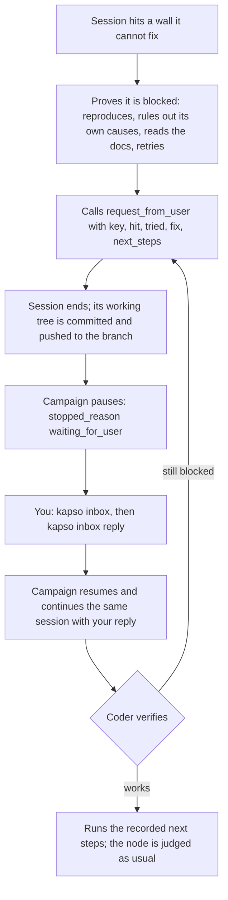

An idea sometimes needs something the coding session cannot get for itself: an
API key that is not in `.env`, access to a private bucket, a dataset that only
exists on your laptop. Instead of faking the resource or dropping the idea, the
session asks you through the inbox. The campaign pauses, and your reply
continues the session that asked, with its context intact.

Nothing polls and nothing runs in the background. Your reply is the only
trigger.

## The cycle



The node that asked is suspended while it waits. It is not judged, never
becomes a parent, and does not count as an iteration. No new work starts while
a request is open.

## What a request looks like

At the pause the terminal prints every open request and how to answer:

```text
kapso evolve — waiting on you

  #1  env:OPENAI_API_KEY
      for    node 3 · re-rank candidates with text-embedding-3-large
      hit    openai.AuthenticationError at the embedding step — no key in the environment
      tried  OPENAI_KEY / OPENAI_API_TOKEN unset too; no .env or config in the repo; README says export OPENAI_API_KEY; two retries
      fix    add OPENAI_API_KEY=sk-... to /home/me/churn/.env
      next   embed the candidate texts, re-rank, run kapso_evaluation/evaluate.py

  reply with   kapso inbox reply "…"        # after the fix, or with what to do instead
  any time     kapso inbox /home/me/churn/campaign
```

| Row | What it tells you |
|-----|-------------------|
| `#1` and the key | The campaign-local id you reply to, and what is missing |
| `for` | The node and the idea that needs it |
| `hit` | The exact failure the session reproduced |
| `tried` | What the session ruled out before asking. Judge the request from this row |
| `fix` | Where the value or grant goes. A credential goes here, never into the reply |
| `next` | What the session will do once it has the resource |

The summary block after `kapso evolve` says `WAITING ON YOU` instead of
`COMPLETED`, and the exit code stays 0. A pause is not a failure.

## Answering

Two commands:

```bash
kapso inbox                          # what is waiting on you
kapso inbox reply 1 "added the key"  # answer it; the campaign resumes
```

Run inside a campaign directory, both act on that campaign. Run anywhere else,
`kapso inbox` lists every campaign with an open request, and `kapso inbox
reply` takes the campaign path first:

```bash
kapso inbox ./campaign
kapso inbox reply ./campaign 1 "added the key"
```

The id may be left out when one request is open. An empty note means done.

Replying records the note and resumes the campaign in the foreground, in your
terminal. Wrap it in `nohup` if you want to walk away. When a node asked for
several things, it waits until every one of its requests is answered, and the
command says so:

```text
#1 answered. #2 still open, so node 3 waits; nothing else to run.
```

The command refuses while a live process holds the campaign, so nothing runs
twice.

<Warning>
  Replies are stored in plain text in `.kapso/inbox.jsonl` and handed to the
  coder as text. Put a credential where the `fix` row says, usually the `.env`
  the run loaded, and reply with a note. A reply shaped like a token is refused
  unless you add `--yes` at the end of the line.
</Warning>

A reply that says the resource is not available is an instruction: the coder
proceeds without it and does not ask for that key again.

## What the resume does

The campaign resumes from its checkpoint, and the session that asked is
continued through the coding agent's own resume (`claude --resume` or
`codex exec resume`) with a follow-up that carries your replies and the next
steps the session recorded. The coder verifies for itself. If it is still
blocked, it asks again with what it tried, and the new request shows your
previous reply next to it.

Kapso runs no checks of its own. Nothing is resumed until you reply, and a
`kapso evolve --resume` with a request still open pauses again without running
anything. Paused time does not count against the campaign's time budget.

## Where the pause shows up

| Surface | What it shows |
|---------|---------------|
| `kapso watch ./campaign` | `WAITING ON YOU · 1 request` with the requests, readable after the process is gone |
| `.kapso/run_state.json` | `last_stop: "waiting_for_user"` on a `running` checkpoint |
| `.kapso/status.json` | `state: done` with `stopped_reason: "waiting_for_user"` and the requests |
| `on_status` | Fires once at the pause with the same payload |
| Python | `solution.metadata["stopped_reason"]`, `solution.requests`, `Kapso.inbox(campaign)`, `Kapso.reply(campaign, id, note)` |

A campaign started from Python with an `iteration_evaluator` callback cannot be
resumed from the command line, because the callback lives in your script.
`kapso inbox reply` records the note and tells you to call `evolve()` again with
`resume=True`.

## When the coder asks

The implementation prompt sets the bar. A session asks only for something a
person must do: installing a package, downloading public data or waiting out a
rate limit is its own job. A request is load-bearing or it is not made. Before
asking, the session reproduces the failure with the smallest command, rules out
every cause it can fix itself, reads how the resource is normally obtained in
the repository, retries when the failure could be transient, and tries routes
that need no person. It asks for everything it needs in one call and does
nothing after it. It never stubs or mocks the resource, and never searches the
machine for credentials.

## Configuration

```yaml
defaults:
  inbox:
    enabled: true
    stop_grace_seconds: 120
    registry: "~/.kapso/campaigns.jsonl"
```

| Key | What it does | Shipped value |
|-----|--------------|---------------|
| `enabled` | Give sessions the tool and let the campaign pause | `true` |
| `stop_grace_seconds` | How long a session that asked gets to end its own turn before the adapter ends it | `120` |
| `registry` | One line per launched campaign, so `kapso inbox` outside a campaign can list every one that waits | `~/.kapso/campaigns.jsonl` |

The benchmark modes ship with the inbox off. A mode whose `node_expansion_value`
is above 1 runs with it off as well: a campaign with several implementation
lanes cannot pause on one of them yet.

## Related

<CardGroup cols={2}>
  <Card title="Resuming runs" icon="rotate" href="/docs/evolve/resuming-runs">
    The checkpoint a paused campaign resumes from
  </Card>
  <Card title="CLI reference" icon="terminal" href="/docs/reference/cli#kapso-inbox">
    Every form of kapso inbox
  </Card>
</CardGroup>

Related pages: [Resuming runs](/docs/evolve/resuming-runs) · [CLI reference](/docs/reference/cli#kapso-inbox) · [Configuration](/docs/reference/configuration)

Kapso is an open-source framework by [Leeroo](https://leeroo.com) that builds software toward measurable goals through experiment campaigns. Source code: [github.com/Leeroo-AI/kapso](https://github.com/Leeroo-AI/kapso) · Install: `pip install leeroo-kapso` · Every page as plain text: [llms.txt](https://docs.leeroo.com/llms.txt).
