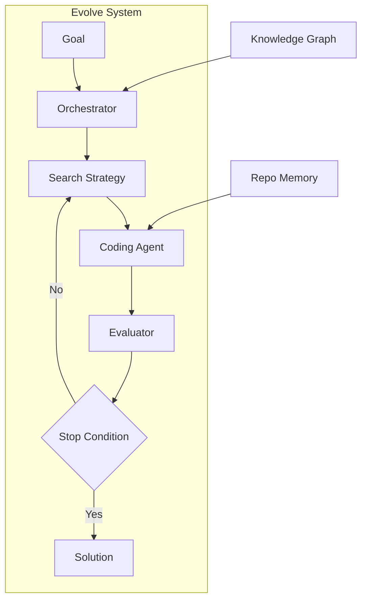

# Evolve System

The Evolve System is Kapso's core engine for building software solutions. It orchestrates an iterative experimentation loop that explores multiple approaches, learns from failures, and converges on high-quality solutions.

## How It Works



The system works by:

1. **Receiving a goal** : What you want to build
2. **Gathering context** : From Knowledge Graph and Repo Memory
3. **Generating solutions** : Via pluggable coding agents
4. **Evaluating results** : With configurable evaluators
5. **Iterating** : Until stop conditions are met

## Key Components

<CardGroup cols={2}>
  <Card title="Orchestrator" icon="sitemap" href="/docs/evolve/orchestrator">
    Central coordinator that manages the experimentation loop, budget tracking, and component lifecycle
  </Card>
  <Card title="Search Strategies" icon="magnifying-glass" href="/docs/evolve/search-strategies">
    Algorithms for exploring the solution space: tree search or linear search
  </Card>
  <Card title="Coding Agents" icon="code" href="/docs/evolve/coding-agents">
    Pluggable code generators: Aider, Gemini, Claude Code, OpenHands
  </Card>
  <Card title="Evaluators" icon="check-double" href="/docs/evolve/evaluators">
    Score solutions: regex patterns, JSON files, LLM judges
  </Card>
  <Card title="Stop Conditions" icon="flag-checkered" href="/docs/evolve/stop-conditions">
    Control when to stop: threshold, plateau, cost/time limits
  </Card>
  <Card title="Repo Memory" icon="brain" href="/docs/evolve/repo-memory">
    Tracks code understanding with file-level evidence
  </Card>
</CardGroup>

## Basic Usage

```python
from src.kapso import Kapso, DeployStrategy

kapso = Kapso()

# Build a solution
solution = kapso.evolve(
    goal="Build a random forest classifier for Iris with accuracy > 0.9",
    output_path="./models/iris_v1",
    evaluator="regex_pattern",
    evaluator_params={"pattern": r"Accuracy: ([\d.]+)"},
    stop_condition="threshold",
    stop_condition_params={"threshold": 0.9},
)

# Deploy and run
software = kapso.deploy(solution, strategy=DeployStrategy.LOCAL)
result = software.run({"data_path": "./test.csv"})
```

## Configuration Modes

Kapso provides preset configurations for different use cases:

| Mode | Search Strategy | Best For |
|------|-----------------|----------|
| `GENERIC` | Tree search (default) | General problem solving |
| `MINIMAL` | Linear search | Quick experiments, simple problems |
| `TREE_SEARCH` | Tree search with debugging | Complex problems requiring exploration |
| `SCORED` | Tree search with scoring | Problems with clear metrics |

```python
# Use a specific mode
solution = kapso.evolve(
    goal="...",
    mode="MINIMAL",  # Fast, linear search
)
```

## The Experimentation Loop

Each iteration of the evolve loop:

1. **Select** — Choose which solution candidates to explore
2. **Expand** — Generate new variations using the coding agent
3. **Execute** — Run the generated code
4. **Evaluate** — Score the results
5. **Prune** — Remove unpromising branches (tree search only)
6. **Check** — Evaluate stop conditions

### Git Branch Model

Each experiment runs on its own Git branch:

```
main
├── kapso/exp-001  (first experiment)
├── kapso/exp-002  (second experiment)
│   └── kapso/exp-002-debug-1  (debug iteration)
├── kapso/exp-003  (third experiment)
└── ...
```

This provides:
- **Isolation** — Experiments don't interfere with each other
- **History** — Full Git history of all attempts
- **Recovery** — Easy to checkout and examine any experiment

## Memory Systems

The Evolve System uses two memory systems:

### Repo Memory

Tracks understanding of the codebase:
- **Architecture** — High-level structure and patterns
- **Key Claims** — Important facts about the code
- **File Evidence** — Which files support each claim

### Cognitive Memory (Advanced)

Learns from past experiments:
- **Episodic Memory** — What worked and what didn't
- **Pattern Recognition** — Common failure modes
- **Strategy Selection** — Which approaches work best

## Budget Tracking

The Orchestrator tracks costs across all components:

```python
# Get cumulative cost
cost = orchestrator.get_cumulative_cost()
print(f"Total cost: ${cost:.2f}")
```

Use cost-based stop conditions to control spending:

```python
solution = kapso.evolve(
    goal="...",
    stop_condition="cost_limit",
    stop_condition_params={"max_cost": 10.0},  # Stop at $10
)
```

## Next Steps

<CardGroup cols={2}>
  <Card title="Architecture" icon="building" href="/docs/evolve/architecture">
    Deep dive into system architecture
  </Card>
  <Card title="Execution Flow" icon="arrow-progress" href="/docs/evolve/execution-flow">
    Detailed walkthrough of the execution process
  </Card>
  <Card title="Search Strategies" icon="tree" href="/docs/evolve/search-strategies">
    How tree search and linear search explore solutions
  </Card>
  <Card title="Experiment Lifecycle" icon="rotate" href="/docs/evolve/experiment-lifecycle">
    Lifecycle of a single experiment
  </Card>
</CardGroup>
