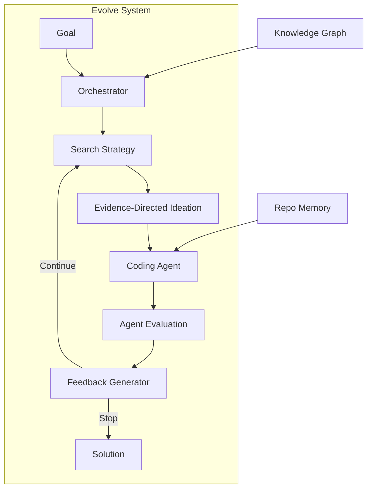

# Evolve System

The Evolve System is Kapso's core engine for building software solutions. It orchestrates an iterative experimentation loop that explores multiple approaches, learns from failures, and converges on high-quality solutions.

## How It Works


```mermaid
flowchart TB
    subgraph Evolve["Evolve System"]
        G[Goal] --> O[Orchestrator]
        O --> SS[Search Strategy]
        SS --> ID[Evidence-Directed Ideation]
        ID --> CA[Coding Agent]
        CA --> AE[Agent Evaluation]
        AE --> FG[Feedback Generator]
        FG -->|Continue| SS
        FG -->|Stop| S[Solution]
    end
    
    KG[Knowledge Graph] --> O
    RM[Repo Memory] --> CA
```

The system works by:

1. **Receiving a goal** : What you want to build (include success criteria in the goal)
2. **Initializing repo** : From `initial_repo`, workflow search, or empty
3. **Gathering context** : From Knowledge Graph and Repo Memory
4. **Selecting an idea** : Deterministic policy plus Codex/Claude CLI candidate and selector roles
5. **Running evaluation** : Agent builds and runs evaluation in `kapso_evaluation/`
6. **Generating feedback** : Feedback generator validates results and decides stop/continue

## Key Components

<CardGroup cols={2}>
  <Card title="Orchestrator" icon="sitemap" href="/docs/evolve/orchestrator">
    Central coordinator that manages the experimentation loop, budget tracking, and component lifecycle
  </Card>
  <Card title="Search Strategies" icon="magnifying-glass" href="/docs/evolve/search-strategies">
    Evidence-directed Generic search or benchmark tree search
  </Card>
  <Card title="Coding Agents" icon="code" href="/docs/evolve/coding-agents">
    Pluggable code generators: Aider, Gemini, Claude Code, OpenHands
  </Card>
  <Card title="Feedback Generator" icon="comments" href="/docs/evolve/feedback-generator">
    Validates evaluation results and decides when to stop
  </Card>
  <Card title="Repo Memory" icon="brain" href="/docs/evolve/repo-memory">
    Tracks code understanding with file-level evidence
  </Card>
</CardGroup>

## Basic Usage

```python
from kapso.kapso import Kapso, DeployStrategy

kapso = Kapso()

# Build a solution - agent builds evaluation dynamically
# Include success criteria in the goal
solution = kapso.evolve(
    goal="Build a random forest classifier for Iris with accuracy > 0.9",
    max_iterations=10,
)

# With user-provided evaluation and data
solution = kapso.evolve(
    goal="Optimize model inference speed to < 10ms",
    eval_dir="./my_evaluation/",   # Copied to kapso_evaluation/
    data_dir="./my_data/",         # Copied to kapso_datasets/
    initial_repo="https://github.com/org/starter",  # Or local path
)

# Deploy and run
deployed_program = kapso.deploy(solution, strategy=DeployStrategy.LOCAL)
result = deployed_program.run({"data_path": "./test.csv"})
```

## Repository Initialization

When `evolve()` is called, the system initializes the workspace:

| `initial_repo` Value | Behavior |
|---------------------|----------|
| Local path | Use existing repository as starting point |
| GitHub URL | Clone repository and use as starting point |
| `None` (default) | Search for relevant workflow via Knowledge Graph. If found, clone workflow's repo. Otherwise, create empty repo. |

## Configuration Modes

Kapso provides preset configurations for different use cases:

| Mode | Search Strategy | Best For |
|------|-----------------|----------|
| `GENERIC` | Evidence-directed Generic search (default) | General problem solving |
| `MINIMAL` | Evidence-directed Generic search with shorter implementation timeouts | Quick experiments, simple problems |

```python
# Use a specific mode
solution = kapso.evolve(
    goal="...",
    mode="MINIMAL",  # Same evidence-directed search, shorter implementation timeout
)
```

## The Experimentation Loop

Each iteration of the evolve loop:

1. **Direct** — Evidence and capacity choose bootstrap, explore, exploit,
   verify, recover, or finalize.
2. **Generate** — Independent coding-agent roles propose structured candidates.
3. **Analyze** — Hard rules, descriptors, and semantic neighbors establish the
   eligible pool.
4. **Select** — A coding-agent critic chooses only among eligible candidates.
5. **Implement and evaluate** — The selected linked idea runs on its frozen
   parent branch.
6. **Learn** — Feedback and evidence authoring update outcomes, claims, and
   evaluation gaps for the next iteration.

### Git Branch Model

Each experiment runs on its own Git branch:

```
main
├── generic_exp_0  (first linked idea/experiment)
├── generic_exp_1  (second linked idea/experiment)
├── generic_exp_2  (third linked idea/experiment)
└── ...
```

A recoverable implementation failure reuses the same `generic_exp_<node_id>`
branch, idea ID, batch ID, and experiment node with a newer execution revision.

This provides:
- **Isolation** — Experiments don't interfere with each other
- **History** — Full Git history of all attempts
- **Recovery** — Easy to checkout and examine any experiment

### Workspace Structure

After setup, the workspace looks like:

```
workspace/
├── kapso_evaluation/     # Agent builds evaluation here
│   └── evaluate.py       # Evaluation script
├── kapso_datasets/       # Data files (from data_dir)
├── .kapso/
│   ├── repo_memory.json        # Branch-specific codebase understanding
│   ├── idea_archive.json       # Candidates, decisions, claims, gaps, outcomes
│   ├── experiment_history.json # Executed-only projection
│   ├── run_state.json          # Strict resumable campaign state
│   └── ideation/agent_calls/   # Replayable CLI call artifacts
└── (solution code)       # From initial_repo or agent-built
```

## Memory Systems

The Evolve System separates four authorities:

- **Run checkpoint / SearchNode** — executable campaign state.
- **Idea archive** — considered proposals, decisions, and outcomes.
- **Experiment history** — work that was actually executed and measured.
- **Repo memory** — branch-specific repository understanding.

### Repo Memory

Tracks understanding of the codebase:
- **Architecture** — High-level structure and patterns
- **Key Claims** — Important facts about the code
- **File Evidence** — Which files support each claim

### Experiment History

Learns from past experiments via MCP tools:
- **Top Experiments** — Best scoring experiments
- **Recent Experiments** — Most recent experiments
- **Similar Experiments** — Semantic search for related experiments

## Budget Tracking

The Orchestrator tracks costs across all components:

```python
# Get cumulative cost
cost = orchestrator.get_cumulative_cost()
print(f"Total cost: ${cost:.2f}")
```

Budget limits can be set via `max_iterations` or time/cost budgets in configuration.

## Next Steps

<CardGroup cols={2}>
  <Card title="Architecture" icon="building" href="/docs/evolve/architecture">
    Deep dive into system architecture
  </Card>
  <Card title="Execution Flow" icon="arrow-progress" href="/docs/evolve/execution-flow">
    Detailed walkthrough of the execution process
  </Card>
  <Card title="Search Strategies" icon="tree" href="/docs/evolve/search-strategies">
    How evidence-directed Generic and benchmark tree search explore solutions
  </Card>
  <Card title="Experiment Lifecycle" icon="rotate" href="/docs/evolve/experiment-lifecycle">
    Lifecycle of a single experiment
  </Card>
</CardGroup>
