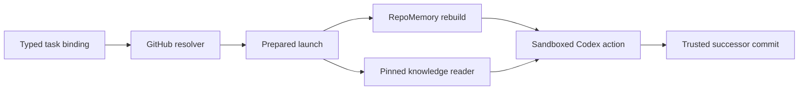

# Evolve System

`Kapso.evolve()` has one startup path: resolve a typed domain binding to pinned
expert, knowledge, and security repositories, prepare an immutable launch, then
run a sandboxed coding-agent edit against that launch.


```mermaid
flowchart LR
    T["Typed task binding"] --> R["GitHub resolver"]
    R --> P["Prepared launch"]
    P --> M["RepoMemory rebuild"]
    P --> K["Pinned knowledge reader"]
    M --> A["Sandboxed Codex action"]
    K --> A
    A --> C["Trusted successor commit"]
```

No model, embedding, evaluator, or provider call is allowed before the prepared
launch handoff. Repository routing comes only from `cross_run_binding` in the
runtime config. Task input cannot select or replace repositories.

## Fresh run

A fresh run supplies:

- a `LaunchTaskContextRequest` describing task semantics;
- content-addressed starting artifacts and their workspace mount paths;
- a dependency/runtime contract;
- a budget/fidelity envelope; and
- either the binding selected by the config mode or the exact scope, family,
  and adapter identifiers.

The resolver verifies repository authorities, pins an expert release and a
knowledge snapshot, materializes the task adapter and artifacts, and publishes
the launch handoff. Kapso then rebuilds RepoMemory from the composed workspace,
retrieves relevant knowledge through the trusted prior reader, and executes one
durable Codex edit action. Only the trusted consumer promotes accepted edits and
creates the direct-successor Git commit.

## Resume

Resume takes the run root, goal, runtime config, and `resume=True`. Fresh launch
inputs are rejected. The persisted prepared launch and action identity are
revalidated; completed durable events are not repeated.

## Python

```python
solution = kapso.evolve(
    goal="Improve validation accuracy without exceeding the time budget",
    output_path="./runs/task-001",
    task_context_request=task_context,
    starting_artifact_sources={
        "dataset": ("./fixtures/dataset", "inputs/dataset"),
    },
    dependency_runtime_contract={"python": "3.12"},
    budget_fidelity_envelope={"wall_clock_minutes": 30},
    config_path="./runtime.yaml",
)
```

`SolutionResult.metadata` carries the launch manifest, expert release,
knowledge snapshot, task adapter, RepoMemory, request, operation, and action
identities needed to audit or continue the run.

## CLI

```bash
kapso evolve --goal-file goal.txt --output ./runs/task-001 \
  --config ./runtime.yaml --launch-inputs ./launch-inputs.json

kapso evolve --goal-file goal.txt --output ./runs/task-001 \
  --config ./runtime.yaml --resume
```

The fresh-launch JSON is a closed object with `task_context_request`,
`starting_artifacts`, `dependency_runtime_contract`, and
`budget_fidelity_envelope`. Relative artifact sources resolve against that JSON
file. `--launch-inputs` is forbidden on resume.
