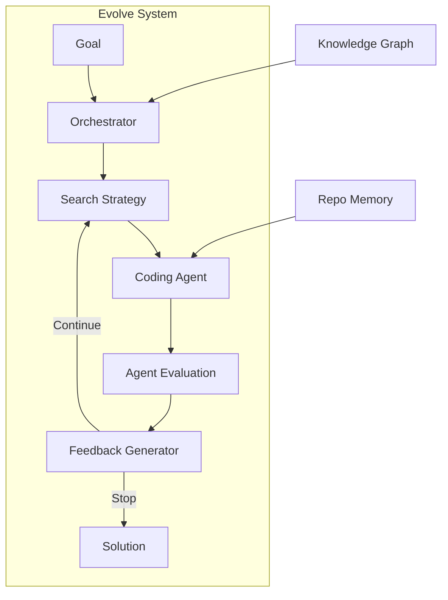

Evolve is the engine. Give it a goal it can score and it runs a campaign: propose a candidate, implement it on its own git branch, evaluate it, judge the result, and repeat with what it learned.

## How does a campaign work?


```mermaid
flowchart TB
    subgraph Evolve["Evolve System"]
        G[Goal] --> O[Orchestrator]
        O --> SS[Search Strategy]
        SS --> CA[Coding Agent]
        CA --> AE[Agent Evaluation]
        AE --> FG[Feedback Generator]
        FG -->|Continue| SS
        FG -->|Stop| S[Solution]
    end
    
    KG[Knowledge Graph] --> O
    RM[Repo Memory] --> CA
```

The system works by:

1. **Receiving a goal**: What you want to build (include success criteria in the goal)
2. **Initializing repo**: From `initial_repo`, workflow search, or empty
3. **Gathering context**: From the knowledge graph and repo memory
4. **Generating solutions**: Via pluggable coding agents
5. **Running evaluation**: Agent builds and runs evaluation in `kapso_evaluation/`
6. **Generating feedback**: Feedback generator validates results and decides stop/continue

## What are the pieces?

<CardGroup cols={2}>
  <Card title="Orchestrator" icon="sitemap" href="/docs/evolve/orchestrator">
    Central coordinator that manages the experimentation loop, budget tracking, and component lifecycle
  </Card>
  <Card title="Search Strategies" icon="magnifying-glass" href="/docs/evolve/search-strategies">
    The generic strategy: how candidates are generated, run and recorded
  </Card>
  <Card title="Coding Agents" icon="code" href="/docs/evolve/coding-agents">
    Pluggable code generators: Claude Code, Codex, Gemini, OpenHands and more
  </Card>
  <Card title="Feedback Generator" icon="comments" href="/docs/evolve/feedback-generator">
    Validates evaluation results and decides when to stop
  </Card>
  <Card title="Repo Memory" icon="brain" href="/docs/evolve/repo-memory">
    Tracks code understanding with file-level evidence
  </Card>
</CardGroup>

## How do I run one?

```python
from kapso import Kapso, DeployStrategy

kapso = Kapso()

# Build a solution - agent builds evaluation dynamically
# Include success criteria in the goal
solution = kapso.evolve(
    goal="Build a random forest classifier for Iris with accuracy > 0.9",
    max_iterations=10,
)

# With user-provided evaluation and data
solution = kapso.evolve(
    goal="Optimize model inference speed to < 10ms",
    eval_dir="./my_evaluation/",   # Copied to kapso_evaluation/
    data_dir="./my_data/",         # Copied to kapso_datasets/
    initial_repo="https://github.com/org/starter",  # Or local path
)

# Deploy and run
deployed_program = kapso.deploy(solution, strategy=DeployStrategy.LOCAL)
result = deployed_program.run({"data_path": "./test.csv"})
```

## How do I start from an existing repo?

When `evolve()` is called, the system initializes the workspace:

| `initial_repo` Value | Behavior |
|---------------------|----------|
| Local path | Use existing repository as starting point |
| GitHub URL | Clone repository and use as starting point |
| `None` (default) | Search for relevant workflow via Knowledge Graph. If found, clone workflow's repo. Otherwise, create empty repo. |

## Configuration modes

Two ship, both running the generic strategy:

| Mode | Description | Best For |
|------|-------------|----------|
| `GENERIC` | The default: MCP gates, knowledge search, full feedback loop | General problem solving |
| `MINIMAL` | The same loop with the knowledge machinery off | Quick experiments, simple problems |

```python
# Use a specific mode
solution = kapso.evolve(
    goal="...",
    mode="MINIMAL",
)
```

Each experiment runs on its own Git branch (`generic_exp_N`), so attempts stay isolated and every one can be checked out later — see [Experiment lifecycle](/docs/evolve/experiment-lifecycle).

### Workspace structure

After setup, the workspace looks like:

```text
workspace/
├── kapso_evaluation/     # Agent builds evaluation here
│   └── evaluate.py       # Evaluation script
├── kapso_datasets/       # Data files (from data_dir)
├── .kapso/
│   └── repo_memory.json  # Codebase understanding
└── (solution code)       # From initial_repo or agent-built
```

## What does a campaign remember?

Evolve uses two memory systems:

### Repo memory

Tracks understanding of the codebase:
- **Architecture** — High-level structure and patterns
- **Key Claims** — Important facts about the code
- **File Evidence** — Which files support each claim

### Experiment history

Learns from past experiments via MCP tools:
- **Top Experiments** — Best scoring experiments
- **Recent Experiments** — Most recent experiments
- **Similar Experiments** — Semantic search for related experiments

## How do I bound a campaign?

The Orchestrator tracks costs across all components:

```python
# Get cumulative cost
cost = orchestrator.get_cumulative_cost()
print(f"Total cost: ${cost:.2f}")
```

Budget limits can be set via `max_iterations` or time/cost budgets in configuration.

## Related

<CardGroup cols={2}>
  <Card title="Architecture" icon="building" href="/docs/evolve/architecture">
    Deep dive into system architecture
  </Card>
  <Card title="Execution Flow" icon="arrow-progress" href="/docs/evolve/execution-flow">
    Detailed walkthrough of the execution process
  </Card>
  <Card title="Search Strategies" icon="tree" href="/docs/evolve/search-strategies">
    How tree search and linear search explore solutions
  </Card>
  <Card title="Experiment Lifecycle" icon="rotate" href="/docs/evolve/experiment-lifecycle">
    Lifecycle of a single experiment
  </Card>
</CardGroup>
