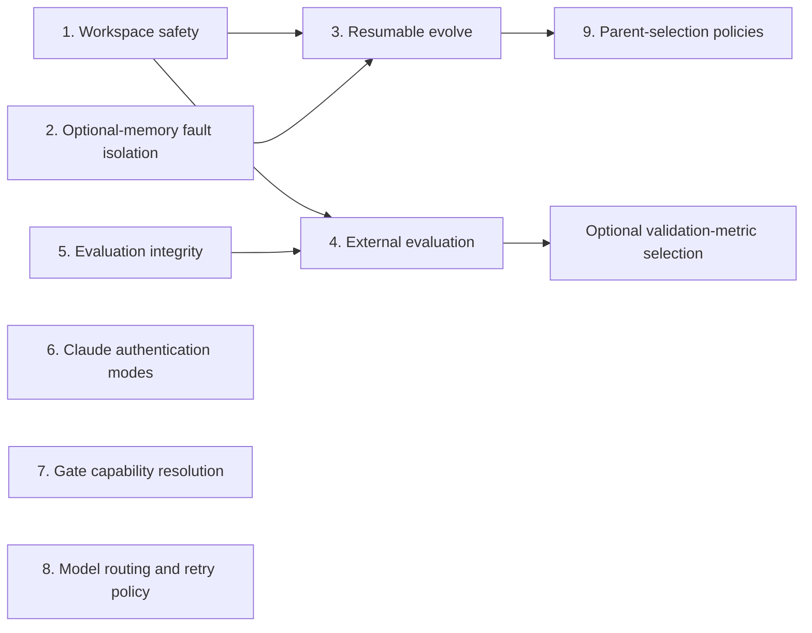

This document defines the upstream implementation plan for a set of reliability
and extensibility improvements developed in a downstream Kapso fork. It also
tracks which generic parts are now available in open-source Kapso.

The changes must be upstreamed as focused pull requests. The downstream branch
mixes reusable behavior with deployment-specific defaults, so it must not be
merged or cherry-picked wholesale.

| Milestone | Status |
|-----------|--------|
| 1. Workspace and Git safety | Implemented |
| 2. Optional RepoMemory fault isolation | Implemented |
| 3. Resumable evolution | Implemented |
| 4. External iteration evaluation | Implemented |
| 5. Evaluation integrity | Implemented |
| 6. Claude Code authentication modes | Implemented |
| 7. Capability-aware gates | Implemented |
| 8. Model routing and retry policy | Planned |
| 9. Parent-selection policies | Planned |

## Goals

The program has five goals:

1. Never lose user files or experiment branches while changing Git refs.
2. Allow long-running evolution campaigns to resume deterministically.
3. Let callers evaluate every candidate with an external harness without
   coupling Kapso to a particular benchmark.
4. Keep optional enrichment, tools, and model providers from becoming hard
   dependencies of the experiment loop.
5. Preserve evaluation integrity by separating optimization signals from final
   holdout measurements.

## Non-goals

- A holdout score must not influence search or best-candidate selection by
  default.
- Kapso must not silently delete untracked files to make a checkout succeed.
- A missing checkpoint must not silently turn a requested resume into a new run.
- The generic configuration must not assume one developer's Claude
  subscription, AWS account, timeout, or benchmark.
- Prompt instructions alone are not considered sufficient evaluation
  protection.

## Delivery order



Workspace safety is the first milestone because both resumability and external
evaluation rely on stable Git refs and non-destructive candidate
materialization.

## Milestone 1: Workspace and Git safety

### Problem

The current workspace implementation runs `git clean -fdx` before switching
branches. That deletes ignored runtime state and may delete user-owned files.
Initialization may also rename the current experiment branch to `main` when
opening an existing repository.

### Design

- Branch switching never runs `git clean` implicitly.
- A blocked checkout raises a `WorkspaceCheckoutError` containing the target
  branch and current status; the working tree is left intact.
- When `main` already exists, initialization checks it out without renaming any
  other branch.
- The current branch is renamed to `main` only for a fresh repository that does
  not already have a `main` ref.
- Best-branch checkout returns the selected ref and verifies that the working
  tree is actually on it.
- Callers that need a candidate without changing the root working tree should
  use a ref-aware temporary worktree/materialization helper.

### Compatibility

This changes failure behavior: an unsafe checkout now raises instead of
silently deleting files. Successful checkouts retain their existing behavior.

### Acceptance tests

- Opening a workspace on `generic_exp_0` preserves that branch.
- Ignored and untracked sentinel files survive branch switches.
- A conflicting untracked path produces a clear error.
- Fresh `master` repositories are normalized to `main`.
- Detached-HEAD repositories can create or check out `main` safely.
- The returned best ref equals the active branch after materialization.

## Milestone 2: Optional RepoMemory fault isolation

### Problem

RepoMemory is useful context, but its LLM-generated metadata is not the primary
experiment artifact. A malformed response must not discard code that has
already been implemented and evaluated.

### Design

- Isolate RepoMemory update failures inside session finalization.
- Continue branch push and session cleanup after an enrichment failure.
- Add a configurable failure policy: `warn` by default, with `fail` for strict
  environments.
- Select repository files once during bootstrap.
- On malformed JSON, repair or regenerate only the structured response rather
  than repeating file planning.
- Retry parse/schema failures only; propagate authentication, configuration,
  and programming errors.

### Configuration

```yaml
search_strategy:
  params:
    repo_memory_failure_policy: warn  # warn | fail
    repo_memory_max_retries: 2
```

`repo_memory_max_retries` counts repair attempts after the initial response.
The failure policy is applied at the optional-enrichment lifecycle boundary;
direct manager calls continue to raise their underlying errors.

### Acceptance tests

- Invalid JSON followed by valid JSON succeeds.
- File selection runs once across repair attempts.
- Repeated invalid JSON fails after the configured limit.
- A RepoMemory failure does not prevent branch push or cleanup in `warn` mode.
- Strict mode propagates the original failure.

## Milestone 3: Resumable evolution

### User API

```python
solution = kapso.evolve(
    goal="Improve the support agent",
    output_path="./campaign",
    max_iterations=1,
    resume=True,
)
```

`resume=True` has strict semantics:

- `output_path` is required and must already exist.
- The path must be a Kapso experiment workspace.
- A valid checkpoint must exist.
- The checkpoint's goal and strategy must match the requested run.
- A completed campaign does not continue unless a future explicit override is
  introduced.

### State model

Checkpoint ownership moves from individual strategies to a versioned store.

```python
@dataclass
class RunCheckpoint:
    schema_version: int
    strategy_type: str
    goal: str
    goal_hash: str
    config_fingerprint: str
    status: str
    completed_iterations: int
    cumulative_cost: float
    current_feedback: str | None
    strategy_state: dict
```

Strategies expose serializable state:

```python
class SearchStrategy:
    def dump_state(self) -> dict: ...
    def load_state(self, state: dict) -> None: ...
```

Generic search serializes `SearchNode` records directly. Tree search stores
nodes by ID with `parent_id` and `children_ids`, then rebuilds object references
when loading.

State is written atomically to `.kapso/run_state.json` using a temporary file
and `os.replace`. A trusted legacy `checkpoint.pkl` may be imported once during
an explicit resume and then migrated.

### Save points

Save after every finalized iteration, including `goal_achieved` and budget
termination. A half-created branch is never recorded as a completed node.

### Acceptance tests

- A fresh one-step run followed by a resumed step creates nodes 0 and 1.
- Previous feedback reaches the resumed iteration.
- Branches, cost, campaign iteration count, and stop state survive restart.
- Missing, corrupt, incompatible, or goal-mismatched checkpoints fail clearly.
- Interrupted atomic writes leave the previous valid checkpoint readable.
- Legacy pickle state migrates once.

## Milestone 4: External iteration evaluation

### User API

External evaluation is generic; holdout evaluation is only one possible use.

```python
@dataclass(frozen=True)
class IterationEvaluationContext:
    iteration: int
    goal: str
    workspace_dir: Path
    git_ref: str
    parent_ref: str
    node: SearchNode

@dataclass
class IterationEvaluationResult:
    metrics: dict[str, float]
    primary_metric: str | None = None
    metadata: dict[str, Any] = field(default_factory=dict)
```

```python
solution = kapso.evolve(
    ...,
    iteration_evaluator=evaluate_candidate,
)
```

The evaluator receives the exact candidate ref or a temporary working tree
materialized from that ref. It must not rely on the root workspace's current
checkout.

### Metric semantics

- `node.score` remains the internal optimization signal.
- External values live in `node.metrics`.
- Internal score controls search, stopping, and best selection by default.
- External metrics are persisted before experiment history and checkpoints are
  written.
- Callback failures follow an explicit `record` or `raise` policy.
- Values must be finite numbers; strings, NaN, and infinity are rejected.

An optional future `selection_metric="validation_accuracy"` may select by an
external validation/dev metric. A true holdout metric must remain
observational.

### Acceptance tests

- The evaluator runs exactly once for every completed candidate.
- The context points to the correct Git ref.
- Metrics persist in experiment history and checkpoints.
- Metrics do not influence search by default.
- Failure policies and numeric validation behave predictably.
- Explicit minimize/maximize selection works only when configured.

## Milestone 5: Evaluation integrity

### Problem

When the caller provides an evaluation suite, an implementation agent must not
rewrite the test it is being judged against. Prompt instructions help but do
not enforce this invariant.

### Design

- Track evaluation provenance as `provided` or `agent_generated`.
- Hash the provided evaluation tree during workspace setup.
- Verify it after implementation and before accepting a score.
- If a provided evaluator changed, mark the evaluation invalid and ignore its
  score.
- Exclude `evaluation_valid=False` nodes from best-candidate selection.
- Keep evaluation retry and run limits configurable rather than embedding one
  campaign's policy in the generic prompt.
- Longer term, execute provided evaluation through a Kapso-owned evaluator
  process instead of trusting agent-reported output.

### Acceptance tests

- An unchanged provided evaluator remains valid.
- A modified provided evaluator is rejected.
- Agent-generated evaluation remains supported when no suite is supplied.
- Invalid evaluation cannot become the best experiment.

## Milestone 6: Claude Code authentication modes

### Configuration

```yaml
coding_agent:
  type: claude_code
  model: claude-opus-4-6
  agent_specific:
    auth_mode: auto  # auto | oauth | api_key | bedrock
```

- `bedrock` validates AWS credentials and sets provider flags.
- `api_key` requires `ANTHROPIC_API_KEY`.
- `oauth` relies on the Claude CLI's stored login.
- `auto` preserves existing Bedrock compatibility, then API-key behavior, then
  CLI credentials.

`use_bedrock` remains a deprecated compatibility alias for at least one
release. The generic default is not switched to a developer-specific OAuth
profile; subscription use is documented as an optional profile.

OAuth discovery uses the supported `claude auth status` command rather than
reading credential files or OS keychains. Per-agent `env_overrides` participate
in validation, and explicit modes remove conflicting provider credentials from
the child environment without mutating `os.environ`.

### Acceptance tests

- Explicit modes override conflicting ambient credentials.
- `auto` resolves Bedrock, API key, and OAuth in the documented order.
- OAuth works with either a stored CLI login or `CLAUDE_CODE_OAUTH_TOKEN`.
- Credentials supplied through `env_overrides` are validated and forwarded.
- Missing credentials and unknown modes fail before an experiment starts.
- Both values of `use_bedrock` preserve their previous meaning and warn.

## Milestone 7: Capability-aware gates

Gate requirements belong in the gate registry, not in a search strategy.

```python
@dataclass
class GateDefinition:
    tools: list[str]
    command: str | None = None
    required_env: list[str] = field(default_factory=list)
    required_commands: list[str] = field(default_factory=list)
```

`resolve_gates` returns enabled gates and diagnostic reasons according to a
`skip`, `warn`, or `error` policy. Unknown gates are configuration errors.

The resolver checks explicit path inputs and the effective environment before
building MCP server configuration. Unavailable gates never appear in the
allowed-tool list, and an external-only request does not create an empty
bundled server.

### Acceptance tests

- Missing environment variables and executables produce structured diagnostics.
- `skip`, `warn`, and `error` apply their documented behavior.
- Unknown gates and policies always raise configuration errors.
- Explicit KG, history, and repo paths are forwarded without global env mutation.
- Allowed tools and MCP servers contain enabled gates only.
- Direct bundled-server startup enforces the same capability policy.

## Milestone 8: Model routing and retry policy

Internal components should request model roles instead of hardcoding provider
names.

```yaml
models:
  utility: gpt-4.1-mini
  reasoning: gpt-5-mini
  web_search: openai/gpt-4o-search-preview

retry:
  max_attempts: 2
  initial_delay_seconds: 5
  max_delay_seconds: 60
  multiplier: 2
  jitter: true
```

Explicit aliases remain available for compatibility. Resolution and retry
behavior must be shared by synchronous, parallel, and web-search calls. Only
retryable provider and network errors are retried.

## Milestone 9: Parent-selection policies

Generic search currently exploits the best branch. Baseline exploration should
be an explicit strategy setting rather than a hidden environment variable.

```yaml
search_strategy:
  params:
    parent_policy: best  # best | baseline
```

A later `ParentSelector` interface may support campaign-specific policies. The
recorded `parent_node_id` must always correspond to the selected branch, and
ideation must read the selected ref's code rather than the root workspace's
current checkout.

## Compatibility and migration

- Existing successful `evolve()` calls retain internal-score selection.
- Existing `use_bedrock` configuration remains supported during deprecation.
- New experiment-record fields use empty defaults when older JSON history is
  loaded.
- Legacy checkpoints are read only during explicit trusted migration.
- No existing default timeout or provider is changed by this program.

## Testing policy

New tests must be hermetic: they may use temporary Git repositories, fake
coding agents, and fake LLMs, but must not require paid API calls. Every
milestone includes unit tests for its failure paths and at least one integration
test through the public `Kapso.evolve` boundary where applicable.

## Explicitly rejected downstream behaviors

- Selecting the best candidate from a holdout score by default.
- Falling back from a requested resume to a fresh campaign.
- Automatic `git clean -fd` or `git clean -fdx` during checkout.
- Swallowing best-branch checkout failures.
- Replacing generic provider and timeout defaults with local campaign values.
- Prefix-based global model substitution at the LLM boundary.
- Hardcoded gate credential checks inside `GenericSearch`.
- Mixing internal scores with missing external metrics in one ranking.
