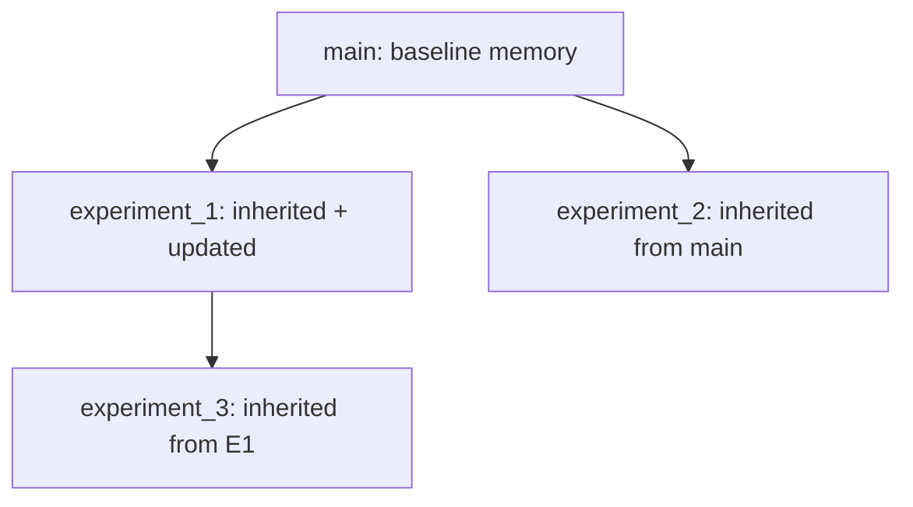

## Overview

RepoMemory is a structured representation of a repository's architecture, patterns, and conventions. It helps coding agents understand the codebase and make informed changes.

## Key Features

- **Evidence-backed claims**: All assertions link to specific file locations
- **Branch inheritance**: Child experiments inherit parent's memory
- **Bounded prompts**: Summary + TOC keeps context manageable
- **Section-based access**: Agents can read specific sections on demand

## Schema

```json
{
  "schema_version": 2,
  "generated_at": "2025-01-15T10:30:00Z",
  "repo_map": { ... },
  "repo_model": { ... },
  "book": {
    "summary": "One-paragraph description",
    "toc": [
      {"id": "core.architecture", "title": "Architecture", "one_liner": "..."},
      {"id": "core.entrypoints", "title": "Entrypoints", "one_liner": "..."},
      ...
    ],
    "sections": {
      "core.architecture": {
        "title": "Architecture",
        "one_liner": "System design and module structure",
        "claims": [
          {
            "kind": "architecture",
            "statement": "Uses factory pattern for component creation",
            "evidence": [{"path": "src/factory.py", "quote": "class Factory:"}]
          }
        ]
      },
      ...
    }
  },
  "experiments": [ ... ],
  "quality": {
    "evidence_ok": true,
    "section_count": 7,
    "claim_count": 15
  }
}
```

## Core Sections

| Section ID | Title | Content |
|------------|-------|---------|
| `core.architecture` | Architecture | System design, module structure |
| `core.entrypoints` | Entrypoints | How to run the application |
| `core.where_to_edit` | Where to edit | Key files for modifications |
| `core.invariants` | Invariants | Contracts and constraints |
| `core.testing` | Testing | How to run tests |
| `core.gotchas` | Gotchas | Common pitfalls |
| `core.dependencies` | Dependencies | Key dependencies |

## Usage

### Ensure Memory Exists

```python
from src.execution.memories.repo_memory import RepoMemoryManager

# Create or load memory
doc = RepoMemoryManager.ensure_exists_in_worktree("/path/to/repo")
```

### Render for Prompts

```python
# Get bounded summary + TOC
brief = RepoMemoryManager.render_summary_and_toc(doc, max_chars=3000)
print(brief)
```

Output:
```
# Repo Memory (book)
Schema: v2
GeneratedAt: 2025-01-15T10:30:00Z

## Summary
A framework for automated code generation with knowledge-grounded experimentation.

## Table of Contents (section IDs)
- [core.architecture] Architecture: System design and module structure
- [core.entrypoints] Entrypoints: How to run the application
- [core.where_to_edit] Where to edit: Key files for modifications
...

## How to read details
- Open `.kapso/repo_memory.json`
- Find `book.sections[section_id]` from the TOC above
```

### Get Specific Section

```python
# Read a section
section_text = RepoMemoryManager.get_section(doc, "core.architecture")
print(section_text)
```

### Bootstrap from Existing Repo

```python
from src.core.llm import LLMBackend

llm = LLMBackend()

# Build evidence-backed model via LLM
RepoMemoryManager.bootstrap_baseline_model(
    repo_root="/path/to/repo",
    llm=llm,
    seed_repo_path="/original/repo",
)
```

### Update After Experiment

```python
RepoMemoryManager.update_after_experiment(
    repo_root="/path/to/repo",
    llm=llm,
    branch_name="experiment_1",
    parent_branch_name="main",
    base_commit_sha="abc123",
    solution_spec="Implement feature X",
    run_result={
        "score": 0.85,
        "run_had_error": False,
    },
)
```

## File Location

RepoMemory is stored at `.kapso/repo_memory.json` in each repository.

```
my_project/
├── .kapso/
│   └── repo_memory.json
├── src/
└── ...
```

## Branch Inheritance

When experiments branch from a parent:

1. Child branch inherits parent's `.kapso/repo_memory.json`
2. After experiment runs, memory is updated with new understanding
3. Memory is committed to the branch
4. Future children of this branch inherit the updated memory



## Evidence Validation

Claims must have evidence that exists in the repository:

```python
from src.execution.memories.repo_memory.builders import validate_evidence

result = validate_evidence(repo_root, model)
if not result.ok:
    print(f"Missing evidence: {result.missing}")
```

## MCP Tools Access

For Claude Code agent, RepoMemory is accessible via MCP tools:

```python
# Get summary and table of contents
get_repo_memory_summary()

# List available sections
list_repo_memory_sections()

# Get specific section content
get_repo_memory_section(section_id="core.architecture")
```

Available sections:
- `core.architecture` - System design and module structure
- `core.entrypoints` - How to run the application
- `core.where_to_edit` - Key files for modifications
- `core.invariants` - Contracts, constraints, and assumptions
- `core.testing` - How to run tests
- `core.gotchas` - Common pitfalls
- `core.dependencies` - Key dependencies

## Integration with Coding Agents

### Prompt Injection

Search strategies inject RepoMemory into prompts:

```python
def implement_solution(self, solution, context, session):
    repo_memory_doc = RepoMemoryManager.ensure_exists_in_worktree(session.session_folder)
    repo_memory_brief = RepoMemoryManager.render_summary_and_toc(repo_memory_doc)

    prompt = f"""
    # Repo Memory (Summary + TOC)
    {repo_memory_brief}

    # Problem
    {context.problem}

    # Solution
    {solution}
    """
```

### Section Access Instructions

Agents are told how to access detailed sections via MCP tools:

```
For detailed section content (architecture, gotchas, invariants, etc.),
use the MCP tool: get_repo_memory_section(section_id="core.architecture")
Available sections: core.architecture, core.entrypoints, core.where_to_edit, core.invariants, core.testing, core.gotchas, core.dependencies
```

## Quality Metrics

```python
doc["quality"] = {
    "evidence_ok": True,       # All claims have valid evidence
    "missing_evidence": [],    # List of missing evidence
    "section_count": 7,        # Number of sections
    "claim_count": 15,         # Total claims across sections
}
```