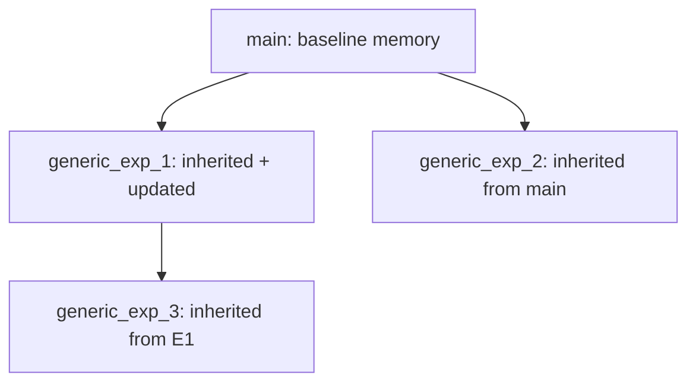

Repo memory is a structured model of a repository — its architecture, patterns and conventions — that coding agents read before they change anything. Every claim in it carries a line-number reference to the file that supports it.

## What does repo memory give an agent?

- **Evidence-backed claims**: All assertions link to specific file locations
- **Branch inheritance**: Child experiments inherit parent's memory
- **Bounded prompts**: Summary + TOC keeps context manageable
- **Section-based access**: Agents can read specific sections on demand

## Schema

```json
{
  "schema_version": 2,
  "generated_at": "2025-01-15T10:30:00Z",
  "baseline": {"initial_repo": null},
  "repo_map": { ... },
  "book": {
    "summary": "One-paragraph description",
    "toc": [
      {"id": "core.architecture", "title": "Architecture", "one_liner": "..."},
      {"id": "core.entrypoints", "title": "Entrypoints", "one_liner": "..."},
      ...
    ],
    "sections": {
      "core.architecture": {
        "title": "Architecture",
        "one_liner": "System design and module structure",
        "claims": [
          {
            "kind": "architecture",
            "statement": "Uses factory pattern for component creation",
            "evidence": [{"path": "src/factory.py", "line": 12, "description": "Factory class definition"}]
          }
        ]
      },
      ...
    }
  },
  "experiments": [ ... ],
  "quality": {
    "evidence_ok": true,
    "section_count": 7,
    "claim_count": 15
  }
}
```

## Core sections

| Section ID | Title | Content |
|------------|-------|---------|
| `core.architecture` | Architecture | System design, module structure |
| `core.entrypoints` | Entrypoints | How to run the application |
| `core.where_to_edit` | Where to edit | Key files for modifications |
| `core.invariants` | Invariants | Contracts and constraints |
| `core.testing` | Testing | How to run tests |
| `core.gotchas` | Gotchas | Common pitfalls |
| `core.dependencies` | Dependencies | Key dependencies |

## How do I build and read it?

### Ensure memory exists

```python
from kapso.execution.memories.repo_memory import RepoMemoryManager

# Create or load memory
doc = RepoMemoryManager.ensure_exists_in_worktree("/path/to/repo")
```

### Render for prompts

```python
# Get bounded summary + TOC
brief = RepoMemoryManager.render_summary_and_toc(doc, max_chars=3000)
print(brief)
```

Output:
```text
# Repo Memory (book)
Schema: v2
GeneratedAt: 2025-01-15T10:30:00Z

## Summary

A framework for automated code generation with knowledge-grounded experimentation.

## Table of Contents (section IDs)

- [core.architecture] Architecture: System design and module structure
- [core.entrypoints] Entrypoints: How to run the application
- [core.where_to_edit] Where to edit: Key files for modifications
...

## How to read details

- Open `.kapso/repo_memory.json`
- Find `book.sections[section_id]` from the TOC above
```

### Get specific section

```python
# Read a section
section_text = RepoMemoryManager.get_section(doc, "core.architecture")
print(section_text)
```

### Bootstrap from existing repo

```python
from kapso.core.llm import LLMBackend

llm = LLMBackend()

# Build evidence-backed model via LLM
RepoMemoryManager.bootstrap_baseline_model(
    repo_root="/path/to/repo",
    llm=llm,
    initial_repo="/original/repo",
    max_retries=2,
)
```

### Update after experiment

```python
RepoMemoryManager.update_after_experiment(
    repo_root="/path/to/repo",
    llm=llm,
    branch_name="generic_exp_1",
    parent_branch_name="main",
    base_commit_sha="abc123",
    solution_spec="Implement feature X",
    run_result={
        "score": 0.85,
        "run_had_error": False,
    },
    max_retries=2,
)
```

`max_retries` counts repair attempts after the first response. Kapso selects
and reads repository files once, then asks the model to repair only malformed
JSON or an invalid outer schema. Provider, authentication, transport, and
configuration errors are not retried.

## What happens when it fails?

RepoMemory is optional enrichment; experiment code and evaluation results are
the primary artifacts. Search strategies therefore default to warning when a
baseline or per-experiment memory update fails:

```yaml
search_strategy:
  type: generic
  params:
    repo_memory_failure_policy: warn  # warn | fail
    repo_memory_max_retries: 2
```

- `warn` logs the enrichment error, then still pushes the candidate branch and
  cleans up the coding agent session.
- `fail` still performs branch push and cleanup, then re-raises the original
  RepoMemory error.
- Invalid policy values and negative or non-integer retry counts fail during
  strategy/workspace setup.

Direct calls to `RepoMemoryManager.bootstrap_baseline_model()` and
`update_after_experiment()` always raise if structured-response repair is
exhausted. The `warn`/`fail` policy is applied by the search/session lifecycle.

## Where is it stored?

RepoMemory is stored at `.kapso/repo_memory.json` in each repository.

```text
my_project/
├── .kapso/
│   └── repo_memory.json
├── src/
└── ...
```

## How does it travel between experiments?

When experiments branch from a parent:

1. Child branch inherits parent's `.kapso/repo_memory.json`
2. After experiment runs, memory is updated with new understanding
3. Memory is committed to the branch
4. Future children of this branch inherit the updated memory


```mermaid
flowchart TD
    M[main: baseline memory]
    E1[generic_exp_1: inherited + updated]
    E2[generic_exp_2: inherited from main]
    E3[generic_exp_3: inherited from E1]

    M --> E1
    M --> E2
    E1 --> E3
```

## How are its claims verified?

Every claim carries a line-number reference — `{path, line, description}` — into the file it came from. The builder validates the model's shape (a summary and well-formed sections); it does not re-check the referenced lines, because a line number is a pointer rather than a quotable assertion: the model is trusted as-is, and the `quality` block records evidence coverage.

## How do agents read it?

For Claude Code agent, RepoMemory is accessible via MCP tools:

```python
# Get summary and table of contents
get_repo_memory_summary()

# List available sections
list_repo_memory_sections()

# Get specific section content
get_repo_memory_section(section_id="core.architecture")
```

The section ids are the seven from the [Core Sections](#core-sections) table.

## Integration with coding agents

The generic strategy's implementation prompt opens with the memory's rendered summary and TOC:

```python
# In run_implementation's prompt assembly
repo_memory_doc = RepoMemoryManager.ensure_exists_in_worktree(session.session_folder)
repo_memory_brief = RepoMemoryManager.render_summary_and_toc(repo_memory_doc, max_chars=3000)
# ...prepended to the problem and solution sections of the prompt
```

The prompt also tells the agent to pull detailed sections on demand through the `repo_memory` MCP gate (`get_repo_memory_section(section_id="core.architecture")`), so the full memory never has to ride in the prompt.

## Quality metrics

```python
doc["quality"] = {
    "evidence_ok": True,       # All claims have valid evidence
    "missing_evidence": [],    # List of missing evidence
    "section_count": 7,        # Number of sections
    "claim_count": 15,         # Total claims across sections
}
```

## Related

<CardGroup cols={2}>
  <Card title="Coding agents" icon="robot" href="/docs/evolve/coding-agents">
    Who reads repo memory
  </Card>
  <Card title="Experiment lifecycle" icon="rotate" href="/docs/evolve/experiment-lifecycle">
    Where it is built and updated
  </Card>
</CardGroup>
