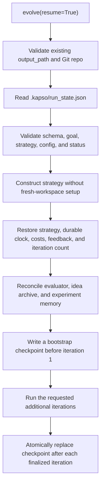

Kapso can continue a previous evolution campaign from its exact search and
orchestration state. Resume is intentionally strict: it never converts a
missing, corrupt, incompatible, or completed checkpoint into a new campaign.

## Basic usage

Run one iteration and keep the workspace:

```python
solution = kapso.evolve(
    goal="Improve the support agent",
    output_path="./campaign",
    max_iterations=1,
)
```

Continue it with one additional iteration:

```python
solution = kapso.evolve(
    goal="Improve the support agent",
    output_path="./campaign",
    max_iterations=1,
    resume=True,
)
```

`max_iterations` is the number of iterations attempted by the current call.
It is not a new lifetime limit. The result distinguishes the two counts:

```python
solution.metadata["iterations"]             # this call
solution.metadata["cumulative_iterations"]  # entire campaign
solution.metadata["resumed"]
```

The same operation is available from the CLI:

```bash
kapso evolve \
  --goal "Improve the support agent" \
  --output ./campaign \
  --iterations 1 \
  --resume
```

## Resume flow



Validation happens before Kapso initializes or changes the experiment
workspace. A failed resume request therefore does not create a Git repository,
rename a branch, or overwrite campaign state.

## Strict requirements

With `resume=True`:

- `output_path` is required and must already be a directory.
- The path must be a non-bare Git repository.
- `.kapso/run_state.json` must exist; no pre-v3 or pickle migration path exists.
- The checkpoint schema must be supported and structurally valid.
- The goal must match exactly.
- The configured search strategy and configuration fingerprint must match.
- A campaign marked `completed` cannot be resumed.

Starting without `resume=True` in a workspace that already has a run
checkpoint also fails. This prevents accidental replacement of a campaign.

## Checkpoint contents

Kapso owns the checkpoint rather than delegating persistence to each strategy.
The current schema is:

```json
{
  "schema_version": 2,
  "strategy_type": "generic",
  "goal": "Improve the support agent",
  "goal_hash": "sha256...",
  "config_fingerprint": "sha256...",
  "status": "running",
  "completed_iterations": 1,
  "cumulative_cost": 0.42,
  "elapsed_seconds": 83.5,
  "cost_by_component": {"search_strategy": 0.42},
  "last_stop": null,
  "current_feedback": "Address the failing edge case",
  "strategy_state": {
    "schema": "kapso.generic_search.v3",
    "campaign_id": "campaign_0123456789abcdef0123456789abcdef",
    "idea_archive_schema": "kapso.ideation_archive.v3",
    "archive_revision": 7,
    "active_batch_id": null,
    "node_history": [],
    "iteration_count": 1,
    "previous_errors": [],
    "evaluation_integrity": {
      "provenance": "agent_generated",
      "manifest": {},
      "fingerprint": null
    },
    "scores_evaluator_id": "",
    "evaluator_transition": null
  }
}
```

The configuration fingerprint includes the selected mode configuration,
strategy type and parameters, any coding-agent override, and the external
evaluator identity and failure policy when one is configured. It prevents a
run from silently continuing under different search, model, or measurement
settings.

When `eval_dir` is provided, its content fingerprint is also part of strict
compatibility. Pass the same unchanged suite to every resumed call.

## Atomic saves and iteration boundaries

The checkpoint is written to a temporary file in `.kapso/`, flushed, and then
installed with `os.replace`. If replacement is interrupted, the previous valid
checkpoint remains readable.

Kapso saves after every finalized iteration, including the iteration that
achieves the goal. It records only nodes returned as completed by the strategy;
a half-created iteration is not added to `completed_iterations`.

Status has two values:

- `running`: the call reached its iteration slice or a time/cost/reserve stop
  and can be resumed; `last_stop` records the budget boundary when present.
- `completed`: the goal was achieved.

The checkpoint file and temporary files are ignored by the experiment Git
repository. Candidate branches remain normal Git artifacts, while orchestration
state remains local runtime state.

## What is restored

Resume restores:

- generic-search node history and next iteration number;
- tree-search nodes, parent/child references, event history, and experiment
  count;
- feedback injected into the next iteration;
- cumulative campaign cost;
- cumulative elapsed time and per-component cost attribution;
- cumulative completed-iteration count;
- the latest resumable budget stop; and
- the status needed to reject completed campaigns.

Experiment history already stored in `.kapso/experiment_history.json` is loaded
by the normal history store.

After evaluation registration and cross-store reconciliation, Kapso writes a
bootstrap checkpoint before starting iteration 1. Those setup costs and state
therefore survive a crash before the first candidate finalizes.

## Failure handling

Resume errors are available from the top-level `kapso` package:

```python
from kapso import (
    RunCheckpointCompletedError,
    RunCheckpointCorruptError,
    RunCheckpointIncompatibleError,
    RunCheckpointMissingError,
)
```

| Error | Meaning |
| --- | --- |
| `RunCheckpointMissingError` | No JSON checkpoint is available |
| `RunCheckpointCorruptError` | JSON, fields, numeric values, or strategy state are invalid |
| `RunCheckpointIncompatibleError` | Goal, strategy, configuration, or schema does not match |
| `RunCheckpointCompletedError` | The campaign already reached a terminal status |

Fix the mismatch or choose the correct workspace. Do not delete validation
fields to force a resume; use a new output path for a new campaign.

## Generic ideation reconciliation

Generic v3 resumes only the exact current JSON schemas. Pre-v3 checkpoints,
archives, and experiment records are rejected; there is no pickle importer or
migration shim.

The run checkpoint stores the campaign/archive identity and revision, active
batch, strict node history, and evaluator state. The separate IdeaArchive may
legitimately be ahead because each ideation phase is committed immediately.
Resume validates the frozen problem, capacity, directive, parents, and context
hash, then continues the first unfinished phase:

- `PLANNED` resumes generation;
- `GENERATED` reuses candidates and resumes analysis;
- `ANALYZED` resumes selection;
- `SELECTED` reuses the persisted decision and completes the node bridge; and
- `BRIDGED` recovers the same idea, node ID, and branch if execution was
  interrupted.

Completed CLI operations are replayed from their durable operation-ID result,
not invoked again. Cross-store reconciliation can recreate a missing executed
record or final idea outcome, but any conflicting identity, lineage, or frozen
context fails loudly.

## Custom search strategies

A resumable custom strategy implements JSON-compatible state methods:

```python
class MyStrategy(SearchStrategy):
    def dump_state(self) -> dict:
        return {
            "iteration_count": self.iteration_count,
            "nodes": [node.to_dict() for node in self.node_history],
        }

    def load_state(self, state: dict) -> None:
        self.iteration_count = state["iteration_count"]
        self.node_history = [
            SearchNode.from_dict(node) for node in state["nodes"]
        ]
```

State must contain only JSON-compatible values. Object graphs with references,
such as tree search, should store IDs and rebuild references during
`load_state()`.
