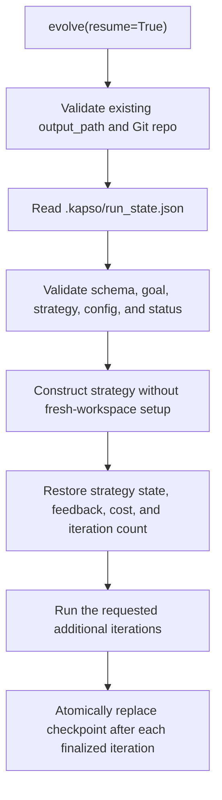

Kapso can continue a previous evolution campaign from its exact search and
orchestration state. Resume is intentionally strict: it never converts a
missing, corrupt, incompatible, or completed checkpoint into a new campaign.

## Basic usage

Run one iteration and keep the workspace:

```python
solution = kapso.evolve(
    goal="Improve the support agent",
    output_path="./campaign",
    max_iterations=1,
)
```

Continue it with one additional iteration:

```python
solution = kapso.evolve(
    goal="Improve the support agent",
    output_path="./campaign",
    max_iterations=1,
    resume=True,
)
```

`max_iterations` is the number of iterations attempted by the current call.
It is not a new lifetime limit. The result distinguishes the two counts:

```python
solution.metadata["iterations"]             # this call
solution.metadata["cumulative_iterations"]  # entire campaign
solution.metadata["resumed"]
```

The same operation is available from the CLI:

```bash
kapso evolve \
  --goal "Improve the support agent" \
  --output ./campaign \
  --iterations 1 \
  --resume
```

## Resume flow



Validation happens before Kapso initializes or changes the experiment
workspace. A failed resume request therefore does not create a Git repository,
rename a branch, or overwrite campaign state.

## Strict requirements

With `resume=True`:

- `output_path` is required and must already be a directory.
- The path must be a non-bare Git repository.
- `.kapso/run_state.json` must exist, unless trusted legacy migration is
  explicitly enabled.
- The checkpoint schema must be supported and structurally valid.
- The goal must match exactly.
- The configured search strategy and configuration fingerprint must match.
- A campaign marked `completed` cannot be resumed.

Starting without `resume=True` in a workspace that already has a run
checkpoint also fails. This prevents accidental replacement of a campaign.

## Checkpoint contents

Kapso owns the checkpoint rather than delegating persistence to each strategy.
The current schema is:

```json
{
  "schema_version": 1,
  "strategy_type": "generic",
  "goal": "Improve the support agent",
  "goal_hash": "sha256...",
  "config_fingerprint": "sha256...",
  "status": "running",
  "completed_iterations": 1,
  "cumulative_cost": 0.42,
  "current_feedback": "Address the failing edge case",
  "strategy_state": {
    "node_history": [],
    "iteration_count": 1,
    "previous_errors": []
  }
}
```

The configuration fingerprint includes the selected mode configuration,
strategy type and parameters, any coding-agent override, and the external
evaluator identity and failure policy when one is configured. It prevents a
run from silently continuing under different search, model, or measurement
settings.

## Atomic saves and iteration boundaries

The checkpoint is written to a temporary file in `.kapso/`, flushed, and then
installed with `os.replace`. If replacement is interrupted, the previous valid
checkpoint remains readable.

Kapso saves after every finalized iteration, including the iteration that
achieves the goal. It records only nodes returned as completed by the strategy;
a half-created iteration is not added to `completed_iterations`.

Status has two values:

- `running`: the call reached its iteration slice and can be resumed.
- `completed`: the goal was achieved or a time/cost budget ended the campaign.

The checkpoint file and temporary files are ignored by the experiment Git
repository. Candidate branches remain normal Git artifacts, while orchestration
state remains local runtime state.

## What is restored

Resume restores:

- generic-search node history and next iteration number;
- tree-search nodes, parent/child references, event history, and experiment
  count;
- feedback injected into the next iteration;
- cumulative campaign cost;
- cumulative completed-iteration count;
- the status needed to reject completed campaigns.

Experiment history already stored in `.kapso/experiment_history.json` is loaded
by the normal history store.

## Failure handling

Resume errors are available from the top-level `kapso` package:

```python
from kapso import (
    RunCheckpointCompletedError,
    RunCheckpointCorruptError,
    RunCheckpointIncompatibleError,
    RunCheckpointMissingError,
)
```

| Error | Meaning |
| --- | --- |
| `RunCheckpointMissingError` | No JSON checkpoint is available |
| `RunCheckpointCorruptError` | JSON, fields, numeric values, or strategy state are invalid |
| `RunCheckpointIncompatibleError` | Goal, strategy, configuration, or schema does not match |
| `RunCheckpointCompletedError` | The campaign already reached a terminal status |

Fix the mismatch or choose the correct workspace. Do not delete validation
fields to force a resume; use a new output path for a new campaign.

## Trusted legacy migration

Older Kapso versions wrote `checkpoint.pkl`. Pickle can execute code while
loading, so migration is opt-in and must only be used for a workspace you
trust:

```python
solution = kapso.evolve(
    goal="Improve the support agent",
    output_path="./trusted-old-campaign",
    max_iterations=1,
    resume=True,
    allow_legacy_checkpoint=True,
)
```

Kapso imports the built-in strategy's legacy state, immediately writes the
versioned JSON checkpoint, and renames the pickle to
`checkpoint.pkl.migrated`. Later resumes use JSON and do not deserialize the
pickle again. Legacy checkpoints do not contain goal/configuration metadata, so
the explicit trust decision also accepts the goal and configuration supplied to
the migration call.

## Custom search strategies

A resumable custom strategy implements JSON-compatible state methods:

```python
class MyStrategy(SearchStrategy):
    def dump_state(self) -> dict:
        return {
            "iteration_count": self.iteration_count,
            "nodes": [node.to_dict() for node in self.node_history],
        }

    def load_state(self, state: dict) -> None:
        self.iteration_count = state["iteration_count"]
        self.node_history = [
            SearchNode.from_dict(node) for node in state["nodes"]
        ]
```

State must contain only JSON-compatible values. Object graphs with references,
such as tree search, should store IDs and rebuild references during
`load_state()`.
