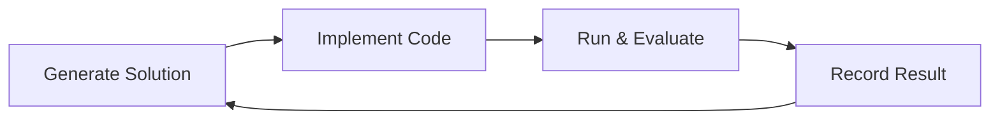
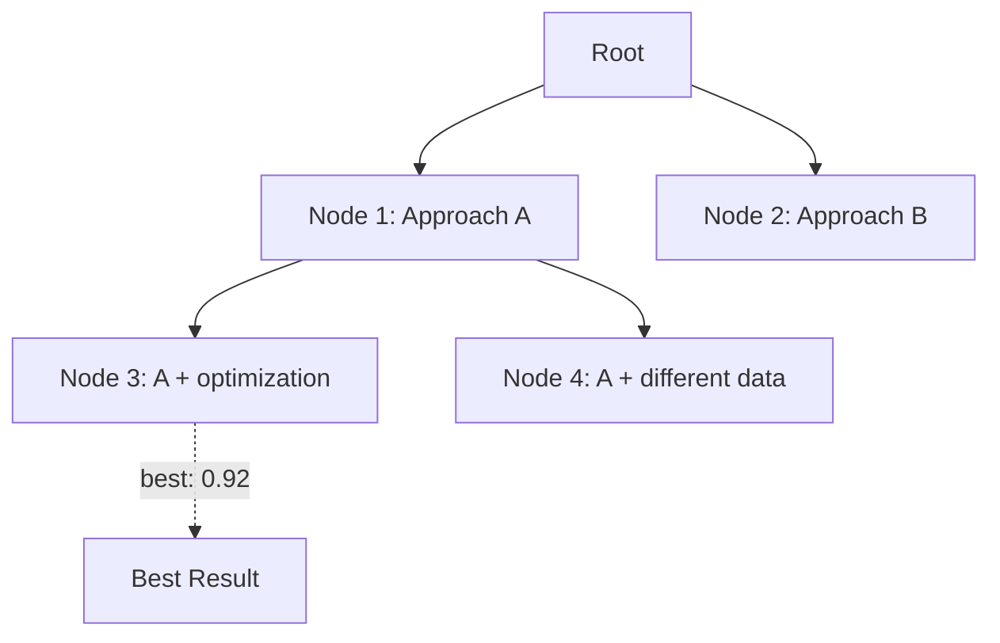
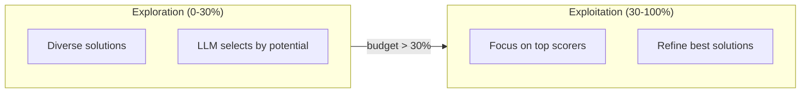

## Overview

Search strategies control how Kapso explores the solution space. They generate solution candidates, run experiments, and track results.

## Available Strategies

| Strategy | Description | Best For |
|----------|-------------|----------|
| `linear_search` | One solution per iteration | Simple problems, quick testing |
| `llm_tree_search` | Tree-based exploration | Complex problems, diverse solutions |

## Linear Search

The simplest strategy: generate one solution per iteration.



### Configuration

```yaml
search_strategy:
  type: "linear_search"
  params:
    code_debug_tries: 5
    idea_generation_model: "gpt-4o-mini"
```

### Usage

```python
from src.execution.search_strategies import SearchStrategyFactory

strategy = SearchStrategyFactory.create(
    strategy_type="linear_search",
    problem_handler=handler,
    llm=llm,
    coding_agent_config=config,
    params={"code_debug_tries": 5},
)

strategy.run(context, budget_progress=0.0)
best = strategy.get_best_experiment()
```

## LLM Tree Search

Advanced strategy that explores solutions as a tree structure.



### Algorithm

Each iteration:
1. **Prune**: Remove unpromising solutions (after 20% budget)
2. **Expand**: Generate new child solutions from selected nodes
3. **Select**: Pick best nodes to experiment with
4. **Run**: Execute experiments in parallel

```python
def run(self, context, budget_progress):
    # Prune after initial exploration
    if budget_progress >= 20:
        self.prune_bad_solutions(context)

    # Expand nodes with new solutions
    self.expand(context, budget_progress)

    # Select best nodes to experiment
    best_nodes = self.select(
        context,
        top_k=experiments_count,
        exclude_experimented_nodes=True
    )

    # Run experiments in parallel
    with ThreadPoolExecutor() as executor:
        for node in best_nodes:
            executor.submit(self._run_for_node, node, context, branch_name)
```

### Configuration

```yaml
search_strategy:
  type: "llm_tree_search"
  params:
    reasoning_effort: "medium"
    code_debug_tries: 5
    node_expansion_limit: 2
    node_expansion_new_childs_count: 5
    idea_generation_steps: 1
    first_experiment_factor: 1
    experimentation_per_run: 1
    per_step_maximum_solution_count: 10
    exploration_budget_percent: 30
    idea_generation_model: "gpt-4o-mini"
```

### Parameters

| Parameter | Default | Description |
|-----------|---------|-------------|
| `node_expansion_limit` | 2 | Nodes to expand per iteration |
| `node_expansion_new_childs_count` | 5 | Solutions generated per expansion |
| `code_debug_tries` | 5 | Max debug attempts per solution |
| `exploration_budget_percent` | 30 | When to switch to exploitation |
| `idea_generation_model` | `gpt-4.1-mini` | Model for solution generation |
| `experimentation_per_run` | 1 | Experiments per iteration |
| `first_experiment_factor` | 1 | Multiplier for first iteration |

### Exploration vs Exploitation



## Node Structure

```python
class Node:
    node_id: int              # Unique identifier
    parent_node: Node         # Parent reference
    solution: str             # Solution description
    branch_name: str          # Git branch
    is_terminated: bool       # Pruned or failed
    experiment_result: ExperimentResult
    children: List[Node]
```

## Experiment Result

```python
@dataclass
class ExperimentResult:
    node_id: int
    solution: str
    score: float
    branch_name: str
    had_error: bool
    error_message: str = ""
    output: str = ""
    feedbacks: str = ""
```

## Creating Custom Strategies

```python
from src.execution.search_strategies.base import SearchStrategy
from src.execution.search_strategies.factory import register_strategy

@register_strategy("my_custom_search")
class MyCustomSearch(SearchStrategy):
    def __init__(self, config, workspace_dir=None):
        super().__init__(config, workspace_dir)
        # Custom initialization

    def run(self, context, budget_progress=0.0):
        # Generate and run experiments
        solution = self.generate_solution(context)
        result = self._implement_n_debug(
            solution, context,
            code_debug_tries=5,
            branch_name="experiment_0",
        )
        self.experiment_history.append(result)

    def get_experiment_history(self, best_last=False):
        if best_last:
            return sorted(self.experiment_history, key=lambda x: x.score)
        return self.experiment_history

    def get_best_experiment(self):
        valid = [e for e in self.experiment_history if not e.had_error]
        return max(valid, key=lambda x: x.score) if valid else None

    def checkout_to_best_experiment_branch(self):
        best = self.get_best_experiment()
        if best:
            self.workspace.switch_branch(best.branch_name)
```

## Shared Implementation

All strategies inherit from `SearchStrategy` base class:

### implement_solution

```python
def implement_solution(self, solution, context, session):
    # Build prompt with RepoMemory context
    repo_memory_brief = RepoMemoryManager.render_summary_and_toc(...)

    prompt = render_prompt(template, {
        "problem": context.problem,
        "solution": solution,
        "repo_memory_brief": repo_memory_brief,
        "kg_code_results": context.kg_code_results,
    })

    session.generate_code(prompt)
    return self.problem_handler.run(session.session_folder)
```

### debug_solution

```python
def debug_solution(self, solution, context, error, session):
    prompt = render_prompt(debug_template, {
        "problem": context.problem,
        "solution": solution,
        "error_details": error,
    })

    session.generate_code(prompt, debug_mode=True)
    return self.problem_handler.run(session.session_folder)
```

### _implement_n_debug

```python
def _implement_n_debug(self, solution, context, code_debug_tries, branch_name):
    session = self.workspace.create_experiment_session(branch_name)
    result = self.implement_solution(solution, context, session)

    for i in range(code_debug_tries):
        if result.run_had_error and result.continue_debugging:
            result = self.debug_solution(solution, context, result.error_details, session)
        else:
            break

    # Update RepoMemory
    session.schedule_repo_memory_update(solution_spec=solution, run_result=result)
    self.workspace.finalize_session(session)

    return result
```