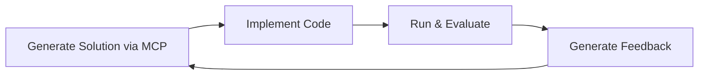
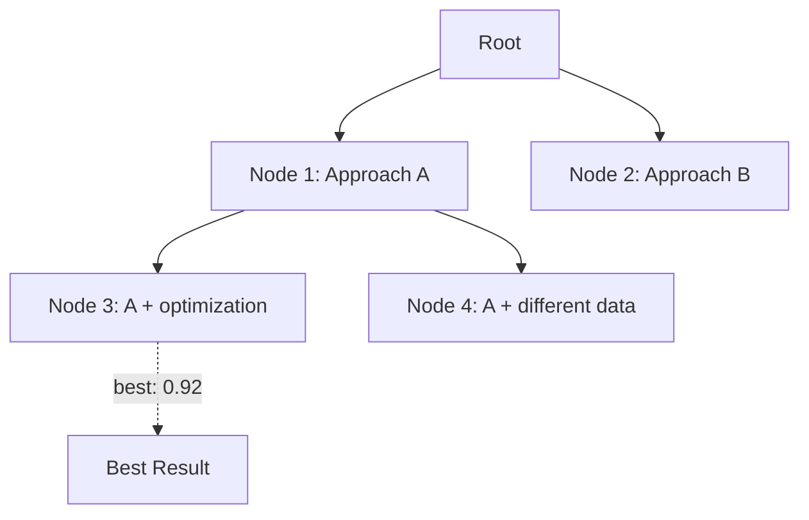
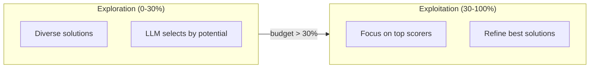

## Overview

Search strategies control how Kapso explores the solution space. They generate solution candidates, run experiments, and track results.

## Available Strategies

| Strategy | Description | Best For |
|----------|-------------|----------|
| `generic` | Claude Code + MCP gates for ideation and implementation | General problem solving |
| `benchmark_tree_search` | Tree-based exploration with handler evaluation | MLE-Bench, ALE-Bench |

## Generic Search

The main strategy for general problem solving. Uses Claude Code with MCP gates for both ideation and implementation.



### Configuration

```yaml
search_strategy:
  type: "generic"
  params:
    idea_generation_model: "us.anthropic.claude-opus-4-5-20251101-v1:0"
    implementation_model: "us.anthropic.claude-opus-4-5-20251101-v1:0"
    use_bedrock: true
    aws_region: "us-east-1"
    ideation_timeout: 300
    implementation_timeout: 600
    ideation_gates: ["idea", "code", "research", "experiment_history"]
    implementation_gates: ["code", "research"]
```

### Usage

```python
from src.execution.search_strategies import SearchStrategyFactory

strategy = SearchStrategyFactory.create(
    strategy_type="generic",
    problem_handler=handler,
    llm=llm,
    coding_agent_config=config,
    params={"ideation_timeout": 300},
)

strategy.run(context, budget_progress=0.0)
best = strategy.get_best_experiment()
```

### MCP Gates

The generic strategy uses MCP gates for external knowledge access:

| Gate | Tools | Purpose |
|------|-------|---------|
| `idea` | `wiki_idea_search` | Search curated ML/AI knowledge |
| `code` | `wiki_code_search` | Search code examples |
| `research` | `research_*` | Deep research capabilities |
| `experiment_history` | `get_top_experiments`, `get_recent_experiments`, `search_similar_experiments` | Learn from past experiments |

## Benchmark Tree Search

Advanced strategy for benchmarks that explores solutions as a tree structure.



### Algorithm

Each iteration:
1. **Prune**: Remove unpromising solutions (after 20% budget)
2. **Expand**: Generate new child solutions from selected nodes
3. **Select**: Pick best nodes to experiment with
4. **Run**: Execute experiments in parallel

```python
def run(self, context, budget_progress):
    # Prune after initial exploration
    if budget_progress >= 20:
        self.prune_bad_solutions(context)

    # Expand nodes with new solutions
    self.expand(context, budget_progress)

    # Select best nodes to experiment
    best_nodes = self.select(
        context,
        top_k=experiments_count,
        exclude_experimented_nodes=True
    )

    # Run experiments in parallel
    with ThreadPoolExecutor() as executor:
        for node in best_nodes:
            executor.submit(self._run_for_node, node, context, branch_name)
```

### Configuration

```yaml
search_strategy:
  type: "benchmark_tree_search"
  params:
    reasoning_effort: "medium"
    code_debug_tries: 5
    node_expansion_limit: 2
    node_expansion_new_childs_count: 5
    idea_generation_steps: 1
    first_experiment_factor: 1
    experimentation_per_run: 1
    per_step_maximum_solution_count: 10
    exploration_budget_percent: 30
    idea_generation_model: "gpt-4o-mini"
```

### Parameters

| Parameter | Default | Description |
|-----------|---------|-------------|
| `node_expansion_limit` | 2 | Nodes to expand per iteration |
| `node_expansion_new_childs_count` | 5 | Solutions generated per expansion |
| `code_debug_tries` | 5 | Max debug attempts per solution |
| `exploration_budget_percent` | 30 | When to switch to exploitation |
| `idea_generation_model` | `gpt-4.1-mini` | Model for solution generation |
| `experimentation_per_run` | 1 | Experiments per iteration |
| `first_experiment_factor` | 1 | Multiplier for first iteration |

### Exploration vs Exploitation



## Node Structure (SearchNode)

```python
@dataclass
class SearchNode:
    node_id: int
    parent_node_id: Optional[int] = None
    
    # Step 1: Solution generation
    solution: str = ""
    
    # Step 2: Implementation
    branch_name: str = ""
    code_changes_summary: str = ""
    
    # Step 3: Evaluation
    evaluation_script_path: str = ""
    evaluation_output: str = ""
    
    # Step 4: Feedback
    feedback: str = ""
    score: Optional[float] = None
    should_stop: bool = False
    evaluation_valid: bool = True
    
    # Metadata
    had_error: bool = False
    error_message: str = ""
    workspace_dir: str = ""
```

## Strategy Comparison

| Strategy | Evaluation | Stop Decision | Use Case |
|----------|------------|---------------|----------|
| `generic` | Agent-built | Feedback generator | `kapso.evolve()` |
| `benchmark_tree_search` | Handler's `run()` | Handler's `stop_condition()` | MLE/ALE benchmarks |

## Creating Custom Strategies

```python
from src.execution.search_strategies.base import SearchStrategy
from src.execution.search_strategies.factory import register_strategy

@register_strategy("my_custom_search")
class MyCustomSearch(SearchStrategy):
    def __init__(self, config, workspace_dir=None):
        super().__init__(config, workspace_dir)
        # Custom initialization

    def run(self, context, budget_progress=0.0):
        # Generate and run experiments
        solution = self.generate_solution(context)
        result = self._implement(
            solution, context,
            branch_name="experiment_0",
        )
        self.node_history.append(result)

    def get_experiment_history(self, best_last=False):
        if best_last:
            return sorted(self.node_history, key=lambda x: x.score)
        return self.node_history

    def get_best_experiment(self):
        valid = [e for e in self.node_history if not e.had_error]
        return max(valid, key=lambda x: x.score) if valid else None

    def checkout_to_best_experiment_branch(self):
        best = self.get_best_experiment()
        if best:
            self.workspace.switch_branch(best.branch_name)
```

## Shared Implementation

All strategies inherit from `SearchStrategy` base class:

### _implement

```python
def _implement(self, solution, context, branch_name, parent_branch_name):
    # Create experiment session
    session = self.workspace.create_experiment_session(branch_name, parent_branch_name)
    
    # Build prompt with RepoMemory context
    repo_memory_brief = RepoMemoryManager.render_summary_and_toc(...)

    prompt = render_prompt(template, {
        "problem": context,
        "solution": solution,
        "repo_memory_brief": repo_memory_brief,
    })

    # Agent implements AND runs evaluation
    session.generate_code(prompt)
    
    # Finalize session
    self.workspace.finalize_session(session)
    
    return session.output
```

### _extract_agent_result

```python
def _extract_agent_result(self, agent_output: str) -> dict:
    """
    Extract structured JSON result from agent output.
    
    Looks for JSON block at the end of the output:
    ```json
    {"code_changes_summary": "...", ...}
    ```
    """
    # Find and parse JSON from agent output
    ...
```

### _generate_feedback

```python
def _generate_feedback(self, node: SearchNode) -> None:
    """
    Generate feedback for the node using FeedbackGenerator.
    Updates node in-place with feedback, score, and should_stop.
    """
    result = self.feedback_generator.generate(
        goal=self.goal,
        idea=node.solution,
        implementation=node.code_changes_summary,
        evaluation_result=node.evaluation_output,
    )
    node.feedback = result.feedback
    node.score = result.score
    node.should_stop = result.stop
```

### _evaluate_with_handler

```python
def _evaluate_with_handler(self, node: SearchNode, solution: str) -> None:
    """
    Evaluate using handler.run() for benchmark strategies.
    Updates node in-place with score and evaluation output.
    """
    result = self.problem_handler.run(solution)
    node.score = result.score
    node.evaluation_output = result.output
    node.had_error = result.run_had_error
```
