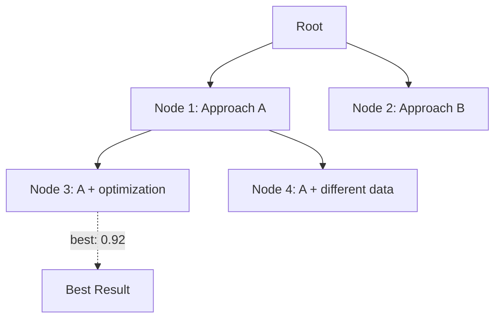
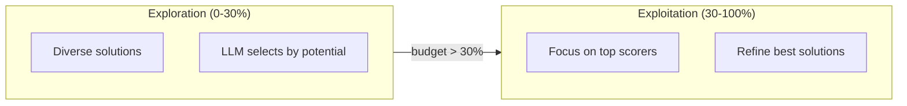

## Overview

Search strategies control how Kapso explores the solution space. They generate solution candidates, run experiments, and track results.

## Available Strategies

| Strategy | Description | Best For |
|----------|-------------|----------|
| `generic` | Evidence-directed Codex/Claude CLI ideation with durable memory | General problem solving |
| `benchmark_tree_search` | Tree-based exploration with handler evaluation | MLE-Bench, ALE-Bench |

## Generic Search

The main strategy for general problem solving. Its deterministic policy chooses
whether to explore, exploit, verify, recover, or finalize from measured
campaign evidence and remaining capacity. Codex or Claude Code CLI agents
propose and judge ideas. A final read-only Codex role authors strictly
provenanced causal evidence from the code diff and evaluation record; only the
embedding provider uses the OpenAI API.


```mermaid
flowchart LR
    E["Build frozen evidence"] --> P["Choose mode and operators"]
    P --> G["Generate candidate pool"]
    G --> A["Analyze novelty and feasibility"]
    A --> S["Persist selection"]
    S --> L["Link idea to SearchNode"]
    L --> X["Implement and evaluate"]
    X --> C["Author causal evidence"]
    C --> M["Write ExperimentRecord and IdeaOutcome"]
```

### Configuration

```yaml
ideation_profile: DEFAULT
search_strategy:
  type: generic
  params:
    implementation_model: us.anthropic.claude-opus-4-6-v1
    auth_mode: bedrock
    implementation_timeout: 600
    implementation_gates: [research, repo_memory, leeroopedia]
```

`ideation_profile` is required. It resolves only from
`src/kapso/config.yaml:ideation_profiles` and is injected into the strategy as
one exact configuration object. The profile owns candidate, selector, and
evidence-author CLI roles, models, timeouts, tools, evidence thresholds,
operator quotas, archive location, embedding identity, and novelty thresholds.
Unknown or missing fields fail during configuration.

`implementation_gates` applies only after an idea is selected. Ideation receives
a mandatory frozen packet and read-only CLI tools; it does not depend on an
idea-history MCP service. See [Parent Selection](/docs/evolve/parent-selection)
for frozen lineage semantics and [Capability-Aware MCP Gates](/docs/evolve/mcp-gates)
for implementation gates.

### Usage

```python
from kapso.execution.search_strategies import SearchStrategyFactory

strategy = SearchStrategyFactory.create(
    strategy_type="generic",
    problem_handler=handler,
    llm=llm,
    coding_agent_config=config,
    params={
        "ideation": canonical_ideation_profile,
        "implementation_timeout": 600,
    },
)

strategy.run(context, budget_progress=0.0)
best = strategy.get_best_experiment()
```

### Durable memory

- `IdeaArchive` stores every batch, candidate, analysis, decision, embedding,
  immutable parent snapshot, experiment link, and final outcome.
- `SearchNode` plus the run checkpoint owns executable state and exact lineage.
- `ExperimentHistoryStore` stores executed nodes only and exposes experiment
  retrieval tools.
- `RepoMemory` remains branch-local implementation context.

The write order is selection, idea-to-node link, implementation/evaluation,
ExperimentRecord, IdeaOutcome, then checkpoint. Resume validates or reconciles
that ordering before admitting another iteration.

## Benchmark Tree Search

Advanced strategy for benchmarks that explores solutions as a tree structure.


```mermaid
flowchart TB
    ROOT["Root"]
    N1["Node 1: Approach A"]
    N2["Node 2: Approach B"]
    N3["Node 3: A + optimization"]
    N4["Node 4: A + different data"]

    ROOT --> N1
    ROOT --> N2
    N1 --> N3
    N1 --> N4

    N3 -.->|"best: 0.92"| BEST["Best Result"]
```

### Algorithm

Each iteration:
1. **Prune**: Remove unpromising solutions (after 20% budget)
2. **Expand**: Generate new child solutions from selected nodes
3. **Select**: Pick best nodes to experiment with
4. **Run**: Execute experiments in parallel

```python
def run(self, context, budget_progress):
    # Prune after initial exploration
    if budget_progress >= 20:
        self.prune_bad_solutions(context)

    # Expand nodes with new solutions
    self.expand(context, budget_progress)

    # Select best nodes to experiment
    best_nodes = self.select(
        context,
        top_k=experiments_count,
        exclude_experimented_nodes=True
    )

    # Run experiments in parallel
    with ThreadPoolExecutor() as executor:
        for node in best_nodes:
            executor.submit(self._run_for_node, node, context, branch_name)
```

### Configuration

```yaml
search_strategy:
  type: "benchmark_tree_search"
  params:
    reasoning_effort: "medium"
    code_debug_tries: 5
    node_expansion_limit: 2
    node_expansion_new_childs_count: 5
    idea_generation_steps: 1
    first_experiment_factor: 1
    experimentation_per_run: 1
    per_step_maximum_solution_count: 10
    exploration_budget_percent: 30
    idea_generation_model: "gpt-4o-mini"
```

### Parameters

| Parameter | Default | Description |
|-----------|---------|-------------|
| `node_expansion_limit` | 2 | Nodes to expand per iteration |
| `node_expansion_new_childs_count` | 5 | Solutions generated per expansion |
| `code_debug_tries` | 5 | Max debug attempts per solution |
| `exploration_budget_percent` | 30 | When to switch to exploitation |
| `idea_generation_model` | `gpt-4.1-mini` | Model for solution generation |
| `experimentation_per_run` | 1 | Experiments per iteration |
| `first_experiment_factor` | 1 | Multiplier for first iteration |

### Exploration vs Exploitation


```mermaid
flowchart LR
    subgraph Exploration["Exploration (0-30%)"]
        E1["Diverse solutions"]
        E2["LLM selects by potential"]
    end

    subgraph Exploitation["Exploitation (30-100%)"]
        X1["Focus on top scorers"]
        X2["Refine best solutions"]
    end

    Exploration -->|"budget > 30%"| Exploitation
```

## Node Structure (SearchNode)

```python
@dataclass
class SearchNode:
    node_id: int
    idea_id: str
    selection_batch_id: str
    parent_node_id: Optional[int] = None
    
    # Step 1: Solution generation
    solution: str = ""
    
    # Step 2: Implementation
    branch_name: str = ""
    code_changes_summary: str = ""
    
    # Step 3: Evaluation
    evaluation_script_path: str = ""
    evaluation_output: str = ""
    
    # Step 4: Feedback
    feedback: str = ""
    score: Optional[float] = None
    should_stop: bool = False
    evaluation_valid: bool = True
    
    # Metadata
    had_error: bool = False
    error_message: str = ""
    workspace_dir: str = ""
```

## Strategy Comparison

| Strategy | Evaluation | Stop Decision | Use Case |
|----------|------------|---------------|----------|
| `generic` | Agent-built | Feedback generator | `kapso.evolve()` |
| `benchmark_tree_search` | Handler's `run()` | Handler's `stop_condition()` | MLE/ALE benchmarks |

## Creating Custom Strategies

```python
from kapso.execution.search_strategies.base import SearchStrategy
from kapso.execution.search_strategies.factory import register_strategy

@register_strategy("my_custom_search")
class MyCustomSearch(SearchStrategy):
    def __init__(self, config, workspace_dir=None):
        super().__init__(config, workspace_dir)
        # Custom initialization

    def run(self, context, budget_progress=0.0):
        # Generate and run experiments
        solution = self.generate_solution(context)
        result = self._implement(
            solution, context,
            branch_name="experiment_0",
        )
        self.node_history.append(result)

    def get_experiment_history(self, best_last=False):
        if best_last:
            return sorted(self.node_history, key=lambda x: x.score)
        return self.node_history

    def get_best_experiment(self):
        valid = [e for e in self.node_history if not e.had_error]
        return max(valid, key=lambda x: x.score) if valid else None

    def checkout_to_best_experiment_branch(self):
        best = self.get_best_experiment()
        if best:
            self.workspace.switch_branch(best.branch_name)
```
